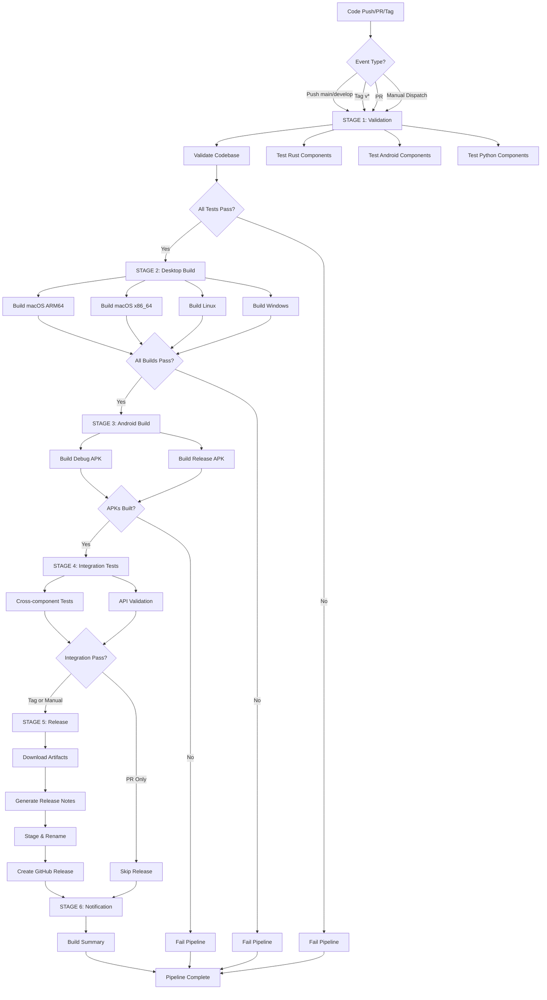

# DeepEyeUnlocker CI/CD Pipeline Architecture

## Visual Pipeline Flow



## Component Build Matrix

```
┌──────────────────────────────────────────────────────────────────┐
│                    BUILD COMPONENTS MATRIX                       │
├─────────────┬──────────────┬────────────────┬────────────────────┤
│ Component   │ Platform     │ Output         │ Build Time         │
├─────────────┼──────────────┼────────────────┼────────────────────┤
│ Tauri       │ macOS ARM64  │ .dmg, .app     │ 8-12 min (cached)  │
│ Desktop     │ macOS x86_64 │ .dmg, .app     │ 10-15 min (cached) │
│             │ Linux x86_64 │ .AppImage,.deb │ 10-15 min (cached) │
│             │ Windows x64  │ .exe (NSIS)    │ 8-12 min (cached)  │
├─────────────┼──────────────┼────────────────┼────────────────────┤
│ Android     │ arm64-v8a    │ .apk (debug)   │ 3-5 min (cached)   │
│ Mobile      │ arm64-v8a    │ .apk (release) │ 5-8 min (cached)   │
├─────────────┼──────────────┼────────────────┼────────────────────┤
│ Frontend    │ All          │ JS/CSS bundles │ 2-3 min (cached)   │
│ React       │              │                │                    │
├─────────────┼──────────────┼────────────────┼────────────────────┤
│ Rust        │ Native       │ Binary + libs  │ Compiled in Tauri  │
│ Backend     │              │                │                    │
├─────────────┼──────────────┼────────────────┼────────────────────┤
│ Python      │ Embedded     │ .py scripts    │ Included in bundle │
│ Tools       │              │                │                    │
└─────────────┴──────────────┴────────────────┴────────────────────┘
```

## Technology Stack Integration

```
┌─────────────────────────────────────────────────────────────┐
│                    TECHNOLOGY LAYERS                         │
├─────────────────────────────────────────────────────────────┤
│  PRESENTATION LAYER                                         │
│  ├─ React 18 + TypeScript + Vite                           │
│  ├─ TailwindCSS + Framer Motion                            │
│  └─ Spotlight Cards, Glass Cards, Grid Layouts             │
├─────────────────────────────────────────────────────────────┤
│  DESKTOP APPLICATION LAYER (Tauri v2)                       │
│  ├─ Rust Backend (deep-eye-unlocker-desktop)               │
│  ├─ Tauri Plugins (shell, dialog, fs, os, updater)         │
│  ├─ USB Communication (rusb, libusb)                       │
│  ├─ Database (rusqlite + SQLite)                           │
│  └─ Python Integration (embedded interpreter)              │
├─────────────────────────────────────────────────────────────┤
│  MOBILE APPLICATION LAYER (Android)                         │
│  ├─ Kotlin + Jetpack Compose                               │
│  ├─ Hilt Dependency Injection                              │
│  ├─ Room Persistence Library                               │
│  ├─ USB Serial (usb-serial-for-android)                    │
│  ├─ ADB Client (adblib)                                    │
│  └─ Python via Chaquopy (iOS tools, exploits)              │
├─────────────────────────────────────────────────────────────┤
│  PROTOCOL & DEVICE LAYER                                    │
│  ├─ iOS: palera1n, pymobiledevice3, libimobiledevice       │
│  ├─ Android: FRP, ADB, Fastboot                            │
│  ├─ MTK: BROM, Preloader, DA protocols                     │
│  ├─ Qualcomm: EDL mode, firehose programmer                │
│  ├─ Samsung: Odin protocol, Download mode                  │
│  └─ Xiaomi: Flash mode, MiFlash protocol                   │
├─────────────────────────────────────────────────────────────┤
│  HARDWARE INTERFACE LAYER                                   │
│  ├─ USB OTG (On-The-Go)                                    │
│  ├─ libusb (cross-platform USB)                            │
│  ├─ Serial communication                                   │
│  └─ Device-specific drivers                                │
└─────────────────────────────────────────────────────────────┘
```

## Artifact Flow

```
┌──────────────────────────────────────────────────────────────┐
│                     ARTIFACT PIPELINE                         │
└──────────────────────────────────────────────────────────────┘

Source Code
    │
    ├── [React/TypeScript] ── Vite Build ──┐
    │                                       ├── dist/ (static assets)
    ├── [Rust] ── Cargo Build ─────────────┤
    │                                       ├── target/release/binary
    ├── [Python Scripts] ──────────────────┤
    │                                       ├── python/**/*.py
    └── [Resources] ───────────────────────┘
                                           │
                                           ▼
                              ┌────────────────────────┐
                              │   Tauri Bundler        │
                              └────────────────────────┘
                                           │
                    ┌──────────────────────┼──────────────────────┐
                    │                      │                      │
                    ▼                      ▼                      ▼
              macOS Bundles          Linux Bundles        Windows Bundles
                    │                      │                      │
                    ├── .dmg               ├── .AppImage          ├── .exe
                    ├── .app               ├── .deb               └── .zip
                    └── .pkg               └── .tar.gz
                   

Source Code (Android)
    │
    ├── [Kotlin] ── Gradle Build ─────────┐
    │                                      ├── app/build/outputs/
    ├── [Java] ───────────────────────────┤
    │                                      ├── *.dex (compiled)
    ├── [Python via Chaquopy] ────────────┤
    │                                      ├── lib/arm64-v8a/
    ├── [C/C++ NDK] ─────────────────────┤
    │                                      └── *.so (native libs)
    └── [Resources] ─────────────────────┘
                                           │
                                           ▼
                              ┌────────────────────────┐
                              │  APK Signer (Release)  │
                              └────────────────────────┘
                                           │
                                           ▼
                                  app-release.apk


Build Artifacts ──┐
                  │
                  ▼
         ┌─────────────────┐
         │ GitHub Release  │
         └─────────────────┘
                  │
    ┌─────────────┼─────────────┐
    │             │             │
    ▼             ▼             ▼
 Desktop      Mobile       Updates
 Installers   APKs         Metadata
```

## Security Pipeline

```
┌─────────────────────────────────────────────────────────────┐
│                    SECURITY CHECKS                          │
├─────────────────────────────────────────────────────────────┤
│  CODE QUALITY                                               │
│  ├─ TypeScript: tsc --noEmit (type safety)                 │
│  ├─ Rust: cargo clippy -D warnings (strict linting)        │
│  ├─ Kotlin: lintDebug + Detekt (static analysis)           │
│  └─ Python: flake8 (code style)                            │
├─────────────────────────────────────────────────────────────┤
│  TESTING                                                    │
│  ├─ Rust: cargo test --release (unit tests)                │
│  ├─ Android: testDebugUnitTest (unit tests)                │
│  ├─ Jest: npm test (frontend tests)                        │
│  └─ Python: pytest (script tests)                          │
├─────────────────────────────────────────────────────────────┤
│  SECURITY AUDITS                                            │
│  ├─ Rust: cargo audit (CVE checking)                       │
│  ├─ Node: npm audit (dependency vulns)                     │
│  ├─ Python: pip-audit (package security)                   │
│  └─ APK: jarsigner verification (signature check)          │
├─────────────────────────────────────────────────────────────┤
│  SIGNING & VERIFICATION                                     │
│  ├─ Android: JKS keystore (release signing)                │
│  ├─ Tauri: Ed25519 signatures (update verification)        │
│  ├─ macOS: Apple notarization (optional)                   │
│  └─ Windows: Code signing certificate (optional)           │
└─────────────────────────────────────────────────────────────┘
```

## Branch Protection & Workflow

```
┌─────────────────────────────────────────────────────────────┐
│                    BRANCH STRATEGY                          │
├─────────────────────────────────────────────────────────────┤
│                                                             │
│  main (protected)                                           │
│  │                                                          │
│  ├── Requires: PR + passing checks                         │
│  ├── Triggers: Full build + tests                          │
│  └── Protected: Direct push blocked                        │
│                                                             │
│  develop                                                    │
│  │                                                          │
│  ├── Integration branch for features                       │
│  ├── Triggers: Full build + tests                          │
│  └── Merged to: main (via PR)                              │
│                                                             │
│  feature/*                                                  │
│  │                                                          │
│  ├── Feature development branches                          │
│  ├── Triggers: PR validation only                          │
│  └── Merged to: develop (via PR)                           │
│                                                             │
│  release/*                                                  │
│  │                                                          │
│  ├── Release preparation branches                          │
│  ├── Triggers: Full build + staging                        │
│  └── Creates: Tags (v*)                                    │
│                                                             │
│  Tags: v*                                                   │
│  │                                                          │
│  ├── Version releases (e.g., v2027.18.1)                   │
│  ├── Triggers: Full build + GitHub Release                 │
│  └── Artifacts: Published to GitHub Releases               │
│                                                             │
└─────────────────────────────────────────────────────────────┘
```

## Caching Strategy

```
┌─────────────────────────────────────────────────────────────┐
│                    CACHE LAYERS                             │
├──────────────────────┬──────────────────┬───────────────────┤
│ Cache Type           │ Storage Location │ Hit Rate          │
├──────────────────────┼──────────────────┼───────────────────┤
│ Gradle Cache         │ ~/.gradle/caches │ 70-85%            │
│ Rust/Cargo Cache     │ target/          │ 60-80%            │
│ pnpm Store           │ pnpm-store       │ 75-90%            │
│ Node Modules         │ node_modules/    │ 50-70%            │
│ Build Outputs        │ dist/, build/    │ 40-60%            │
└──────────────────────┴──────────────────┴───────────────────┘

Cache Invalidation:
  - Cargo.lock changes → Rust cache invalidated
  - package-lock.json changes → Node cache invalidated
  - build.gradle.kts changes → Gradle cache invalidated
  - Force push → All caches cleared
```

## Deployment Targets

```
┌─────────────────────────────────────────────────────────────┐
│                    DEPLOYMENT MATRIX                        │
├──────────────────┬──────────────────┬───────────────────────┤
│ Platform         │ Format           │ Distribution Method   │
├──────────────────┼──────────────────┼───────────────────────┤
│ macOS ARM64      │ .dmg, .pkg       │ GitHub Releases       │
│ macOS x86_64     │ .dmg             │ GitHub Releases       │
│ Linux            │ .AppImage, .deb  │ GitHub Releases       │
│ Windows          │ .exe (NSIS)      │ GitHub Releases       │
│ Android          │ .apk             │ GitHub Releases       │
├──────────────────┼──────────────────┼───────────────────────┤
│ Future Targets:  │                  │                       │
│ ├─ Homebrew      │ Formula          │ Tap repository        │
│ ├─ AUR           │ PKGBUILD         │ Arch User Repository  │
│ ├─ Winget        │ Manifest         │ Windows Package Mgr   │
│ ├─ Play Store    │ AAB              │ Google Play           │
│ └─ Snap/Flatpak  │ Container        │ Linux package repos   │
└──────────────────┴──────────────────┴───────────────────────┘
```

## Monitoring & Metrics

```
┌─────────────────────────────────────────────────────────────┐
│                    PIPELINE METRICS                         │
├─────────────────────────────────────────────────────────────┤
│  BUILD PERFORMANCE                                          │
│  ├─ Average build time: 15-25 minutes                      │
│  ├─ Cache hit rate: 65-80%                                 │
│  ├─ Success rate: 95%+                                     │
│  └─ Parallel jobs: 8-12 concurrent                         │
├─────────────────────────────────────────────────────────────┤
│  RESOURCE UTILIZATION                                       │
│  ├─ CPU: 70-100% during Rust LTO                           │
│  ├─ Memory: 4-8 GB peak (Rust compilation)                 │
│  ├─ Disk: 15-25 GB per build                               │
│  └─ Network: 500MB-1GB (dependency download)               │
├─────────────────────────────────────────────────────────────┤
│  COST OPTIMIZATION                                          │
│  ├─ Path filtering: Skip unchanged components              │
│  ├─ Selective builds: desktop-only, android-only           │
│  ├─ Cache optimization: Reuse dependencies                 │
│  └─ PR optimization: Fast validation path                  │
└─────────────────────────────────────────────────────────────┘
```

## Pipeline Evolution

```
Version 1.0 (Legacy)
  └─ Single workflow file
  └─ Basic build + release
  └─ No testing stage
  └─ Sequential execution

Version 2.0 (Current)
  ├─ 3 workflow files (complete, release, build)
  ├─ 6-stage pipeline
  ├─ Parallel execution
  ├─ Comprehensive testing
  ├─ Path filtering
  ├─ Selective builds
  └─ Manual triggers

Version 3.0 (Planned)
  ├─ Automated code signing
  ├─ Multi-architecture builds (RISC-V, ARM32)
  ├─ Automated store deployment
  ├─ Performance regression testing
  ├─ Security scan integration
  └─ Custom runner optimization
```
