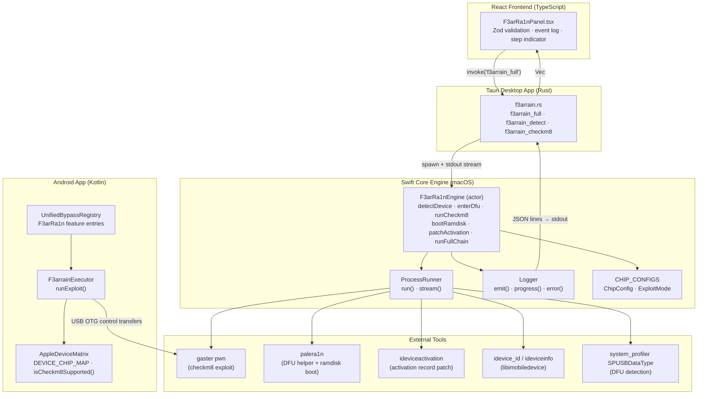
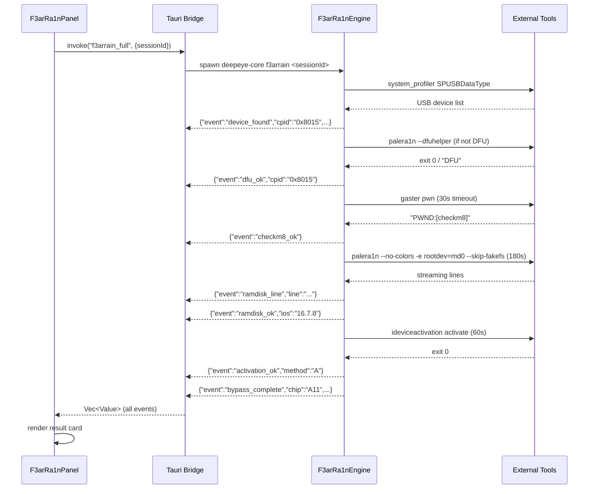
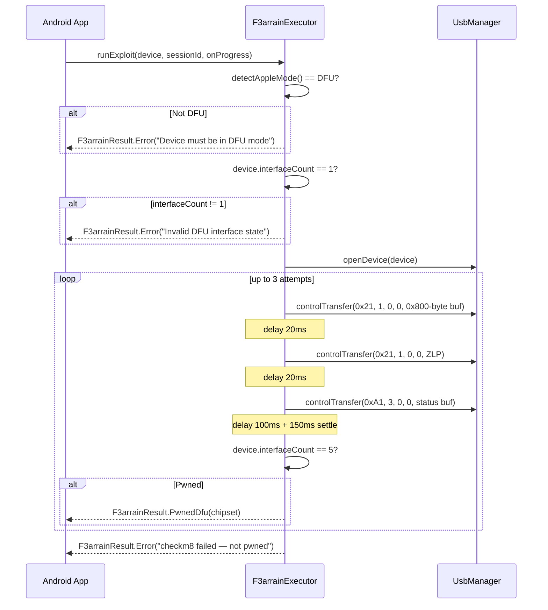

# Design Document — F3arRa1n Features

## Overview

F3arRa1n is DeepEyeUnlocker's built-in iOS iCloud activation bypass engine, built on the checkm8 bootrom exploit. It targets Apple A7–A11 SoCs (iPhone 5S through iPhone X) — the last generation of chips with an unpatchable hardware vulnerability in the SecureROM USB DFU stack.

The engine operates across three execution environments:

| Layer                   | File                   | Runtime           | Role                                                                              |
| ----------------------- | ---------------------- | ----------------- | --------------------------------------------------------------------------------- |
| Swift Core Engine       | `F3arRa1nEngine.swift` | macOS CLI binary  | Orchestrates the full bypass pipeline using palera1n + gaster + ideviceactivation |
| Rust Tauri Bridge       | `f3arrain.rs`          | Tauri desktop app | Spawns the Swift binary, streams JSON events to the React frontend                |
| Android Kotlin Executor | `F3arrainExecutor.kt`  | Android OTG USB   | Runs the raw checkm8 USB control-transfer sequence directly from Android          |

The four registered bypass modes are:

- **F3ARRAIN_HELLO_BYPASS** — Free, A7–A11, iOS 12–16.7.8, tethered WiFi-only bypass
- **F3AR_A12_FREE** — Free, A12–A18, iOS 15–26.1, untethered server-based bypass
- **F3AR_TEMP_TEST** — Free, A7–A18, iOS 12–26.1, temporary compatibility test
- **F3AR_BOOT_FILES** — 10 credits, A7–A11, iOS 15–16.7, untethered NVRAM boot-files bypass

---

## Architecture

### System Layers



### Full Chain Pipeline (Desktop)



### Android OTG Pipeline



---

## Components and Interfaces

### 1. F3arRa1nEngine (Swift Actor)

The engine is declared as a Swift `actor` to guarantee serial access to its internal state and prevent data races when called from concurrent async contexts.

```swift
actor F3arRa1nEngine {
    private let runner:        ProcessRunner
    private let log:           Logger
    private let resourcesPath: String

    init(resourcesPath: String, log: Logger)

    // Pipeline steps — each emits structured JSON events via Logger
    func detectDevice(sessionId: String)  async throws -> F3arRa1nDevice
    func enterDfu(cpid: Int, sessionId: String) async throws
    func runCheckm8(cpid: Int, sessionId: String) async throws
    func bootRamdisk(iosVersion: String, sessionId: String) async throws
    func patchActivation(udid: String, sessionId: String) async throws

    // Full orchestration
    func runFullChain(sessionId: String) async

    // Private helpers
    private func isPwned(_ r: ProcessResult) -> Bool
    private func classifyLayer(_ error: Error) -> String
    private func isRetryable(_ error: Error) -> Bool
}
```

**Key design decisions:**

- `actor` isolation ensures the Logger's `print()` + `fflush()` calls are never interleaved across concurrent pipeline runs
- Each step is a separate `async throws` function so the full chain can be composed or called individually
- `runFullChain` catches all errors internally and emits structured error events — it never throws to the caller

### 2. ProcessRunner (Swift Struct)

Synchronous subprocess wrapper. Resolves tool paths from the bundled `resources/tools/` directory first, then falls back to `PATH`.

```swift
struct ProcessRunner {
    static let toolsDir: URL  // resolved at startup

    static func run(
        _ executable: String,
        args:    [String]       = [],
        env:     [String: String] = [:],
        timeout: TimeInterval   = 30.0
    ) -> ProcessResult

    // Streaming variant — calls lineHandler for each stdout line
    static func stream(
        _ executable: String,
        args:    [String],
        timeout: TimeInterval,
        lineHandler: @escaping (String) -> Void
    ) async -> ProcessResult

    private static func which(_ name: String) -> String?
}

struct ProcessResult {
    let exitCode: Int32
    let stdout:   String
    let stderr:   String
    var succeeded: Bool { exitCode == 0 }
}
```

**Timeout implementation:** Uses `DispatchSemaphore` with a deadline. On timeout, `proc.terminate()` is called and a synthetic `ProcessResult(exitCode: -1, stderr: "Timeout after Xs")` is returned.

### 3. Logger (Swift Struct)

Emits newline-delimited JSON to stdout. Each line is a complete JSON object. The Rust bridge reads these lines and parses them.

```swift
struct Logger {
    let sessionId: String

    func emit(_ event: String, _ extra: [String: Any] = [:])
    func progress(_ pct: Int, _ phase: String)
    func error(_ reason: String, layer: String, retryable: Bool)
    func success(_ msg: String, extra: [String: Any] = [:])
}
```

**Protocol:** Every emitted object always contains `"event"` and `"sessionId"`. Additional fields are merged from `extra`. `JSONSerialization.data(withJSONObject:options:.sortedKeys)` ensures deterministic key ordering. `fflush(stdout)` is called after every `print()` to prevent buffering.

### 4. Tauri Bridge (Rust)

```rust
#[derive(Debug, Serialize)]
pub struct F3arError {
    pub layer:     String,
    pub reason:    String,
    pub retryable: bool,
}

// Resolves Swift binary path from app resource directory
fn swift(app: &AppHandle) -> String

// Spawns Swift binary, collects JSON-line events
async fn run_cmd(
    app:  &AppHandle,
    cmd:  &str,
    args: &[&str],
) -> Result<Vec<Value>, F3arError>

#[tauri::command]
pub async fn f3arrain_full(
    app: AppHandle, session_id: String,
) -> Result<Vec<Value>, F3arError>

#[tauri::command]
pub async fn f3arrain_detect(
    app: AppHandle, session_id: String,
) -> Result<Value, F3arError>

#[tauri::command]
pub async fn f3arrain_checkm8(
    app: AppHandle, session_id: String,
) -> Result<Vec<Value>, F3arError>
```

**Stdout parsing algorithm:**

```
for each line in stdout:
    if line.starts_with('{'):
        match serde_json::from_str(line):
            Ok(value)  → append to events Vec
            Err(e)     → return F3arError { layer: "PARSE", reason: e.to_string(), retryable: false }
    else:
        // ignore — tool debug output, ANSI codes, etc.
```

### 5. F3arrainExecutor (Kotlin, Android)

```kotlin
@Singleton
class F3arrainExecutor @Inject constructor(
    private val usbManager: UsbManager
) {
    suspend fun runExploit(
        device:     UsbDevice,
        sessionId:  String,
        onProgress: (Float) -> Unit
    ): F3arrainResult
}

sealed class F3arrainResult {
    object Idle : F3arrainResult()
    data class PwnedDfu(val message: String, val chipset: String) : F3arrainResult()
    data class BypassComplete(val type: String) : F3arrainResult()
    data class Error(val reason: String) : F3arrainResult()
}
```

**USB control transfer sequence (per attempt):**

| Step                  | bmRequestType | bRequest | wValue | wIndex | Data             | Delay after |
| --------------------- | ------------- | -------- | ------ | ------ | ---------------- | ----------- |
| DFU_DNLOAD max packet | 0x21          | 1        | 0      | 0      | 0x800 zero bytes | 20 ms       |
| DFU_DNLOAD ZLP        | 0x21          | 1        | 0      | 0      | 0 bytes          | 20 ms       |
| DFU_GETSTATUS         | 0xA1          | 3        | 0      | 0      | 1 byte           | 100 ms      |
| Re-enumeration settle | —             | —        | —      | —      | —                | 150 ms      |

Success condition: `device.interfaceCount == 5` after the settle delay.

### 6. AppleDeviceMatrix (Kotlin, Android)

```kotlin
object AppleDeviceMatrix {
    val F3ARRAIN_SUPPORTED_CHIPS: Map<String, List<String>>
    val CHECKM8_SUPPORTED: Set<AppleChip>
    val DEVICE_CHIP_MAP: Map<String, AppleChip>

    fun getChip(identifier: String): AppleChip
    fun isCheckm8Supported(identifier: String): Boolean
}

enum class AppleChip { A5, A6, A7, A8, A9, A10, A11, A12, A13, A14, A15, A16, A17, A18, UNKNOWN }
```

### 7. F3arRa1nPanel (React/TypeScript)

```typescript
// Zod event schema — all fields optional except event
const EventSchema = z.object({
  event: z.string(),
  msg: z.string().optional(),
  pct: z.number().min(0).max(100).optional(),
  phase: z.string().optional(),
  chip_name: z.string().optional(),
  ios: z.string().optional(),
  cpid: z.string().optional(),
  is_checkm8: z.boolean().optional(),
  signal: z.boolean().optional(),
  untethered: z.boolean().optional(),
  method: z.string().optional(),
  reason: z.string().optional(),
  layer: z.string().optional(),
  retryable: z.boolean().optional(),
  notes: z.array(z.string()).optional(),
});

type Phase = 'idle' | 'detect' | 'dfu' | 'checkm8' | 'ramdisk' | 'bypass' | 'done' | 'error';

// Component state
interface PanelState {
  phase: Phase;
  device: DeviceInfo | null;
  result: BypassResult | null;
  pct: number;
  msg: string;
  log: DeepEvent[]; // capped at 200 entries
  error: string | null;
}
```

---

## Data Models

### ChipConfig (Swift)

```swift
struct ChipConfig {
    let cpid:        Int          // USB product ID / chip identifier (hex)
    let name:        String       // Human-readable chip + device string
    let exploitTime: Double       // Seconds for the checkm8 exploit window
    let mode:        ExploitMode  // .buttons or .dfuLoop
}

enum ExploitMode { case buttons; case dfuLoop }
```

**Complete chip table:**

| CPID   | Name                | exploitTime | mode    |
| ------ | ------------------- | ----------- | ------- |
| 0x8960 | A7 (iPhone 5S)      | 14.0        | buttons |
| 0x7000 | A8 (iPhone 6/6+)    | 2.0         | dfuLoop |
| 0x7001 | A8X (iPad Air 2)    | 2.0         | dfuLoop |
| 0x8000 | A9 (iPhone 6S/SE)   | 2.0         | dfuLoop |
| 0x8003 | A9X (iPad Pro 9.7)  | 2.0         | dfuLoop |
| 0x8010 | A10 (iPhone 7/7+)   | 0.68        | buttons |
| 0x8011 | A10X (iPad Pro)     | 0.68        | buttons |
| 0x8015 | A11 (iPhone 8/8+/X) | 0.66        | dfuLoop |

### F3arRa1nDevice (Swift)

```swift
struct F3arRa1nDevice: Codable {
    let udid:       String   // UDID or "DFU_MODE" if detected in DFU
    let cpid:       Int      // Chip ID integer (0 if unknown)
    let chipName:   String   // Human-readable chip name
    let iosVersion: String   // "16.7.8" format, empty if unknown
    let serial:     String   // Serial number, empty if unknown
    let isDfu:      Bool     // True if detected via PID 0x1227
    let isCheckm8:  Bool     // True iff CPID is in CHIP_CONFIGS
    let sessionId:  String   // UUID for this operation
}
```

### F3arRa1nError (Swift)

```swift
enum F3arRa1nError: Error, LocalizedError {
    case noDevice
    case notCheckm8Vulnerable(Int)   // carries CPID
    case gasterFailed(String)        // carries last 200 chars of stderr/stdout
    case ramdiskFailed(String)       // carries last 300 chars of stderr/stdout
    case activationFailed(String)    // carries reason string
}
```

**Error classification table:**

| Error case           | layer      | retryable |
| -------------------- | ---------- | --------- |
| noDevice             | DETECT     | false     |
| notCheckm8Vulnerable | CHIP       | false     |
| gasterFailed         | CHECKM8    | true      |
| ramdiskFailed        | RAMDISK    | true      |
| activationFailed     | ACTIVATION | false     |
| OS spawn error       | SPAWN      | false     |
| JSON parse error     | PARSE      | false     |
| Unknown              | UNKNOWN    | false     |

### F3arError (Rust)

```rust
#[derive(Debug, Serialize)]
pub struct F3arError {
    pub layer:     String,   // "SPAWN" | "PARSE" | mirrors Swift layers
    pub reason:    String,   // Human-readable description
    pub retryable: bool,
}
```

### JSON Event Protocol

All events share a base shape. Additional fields are event-specific.

```typescript
// Base (always present)
{ event: string, sessionId: string }

// progress
{ event: "progress", pct: number, phase: string }

// device_found
{ event: "device_found", udid: string, cpid: string, chip_name: string,
  ios: string, serial: string, is_checkm8: boolean }

// dfu_guide
{ event: "dfu_guide", chip: string, timing: number, mode: string }

// dfu_ok
{ event: "dfu_ok", cpid: string }

// dfu_warn
{ event: "dfu_warn", msg: string }

// checkm8_ok
{ event: "checkm8_ok", msg: string }

// ramdisk_line
{ event: "ramdisk_line", line: string }

// ramdisk_ok
{ event: "ramdisk_ok", ios: string }

// activation_ok
{ event: "activation_ok", method: "A" | "B" | "C" }

// activation_partial
{ event: "activation_partial", msg: string, wifi: boolean }

// bypass_complete
{ event: "bypass_complete", chip: string, ios: string,
  signal: boolean, untethered: boolean, method: string, notes: string[] }

// error
{ event: "error", reason: string, layer: string, retryable: boolean }
```

### BypassFeature (Kotlin — UnifiedBypassRegistry)

```kotlin
data class BypassFeature(
    val id:                 String,
    val source:             FeatureSource,
    val displayName:        String,
    val description:        String,
    val category:           FeatureCategory,
    val mechanism:          BypassMechanism,
    val chipRange:          ChipRange,
    val iosRange:           String,
    val iosMinVersion:      String,
    val iosMaxVersion:      String,
    val costCredits:        Int,
    val isFree:             Boolean,
    val signalAfter:        Boolean,
    val iServicesAfter:     Boolean,
    val isUntethered:       Boolean,
    val dataLoss:           Boolean,
    val riskLevel:          RiskLevel,
    val tags:               List<String>,
    val executionSteps:     List<ExecutionStep>,
    val requiresDfu:        Boolean,
    val requiresInternet:   Boolean,
    val requiresImei:       Boolean,
    // ... additional metadata fields
)
```

**F3arRa1n registry entries summary:**

| ID                    | isFree | costCredits | chipRange | isUntethered | signalAfter |
| --------------------- | ------ | ----------- | --------- | ------------ | ----------- |
| F3ARRAIN_HELLO_BYPASS | true   | 0           | A7–A11    | false        | false       |
| F3AR_A12_FREE         | true   | 0           | A12–A18   | true         | false       |
| F3AR_TEMP_TEST        | true   | 0           | A7–A18    | false        | false       |
| F3AR_BOOT_FILES       | false  | 10          | A7–A11    | true         | true        |

---

## Correctness Properties

_A property is a characteristic or behavior that should hold true across all valid executions of a system — essentially, a formal statement about what the system should do. Properties serve as the bridge between human-readable specifications and machine-verifiable correctness guarantees._

### Property 1: CPID-to-checkm8 mapping is exact

_For any_ integer CPID value, `isCheckm8` is `true` if and only if the CPID is one of the eight known values: `{0x8960, 0x7000, 0x7001, 0x8000, 0x8003, 0x8010, 0x8011, 0x8015}`. For all other CPID values (including zero, negative, and arbitrary integers), `isCheckm8` must be `false`.

**Validates: Requirements 1.5, 1.6, 3.1**

---

### Property 2: device_found event contains all required fields

_For any_ `F3arRa1nDevice` value (with any combination of CPID, UDID, iOS version, serial, isDfu, isCheckm8), the JSON event emitted by `detectDevice` must contain all six required fields: `udid`, `cpid`, `chip_name`, `ios_version`, `serial`, and `is_checkm8`, each with the correct type.

**Validates: Requirements 1.3, 1.7**

---

### Property 3: ideviceinfo output parsing round-trip

_For any_ valid `ideviceinfo` key-value output string (lines in `"Key: Value"` format), the parser must correctly extract `ChipID`, `ProductVersion`, `SerialNumber`, and `UniqueDeviceID` fields. The extracted values must equal the values present in the input string.

**Validates: Requirements 1.2**

---

### Property 4: DFU tool output determines dfu_ok vs dfu_warn

_For any_ `(exitCode: Int32, stdout: String)` pair from the DFU helper tool, `dfu_ok` is emitted if and only if `exitCode == 0` OR `stdout.uppercased().contains("DFU")`. In all other cases, `dfu_warn` is emitted and the pipeline continues (non-fatal).

**Validates: Requirements 2.2, 2.3**

---

### Property 5: Chip timing config correctness

_For any_ CPID in the supported chip set, `CHIP_CONFIGS[cpid]` returns a `ChipConfig` whose `exploitTime` and `mode` exactly match the specification table (A7=14.0/buttons, A8=2.0/dfuLoop, A8X=2.0/dfuLoop, A9=2.0/dfuLoop, A9X=2.0/dfuLoop, A10=0.68/buttons, A10X=0.68/buttons, A11=0.66/dfuLoop). For any CPID not in the supported set, `CHIP_CONFIGS[cpid]` returns `nil`.

**Validates: Requirements 2.4, 2.5**

---

### Property 6: checkm8 success detection

_For any_ `(exitCode: Int32, stdout: String)` pair from the gaster tool, `checkm8_ok` is emitted if and only if `exitCode == 0` OR `stdout` contains `"PWND"` or `"pwned"` (case-insensitive). The exploit tool is never invoked on a device whose CPID is not in the supported set.

**Validates: Requirements 3.1, 3.4, 16.1, 16.2**

---

### Property 7: gasterFailed error message truncation

_For any_ `(stderr: String, stdout: String)` pair from a failed gaster invocation, the `reason` field in the `gasterFailed` error event equals `stderr.suffix(200)` if `stderr` is non-empty, or `stdout.suffix(200)` if `stderr` is empty. The truncation boundary is always exactly 200 characters.

**Validates: Requirements 3.7**

---

### Property 8: ramdisk success detection

_For any_ `(exitCode: Int32, stdout: String)` pair from the palera1n ramdisk tool, `ramdisk_ok` is emitted if and only if `exitCode == 0` OR `stdout.lowercased()` contains `"done"` or `"success"`.

**Validates: Requirements 4.2**

---

### Property 9: ramdisk streaming line count

_For any_ N-line stdout string produced by the palera1n ramdisk tool during streaming, exactly N `ramdisk_line` events are emitted — one per line, in order.

**Validates: Requirements 4.3**

---

### Property 10: ramdiskFailed error message truncation

_For any_ `(stderr: String, stdout: String)` pair from a failed ramdisk invocation, the `reason` field in the `ramdiskFailed` error event equals `stderr.suffix(300)` if `stderr` is non-empty, or `stdout.suffix(300)` if `stderr` is empty.

**Validates: Requirements 4.4**

---

### Property 11: Activation Method A early exit

_For any_ `(exitCode: Int32, stdout: String)` pair from Method A where `exitCode == 0` OR `stdout.lowercased().contains("success")`, `activation_ok` is emitted with `method: "A"` and no further activation methods (B or C) are attempted.

**Validates: Requirements 5.3**

---

### Property 12: Pipeline step ordering invariant

_For any_ valid device configuration, the sequence of pipeline step events emitted by `runFullChain` always follows the fixed order: `device_found` → (optionally `dfu_ok`/`dfu_warn`) → `checkm8_ok` → `ramdisk_ok` → (`activation_ok` or `activation_partial`) → `bypass_complete`. No step event from a later stage appears before all events from earlier stages.

**Validates: Requirements 6.1, 6.2**

---

### Property 13: Fatal error stops the pipeline

_For any_ pipeline step that emits an error event with `retryable: false`, no events from any subsequent pipeline step are emitted. The pipeline halts immediately after the fatal error event.

**Validates: Requirements 6.4, 16.1, 16.2, 16.3, 16.4, 16.5, 16.6, 16.7, 16.8, 16.9, 16.10**

---

### Property 14: Progress percentage monotonicity

_For any_ successful pipeline run, the `pct` values in `progress` events are non-decreasing and match the specification: Detect=5%, DFU=15%, checkm8=30%, Ramdisk=55%, Activation=80%, Complete=100%.

**Validates: Requirements 6.5**

---

### Property 15: Android DFU mode precondition

_For any_ `UsbDevice` where `detectAppleMode() != DeviceMatrix.AppleMode.DFU`, `runExploit()` returns `F3arrainResult.Error` containing the device's product ID in the message, without opening a USB connection.

**Validates: Requirements 7.1, 7.2, 16.9**

---

### Property 16: Android interface count precondition

_For any_ `UsbDevice` in DFU mode where `device.interfaceCount != 1`, `runExploit()` returns `F3arrainResult.Error` indicating the unexpected interface count, without opening a USB connection.

**Validates: Requirements 7.3, 7.4, 16.9**

---

### Property 17: Android exploit retry count

_For any_ exploit sequence that never results in `device.interfaceCount == 5`, `runExploit()` makes exactly 3 total attempts before returning `F3arrainResult.Error("checkm8 failed — not pwned")`. The USB connection is always closed in the `finally` block regardless of outcome.

**Validates: Requirements 7.10, 7.11**

---

### Property 18: Device identifier chip lookup

_For any_ device identifier string in `DEVICE_CHIP_MAP`, `getChip(identifier)` returns the mapped `AppleChip` value. For any identifier not in the map (including malformed identifiers), `getChip(identifier)` returns `AppleChip.UNKNOWN` and `isCheckm8Supported(identifier)` returns `false`.

**Validates: Requirements 12.3, 12.4, 12.5, 12.7**

---

### Property 19: Error layer and retryable classification

_For any_ `F3arRa1nError` value, `classifyLayer()` and `isRetryable()` return values that exactly match the specification table: `noDevice` → (DETECT, false), `notCheckm8Vulnerable` → (CHIP, false), `gasterFailed` → (CHECKM8, true), `ramdiskFailed` → (RAMDISK, true), `activationFailed` → (ACTIVATION, false).

**Validates: Requirements 13.1, 13.2, 13.3, 13.4, 13.5, 13.6**

---

### Property 20: Tauri bridge JSON line filtering

_For any_ stdout string containing a mix of lines starting with `{` and lines not starting with `{`, the Tauri bridge includes only the `{`-prefixed lines in the result `Vec<Value>`. Lines not starting with `{` are silently discarded.

**Validates: Requirements 14.6, 14.7**

---

### Property 21: Frontend event schema validation

_For any_ arbitrary object passed to the panel's event handler that fails `EventSchema.safeParse()`, the panel discards the event (the log length does not increase) and does not crash or enter an error state.

**Validates: Requirements 15.9**

---

### Property 22: Registry free feature selection

_For any_ feature list containing the F3arRa1n entries, `cheapestCandidate(requireFree = true)` returns `F3ARRAIN_HELLO_BYPASS` when filtering for A7–A11 devices and `F3AR_A12_FREE` when filtering for A12+ devices, as these are the only entries with `isFree = true` and `costCredits = 0` in their respective chip ranges.

**Validates: Requirements 18.4, 18.5, 18.6**

---

## Error Handling

### Swift Engine Error Flow

```
runFullChain()
  └─ do { ... } catch { log.error(...) }
       ├─ F3arRa1nError.noDevice
       │    → layer: "DETECT", retryable: false
       │    → message: "No device found. Connect iPhone via USB in DFU mode."
       ├─ F3arRa1nError.notCheckm8Vulnerable(cpid)
       │    → layer: "CHIP", retryable: false
       │    → message: "Chip 0x<cpid> not vulnerable to checkm8."
       ├─ F3arRa1nError.gasterFailed(reason)
       │    → layer: "CHECKM8", retryable: true
       │    → message: "checkm8 exploit failed: <reason>. Re-enter DFU and retry."
       ├─ F3arRa1nError.ramdiskFailed(reason)
       │    → layer: "RAMDISK", retryable: true
       │    → message: "Ramdisk boot failed: <reason>"
       └─ F3arRa1nError.activationFailed(reason)
            → layer: "ACTIVATION", retryable: false
            → message: "Activation patch failed: <reason>"
```

**Activation partial success:** When all three activation methods fail, `activation_partial` is emitted with `wifi: true`. This is NOT an error — the pipeline continues to `bypass_complete`. WiFi bypass is still active even without full activation record patching.

### Rust Bridge Error Flow

```
run_cmd()
  ├─ OS spawn failure
  │    → F3arError { layer: "SPAWN", reason: <OS error>, retryable: false }
  ├─ Binary not found at resolved path
  │    → F3arError { layer: "SPAWN", reason: "binary not found at <path>", retryable: false }
  ├─ stdout line starts with '{' but invalid JSON
  │    → F3arError { layer: "PARSE", reason: <serde error>, retryable: false }
  └─ Non-zero exit with non-empty events
       → Ok(events)  // partial result — not an error
```

### Android Executor Error Flow

```
runExploit()
  ├─ detectAppleMode() != DFU
  │    → F3arrainResult.Error("Device must be in DFU mode. PID: 0x<pid>")
  ├─ device.interfaceCount != 1
  │    → F3arrainResult.Error("Invalid DFU interface state. Expected=1, actual=<n>")
  ├─ usbManager.openDevice() returns null
  │    → F3arrainResult.Error("Cannot open USB device")
  ├─ USB controlTransfer returns negative (error)
  │    → count as failed attempt, retry
  └─ After 3 failed attempts (interfaceCount != 5)
       → F3arrainResult.Error("checkm8 failed — not pwned (interfaceCount=<n>)")
```

### Frontend Error Handling

The panel handles two error sources:

1. **Tauri invoke rejection** — caught in the `try/catch` around `invoke()`. The error message is displayed in the red error card.
2. **Error events in the event stream** — `event === "error"` triggers `setPhase("error")` and displays `[layer] reason` in the error card.

In both cases, if `retryable === true`, the "↻ RETRY" button re-invokes `f3arrain_full` with a new session ID. The "RESET" button clears all state and returns to idle.

**Zod validation failures** are silently discarded — the panel calls `EventSchema.safeParse(item)` and skips items where `!p.success`. This prevents malformed events from crashing the UI.

---

## Testing Strategy

### Dual Testing Approach

The testing strategy combines unit/example-based tests for specific behaviors with property-based tests for universal correctness properties.

**Property-based testing library:** [fast-check](https://github.com/dubzzz/fast-check) for TypeScript/React components; [SwiftCheck](https://github.com/typelift/SwiftCheck) for Swift engine logic; [kotest-property](https://kotest.io/docs/proptest/property-based-testing.html) for Kotlin Android components.

Each property test runs a minimum of **100 iterations** with randomized inputs.

### Unit Tests (Example-Based)

These cover specific behaviors that are not universal across all inputs:

**Swift Engine:**

- `noDevice` error when idevice_id returns empty output (Req 1.4)
- `device_found` with `cpid: "unknown"` when ideviceinfo has no ChipID field (Req 1.7)
- DFU entry skipped when `isDfu == true` (Req 2.6)
- checkm8 retried exactly once on first failure, succeeds on second (Req 3.5)
- checkm8 NOT retried on timeout — `gasterFailed` emitted immediately (Req 3.6)
- Activation Method A → B → C fallback ordering (Req 5.1, 5.4, 5.5)
- `activation_partial` emitted when all three methods fail (Req 5.6)
- DFU step inserted when `isDfu == false`, skipped when `isDfu == true` (Req 6.2)

**Rust Bridge:**

- `F3arError { layer: "SPAWN" }` when binary path does not exist (Req 14.5)
- `F3arError { layer: "PARSE" }` when a `{`-prefixed line is invalid JSON (Req 14.10)
- Partial result returned (not error) when exit code is non-zero but events were collected (Req 14.8)

**Android Executor:**

- `F3arrainResult.Error` with product ID when device is not in DFU mode (Req 7.2)
- `F3arrainResult.Error` with interface count when `interfaceCount != 1` (Req 7.4)
- `F3arrainResult.Error` when USB connection cannot be opened (Req 7.5)

**Frontend Panel:**

- "↻ RETRY" button appears when error event has `retryable: true` (Req 13.7)
- "RESET" button clears all state and returns to idle (Req 15.11)
- Progress bar updates correctly on each `progress` event (Req 15.5)
- Device card renders chip name, iOS version, CPID, checkm8 badge (Req 15.4)

### Property Tests

Each property test is tagged with a comment referencing the design property.

**Tag format:** `// Feature: f3arrain-features, Property <N>: <property_text>`

**Swift property tests (SwiftCheck):**

```swift
// Feature: f3arrain-features, Property 1: CPID-to-checkm8 mapping is exact
property("isCheckm8 is true iff CPID is in supported set") <- forAll { (cpid: Int) in
    let supported: Set<Int> = [0x8960, 0x7000, 0x7001, 0x8000, 0x8003, 0x8010, 0x8011, 0x8015]
    let result = CHIP_CONFIGS[cpid] != nil
    return result == supported.contains(cpid)
}

// Feature: f3arrain-features, Property 5: Chip timing config correctness
property("CHIP_CONFIGS timing matches spec for all supported CPIDs") <- forAll { in
    let expected: [(Int, Double, ExploitMode)] = [
        (0x8960, 14.0, .buttons), (0x7000, 2.0, .dfuLoop), (0x7001, 2.0, .dfuLoop),
        (0x8000, 2.0, .dfuLoop),  (0x8003, 2.0, .dfuLoop), (0x8010, 0.68, .buttons),
        (0x8011, 0.68, .buttons), (0x8015, 0.66, .dfuLoop),
    ]
    return expected.allSatisfy { (cpid, time, mode) in
        CHIP_CONFIGS[cpid]?.exploitTime == time && CHIP_CONFIGS[cpid]?.mode == mode
    }
}

// Feature: f3arrain-features, Property 7: gasterFailed error message truncation
property("gasterFailed reason is last 200 chars of stderr (or stdout if empty)") <- forAll {
    (stderr: String, stdout: String) in
    let reason = stderr.isEmpty ? String(stdout.suffix(200)) : String(stderr.suffix(200))
    // verify engine produces this reason for a failed gaster run
    return reason.count <= 200
}
```

**Kotlin property tests (kotest-property):**

```kotlin
// Feature: f3arrain-features, Property 18: Device identifier chip lookup
"getChip returns UNKNOWN for any identifier not in DEVICE_CHIP_MAP" {
    checkAll(Arb.string()) { identifier ->
        if (identifier !in AppleDeviceMatrix.DEVICE_CHIP_MAP) {
            AppleDeviceMatrix.getChip(identifier) shouldBe AppleChip.UNKNOWN
            AppleDeviceMatrix.isCheckm8Supported(identifier) shouldBe false
        }
    }
}

// Feature: f3arrain-features, Property 17: Android exploit retry count
"runExploit makes exactly 3 attempts before returning Error when always failing" {
    checkAll(Arb.int(min = 0, max = 4).filter { it != 5 }) { interfaceCount ->
        val mockDevice = mockDevice(interfaceCount = interfaceCount, inDfu = true, initialCount = 1)
        val result = executor.runExploit(mockDevice, "test-session") {}
        result shouldBe instanceOf<F3arrainResult.Error>()
        mockDevice.attemptCount shouldBe 3
    }
}
```

**TypeScript property tests (fast-check):**

```typescript
// Feature: f3arrain-features, Property 21: Frontend event schema validation
test('panel discards any object failing EventSchema validation', () => {
  fc.assert(
    fc.property(fc.anything(), (obj) => {
      const result = EventSchema.safeParse(obj);
      if (!result.success) {
        // Simulate panel receiving this object
        const before = logLength;
        handleEvent(obj);
        expect(logLength).toBe(before); // not increased
      }
    }),
    { numRuns: 100 },
  );
});

// Feature: f3arrain-features, Property 20: Tauri bridge JSON line filtering
test('bridge includes only {-prefixed lines in result', () => {
  fc.assert(
    fc.property(
      fc.array(
        fc.oneof(
          fc.string().map((s) => `{${s}`), // JSON-like lines
          fc.string().filter((s) => !s.startsWith('{')), // non-JSON lines
        ),
      ),
      (lines) => {
        const stdout = lines.join('\n');
        const result = parseStdout(stdout);
        const expected = lines.filter((l) => l.startsWith('{') && isValidJson(l));
        expect(result.length).toBe(expected.length);
      },
    ),
    { numRuns: 100 },
  );
});
```

### Integration Tests

These verify external tool wiring with 1–3 representative examples:

- `gaster pwn` is invoked with a 30-second timeout (Req 3.3)
- `palera1n --dfuhelper` is invoked with a 60-second timeout (Req 2.1)
- `palera1n --no-colors -e rootdev=md0 --skip-fakefs` is invoked with a 180-second timeout (Req 4.1)
- `ideviceactivation activate` is the first activation invocation (Req 5.1)
- Swift binary path is resolved from app resource directory at runtime (Req 14.4)

### Smoke Tests

- Swift binary exists at the resolved resource path
- `gaster`, `palera1n`, `ideviceactivation`, `idevice_id`, `ideviceinfo` are present in `resources/tools/` or on PATH
- Android USB permissions are granted before `F3arrainExecutor` is invoked
