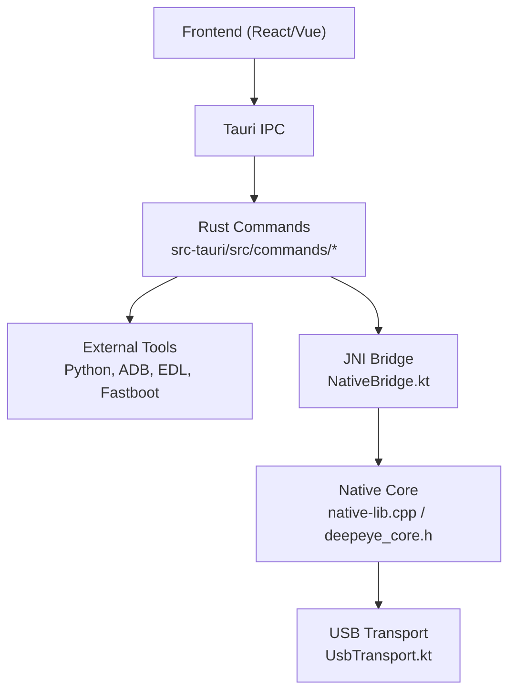
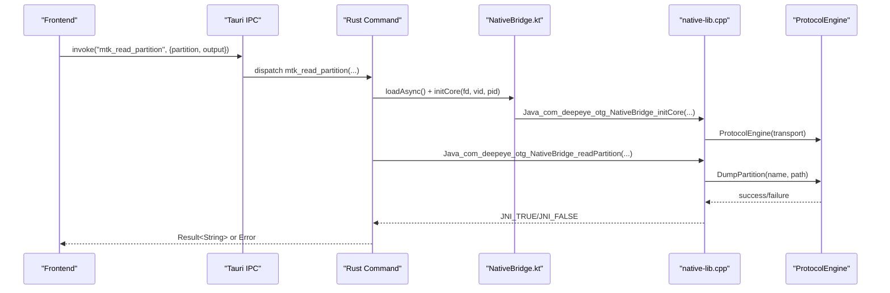
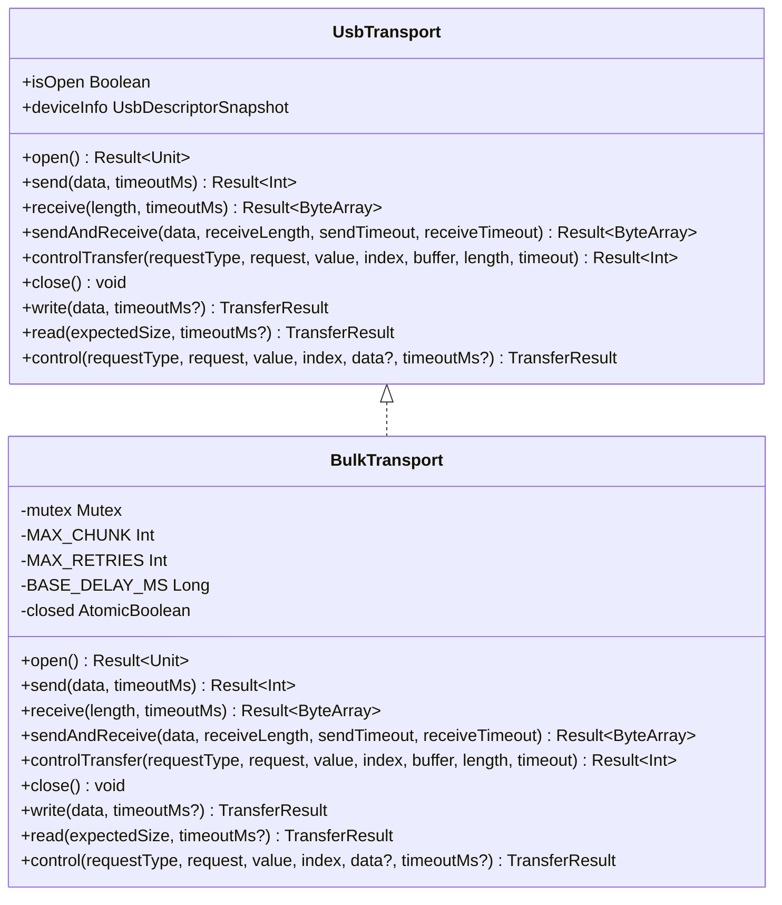
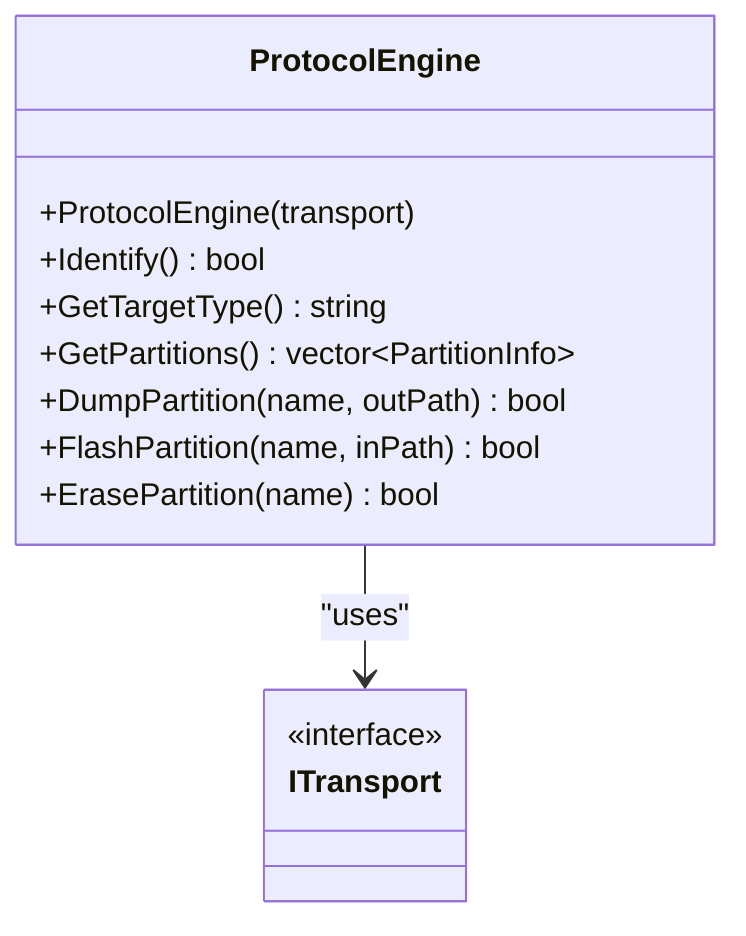
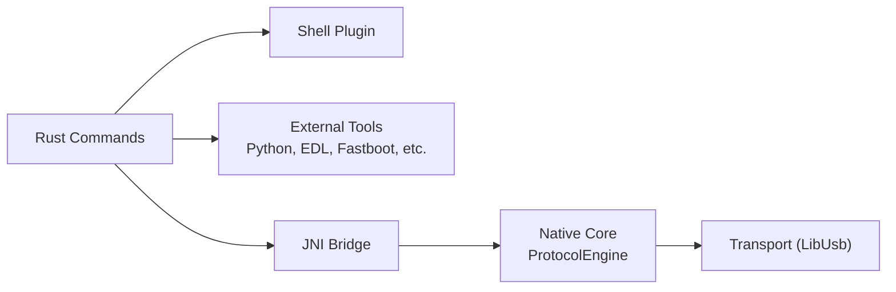

# API Reference

<cite>
**Referenced Files in This Document**
- [lib.rs](file://src-tauri/src/lib.rs)
- [Cargo.toml](file://src-tauri/Cargo.toml)
- [tauri.conf.json](file://src-tauri/tauri.conf.json)
- [commands/mod.rs](file://src-tauri/src/commands/mod.rs)
- [commands/activation.rs](file://src-tauri/src/commands/activation.rs)
- [commands/mtk.rs](file://src-tauri/src/commands/mtk.rs)
- [commands/edl.rs](file://src-tauri/src/commands/edl.rs)
- [NativeBridge.kt](file://app/src/main/kotlin/com/deepeye/otg/NativeBridge.kt)
- [UsbTransport.kt](file://app/src/main/kotlin/com/deepeye/otg/usb/UsbTransport.kt)
- [native-lib.cpp](file://app/src/main/jni/native-lib.cpp)
- [deepeye_core.h](file://app/src/main/jni/core/include/deepeye_core.h)
</cite>

## Table of Contents
1. [Introduction](#introduction)
2. [Project Structure](#project-structure)
3. [Core Components](#core-components)
4. [Architecture Overview](#architecture-overview)
5. [Detailed Component Analysis](#detailed-component-analysis)
6. [Dependency Analysis](#dependency-analysis)
7. [Performance Considerations](#performance-considerations)
8. [Troubleshooting Guide](#troubleshooting-guide)
9. [Conclusion](#conclusion)
10. [Appendices](#appendices)

## Introduction
This API Reference documents the public interfaces of DeepEye Unlocker across three layers:
- Rust Tauri command handlers that expose backend operations to the frontend.
- Android JNI bridge that connects Kotlin code to native C++ protocol engines.
- USB transport abstraction used by both the frontend and native layers to communicate with devices.

It covers function signatures, parameter specifications, return value formats, error handling, IPC events, protocol engine APIs, and practical usage patterns. It also includes guidance on API versioning, backward compatibility, and migration.

## Project Structure
The project is organized into:
- Desktop backend: Tauri-based Rust application exposing commands.
- Android frontend: Kotlin code with JNI bindings to native C++.
- Native core: C++ protocol engine and transport abstractions.

**Diagram sources**
- [lib.rs:154-350](file://src-tauri/src/lib.rs#L154-L350)
- [NativeBridge.kt:18-250](file://app/src/main/kotlin/com/deepeye/otg/NativeBridge.kt#L18-L250)
- [UsbTransport.kt:43-77](file://app/src/main/kotlin/com/deepeye/otg/usb/UsbTransport.kt#L43-L77)
- [native-lib.cpp:62-108](file://app/src/main/jni/native-lib.cpp#L62-L108)
- [deepeye_core.h:31-44](file://app/src/main/jni/core/include/deepeye_core.h#L31-L44)

**Section sources**
- [lib.rs:1-351](file://src-tauri/src/lib.rs#L1-L351)
- [Cargo.toml:1-42](file://src-tauri/Cargo.toml#L1-L42)
- [tauri.conf.json:1-192](file://src-tauri/tauri.conf.json#L1-L192)

## Core Components
- Rust Tauri commands: Centralized registration and invocation of backend operations. See [lib.rs:162-347](file://src-tauri/src/lib.rs#L162-L347).
- Android JNI bridge: Kotlin object exposing native methods for device operations. See [NativeBridge.kt:18-250](file://app/src/main/kotlin/com/deepeye/otg/NativeBridge.kt#L18-L250).
- USB transport abstraction: Kotlin interface and implementation for bulk transfers and control requests. See [UsbTransport.kt:43-311](file://app/src/main/kotlin/com/deepeye/otg/usb/UsbTransport.kt#L43-L311).
- Native core: Protocol engine and transport interfaces. See [deepeye_core.h:31-44](file://app/src/main/jni/core/include/deepeye_core.h#L31-L44) and [native-lib.cpp:62-108](file://app/src/main/jni/native-lib.cpp#L62-L108).

**Section sources**
- [lib.rs:162-347](file://src-tauri/src/lib.rs#L162-L347)
- [NativeBridge.kt:18-250](file://app/src/main/kotlin/com/deepeye/otg/NativeBridge.kt#L18-L250)
- [UsbTransport.kt:43-311](file://app/src/main/kotlin/com/deepeye/otg/usb/UsbTransport.kt#L43-L311)
- [deepeye_core.h:31-44](file://app/src/main/jni/core/include/deepeye_core.h#L31-L44)
- [native-lib.cpp:62-108](file://app/src/main/jni/native-lib.cpp#L62-L108)

## Architecture Overview
The frontend invokes Tauri commands. Rust commands either orchestrate external tools or delegate to the JNI bridge. The JNI bridge initializes a native transport, identifies the device, and executes protocol-specific operations.

**Diagram sources**
- [lib.rs:220-225](file://src-tauri/src/lib.rs#L220-L225)
- [commands/mtk.rs:62-83](file://src-tauri/src/commands/mtk.rs#L62-L83)
- [NativeBridge.kt:48-55](file://app/src/main/kotlin/com/deepeye/otg/NativeBridge.kt#L48-L55)
- [native-lib.cpp:138-153](file://app/src/main/jni/native-lib.cpp#L138-L153)
- [deepeye_core.h:31-44](file://app/src/main/jni/core/include/deepeye_core.h#L31-L44)

## Detailed Component Analysis

### Rust Tauri Commands API
- Registration: All commands are registered in the Tauri builder. See [lib.rs:162-347](file://src-tauri/src/lib.rs#L162-L347).
- Invocation: Frontend calls invoke with command names and arguments; handlers return typed results or errors.
- Event emission: Commands emit structured events for long-running tasks (e.g., progress, completion, errors).

Examples of documented commands:
- Activation
  - ios_check_activation_state: Checks activation state and determines removal path. Returns an activation state object. See [commands/activation.rs:29-76](file://src-tauri/src/commands/activation.rs#L29-L76).
  - ios_run_checkra1n: Starts a process and emits progress and completion events. See [commands/activation.rs:78-110](file://src-tauri/src/commands/activation.rs#L78-L110).
  - ios_patch_activation_record: Placeholder for future implementation. See [commands/activation.rs:112-117](file://src-tauri/src/commands/activation.rs#L112-L117).

- MediaTek (MTK)
  - mtk_run_command: Executes arbitrary mtkclient arguments and streams stdout/stderr. Returns combined stdout or error. See [commands/mtk.rs:52-59](file://src-tauri/src/commands/mtk.rs#L52-L59).
  - mtk_read_partition: Reads a partition to a file. See [commands/mtk.rs:62-83](file://src-tauri/src/commands/mtk.rs#L62-L83).
  - mtk_write_partition: Writes a file to a partition. See [commands/mtk.rs:86-107](file://src-tauri/src/commands/mtk.rs#L86-L107).
  - mtk_erase_partition: Erases a partition. See [commands/mtk.rs:109-116](file://src-tauri/src/commands/mtk.rs#L109-L116).
  - mtk_device_info: Prints GPT information. See [commands/mtk.rs:118-121](file://src-tauri/src/commands/mtk.rs#L118-L121).
  - mtk_unlock_bootloader: Invokes bootloader unlock via DA. See [commands/mtk.rs:123-126](file://src-tauri/src/commands/mtk.rs#L123-L126).

- EDL (Qualcomm)
  - edl_detect_device: Detects device and returns chipset/serial/mode. See [commands/edl.rs:57-105](file://src-tauri/src/commands/edl.rs#L57-L105).
  - edl_read_partition: Reads a partition to a file. See [commands/edl.rs:107-145](file://src-tauri/src/commands/edl.rs#L107-L145).
  - edl_write_partition: Writes an image to a partition. See [commands/edl.rs:147-184](file://src-tauri/src/commands/edl.rs#L147-L184).
  - edl_erase_partition: Erases a partition. See [commands/edl.rs:187-223](file://src-tauri/src/commands/edl.rs#L187-L223).
  - edl_reboot: Reboots device from EDL. See [commands/edl.rs:226-246](file://src-tauri/src/commands/edl.rs#L226-L246).
  - edl_get_gpt: Prints partition table. See [commands/edl.rs:248-277](file://src-tauri/src/commands/edl.rs#L248-L277).

Message formats and events:
- Events: Commands emit structured events (e.g., "mtk://stdout", "mtk://stderr", "mtk://exit", "activation-error", "activation-complete").
- Return values: Results are either success strings or error strings. Many commands return a formatted status message upon success.

**Section sources**
- [lib.rs:162-347](file://src-tauri/src/lib.rs#L162-L347)
- [commands/activation.rs:29-117](file://src-tauri/src/commands/activation.rs#L29-L117)
- [commands/mtk.rs:52-126](file://src-tauri/src/commands/mtk.rs#L52-L126)
- [commands/edl.rs:57-277](file://src-tauri/src/commands/edl.rs#L57-L277)

### Android JNI Interface (NativeBridge.kt)
Public methods exposed to Kotlin:
- Lifecycle
  - initCore(fd, vid, pid): Opens transport and returns a handle (pointer) or 0 on failure. See [NativeBridge.kt:48-55](file://app/src/main/kotlin/com/deepeye/otg/NativeBridge.kt#L48-L55).
  - identifyDevice(handle): Performs protocol handshake and returns device type string. See [NativeBridge.kt:51-52](file://app/src/main/kotlin/com/deepeye/otg/NativeBridge.kt#L51-L52).
  - closeCore(handle): Closes transport and frees resources. See [NativeBridge.kt:54-55](file://app/src/main/kotlin/com/deepeye/otg/NativeBridge.kt#L54-L55).

- Partition Operations
  - getPartitions(handle): Returns array of partition info strings. See [NativeBridge.kt:58-59](file://app/src/main/kotlin/com/deepeye/otg/NativeBridge.kt#L58-L59).
  - readPartition(handle, name, outPath): Dumps partition to file; returns boolean. See [NativeBridge.kt:61-62](file://app/src/main/kotlin/com/deepeye/otg/NativeBridge.kt#L61-L62).
  - writePartition(handle, name, inPath): Flashes partition from file; returns boolean. See [NativeBridge.kt:64-65](file://app/src/main/kotlin/com/deepeye/otg/NativeBridge.kt#L64-L65).
  - erasePartition(handle, name): Erases partition; returns boolean. See [NativeBridge.kt:67-68](file://app/src/main/kotlin/com/deepeye/otg/NativeBridge.kt#L67-L68).

- MediaTek (BROM)
  - injectDa(handle, daData): Injects DA binary; returns boolean. See [NativeBridge.kt:71-72](file://app/src/main/kotlin/com/deepeye/otg/NativeBridge.kt#L71-L72).
  - readNvram(handle, item): Reads NVRAM item; returns byte array. See [NativeBridge.kt:74-75](file://app/src/main/kotlin/com/deepeye/otg/NativeBridge.kt#L74-L75).
  - writeNvram(handle, item, data): Writes NVRAM item; returns boolean. See [NativeBridge.kt:77-78](file://app/src/main/kotlin/com/deepeye/otg/NativeBridge.kt#L77-L78).
  - enterMetaMode(handle): Switches to MetaMode; returns boolean. See [NativeBridge.kt:80-81](file://app/src/main/kotlin/com/deepeye/otg/NativeBridge.kt#L80-L81).
  - readSeccfg(handle): Reads seccfg; returns byte array. See [NativeBridge.kt:83-84](file://app/src/main/kotlin/com/deepeye/otg/NativeBridge.kt#L83-L84).
  - writeSeccfg(handle, data): Writes seccfg; returns boolean. See [NativeBridge.kt:86-87](file://app/src/main/kotlin/com/deepeye/otg/NativeBridge.kt#L86-L87).

- Qualcomm (EDL/Firehose)
  - saharaHandshake(handle, programmerPath): Establishes Sahara session; returns boolean. See [NativeBridge.kt:90-91](file://app/src/main/kotlin/com/deepeye/otg/NativeBridge.kt#L90-L91).
  - firehoseCommand(handle, xmlCommand): Sends XML command; returns response string. See [NativeBridge.kt:93-94](file://app/src/main/kotlin/com/deepeye/otg/NativeBridge.kt#L93-L94).
  - readQcNv(handle, nvItem): Reads NV item; returns byte array. See [NativeBridge.kt:96-97](file://app/src/main/kotlin/com/deepeye/otg/NativeBridge.kt#L96-L97).
  - writeQcNv(handle, nvItem, data): Writes NV item; returns boolean. See [NativeBridge.kt:99-100](file://app/src/main/kotlin/com/deepeye/otg/NativeBridge.kt#L99-L100).
  - diagCommand(handle, cmd): Sends Diag command; returns response bytes. See [NativeBridge.kt:102-103](file://app/src/main/kotlin/com/deepeye/otg/NativeBridge.kt#L102-L103).

- Samsung (ODIN)
  - odinHandshake(handle): Establishes Odin session; returns boolean. See [NativeBridge.kt:106-107](file://app/src/main/kotlin/com/deepeye/otg/NativeBridge.kt#L106-L107).
  - readPit(handle): Reads PIT; returns byte array. See [NativeBridge.kt:109-110](file://app/src/main/kotlin/com/deepeye/otg/NativeBridge.kt#L109-L110).
  - odinFlash(handle, partName, imagePath): Flashes image; returns boolean. See [NativeBridge.kt:112-113](file://app/src/main/kotlin/com/deepeye/otg/NativeBridge.kt#L112-L113).
  - readEfs(handle): Reads EFS; returns byte array. See [NativeBridge.kt:115-116](file://app/src/main/kotlin/com/deepeye/otg/NativeBridge.kt#L115-L116).
  - writeEfs(handle, data): Writes EFS; returns boolean. See [NativeBridge.kt:118-119](file://app/src/main/kotlin/com/deepeye/otg/NativeBridge.kt#L118-L119).

- UniSoc (FDL)
  - fdlHandshake(handle): Establishes FDL session; returns boolean. See [NativeBridge.kt:122-123](file://app/src/main/kotlin/com/deepeye/otg/NativeBridge.kt#L122-L123).
  - fdlFlash(handle, pacPath): Flashes PAC; returns boolean. See [NativeBridge.kt:125-126](file://app/src/main/kotlin/com/deepeye/otg/NativeBridge.kt#L125-L126).
  - readUnisocNv(handle, nvId): Reads NV; returns byte array. See [NativeBridge.kt:128-129](file://app/src/main/kotlin/com/deepeye/otg/NativeBridge.kt#L128-L129).
  - writeUnisocNv(handle, nvId, data): Writes NV; returns boolean. See [NativeBridge.kt:131-132](file://app/src/main/kotlin/com/deepeye/otg/NativeBridge.kt#L131-L132).

- Fastboot
  - fastbootCommand(handle, command): Sends command; returns response or FAIL: prefix. See [NativeBridge.kt:135-136](file://app/src/main/kotlin/com/deepeye/otg/NativeBridge.kt#L135-L136).
  - fastbootFlash(handle, partition, data): Downloads and flashes data; returns boolean. See [NativeBridge.kt:138-139](file://app/src/main/kotlin/com/deepeye/otg/NativeBridge.kt#L138-L139).
  - fastbootUnlock(handle): Requests OEM unlock; returns boolean. See [NativeBridge.kt:141-142](file://app/src/main/kotlin/com/deepeye/otg/NativeBridge.kt#L141-L142).
  - fastbootReboot(handle, target): Reboots device; returns boolean. See [NativeBridge.kt:144-145](file://app/src/main/kotlin/com/deepeye/otg/NativeBridge.kt#L144-L145).

- Forensics
  - safeDump(handle, partition, outPath): Safe partition dump with verification; returns boolean. See [NativeBridge.kt:152-153](file://app/src/main/kotlin/com/deepeye/otg/NativeBridge.kt#L152-L153).
  - carveDeletedData(handle, partition, types): Carves deleted files; returns JSON array string. See [NativeBridge.kt:154-158](file://app/src/main/kotlin/com/deepeye/otg/NativeBridge.kt#L154-L158).
  - acquireForensicImage(handle, partition, outDir): Forensic acquisition; returns JSON string. See [NativeBridge.kt:160-161](file://app/src/main/kotlin/com/deepeye/otg/NativeBridge.kt#L160-L161).
  - dumpRam(handle, outDir): RAM imaging; returns boolean. See [NativeBridge.kt:167-167](file://app/src/main/kotlin/com/deepeye/otg/NativeBridge.kt#L167-L167).
  - removeScreenLock(handle, dbPath): Clears Android locksettings; returns boolean. See [NativeBridge.kt:169-170](file://app/src/main/kotlin/com/deepeye/otg/NativeBridge.kt#L169-L170).

- Device Info and Utilities
  - getDeviceInfo(handle): Returns JSON device info. See [NativeBridge.kt:173-174](file://app/src/main/kotlin/com/deepeye/otg/NativeBridge.kt#L173-L174).
  - calculateFileHash(path): Returns SHA256 string. See [NativeBridge.kt:177-177](file://app/src/main/kotlin/com/deepeye/otg/NativeBridge.kt#L177-L177).

- TEE and Secure Storage
  - readRpmb(handle): Reads RPMB; returns byte array. See [NativeBridge.kt:180-181](file://app/src/main/kotlin/com/deepeye/otg/NativeBridge.kt#L180-L181).
  - readTeeDescriptor(handle): Returns descriptor string. See [NativeBridge.kt:183-184](file://app/src/main/kotlin/com/deepeye/otg/NativeBridge.kt#L183-L184).
  - peekPartition(handle, name, bytes): Returns hex string or null. See [NativeBridge.kt:187-187](file://app/src/main/kotlin/com/deepeye/otg/NativeBridge.kt#L187-L187).

- MTK Filesystem Decryption and Explorer
  - mtkDecryptFs(handle, partition, keyBlob): Decrypts userdata; returns boolean. See [NativeBridge.kt:194-194](file://app/src/main/kotlin/com/deepeye/otg/NativeBridge.kt#L194-L194).
  - fsCheckVolume(handle, volumeName): Checks volume existence; returns boolean. See [NativeBridge.kt:199-199](file://app/src/main/kotlin/com/deepeye/otg/NativeBridge.kt#L199-L199).
  - extractAdoptableKey(handle, partition): Extracts adoptable storage key; returns byte array. See [NativeBridge.kt:204-204](file://app/src/main/kotlin/com/deepeye/otg/NativeBridge.kt#L204-L204).

- Forensic File System Explorer
  - fsListDirectory(handle, partition, path): Lists files; returns JSON array string. See [NativeBridge.kt:207-207](file://app/src/main/kotlin/com/deepeye/otg/NativeBridge.kt#L207-L207).
  - fsReadFile(handle, partition, path): Reads file bytes; returns byte array. See [NativeBridge.kt:210-210](file://app/src/main/kotlin/com/deepeye/otg/NativeBridge.kt#L210-L210).
  - fsGetFileStats(handle, partition, path): Returns JSON metadata. See [NativeBridge.kt:213-213](file://app/src/main/kotlin/com/deepeye/otg/NativeBridge.kt#L213-L213).
  - fsExtractDirectory(handle, partition, srcPath, destPath, onProgress): Copies directory; returns JSON summary. See [NativeBridge.kt:220-226](file://app/src/main/kotlin/com/deepeye/otg/NativeBridge.kt#L220-L226).

- Storage Search and Patching
  - searchStorage(handle, pattern, limit): Searches storage; returns JSON array string. See [NativeBridge.kt:232-232](file://app/src/main/kotlin/com/deepeye/otg/NativeBridge.kt#L232-L232).
  - patchPartition(handle, name, offset, data): Patches partition; returns boolean. See [NativeBridge.kt:238-238](file://app/src/main/kotlin/com/deepeye/otg/NativeBridge.kt#L238-L238).
  - verifyImageSignature(handle, name): Verifies image signature; returns string. See [NativeBridge.kt:243-243](file://app/src/main/kotlin/com/deepeye/otg/NativeBridge.kt#L243-L243).

- Physical Integrity Testing
  - examinePhysicalIntegrity(handle): Returns JSON report. See [NativeBridge.kt:249-249](file://app/src/main/kotlin/com/deepeye/otg/NativeBridge.kt#L249-L249).

Parameter marshaling and error handling:
- All external calls marshal Kotlin types to native types (strings, byte arrays, integers). See [native-lib.cpp:28-56](file://app/src/main/jni/native-lib.cpp#L28-L56).
- Methods return primitive types (boolean, integer, string, byte array) or arrays. Failures typically propagate as false or empty values; callers should inspect logs and return codes.

**Section sources**
- [NativeBridge.kt:18-250](file://app/src/main/kotlin/com/deepeye/otg/NativeBridge.kt#L18-L250)
- [native-lib.cpp:62-108](file://app/src/main/jni/native-lib.cpp#L62-L108)

### USB Transport API (UsbTransport.kt)
Interface contract:
- open(): Result<Unit> — establishes transport session.
- send(data, timeoutMs): Result<Int> — bulk write with timeout.
- receive(length, timeoutMs): Result<ByteArray> — bulk read with timeout.
- sendAndReceive(data, receiveLength, sendTimeout, receiveTimeout): Result<ByteArray>.
- controlTransfer(requestType, request, value, index, buffer, length, timeout): Result<Int>.
- close(): void — releases resources.
- isOpen: Boolean — indicates active session.
- deviceInfo: UsbDescriptorSnapshot — device descriptors snapshot.

Compatibility API:
- write(data, timeoutMs?): TransferResult — supports retries and stall handling.
- read(expectedSize, timeoutMs?): TransferResult — supports partial reads and timeouts.
- control(requestType, request, value, index, data?, timeoutMs?): TransferResult.

Implementation details:
- BulkTransport uses a mutex to serialize transfers, chunked writes, and exponential backoff on stalls. See [UsbTransport.kt:82-311](file://app/src/main/kotlin/com/deepeye/otg/usb/UsbTransport.kt#L82-L311).
- TransferResult encapsulates success, partial, timeout, device-gone, stall, IO error, protocol error, and null-connection outcomes. See [UsbTransport.kt:22-38](file://app/src/main/kotlin/com/deepeye/otg/usb/UsbTransport.kt#L22-L38).

**Diagram sources**
- [UsbTransport.kt:43-311](file://app/src/main/kotlin/com/deepeye/otg/usb/UsbTransport.kt#L43-L311)

**Section sources**
- [UsbTransport.kt:43-311](file://app/src/main/kotlin/com/deepeye/otg/usb/UsbTransport.kt#L43-L311)

### Protocol Engine APIs (Native)
Native protocol engine and transport interfaces:
- ProtocolEngine: Identifies device, lists partitions, dumps/flashes/erases partitions. See [deepeye_core.h:31-44](file://app/src/main/jni/core/include/deepeye_core.h#L31-L44).
- ITransport: Abstract transport interface used by ProtocolEngine. See [deepeye_core.h:9-10](file://app/src/main/jni/core/include/deepeye_core.h#L9-L10).
- JNI entry points: All NativeBridge methods are backed by JNI functions delegating to ProtocolEngine and protocol managers. See [native-lib.cpp:62-108](file://app/src/main/jni/native-lib.cpp#L62-L108).

**Diagram sources**
- [deepeye_core.h:31-44](file://app/src/main/jni/core/include/deepeye_core.h#L31-L44)

**Section sources**
- [deepeye_core.h:31-44](file://app/src/main/jni/core/include/deepeye_core.h#L31-L44)
- [native-lib.cpp:62-108](file://app/src/main/jni/native-lib.cpp#L62-L108)

## Dependency Analysis
- Rust commands depend on:
  - Tauri plugins for shell, dialog, fs, sql, os, and updater.
  - External tools invoked via shell scope configured in Tauri config.
- JNI bridge depends on native core libraries and protocol managers.
- Native core depends on transport implementations (e.g., LibUsbTransport) and protocol-specific managers.

**Diagram sources**
- [lib.rs:156-161](file://src-tauri/src/lib.rs#L156-L161)
- [tauri.conf.json:94-183](file://src-tauri/tauri.conf.json#L94-L183)
- [native-lib.cpp:68-75](file://app/src/main/jni/native-lib.cpp#L68-L75)

**Section sources**
- [lib.rs:156-161](file://src-tauri/src/lib.rs#L156-L161)
- [tauri.conf.json:94-183](file://src-tauri/tauri.conf.json#L94-L183)

## Performance Considerations
- Chunked transfers: BulkTransport writes data in chunks and retries with exponential backoff to mitigate endpoint stalls. See [UsbTransport.kt:89-91](file://app/src/main/kotlin/com/deepeye/otg/usb/UsbTransport.kt#L89-L91) and [UsbTransport.kt:265-299](file://app/src/main/kotlin/com/deepeye/otg/usb/UsbTransport.kt#L265-L299).
- Concurrency: Use Dispatchers.IO for JNI operations and avoid blocking the main thread. See [NativeBridge.kt:25-43](file://app/src/main/kotlin/com/deepeye/otg/NativeBridge.kt#L25-L43).
- Event streaming: Long-running operations emit incremental progress to keep UI responsive. See [commands/mtk.rs:16-34](file://src-tauri/src/commands/mtk.rs#L16-L34) and [commands/activation.rs:88-107](file://src-tauri/src/commands/activation.rs#L88-L107).

[No sources needed since this section provides general guidance]

## Troubleshooting Guide
Common issues and resolutions:
- JNI load failures: Ensure loadAsync is called on Dispatchers.IO and not on the main thread. See [NativeBridge.kt:25-43](file://app/src/main/kotlin/com/deepeye/otg/NativeBridge.kt#L25-L43).
- USB device gone or stalled: BulkTransport detects stalls and clears them; callers should retry or re-open the session. See [UsbTransport.kt:301-309](file://app/src/main/kotlin/com/deepeye/otg/usb/UsbTransport.kt#L301-L309).
- External tool errors: Rust commands return stderr messages or formatted errors; inspect emitted events for mtk://stderr and activation-error. See [commands/mtk.rs:23-42](file://src-tauri/src/commands/mtk.rs#L23-L42) and [commands/activation.rs:96-98](file://src-tauri/src/commands/activation.rs#L96-L98).
- Partition operations: Validate partition names and paths; EDL commands enforce allowed partitions. See [commands/edl.rs:113-116](file://src-tauri/src/commands/edl.rs#L113-L116).

**Section sources**
- [NativeBridge.kt:25-43](file://app/src/main/kotlin/com/deepeye/otg/NativeBridge.kt#L25-L43)
- [UsbTransport.kt:301-309](file://app/src/main/kotlin/com/deepeye/otg/usb/UsbTransport.kt#L301-L309)
- [commands/mtk.rs:23-42](file://src-tauri/src/commands/mtk.rs#L23-L42)
- [commands/activation.rs:96-98](file://src-tauri/src/commands/activation.rs#L96-L98)
- [commands/edl.rs:113-116](file://src-tauri/src/commands/edl.rs#L113-L116)

## Conclusion
This API Reference consolidates the public interfaces across Rust Tauri commands, Android JNI, and USB transport layers. It provides precise guidance on invoking operations, handling results and errors, and integrating with protocol engines. For robust integrations, follow the recommended patterns for concurrency, retries, and event-driven progress reporting.

[No sources needed since this section summarizes without analyzing specific files]

## Appendices

### API Versioning and Backward Compatibility
- Version fields:
  - Desktop crate version: see [Cargo.toml](file://src-tauri/Cargo.toml#L3).
  - Application version: see [tauri.conf.json](file://src-tauri/tauri.conf.json#L3).
- Migration guidance:
  - Keep command names stable; introduce new commands rather than renaming existing ones.
  - For JNI, maintain stable method signatures; deprecate old methods by adding new ones and marking old ones as deprecated.
  - For USB transport, preserve interface methods and only add optional parameters with defaults.

**Section sources**
- [Cargo.toml](file://src-tauri/Cargo.toml#L3)
- [tauri.conf.json](file://src-tauri/tauri.conf.json#L3)

### Practical Usage Examples
- Read a partition via EDL:
  - Frontend invokes the EDL read command with partition and output path; Rust spawns the EDL tool, streams output, and returns a success message. See [commands/edl.rs:107-145](file://src-tauri/src/commands/edl.rs#L107-L145).
- MediaTek NVRAM read/write:
  - Frontend calls JNI methods to read/write NVRAM items; JNI delegates to protocol managers. See [NativeBridge.kt:74-78](file://app/src/main/kotlin/com/deepeye/otg/NativeBridge.kt#L74-L78) and [native-lib.cpp:206-234](file://app/src/main/jni/native-lib.cpp#L206-L234).
- Fastboot operations:
  - Frontend sends commands and flashes images; JNI translates to protocol manager calls. See [NativeBridge.kt:135-145](file://app/src/main/kotlin/com/deepeye/otg/NativeBridge.kt#L135-L145) and [native-lib.cpp:515-581](file://app/src/main/jni/native-lib.cpp#L515-L581).

**Section sources**
- [commands/edl.rs:107-145](file://src-tauri/src/commands/edl.rs#L107-L145)
- [NativeBridge.kt:74-78](file://app/src/main/kotlin/com/deepeye/otg/NativeBridge.kt#L74-L78)
- [native-lib.cpp:206-234](file://app/src/main/jni/native-lib.cpp#L206-L234)
- [NativeBridge.kt:135-145](file://app/src/main/kotlin/com/deepeye/otg/NativeBridge.kt#L135-L145)
- [native-lib.cpp:515-581](file://app/src/main/jni/native-lib.cpp#L515-L581)