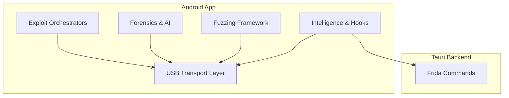
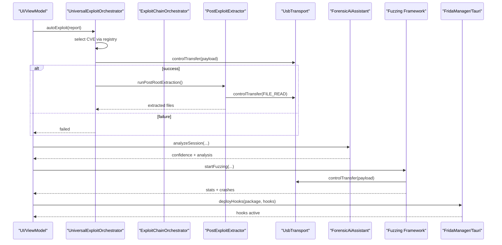
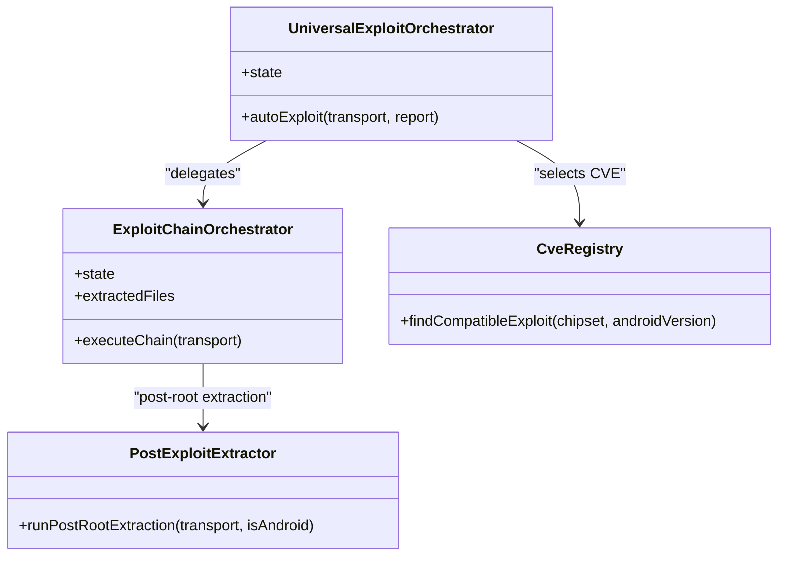
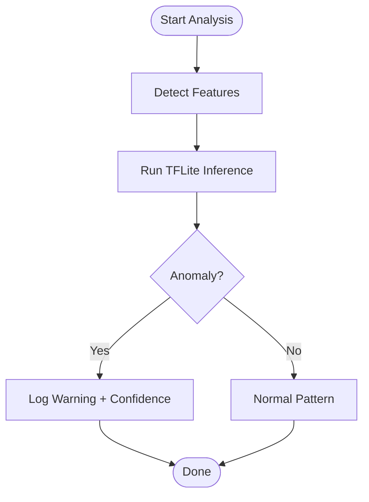
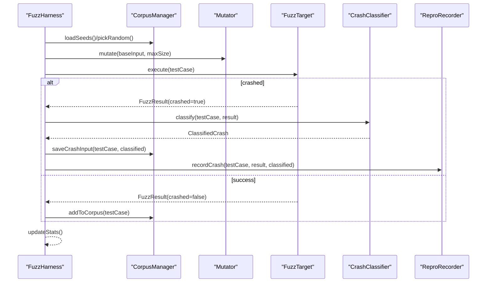
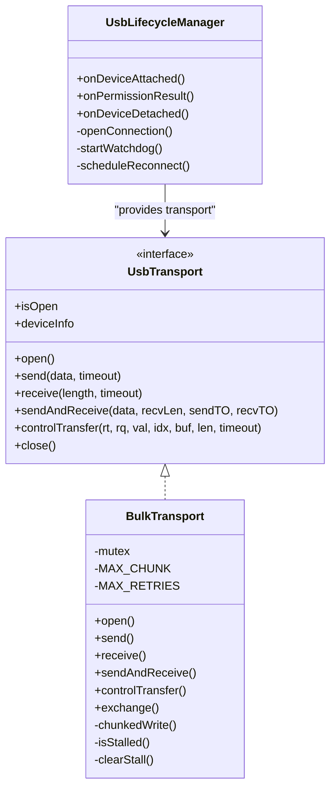
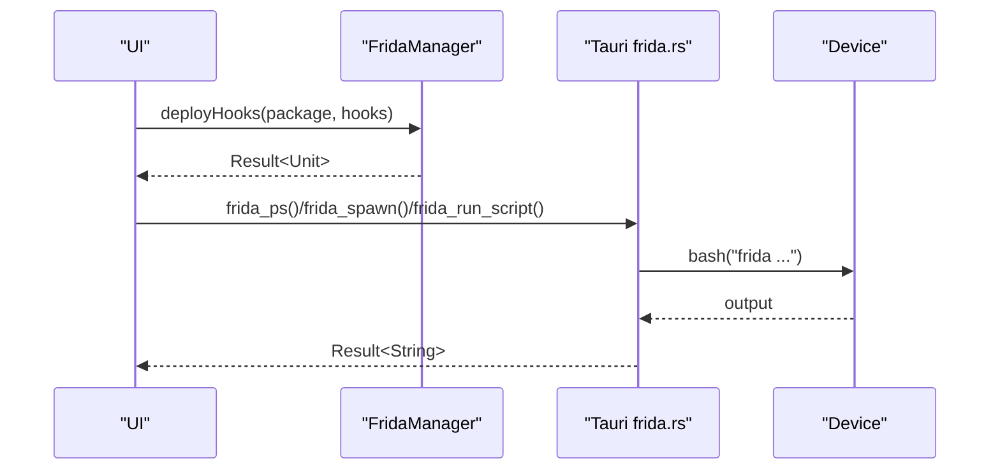
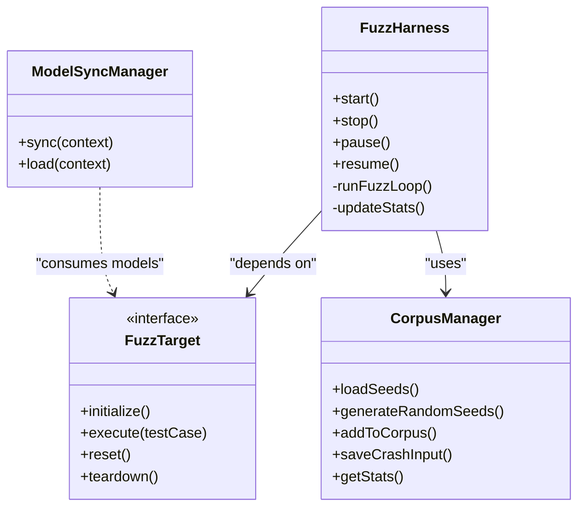
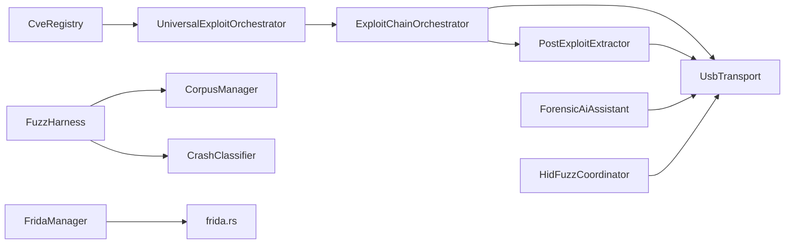

# Advanced Topics

<cite>
**Referenced Files in This Document**
- [ExploitChainOrchestrator.kt](file://app/src/main/kotlin/com/deepeye/otg/exploit/ExploitChainOrchestrator.kt)
- [CveRegistry.kt](file://app/src/main/kotlin/com/deepeye/otg/exploit/CveRegistry.kt)
- [PostExploitExtractor.kt](file://app/src/main/kotlin/com/deepeye/otg/exploit/PostExploitExtractor.kt)
- [UniversalExploitOrchestrator.kt](file://app/src/main/kotlin/com/deepeye/otg/exploit/UniversalExploitOrchestrator.kt)
- [BruteForceExecutor.kt](file://app/src/main/kotlin/com/deepeye/otg/exploit/BruteForceExecutor.kt)
- [ForensicAiAssistant.kt](file://app/src/main/kotlin/com/deepeye/otg/engine/ForensicAiAssistant.kt)
- [AnomalyDetector.kt](file://app/src/main/kotlin/com/deepeye/otg/intelligence/AnomalyDetector.kt)
- [FridaManager.kt](file://app/src/main/kotlin/com/deepeye/otg/intelligence/FridaManager.kt)
- [HidFuzzCoordinator.kt](file://app/src/main/kotlin/com/deepeye/otg/fuzz/hid/HidFuzzCoordinator.kt)
- [FuzzHarness.kt](file://app/src/main/kotlin/com/deepeye/otg/research/fuzz/FuzzHarness.kt)
- [CorpusManager.kt](file://app/src/main/kotlin/com/deepeye/otg/research/fuzz/CorpusManager.kt)
- [CrashClassifier.kt](file://app/src/main/kotlin/com/deepeye/otg/research/fuzz/CrashClassifier.kt)
- [UsbLifecycleManager.kt](file://app/src/main/kotlin/com/deepeye/otg/usb/UsbLifecycleManager.kt)
- [UsbTransport.kt](file://app/src/main/kotlin/com/deepeye/otg/usb/UsbTransport.kt)
- [ModelSyncManager.kt](file://app/src/main/kotlin/com/deepeye/otg/service/ModelSyncManager.kt)
- [frida.rs](file://src-tauri/src/frida.rs)
</cite>

## Table of Contents
1. [Introduction](#introduction)
2. [Project Structure](#project-structure)
3. [Core Components](#core-components)
4. [Architecture Overview](#architecture-overview)
5. [Detailed Component Analysis](#detailed-component-analysis)
6. [Dependency Analysis](#dependency-analysis)
7. [Performance Considerations](#performance-considerations)
8. [Troubleshooting Guide](#troubleshooting-guide)
9. [Conclusion](#conclusion)
10. [Appendices](#appendices)

## Introduction
This document presents advanced topics in DeepEye Unlocker, focusing on:
- Universal exploit orchestration and CVE registry management
- Post-root extraction and forensic AI assistance
- Fuzzing framework with corpus management, crash classification, and reproducible testing
- Custom protocol implementation guidelines, plugin development patterns, and extensibility
- Performance optimization for low-latency USB orchestration, memory management, and parallel processing
- Advanced debugging, profiling, and troubleshooting methodologies
- Reverse engineering support, Frida integration, and dynamic analysis
- Research and development topics for vulnerability discovery, exploit development, and security assessment

## Project Structure
DeepEye Unlocker is organized into:
- Kotlin Android application modules for device orchestration, exploit orchestration, fuzzing, AI forensics, and USB transport
- Tauri backend for Frida integration and system-level commands
- JNI/libusb integration for low-level USB control transfers
- Asset-driven models and scripts for payloads and hooks

**Diagram sources**
- [UsbLifecycleManager.kt:1-402](file://app/src/main/kotlin/com/deepeye/otg/usb/UsbLifecycleManager.kt#L1-L402)
- [UsbTransport.kt:1-311](file://app/src/main/kotlin/com/deepeye/otg/usb/UsbTransport.kt#L1-L311)
- [frida.rs:1-159](file://src-tauri/src/frida.rs#L1-L159)

**Section sources**
- [UsbLifecycleManager.kt:1-402](file://app/src/main/kotlin/com/deepeye/otg/usb/UsbLifecycleManager.kt#L1-L402)
- [UsbTransport.kt:1-311](file://app/src/main/kotlin/com/deepeye/otg/usb/UsbTransport.kt#L1-L311)
- [frida.rs:1-159](file://src-tauri/src/frida.rs#L1-L159)

## Core Components
- Universal exploit orchestrators coordinate multi-stage exploits, integrate CVE registry selection, and trigger post-compromise extraction.
- Forensic AI Assistant performs automated device analysis, anomaly detection, and report synthesis.
- Fuzzing framework manages corpus, mutations, crash classification, and reproducible test recording.
- USB transport layer provides robust bulk and control transfer abstractions with retry/backoff and stall handling.
- Frida integration enables dynamic hook deployment and memory dumping from the Tauri backend.

**Section sources**
- [ExploitChainOrchestrator.kt:1-198](file://app/src/main/kotlin/com/deepeye/otg/exploit/ExploitChainOrchestrator.kt#L1-L198)
- [UniversalExploitOrchestrator.kt:1-148](file://app/src/main/kotlin/com/deepeye/otg/exploit/UniversalExploitOrchestrator.kt#L1-L148)
- [CveRegistry.kt:1-44](file://app/src/main/kotlin/com/deepeye/otg/exploit/CveRegistry.kt#L1-L44)
- [PostExploitExtractor.kt:1-68](file://app/src/main/kotlin/com/deepeye/otg/exploit/PostExploitExtractor.kt#L1-L68)
- [ForensicAiAssistant.kt:1-255](file://app/src/main/kotlin/com/deepeye/otg/engine/ForensicAiAssistant.kt#L1-L255)
- [AnomalyDetector.kt:1-81](file://app/src/main/kotlin/com/deepeye/otg/intelligence/AnomalyDetector.kt#L1-L81)
- [FuzzHarness.kt:1-399](file://app/src/main/kotlin/com/deepeye/otg/research/fuzz/FuzzHarness.kt#L1-L399)
- [CorpusManager.kt:1-242](file://app/src/main/kotlin/com/deepeye/otg/research/fuzz/CorpusManager.kt#L1-L242)
- [CrashClassifier.kt:1-278](file://app/src/main/kotlin/com/deepeye/otg/research/fuzz/CrashClassifier.kt#L1-L278)
- [UsbTransport.kt:1-311](file://app/src/main/kotlin/com/deepeye/otg/usb/UsbTransport.kt#L1-L311)
- [FridaManager.kt:1-49](file://app/src/main/kotlin/com/deepeye/otg/intelligence/FridaManager.kt#L1-L49)
- [frida.rs:1-159](file://src-tauri/src/frida.rs#L1-L159)

## Architecture Overview
The system integrates exploit orchestration, fuzzing, and forensic AI with a unified USB transport and optional Frida hooks.

**Diagram sources**
- [UniversalExploitOrchestrator.kt:36-84](file://app/src/main/kotlin/com/deepeye/otg/exploit/UniversalExploitOrchestrator.kt#L36-L84)
- [ExploitChainOrchestrator.kt:45-120](file://app/src/main/kotlin/com/deepeye/otg/exploit/ExploitChainOrchestrator.kt#L45-L120)
- [PostExploitExtractor.kt:32-66](file://app/src/main/kotlin/com/deepeye/otg/exploit/PostExploitExtractor.kt#L32-L66)
- [UsbTransport.kt:139-250](file://app/src/main/kotlin/com/deepeye/otg/usb/UsbTransport.kt#L139-L250)
- [ForensicAiAssistant.kt:31-69](file://app/src/main/kotlin/com/deepeye/otg/engine/ForensicAiAssistant.kt#L31-L69)
- [HidFuzzCoordinator.kt:37-88](file://app/src/main/kotlin/com/deepeye/otg/fuzz/hid/HidFuzzCoordinator.kt#L37-L88)
- [FridaManager.kt:23-47](file://app/src/main/kotlin/com/deepeye/otg/intelligence/FridaManager.kt#L23-L47)
- [frida.rs:20-61](file://src-tauri/src/frida.rs#L20-L61)

## Detailed Component Analysis

### Universal Exploit Orchestration and CVE Registry
- UniversalExploitOrchestrator selects and executes exploits based on telemetry-driven CVE reports, persists outcomes, and triggers post-compromise extraction.
- ExploitChainOrchestrator coordinates multi-stage root exploits, including ASLR defeat, staged UAFs, kernel LPE, AMFI bypass, and post-root extraction.
- CveRegistry maintains a curated list of CVE-based payloads with chipset and Android version compatibility.

**Diagram sources**
- [UniversalExploitOrchestrator.kt:1-148](file://app/src/main/kotlin/com/deepeye/otg/exploit/UniversalExploitOrchestrator.kt#L1-L148)
- [ExploitChainOrchestrator.kt:1-198](file://app/src/main/kotlin/com/deepeye/otg/exploit/ExploitChainOrchestrator.kt#L1-L198)
- [PostExploitExtractor.kt:1-68](file://app/src/main/kotlin/com/deepeye/otg/exploit/PostExploitExtractor.kt#L1-L68)
- [CveRegistry.kt:1-44](file://app/src/main/kotlin/com/deepeye/otg/exploit/CveRegistry.kt#L1-L44)

**Section sources**
- [UniversalExploitOrchestrator.kt:36-106](file://app/src/main/kotlin/com/deepeye/otg/exploit/UniversalExploitOrchestrator.kt#L36-L106)
- [ExploitChainOrchestrator.kt:45-120](file://app/src/main/kotlin/com/deepeye/otg/exploit/ExploitChainOrchestrator.kt#L45-L120)
- [PostExploitExtractor.kt:32-66](file://app/src/main/kotlin/com/deepeye/otg/exploit/PostExploitExtractor.kt#L32-L66)
- [CveRegistry.kt:38-42](file://app/src/main/kotlin/com/deepeye/otg/exploit/CveRegistry.kt#L38-L42)

### Forensic AI Assistant and Anomaly Detection
- ForensicAiAssistant provides automated device analysis, identity status checks, global situation assessment, storage mapping, sector entropy analysis, and cryptographic artifact detection.
- AnomalyDetector loads a TensorFlow Lite model to detect device-side traps or anomalies from feature vectors.

**Diagram sources**
- [AnomalyDetector.kt:43-69](file://app/src/main/kotlin/com/deepeye/otg/intelligence/AnomalyDetector.kt#L43-L69)

**Section sources**
- [ForensicAiAssistant.kt:31-253](file://app/src/main/kotlin/com/deepeye/otg/engine/ForensicAiAssistant.kt#L31-L253)
- [AnomalyDetector.kt:15-74](file://app/src/main/kotlin/com/deepeye/otg/intelligence/AnomalyDetector.kt#L15-L74)

### Fuzzing Framework: Corpus, Crashes, and Reproducible Testing
- FuzzHarness orchestrates corpus loading, mutation, execution, crash classification, and persistent recording.
- CorpusManager manages seeds, runtime corpus, crash buckets, and minimization.
- CrashClassifier categorizes crashes by component, type, and severity, and builds signatures for deduplication.
- HidFuzzCoordinator demonstrates HID-specific fuzzing with continuous mutation and crash persistence.

**Diagram sources**
- [FuzzHarness.kt:276-373](file://app/src/main/kotlin/com/deepeye/otg/research/fuzz/FuzzHarness.kt#L276-L373)
- [CorpusManager.kt:60-107](file://app/src/main/kotlin/com/deepeye/otg/research/fuzz/CorpusManager.kt#L60-L107)
- [CrashClassifier.kt:131-167](file://app/src/main/kotlin/com/deepeye/otg/research/fuzz/CrashClassifier.kt#L131-L167)
- [HidFuzzCoordinator.kt:37-88](file://app/src/main/kotlin/com/deepeye/otg/fuzz/hid/HidFuzzCoordinator.kt#L37-L88)

**Section sources**
- [FuzzHarness.kt:178-398](file://app/src/main/kotlin/com/deepeye/otg/research/fuzz/FuzzHarness.kt#L178-L398)
- [CorpusManager.kt:35-241](file://app/src/main/kotlin/com/deepeye/otg/research/fuzz/CorpusManager.kt#L35-L241)
- [CrashClassifier.kt:22-277](file://app/src/main/kotlin/com/deepeye/otg/research/fuzz/CrashClassifier.kt#L22-L277)
- [HidFuzzCoordinator.kt:14-131](file://app/src/main/kotlin/com/deepeye/otg/fuzz/hid/HidFuzzCoordinator.kt#L14-L131)

### USB Transport and Low-Latency Orchestration
- UsbTransport defines a unified interface for bulk and control transfers with robust error modeling.
- BulkTransport implements chunked writes, retry/backoff, stall detection/clear, and ZLP handling.
- UsbLifecycleManager coordinates device attachment, permission, session establishment, watchdog pings, and reconnect scheduling.

**Diagram sources**
- [UsbTransport.kt:43-311](file://app/src/main/kotlin/com/deepeye/otg/usb/UsbTransport.kt#L43-L311)
- [UsbLifecycleManager.kt:24-402](file://app/src/main/kotlin/com/deepeye/otg/usb/UsbLifecycleManager.kt#L24-L402)

**Section sources**
- [UsbTransport.kt:82-311](file://app/src/main/kotlin/com/deepeye/otg/usb/UsbTransport.kt#L82-L311)
- [UsbLifecycleManager.kt:71-373](file://app/src/main/kotlin/com/deepeye/otg/usb/UsbLifecycleManager.kt#L71-L373)

### Reverse Engineering Support and Frida Integration
- FridaManager lists and deploys hook scripts to target packages.
- Tauri frida.rs exposes commands for process enumeration, spawn/attach, script injection, export listing, and memory dumping.

**Diagram sources**
- [FridaManager.kt:23-47](file://app/src/main/kotlin/com/deepeye/otg/intelligence/FridaManager.kt#L23-L47)
- [frida.rs:20-159](file://src-tauri/src/frida.rs#L20-L159)

**Section sources**
- [FridaManager.kt:11-48](file://app/src/main/kotlin/com/deepeye/otg/intelligence/FridaManager.kt#L11-L48)
- [frida.rs:1-159](file://src-tauri/src/frida.rs#L1-L159)

### Plugin Development Patterns and Extensibility
- FuzzHarness targets are pluggable via FuzzTarget interface; implementers define delivery mechanisms per surface (USB HID/BULK/CONTROL, network, file formats).
- CorpusManager supports seed and crash input persistence with configurable directories and minimization helpers.
- ModelSyncManager demonstrates cloud-backed model synchronization with delta updates and hot-reload.

**Diagram sources**
- [FuzzHarness.kt:178-398](file://app/src/main/kotlin/com/deepeye/otg/research/fuzz/FuzzHarness.kt#L178-L398)
- [CorpusManager.kt:35-241](file://app/src/main/kotlin/com/deepeye/otg/research/fuzz/CorpusManager.kt#L35-L241)
- [ModelSyncManager.kt:25-90](file://app/src/main/kotlin/com/deepeye/otg/service/ModelSyncManager.kt#L25-L90)

**Section sources**
- [FuzzHarness.kt:129-165](file://app/src/main/kotlin/com/deepeye/otg/research/fuzz/FuzzHarness.kt#L129-L165)
- [CorpusManager.kt:35-241](file://app/src/main/kotlin/com/deepeye/otg/research/fuzz/CorpusManager.kt#L35-L241)
- [ModelSyncManager.kt:14-90](file://app/src/main/kotlin/com/deepeye/otg/service/ModelSyncManager.kt#L14-L90)

## Dependency Analysis
- Exploit orchestration depends on USB transport and post-exploit extraction; CVE registry informs selection.
- Forensic AI integrates with USB transport snapshots and device metadata.
- Fuzzing depends on corpus and crash classification; results persist to DAO entities.
- Frida integration bridges Android app and Tauri backend for dynamic analysis.

**Diagram sources**
- [CveRegistry.kt:1-44](file://app/src/main/kotlin/com/deepeye/otg/exploit/CveRegistry.kt#L1-L44)
- [UniversalExploitOrchestrator.kt:1-148](file://app/src/main/kotlin/com/deepeye/otg/exploit/UniversalExploitOrchestrator.kt#L1-L148)
- [ExploitChainOrchestrator.kt:1-198](file://app/src/main/kotlin/com/deepeye/otg/exploit/ExploitChainOrchestrator.kt#L1-L198)
- [PostExploitExtractor.kt:1-68](file://app/src/main/kotlin/com/deepeye/otg/exploit/PostExploitExtractor.kt#L1-L68)
- [UsbTransport.kt:1-311](file://app/src/main/kotlin/com/deepeye/otg/usb/UsbTransport.kt#L1-L311)
- [ForensicAiAssistant.kt:1-255](file://app/src/main/kotlin/com/deepeye/otg/engine/ForensicAiAssistant.kt#L1-L255)
- [HidFuzzCoordinator.kt:1-131](file://app/src/main/kotlin/com/deepeye/otg/fuzz/hid/HidFuzzCoordinator.kt#L1-L131)
- [FuzzHarness.kt:1-399](file://app/src/main/kotlin/com/deepeye/otg/research/fuzz/FuzzHarness.kt#L1-L399)
- [CorpusManager.kt:1-242](file://app/src/main/kotlin/com/deepeye/otg/research/fuzz/CorpusManager.kt#L1-L242)
- [CrashClassifier.kt:1-278](file://app/src/main/kotlin/com/deepeye/otg/research/fuzz/CrashClassifier.kt#L1-L278)
- [FridaManager.kt:1-49](file://app/src/main/kotlin/com/deepeye/otg/intelligence/FridaManager.kt#L1-L49)
- [frida.rs:1-159](file://src-tauri/src/frida.rs#L1-L159)

**Section sources**
- [UniversalExploitOrchestrator.kt:36-106](file://app/src/main/kotlin/com/deepeye/otg/exploit/UniversalExploitOrchestrator.kt#L36-L106)
- [ExploitChainOrchestrator.kt:45-120](file://app/src/main/kotlin/com/deepeye/otg/exploit/ExploitChainOrchestrator.kt#L45-L120)
- [PostExploitExtractor.kt:32-66](file://app/src/main/kotlin/com/deepeye/otg/exploit/PostExploitExtractor.kt#L32-L66)
- [UsbTransport.kt:139-250](file://app/src/main/kotlin/com/deepeye/otg/usb/UsbTransport.kt#L139-L250)
- [ForensicAiAssistant.kt:31-69](file://app/src/main/kotlin/com/deepeye/otg/engine/ForensicAiAssistant.kt#L31-L69)
- [HidFuzzCoordinator.kt:37-88](file://app/src/main/kotlin/com/deepeye/otg/fuzz/hid/HidFuzzCoordinator.kt#L37-L88)
- [FuzzHarness.kt:276-373](file://app/src/main/kotlin/com/deepeye/otg/research/fuzz/FuzzHarness.kt#L276-L373)
- [CorpusManager.kt:164-195](file://app/src/main/kotlin/com/deepeye/otg/research/fuzz/CorpusManager.kt#L164-L195)
- [CrashClassifier.kt:131-167](file://app/src/main/kotlin/com/deepeye/otg/research/fuzz/CrashClassifier.kt#L131-L167)
- [FridaManager.kt:23-47](file://app/src/main/kotlin/com/deepeye/otg/intelligence/FridaManager.kt#L23-L47)
- [frida.rs:20-61](file://src-tauri/src/frida.rs#L20-L61)

## Performance Considerations
- USB transport optimization:
  - Chunked bulk writes with exponential backoff and stall handling reduce stalls and improve reliability.
  - Mutex-protected transfers ensure thread safety under concurrent loads.
  - Watchdog pings detect disconnections promptly to trigger reconnect scheduling.
- Fuzzing throughput:
  - High-frequency loops with minimal delays enable rapid mutation and execution.
  - Persistent crash inputs and corpus minimization reduce redundant work.
- AI inference:
  - Device-side TFLite model loading and inference provide low-latency anomaly detection.
- Parallelism:
  - Coroutines with IO dispatcher and supervisor scopes manage long-running tasks without blocking UI.
- Memory management:
  - Streaming reads and bounded buffers prevent excessive allocations.
  - ZLP handling avoids unnecessary overhead for zero-length transfers.

**Section sources**
- [UsbTransport.kt:174-311](file://app/src/main/kotlin/com/deepeye/otg/usb/UsbTransport.kt#L174-L311)
- [UsbLifecycleManager.kt:295-373](file://app/src/main/kotlin/com/deepeye/otg/usb/UsbLifecycleManager.kt#L295-L373)
- [HidFuzzCoordinator.kt:46-86](file://app/src/main/kotlin/com/deepeye/otg/fuzz/hid/HidFuzzCoordinator.kt#L46-L86)
- [CorpusManager.kt:129-136](file://app/src/main/kotlin/com/deepeye/otg/research/fuzz/CorpusManager.kt#L129-L136)
- [AnomalyDetector.kt:29-38](file://app/src/main/kotlin/com/deepeye/otg/intelligence/AnomalyDetector.kt#L29-L38)

## Troubleshooting Guide
- USB connectivity issues:
  - Permission denial or timeouts require user intervention; lifecycle manager transitions to appropriate states and schedules retries.
  - Watchdog failures indicate device disconnects; lifecycle manager triggers detachment and reconnect scheduling.
- Transfer failures:
  - Control/bulk transfers return explicit error types; callers handle stalls, timeouts, and partial transfers.
- Fuzzing stability:
  - Crash classification provides bucketing and severity; repro recorder captures inputs for later replay.
- Frida deployment:
  - Script concatenation and progress callbacks aid in diagnosing hook deployment failures.

**Section sources**
- [UsbLifecycleManager.kt:165-208](file://app/src/main/kotlin/com/deepeye/otg/usb/UsbLifecycleManager.kt#L165-L208)
- [UsbTransport.kt:22-38](file://app/src/main/kotlin/com/deepeye/otg/usb/UsbTransport.kt#L22-L38)
- [CrashClassifier.kt:131-167](file://app/src/main/kotlin/com/deepeye/otg/research/fuzz/CrashClassifier.kt#L131-L167)
- [FridaManager.kt:23-47](file://app/src/main/kotlin/com/deepeye/otg/intelligence/FridaManager.kt#L23-L47)

## Conclusion
DeepEye Unlocker’s advanced capabilities combine robust exploit orchestration, AI-driven forensics, and a scalable fuzzing framework, all unified by a resilient USB transport and dynamic Frida integration. The modular design supports extensibility, reproducible testing, and performance optimization for real-world security assessments.

## Appendices
- Custom protocol implementation guidelines:
  - Implement UsbTransport for new protocols; leverage BulkTransport patterns for bulk and control transfers.
  - Define FuzzTarget for new surfaces; ensure deterministic resets and teardown.
- Plugin development patterns:
  - Use FuzzHarness with pluggable FuzzTarget implementations for new target surfaces.
  - Extend CorpusManager for specialized seed sets and crash categories.
- Extensibility mechanisms:
  - ModelSyncManager demonstrates cloud-backed asset synchronization with hot-reload.
  - FridaManager and Tauri frida.rs provide a foundation for dynamic hook deployment and memory analysis.