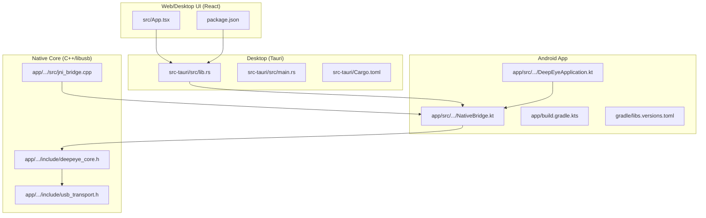
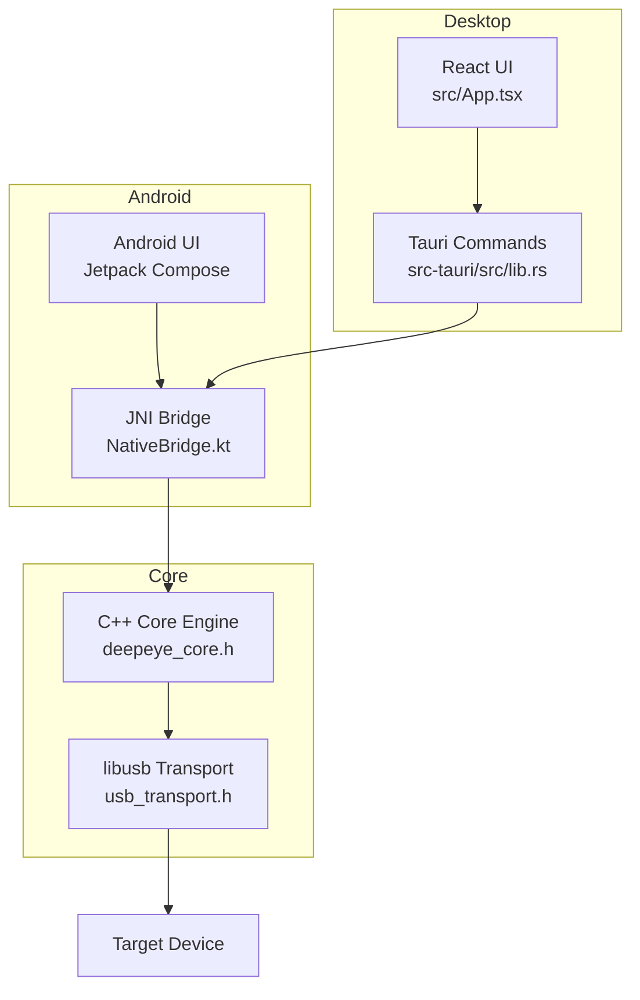
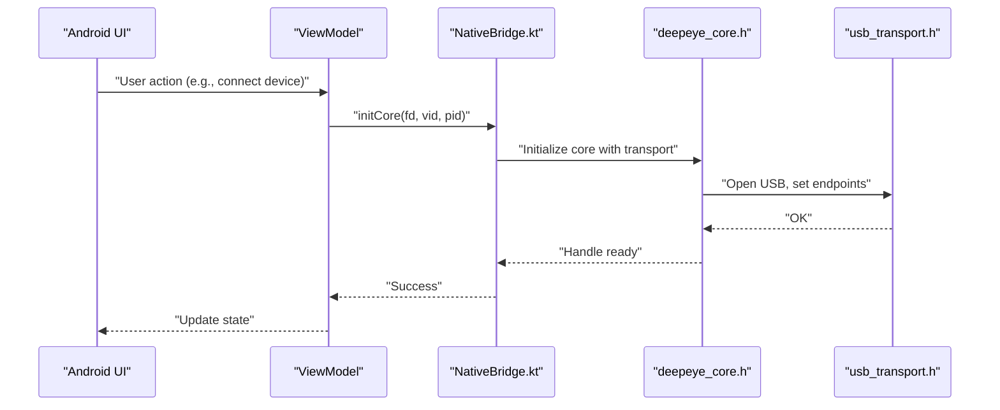
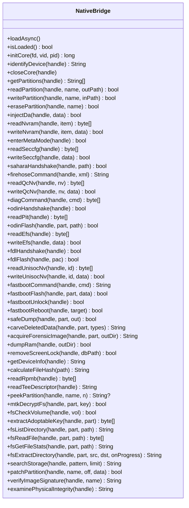
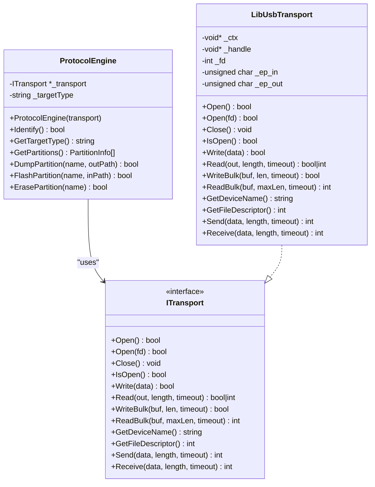
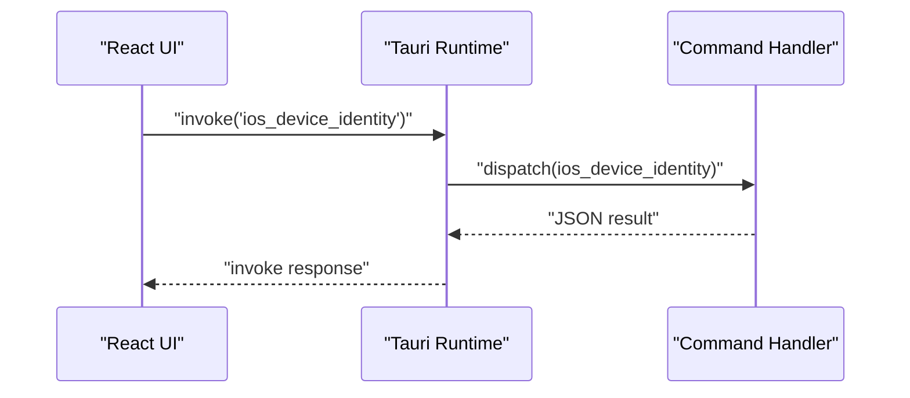
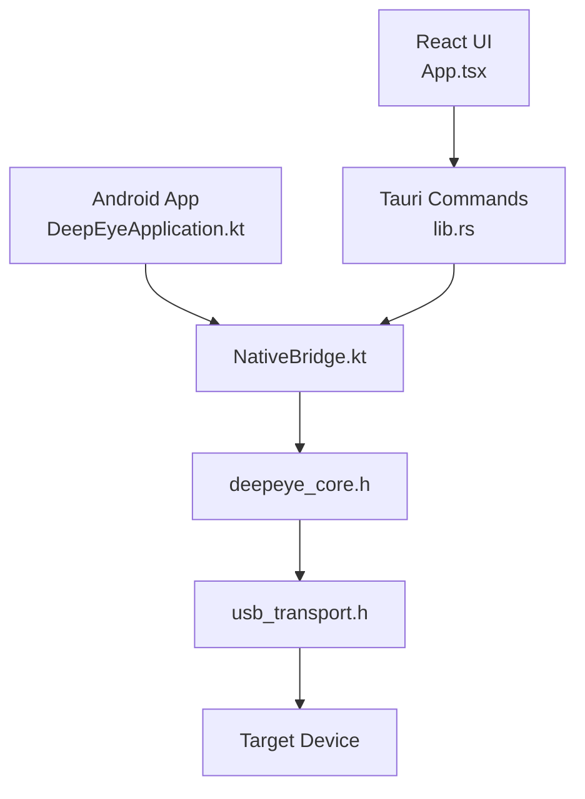
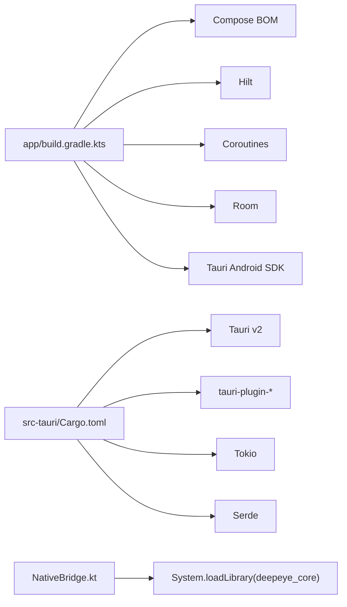
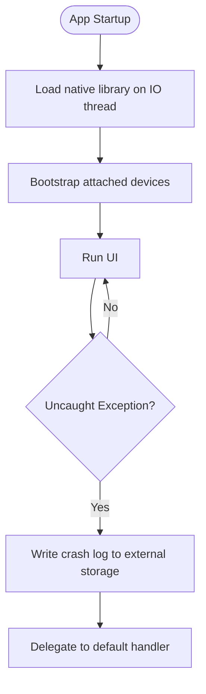

# Architecture Overview

<cite>
**Referenced Files in This Document**
- [README.md](file://README.md)
- [src/App.tsx](file://src/App.tsx)
- [package.json](file://package.json)
- [src-tauri/src/main.rs](file://src-tauri/src/main.rs)
- [src-tauri/src/lib.rs](file://src-tauri/src/lib.rs)
- [src-tauri/Cargo.toml](file://src-tauri/Cargo.toml)
- [app/src/main/kotlin/com/deepeye/otg/NativeBridge.kt](file://app/src/main/kotlin/com/deepeye/otg/NativeBridge.kt)
- [app/src/main/kotlin/com/deepeye/otg/DeepEyeApplication.kt](file://app/src/main/kotlin/com/deepeye/otg/DeepEyeApplication.kt)
- [app/build.gradle.kts](file://app/build.gradle.kts)
- [gradle/libs.versions.toml](file://gradle/libs.versions.toml)
- [app/src/main/jni/core/include/usb_transport.h](file://app/src/main/jni/core/include/usb_transport.h)
- [app/src/main/jni/core/include/deepeye_core.h](file://app/src/main/jni/core/include/deepeye_core.h)
- [app/src/main/jni/core/src/jni_bridge.cpp](file://app/src/main/jni/core/src/jni_bridge.cpp)
</cite>

## Table of Contents
1. [Introduction](#introduction)
2. [Project Structure](#project-structure)
3. [Core Components](#core-components)
4. [Architecture Overview](#architecture-overview)
5. [Detailed Component Analysis](#detailed-component-analysis)
6. [Dependency Analysis](#dependency-analysis)
7. [Performance Considerations](#performance-considerations)
8. [Troubleshooting Guide](#troubleshooting-guide)
9. [Conclusion](#conclusion)
10. [Appendices](#appendices)

## Introduction
This document presents the architecture of DeepEye Unlocker, a professional-grade mobile forensic engine. It describes the multi-layered system integrating:
- Frontend: React/Tauri desktop application
- Android application layer: Jetpack Compose UI with Kotlin
- Kotlin Native Bridge: JNI interface to the native core
- Native Core Engine: C++17 with libusb transport
- Target physical devices: Android, iOS, and related recovery/bootloader protocols

The system emphasizes low-latency USB orchestration, protocol diversity (Qualcomm EDL, MediaTek BROM, Samsung Odin, UniSoc FDL, Fastboot), and forensic capabilities including bit-level imaging, decryption, and integrity analysis.

## Project Structure
The repository is organized into:
- Desktop (Tauri/Rust): src-tauri
- Web/Desktop UI (React): src
- Android app (Compose/Kotlin): app
- Native core (C++/libusb): app/src/main/jni/core

**Diagram sources**
- [src-tauri/src/lib.rs:154-350](file://src-tauri/src/lib.rs#L154-L350)
- [src-tauri/src/main.rs:1-7](file://src-tauri/src/main.rs#L1-L7)
- [src-tauri/Cargo.toml:1-42](file://src-tauri/Cargo.toml#L1-L42)
- [src/App.tsx:1-88](file://src/App.tsx#L1-L88)
- [package.json:1-30](file://package.json#L1-L30)
- [app/src/main/kotlin/com/deepeye/otg/NativeBridge.kt:1-251](file://app/src/main/kotlin/com/deepeye/otg/NativeBridge.kt#L1-L251)
- [app/src/main/kotlin/com/deepeye/otg/DeepEyeApplication.kt:1-112](file://app/src/main/kotlin/com/deepeye/otg/DeepEyeApplication.kt#L1-L112)
- [app/build.gradle.kts:1-143](file://app/build.gradle.kts#L1-L143)
- [gradle/libs.versions.toml:1-53](file://gradle/libs.versions.toml#L1-L53)
- [app/src/main/jni/core/include/usb_transport.h:1-45](file://app/src/main/jni/core/include/usb_transport.h#L1-L45)
- [app/src/main/jni/core/include/deepeye_core.h:1-50](file://app/src/main/jni/core/include/deepeye_core.h#L1-L50)
- [app/src/main/jni/core/src/jni_bridge.cpp:1-13](file://app/src/main/jni/core/src/jni_bridge.cpp#L1-L13)

**Section sources**
- [README.md:39-51](file://README.md#L39-L51)
- [src-tauri/src/lib.rs:154-350](file://src-tauri/src/lib.rs#L154-L350)
- [src/App.tsx:1-88](file://src/App.tsx#L1-L88)
- [app/src/main/kotlin/com/deepeye/otg/NativeBridge.kt:1-251](file://app/src/main/kotlin/com/deepeye/otg/NativeBridge.kt#L1-L251)

## Core Components
- React/Tauri Desktop UI: Provides navigation, device cards, console logs, and page routing. It communicates with Rust backend via Tauri’s invoke channel.
- Rust Backend (Tauri): Orchestrates iOS/macOS operations, device management, backups, forensic tools, and updates. Exposes commands for the UI.
- Android App: Jetpack Compose UI with MVVM-like view models. Uses a Kotlin Native Bridge to call into the native core.
- Kotlin Native Bridge: JNI surface exposing hundreds of native functions for device identification, protocol handshakes, partition operations, forensic acquisition, and integrity checks.
- Native Core Engine: C++17 with libusb transport abstraction. Implements protocol engines (EDL, BROM, Odin, FDL, Fastboot) and forensic operations.
- libusb Transport: Cross-platform asynchronous USB transport used by the native core to communicate with target devices.

**Section sources**
- [src/App.tsx:26-46](file://src/App.tsx#L26-L46)
- [src-tauri/src/lib.rs:154-350](file://src-tauri/src/lib.rs#L154-L350)
- [app/src/main/kotlin/com/deepeye/otg/NativeBridge.kt:48-250](file://app/src/main/kotlin/com/deepeye/otg/NativeBridge.kt#L48-L250)
- [app/src/main/jni/core/include/usb_transport.h:10-39](file://app/src/main/jni/core/include/usb_transport.h#L10-L39)
- [app/src/main/jni/core/include/deepeye_core.h:31-44](file://app/src/main/jni/core/include/deepeye_core.h#L31-L44)

## Architecture Overview
The system follows a layered architecture:
- Presentation Layer: React/Tauri desktop UI and Android Jetpack Compose UI
- Domain/Control Layer: Tauri commands and Android view models
- Bridge Layer: JNI bridge to native core
- Core Layer: C++17 core engine with protocol engines and forensic subsystems
- Transport Layer: libusb for USB communication

**Diagram sources**
- [src/App.tsx:48-85](file://src/App.tsx#L48-L85)
- [src-tauri/src/lib.rs:154-350](file://src-tauri/src/lib.rs#L154-L350)
- [app/src/main/kotlin/com/deepeye/otg/NativeBridge.kt:48-250](file://app/src/main/kotlin/com/deepeye/otg/NativeBridge.kt#L48-L250)
- [app/src/main/jni/core/include/deepeye_core.h:31-44](file://app/src/main/jni/core/include/deepeye_core.h#L31-L44)
- [app/src/main/jni/core/include/usb_transport.h:10-39](file://app/src/main/jni/core/include/usb_transport.h#L10-L39)

## Detailed Component Analysis

### Android UI and MVVM Pattern
- The Android app uses Jetpack Compose with a UI shell and modular pages. While not a strict MVVM framework, the view models coordinate UI state and orchestrate native calls via the bridge.
- The application initializes native libraries asynchronously on IO threads and sets up crash logging for diagnostics.

**Diagram sources**
- [app/src/main/kotlin/com/deepeye/otg/DeepEyeApplication.kt:51-54](file://app/src/main/kotlin/com/deepeye/otg/DeepEyeApplication.kt#L51-L54)
- [app/src/main/kotlin/com/deepeye/otg/NativeBridge.kt:48-56](file://app/src/main/kotlin/com/deepeye/otg/NativeBridge.kt#L48-L56)
- [app/src/main/jni/core/include/deepeye_core.h:31-44](file://app/src/main/jni/core/include/deepeye_core.h#L31-L44)
- [app/src/main/jni/core/include/usb_transport.h:15-28](file://app/src/main/jni/core/include/usb_transport.h#L15-L28)

**Section sources**
- [app/src/main/kotlin/com/deepeye/otg/DeepEyeApplication.kt:43-63](file://app/src/main/kotlin/com/deepeye/otg/DeepEyeApplication.kt#L43-L63)
- [app/src/main/kotlin/com/deepeye/otg/NativeBridge.kt:18-45](file://app/src/main/kotlin/com/deepeye/otg/NativeBridge.kt#L18-L45)

### Kotlin Native Bridge and JNI Surface
- The bridge exposes a comprehensive set of native functions covering device identification, protocol handshakes, partition operations, forensic acquisition, and integrity checks.
- Functions are grouped by SoC/protocol family (e.g., MTK, Qualcomm, Samsung, UniSoc, Fastboot) and forensic operations.

**Diagram sources**
- [app/src/main/kotlin/com/deepeye/otg/NativeBridge.kt:48-250](file://app/src/main/kotlin/com/deepeye/otg/NativeBridge.kt#L48-L250)

**Section sources**
- [app/src/main/kotlin/com/deepeye/otg/NativeBridge.kt:1-251](file://app/src/main/kotlin/com/deepeye/otg/NativeBridge.kt#L1-L251)

### Native Core Engine and Protocol Engines
- The core defines a ProtocolEngine that identifies the target device type and performs partition operations.
- It relies on an ITransport abstraction implemented by libusb transport for bulk transfers and endpoint management.

**Diagram sources**
- [app/src/main/jni/core/include/deepeye_core.h:31-44](file://app/src/main/jni/core/include/deepeye_core.h#L31-L44)
- [app/src/main/jni/core/include/usb_transport.h:10-39](file://app/src/main/jni/core/include/usb_transport.h#L10-L39)

**Section sources**
- [app/src/main/jni/core/include/deepeye_core.h:14-44](file://app/src/main/jni/core/include/deepeye_core.h#L14-L44)
- [app/src/main/jni/core/include/usb_transport.h:10-39](file://app/src/main/jni/core/include/usb_transport.h#L10-L39)

### Desktop UI and Tauri Commands
- The React UI organizes pages and a terminal log, and navigates between functional modules.
- The Tauri backend registers a large set of commands for iOS/macOS operations, diagnostics, backups, forensic tools, and device management.

**Diagram sources**
- [src/App.tsx:26-46](file://src/App.tsx#L26-L46)
- [src-tauri/src/lib.rs:162-347](file://src-tauri/src/lib.rs#L162-L347)

**Section sources**
- [src/App.tsx:1-88](file://src/App.tsx#L1-L88)
- [src-tauri/src/lib.rs:154-350](file://src-tauri/src/lib.rs#L154-L350)

### System Context and Integration Patterns
- The Android app initializes the native library and coordinates USB lifecycle. The desktop UI invokes Tauri commands for higher-level tasks.
- Both paths converge on the native core for protocol-specific operations and forensic workflows.

**Diagram sources**
- [app/src/main/kotlin/com/deepeye/otg/DeepEyeApplication.kt:51-54](file://app/src/main/kotlin/com/deepeye/otg/DeepEyeApplication.kt#L51-L54)
- [app/src/main/kotlin/com/deepeye/otg/NativeBridge.kt:48-56](file://app/src/main/kotlin/com/deepeye/otg/NativeBridge.kt#L48-L56)
- [src/App.tsx:48-85](file://src/App.tsx#L48-L85)
- [src-tauri/src/lib.rs:162-347](file://src-tauri/src/lib.rs#L162-L347)
- [app/src/main/jni/core/include/deepeye_core.h:31-44](file://app/src/main/jni/core/include/deepeye_core.h#L31-L44)
- [app/src/main/jni/core/include/usb_transport.h:15-28](file://app/src/main/jni/core/include/usb_transport.h#L15-L28)

## Dependency Analysis
- Android app depends on Compose BOM, Hilt, Coroutines, Retrofit, Room, and Tauri Android SDK.
- Desktop Rust crate depends on Tauri v2 plugins (shell, sql, dialog, fs, os, updater), Tokio, Serde, and Chrono.
- Native bridge links to the C++ core via System.loadLibrary("deepeye_core").

**Diagram sources**
- [app/build.gradle.kts:84-135](file://app/build.gradle.kts#L84-L135)
- [gradle/libs.versions.toml:25-53](file://gradle/libs.versions.toml#L25-L53)
- [src-tauri/Cargo.toml:12-27](file://src-tauri/Cargo.toml#L12-L27)
- [app/src/main/kotlin/com/deepeye/otg/NativeBridge.kt:34-36](file://app/src/main/kotlin/com/deepeye/otg/NativeBridge.kt#L34-L36)

**Section sources**
- [app/build.gradle.kts:84-135](file://app/build.gradle.kts#L84-L135)
- [gradle/libs.versions.toml:25-53](file://gradle/libs.versions.toml#L25-L53)
- [src-tauri/Cargo.toml:12-27](file://src-tauri/Cargo.toml#L12-L27)

## Performance Considerations
- Latency targets are documented across layers: UI < 16.7ms, JNI bridge < 0.5ms, core < 0.1ms, USB bulk transfer < 2.0ms, decryption < 5ms per GB.
- Asynchronous I/O via libusb and coroutines minimize blocking on the UI thread.
- Native library loading occurs on IO threads to avoid main-thread stalls.

**Section sources**
- [README.md:55-62](file://README.md#L55-L62)
- [app/src/main/kotlin/com/deepeye/otg/DeepEyeApplication.kt:51-54](file://app/src/main/kotlin/com/deepeye/otg/DeepEyeApplication.kt#L51-L54)

## Troubleshooting Guide
- Crash reporting: The Android application installs a global uncaught exception handler that writes crash logs to external storage for later analysis.
- USB lifecycle: The application bootstraps already attached devices and integrates with a lifecycle manager for hotplug scenarios.
- Logging: Timber is used in debug builds for structured logging.

**Diagram sources**
- [app/src/main/kotlin/com/deepeye/otg/DeepEyeApplication.kt:70-94](file://app/src/main/kotlin/com/deepeye/otg/DeepEyeApplication.kt#L70-L94)
- [app/src/main/kotlin/com/deepeye/otg/DeepEyeApplication.kt:96-104](file://app/src/main/kotlin/com/deepeye/otg/DeepEyeApplication.kt#L96-L104)

**Section sources**
- [app/src/main/kotlin/com/deepeye/otg/DeepEyeApplication.kt:70-94](file://app/src/main/kotlin/com/deepeye/otg/DeepEyeApplication.kt#L70-L94)
- [app/src/main/kotlin/com/deepeye/otg/DeepEyeApplication.kt:96-104](file://app/src/main/kotlin/com/deepeye/otg/DeepEyeApplication.kt#L96-L104)

## Conclusion
DeepEye Unlocker employs a layered architecture with clear separation between presentation, orchestration, bridging, and core logic. The React/Tauri desktop UI complements the Android Compose UI, both invoking native capabilities through a robust JNI bridge into a C++ core powered by libusb. The system emphasizes performance, reliability, and forensic integrity, with documented latency targets and comprehensive protocol coverage.

## Appendices

### Technology Stack and Compatibility
- Android: SDK 24–34, Kotlin 2.0, Compose BOM, Hilt, Coroutines, Room, Retrofit
- Desktop: Rust 2021 edition, Tauri v2, Tokio, Serde, SQLite plugin
- Native: C++17, Standalone STL, libusb-1.0.26
- UI: React 18, Vite, TypeScript

**Section sources**
- [README.md:87-100](file://README.md#L87-L100)
- [app/build.gradle.kts:10-82](file://app/build.gradle.kts#L10-L82)
- [gradle/libs.versions.toml:1-53](file://gradle/libs.versions.toml#L1-L53)
- [src-tauri/Cargo.toml:1-42](file://src-tauri/Cargo.toml#L1-L42)
- [package.json:1-30](file://package.json#L1-L30)

### Architectural Patterns
- MVVM-like coordination in Android UI with view models and state holders
- Command pattern exposed via Tauri invoke handlers and JNI method dispatch
- Plugin architecture via Tauri plugins and modular Rust modules

**Section sources**
- [src-tauri/src/lib.rs:154-350](file://src-tauri/src/lib.rs#L154-L350)
- [app/src/main/kotlin/com/deepeye/otg/NativeBridge.kt:48-250](file://app/src/main/kotlin/com/deepeye/otg/NativeBridge.kt#L48-L250)