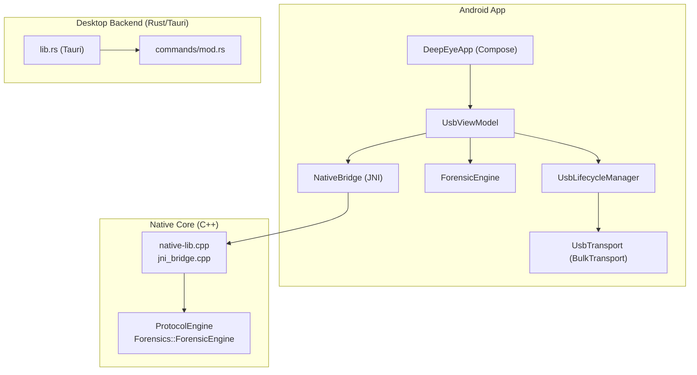
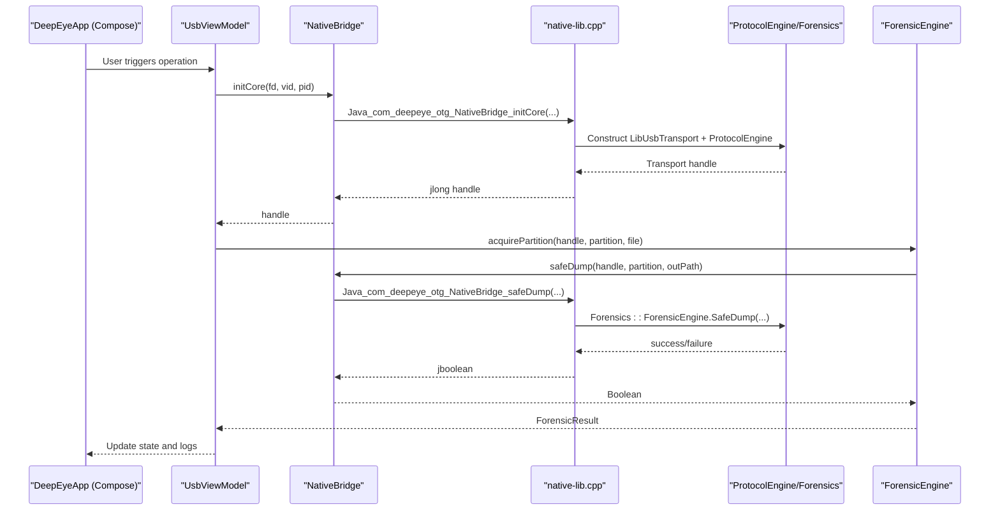
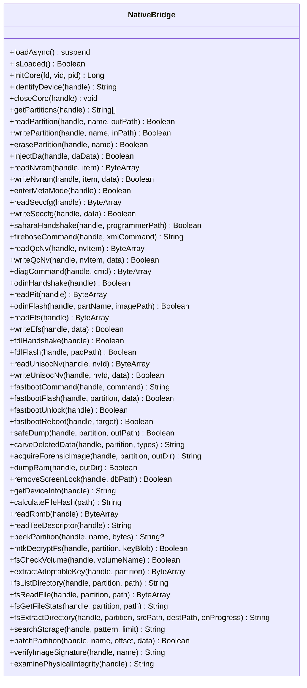
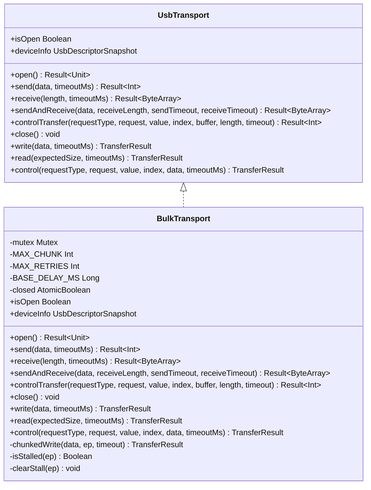
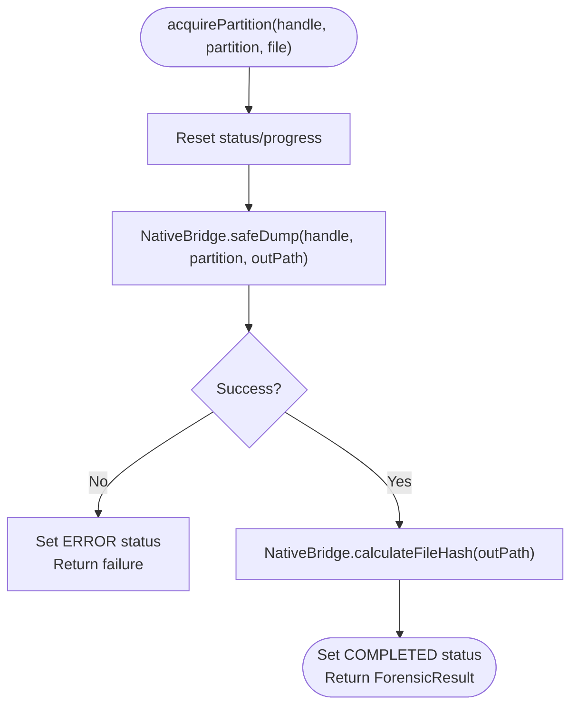
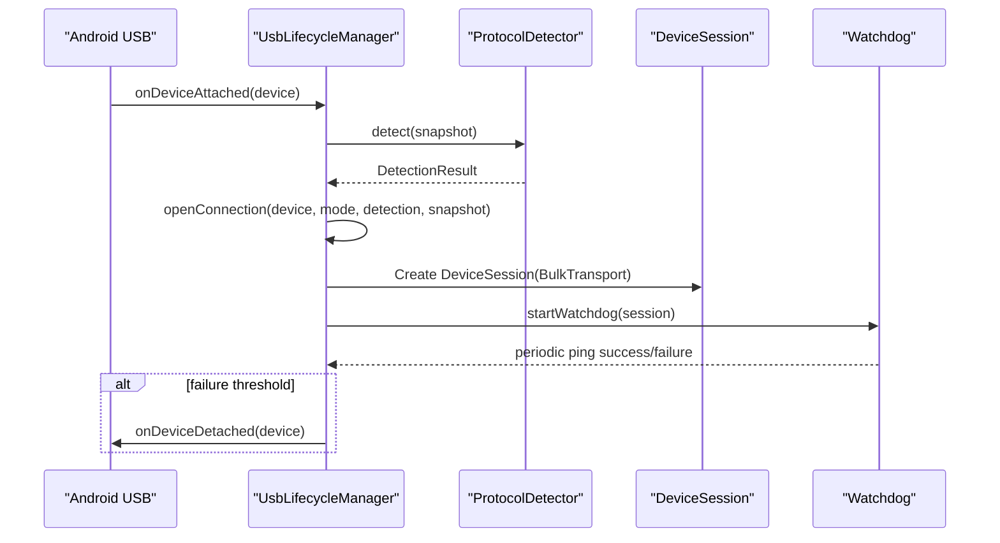
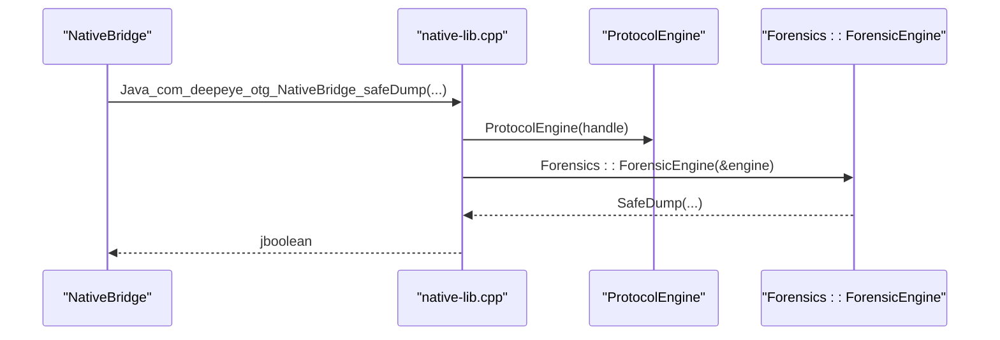
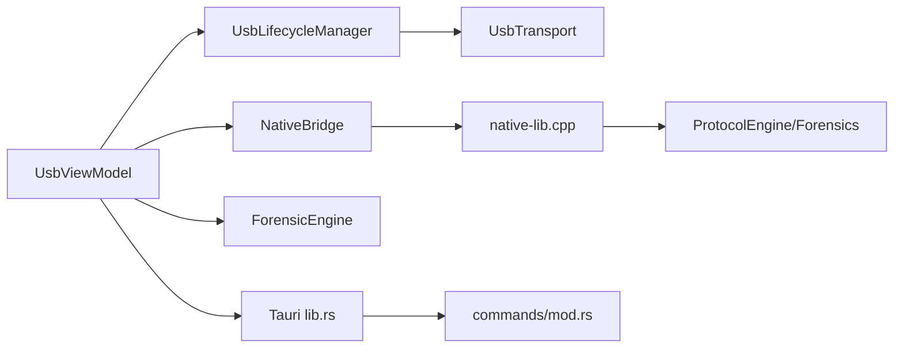

# Core Components

<cite>
**Referenced Files in This Document**
- [NativeBridge.kt](file://app/src/main/kotlin/com/deepeye/otg/NativeBridge.kt)
- [UsbTransport.kt](file://app/src/main/kotlin/com/deepeye/otg/usb/UsbTransport.kt)
- [ForensicEngine.kt](file://app/src/main/kotlin/com/deepeye/otg/engine/ForensicEngine.kt)
- [UsbLifecycleManager.kt](file://app/src/main/kotlin/com/deepeye/otg/usb/UsbLifecycleManager.kt)
- [UsbSessionManager.kt](file://app/src/main/kotlin/com/deepeye/otg/usb/UsbSessionManager.kt)
- [UsbViewModel.kt](file://app/src/main/kotlin/com/deepeye/otg/viewmodel/UsbViewModel.kt)
- [DeepEyeApp.kt](file://app/src/main/kotlin/com/deepeye/otg/ui/DeepEyeApp.kt)
- [MassExtractor.kt](file://app/src/main/kotlin/com/deepeye/otg/service/MassExtractor.kt)
- [UniversalExploitOrchestrator.kt](file://app/src/main/kotlin/com/deepeye/otg/exploit/UniversalExploitOrchestrator.kt)
- [ForensicRepository.kt](file://app/src/main/kotlin/com/deepeye/otg/data/repository/ForensicRepository.kt)
- [jni_bridge.cpp](file://app/src/main/jni/core/src/jni_bridge.cpp)
- [native-lib.cpp](file://app/src/main/jni/native-lib.cpp)
- [forensic_engine.cpp](file://app/src/main/jni/core/src/forensics/forensic_engine.cpp)
- [lib.rs](file://src-tauri/src/lib.rs)
- [mod.rs](file://src-tauri/src/commands/mod.rs)
</cite>

## Table of Contents
1. [Introduction](#introduction)
2. [Project Structure](#project-structure)
3. [Core Components](#core-components)
4. [Architecture Overview](#architecture-overview)
5. [Detailed Component Analysis](#detailed-component-analysis)
6. [Dependency Analysis](#dependency-analysis)
7. [Performance Considerations](#performance-considerations)
8. [Troubleshooting Guide](#troubleshooting-guide)
9. [Conclusion](#conclusion)

## Introduction
This document explains the core components of DeepEye Unlocker, focusing on the Android Kotlin/NDK bridge, unified USB transport abstraction, forensic acquisition engine, Rust-based desktop backend, and Android application layer. It covers bidirectional communication mechanisms, data marshaling, component interaction patterns, initialization sequences, and error handling strategies.

## Project Structure
DeepEye Unlocker comprises:
- Android app module with Kotlin/Compose UI, ViewModel architecture, and JNI bridge to a native C++ core.
- A native C++ core exposing protocol engines and forensic services via JNI.
- A Tauri-based desktop backend with Rust command handlers for advanced operations.

**Diagram sources**
- [UsbViewModel.kt:1-1273](file://app/src/main/kotlin/com/deepeye/otg/viewmodel/UsbViewModel.kt#L1-L1273)
- [NativeBridge.kt:1-251](file://app/src/main/kotlin/com/deepeye/otg/NativeBridge.kt#L1-L251)
- [UsbTransport.kt:1-311](file://app/src/main/kotlin/com/deepeye/otg/usb/UsbTransport.kt#L1-L311)
- [ForensicEngine.kt:1-144](file://app/src/main/kotlin/com/deepeye/otg/engine/ForensicEngine.kt#L1-L144)
- [UsbLifecycleManager.kt:1-402](file://app/src/main/kotlin/com/deepeye/otg/usb/UsbLifecycleManager.kt#L1-L402)
- [native-lib.cpp:1-909](file://app/src/main/jni/native-lib.cpp#L1-L909)
- [jni_bridge.cpp:1-13](file://app/src/main/jni/core/src/jni_bridge.cpp#L1-L13)
- [forensic_engine.cpp:1-126](file://app/src/main/jni/core/src/forensics/forensic_engine.cpp#L1-L126)
- [lib.rs:1-351](file://src-tauri/src/lib.rs#L1-L351)
- [mod.rs:1-28](file://src-tauri/src/commands/mod.rs#L1-L28)

**Section sources**
- [UsbViewModel.kt:1-1273](file://app/src/main/kotlin/com/deepeye/otg/viewmodel/UsbViewModel.kt#L1-L1273)
- [NativeBridge.kt:1-251](file://app/src/main/kotlin/com/deepeye/otg/NativeBridge.kt#L1-L251)
- [UsbTransport.kt:1-311](file://app/src/main/kotlin/com/deepeye/otg/usb/UsbTransport.kt#L1-L311)
- [ForensicEngine.kt:1-144](file://app/src/main/kotlin/com/deepeye/otg/engine/ForensicEngine.kt#L1-L144)
- [UsbLifecycleManager.kt:1-402](file://app/src/main/kotlin/com/deepeye/otg/usb/UsbLifecycleManager.kt#L1-L402)
- [native-lib.cpp:1-909](file://app/src/main/jni/native-lib.cpp#L1-L909)
- [jni_bridge.cpp:1-13](file://app/src/main/jni/core/src/jni_bridge.cpp#L1-L13)
- [forensic_engine.cpp:1-126](file://app/src/main/jni/core/src/forensics/forensic_engine.cpp#L1-L126)
- [lib.rs:1-351](file://src-tauri/src/lib.rs#L1-L351)
- [mod.rs:1-28](file://src-tauri/src/commands/mod.rs#L1-L28)

## Core Components
- NativeBridge: Kotlin singleton managing asynchronous loading of the native library and exposing JNI entry points for device identification, partition operations, protocol-specific commands, and forensic services.
- UsbTransport: Unified interface abstracting bulk-based USB protocols with robust error handling, retry/backoff, stall-clearing, and chunked transfers.
- ForensicEngine: Kotlin engine orchestrating forensic acquisition, carving, integrity checks, and storage search, publishing state via StateFlow.
- UsbLifecycleManager: Centralized USB lifecycle orchestration, session management, watchdog, and protocol routing.
- Desktop Rust/Tauri backend: Rust command handlers registered with Tauri for advanced device operations and integrations.

**Section sources**
- [NativeBridge.kt:1-251](file://app/src/main/kotlin/com/deepeye/otg/NativeBridge.kt#L1-L251)
- [UsbTransport.kt:1-311](file://app/src/main/kotlin/com/deepeye/otg/usb/UsbTransport.kt#L1-L311)
- [ForensicEngine.kt:1-144](file://app/src/main/kotlin/com/deepeye/otg/engine/ForensicEngine.kt#L1-L144)
- [UsbLifecycleManager.kt:1-402](file://app/src/main/kotlin/com/deepeye/otg/usb/UsbLifecycleManager.kt#L1-L402)
- [lib.rs:154-350](file://src-tauri/src/lib.rs#L154-L350)

## Architecture Overview
The Android app coordinates USB sessions, invokes native operations through NativeBridge, and exposes UI state via Compose. The native layer initializes a transport, identifies the device, and executes protocol-specific operations. ForensicEngine leverages the native core for acquisition and carving. The desktop backend (Tauri/Rust) provides complementary operations via command handlers.

**Diagram sources**
- [DeepEyeApp.kt:1-115](file://app/src/main/kotlin/com/deepeye/otg/ui/DeepEyeApp.kt#L1-L115)
- [UsbViewModel.kt:463-494](file://app/src/main/kotlin/com/deepeye/otg/viewmodel/UsbViewModel.kt#L463-L494)
- [ForensicEngine.kt:29-67](file://app/src/main/kotlin/com/deepeye/otg/engine/ForensicEngine.kt#L29-L67)
- [NativeBridge.kt:48-152](file://app/src/main/kotlin/com/deepeye/otg/NativeBridge.kt#L48-L152)
- [native-lib.cpp:587-604](file://app/src/main/jni/native-lib.cpp#L587-L604)
- [forensic_engine.cpp:12-43](file://app/src/main/jni/core/src/forensics/forensic_engine.cpp#L12-L43)

## Detailed Component Analysis

### NativeBridge.kt: JNI Bridge and Data Marshaling
- Responsibilities:
  - Asynchronous loading of the native library with a mutex-guarded guard flag.
  - Exposes methods for device lifecycle (init/close), partition operations, protocol-specific commands, and forensic services.
  - Provides typed Kotlin wrappers around JNI calls, ensuring caller threads run on Dispatchers.IO.
- Data marshaling:
  - Strings and arrays are passed across JNI boundaries using standard JNI conversions.
  - Handles return values as booleans, strings, byte arrays, and arrays of strings.
- Error handling:
  - Loads asynchronously and logs failures; callers should guard against repeated loads.
  - Methods throw or return false on failure; consumers should wrap calls in try/catch and propagate errors.

**Diagram sources**
- [NativeBridge.kt:1-251](file://app/src/main/kotlin/com/deepeye/otg/NativeBridge.kt#L1-L251)

**Section sources**
- [NativeBridge.kt:1-251](file://app/src/main/kotlin/com/deepeye/otg/NativeBridge.kt#L1-L251)

### UsbTransport.kt: Unified USB Communication Interface
- Responsibilities:
  - Defines a unified transport interface for bulk-based protocols.
  - Implements BulkTransport with chunked writes, retry/backoff, stall detection/clearing, and control transfers.
  - Provides Result-based APIs and a compatibility TransferResult API for existing code.
- Error handling:
  - Distinguishes between timeouts, stalls, partial transfers, and protocol errors.
  - Uses mutexes to serialize operations and atomic flags to guard closed state.
- Data flow:
  - Uses helper extensions for bulk-in/out and ZLP signaling.
  - Applies exponential backoff on retry attempts.

**Diagram sources**
- [UsbTransport.kt:43-311](file://app/src/main/kotlin/com/deepeye/otg/usb/UsbTransport.kt#L43-L311)

**Section sources**
- [UsbTransport.kt:1-311](file://app/src/main/kotlin/com/deepeye/otg/usb/UsbTransport.kt#L1-L311)

### ForensicEngine.kt: Forensic Acquisition and Analysis
- Responsibilities:
  - Orchestrates physical acquisition with integrity verification via native safeDump and hash calculation.
  - Carries out data carving, storage search, sector patching, and partition inspection.
  - Publishes status and progress via StateFlow for UI binding.
- Integration:
  - Uses NativeBridge for all native operations.
  - Leverages GPT parsing for partition discovery.

**Diagram sources**
- [ForensicEngine.kt:29-67](file://app/src/main/kotlin/com/deepeye/otg/engine/ForensicEngine.kt#L29-L67)

**Section sources**
- [ForensicEngine.kt:1-144](file://app/src/main/kotlin/com/deepeye/otg/engine/ForensicEngine.kt#L1-L144)

### UsbLifecycleManager.kt: Session Orchestration and Watchdog
- Responsibilities:
  - Manages device attach/detach, permission requests, and session establishment.
  - Creates and maintains DeviceSession with BulkTransport and watchdog.
  - Tracks session states and coordinates with SessionCoordinator.
- Robustness:
  - Uses mutex-protected transitions, backoff retries, and watchdog pings to recover from flaky connections.

**Diagram sources**
- [UsbLifecycleManager.kt:71-318](file://app/src/main/kotlin/com/deepeye/otg/usb/UsbLifecycleManager.kt#L71-L318)

**Section sources**
- [UsbLifecycleManager.kt:1-402](file://app/src/main/kotlin/com/deepeye/otg/usb/UsbLifecycleManager.kt#L1-L402)

### UsbSessionManager.kt: Alternative Session Manager
- Responsibilities:
  - Provides an alternate session manager with event streaming, mutex-serialized lifecycle, and watchdog.
  - Emits connection events and exposes queue-aware read/write/exchange APIs.

**Section sources**
- [UsbSessionManager.kt:1-241](file://app/src/main/kotlin/com/deepeye/otg/usb/UsbSessionManager.kt#L1-L241)

### UsbViewModel.kt: Android Application Layer
- Responsibilities:
  - Coordinates device sessions, forensic operations, vulnerability analysis, and UI state.
  - Integrates with NativeBridge, ForensicEngine, UsbLifecycleManager, and other engines/services.
  - Exposes StateFlows for UI binding and handles batch operations and cloud sync.
- Patterns:
  - Uses Hilt injection for dependencies.
  - Emits logs and session state for reporting and debugging.

**Section sources**
- [UsbViewModel.kt:1-1273](file://app/src/main/kotlin/com/deepeye/otg/viewmodel/UsbViewModel.kt#L1-L1273)

### DeepEyeApp.kt: UI Coordination
- Responsibilities:
  - Renders overlay screens based on session state and displays logs and progress.
  - Integrates with UsbViewModel to reflect operational states.

**Section sources**
- [DeepEyeApp.kt:1-115](file://app/src/main/kotlin/com/deepeye/otg/ui/DeepEyeApp.kt#L1-L115)

### MassExtractor.kt: Multi-Device Forensic Extraction
- Responsibilities:
  - Orchestrates parallel extraction across multiple devices to centralized storage.
  - Initializes native handles, ensures MTK decryption when applicable, and performs directory extraction.

**Section sources**
- [MassExtractor.kt:1-95](file://app/src/main/kotlin/com/deepeye/otg/service/MassExtractor.kt#L1-L95)

### UniversalExploitOrchestrator.kt: Automated Exploitation
- Responsibilities:
  - Selects and executes exploits based on vulnerability telemetry.
  - Persists findings and triggers post-compromise extraction.

**Section sources**
- [UniversalExploitOrchestrator.kt:1-148](file://app/src/main/kotlin/com/deepeye/otg/exploit/UniversalExploitOrchestrator.kt#L1-L148)

### ForensicRepository.kt: Data Persistence
- Responsibilities:
  - Provides DAO-backed persistence for devices, sessions, and operation logs.

**Section sources**
- [ForensicRepository.kt:1-46](file://app/src/main/kotlin/com/deepeye/otg/data/repository/ForensicRepository.kt#L1-L46)

### Native Core and JNI: C++ Bridge
- native-lib.cpp:
  - Implements JNI entry points delegating to ProtocolEngine and Forensics::ForensicEngine.
  - Converts jstring/jbyteArray to std::string/std::vector<uint8_t> and back.
- forensic_engine.cpp:
  - Implements SafeDump, carving, hashing, directory listing, file reading, and integrity examination.
- jni_bridge.cpp:
  - Minimal JNI version getter for demonstration.

**Diagram sources**
- [native-lib.cpp:587-604](file://app/src/main/jni/native-lib.cpp#L587-L604)
- [forensic_engine.cpp:12-43](file://app/src/main/jni/core/src/forensics/forensic_engine.cpp#L12-L43)

**Section sources**
- [native-lib.cpp:1-909](file://app/src/main/jni/native-lib.cpp#L1-L909)
- [forensic_engine.cpp:1-126](file://app/src/main/jni/core/src/forensics/forensic_engine.cpp#L1-L126)
- [jni_bridge.cpp:1-13](file://app/src/main/jni/core/src/jni_bridge.cpp#L1-L13)

### Rust Desktop Backend: Tauri Commands
- lib.rs:
  - Registers command handlers for iOS, Apple, MTK, EDL, ROM flashing, backups, diagnostics, and more.
- commands/mod.rs:
  - Declares modules for each command group.

**Section sources**
- [lib.rs:1-351](file://src-tauri/src/lib.rs#L1-L351)
- [mod.rs:1-28](file://src-tauri/src/commands/mod.rs#L1-L28)

## Dependency Analysis
- Android app depends on:
  - NativeBridge for JNI operations.
  - UsbTransport for reliable USB communication.
  - ForensicEngine for acquisition and analysis.
  - UsbLifecycleManager for session orchestration.
- Native core depends on:
  - ProtocolEngine and Forensics::ForensicEngine for operations.
- Desktop backend depends on:
  - Tauri runtime and generated handler registration.

**Diagram sources**
- [UsbViewModel.kt:1-1273](file://app/src/main/kotlin/com/deepeye/otg/viewmodel/UsbViewModel.kt#L1-L1273)
- [NativeBridge.kt:1-251](file://app/src/main/kotlin/com/deepeye/otg/NativeBridge.kt#L1-L251)
- [UsbTransport.kt:1-311](file://app/src/main/kotlin/com/deepeye/otg/usb/UsbTransport.kt#L1-L311)
- [ForensicEngine.kt:1-144](file://app/src/main/kotlin/com/deepeye/otg/engine/ForensicEngine.kt#L1-L144)
- [UsbLifecycleManager.kt:1-402](file://app/src/main/kotlin/com/deepeye/otg/usb/UsbLifecycleManager.kt#L1-L402)
- [native-lib.cpp:1-909](file://app/src/main/jni/native-lib.cpp#L1-L909)
- [lib.rs:154-350](file://src-tauri/src/lib.rs#L154-L350)
- [mod.rs:1-28](file://src-tauri/src/commands/mod.rs#L1-L28)

**Section sources**
- [UsbViewModel.kt:1-1273](file://app/src/main/kotlin/com/deepeye/otg/viewmodel/UsbViewModel.kt#L1-L1273)
- [NativeBridge.kt:1-251](file://app/src/main/kotlin/com/deepeye/otg/NativeBridge.kt#L1-L251)
- [UsbTransport.kt:1-311](file://app/src/main/kotlin/com/deepeye/otg/usb/UsbTransport.kt#L1-L311)
- [ForensicEngine.kt:1-144](file://app/src/main/kotlin/com/deepeye/otg/engine/ForensicEngine.kt#L1-L144)
- [UsbLifecycleManager.kt:1-402](file://app/src/main/kotlin/com/deepeye/otg/usb/UsbLifecycleManager.kt#L1-L402)
- [native-lib.cpp:1-909](file://app/src/main/jni/native-lib.cpp#L1-L909)
- [lib.rs:154-350](file://src-tauri/src/lib.rs#L154-L350)
- [mod.rs:1-28](file://src-tauri/src/commands/mod.rs#L1-L28)

## Performance Considerations
- Prefer chunked transfers and retry/backoff in BulkTransport to minimize stalls and retransmissions.
- Use Dispatchers.IO for all JNI and USB operations to avoid blocking the main thread.
- Avoid synchronous file hashing on large images; leverage native hash calculation and streaming where possible.
- Batch operations (e.g., MassExtractor) benefit from parallelization across devices with controlled concurrency.

## Troubleshooting Guide
- JNI load failures:
  - Ensure loadAsync is invoked on Dispatchers.IO and not on the main thread.
  - Check UnsatisfiedLinkError logs and verify native library packaging.
- USB stalls and timeouts:
  - BulkTransport clears endpoint stalls and retries with exponential backoff.
  - Validate endpoint resolution and interface claims.
- Forensic acquisition failures:
  - Verify handle validity and device identification prior to operations.
  - Inspect native logs for protocol-layer errors.
- Session recovery:
  - UsbLifecycleManager watchdog triggers detach and scheduled reconnect on ping failures.

**Section sources**
- [NativeBridge.kt:25-43](file://app/src/main/kotlin/com/deepeye/otg/NativeBridge.kt#L25-L43)
- [UsbTransport.kt:174-229](file://app/src/main/kotlin/com/deepeye/otg/usb/UsbTransport.kt#L174-L229)
- [UsbLifecycleManager.kt:295-318](file://app/src/main/kotlin/com/deepeye/otg/usb/UsbLifecycleManager.kt#L295-L318)
- [ForensicEngine.kt:29-67](file://app/src/main/kotlin/com/deepeye/otg/engine/ForensicEngine.kt#L29-L67)

## Conclusion
DeepEye Unlocker integrates a robust Android/Kotlin frontend with a native C++ core via JNI and a unified USB transport abstraction. ForensicEngine coordinates acquisition and analysis, while the desktop backend extends capabilities through Tauri/Rust command handlers. The system emphasizes reliability through structured lifecycle management, error handling, and state-driven UI coordination.