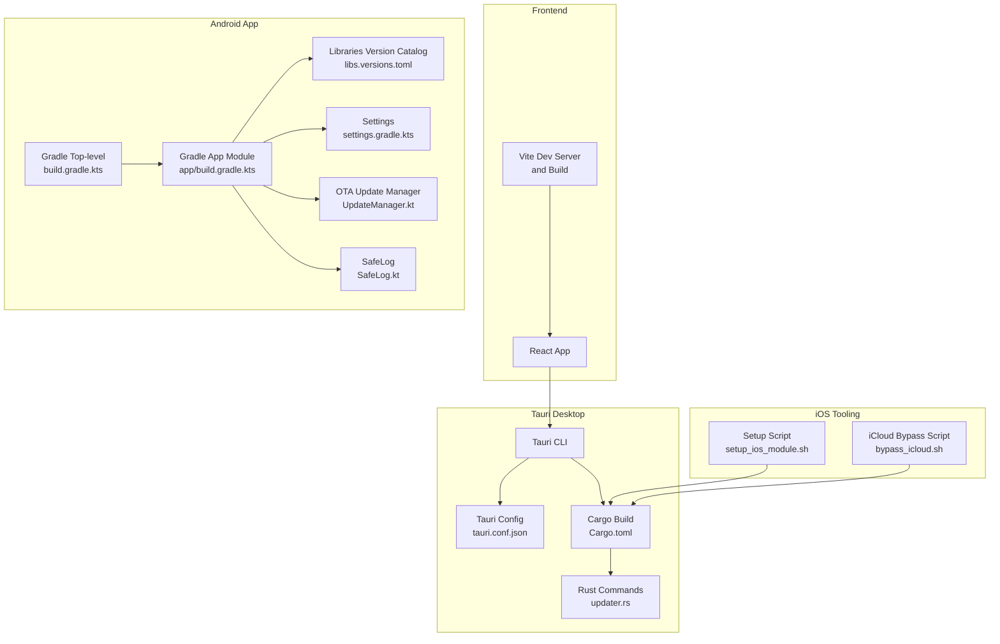
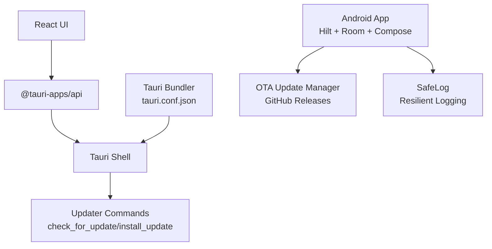
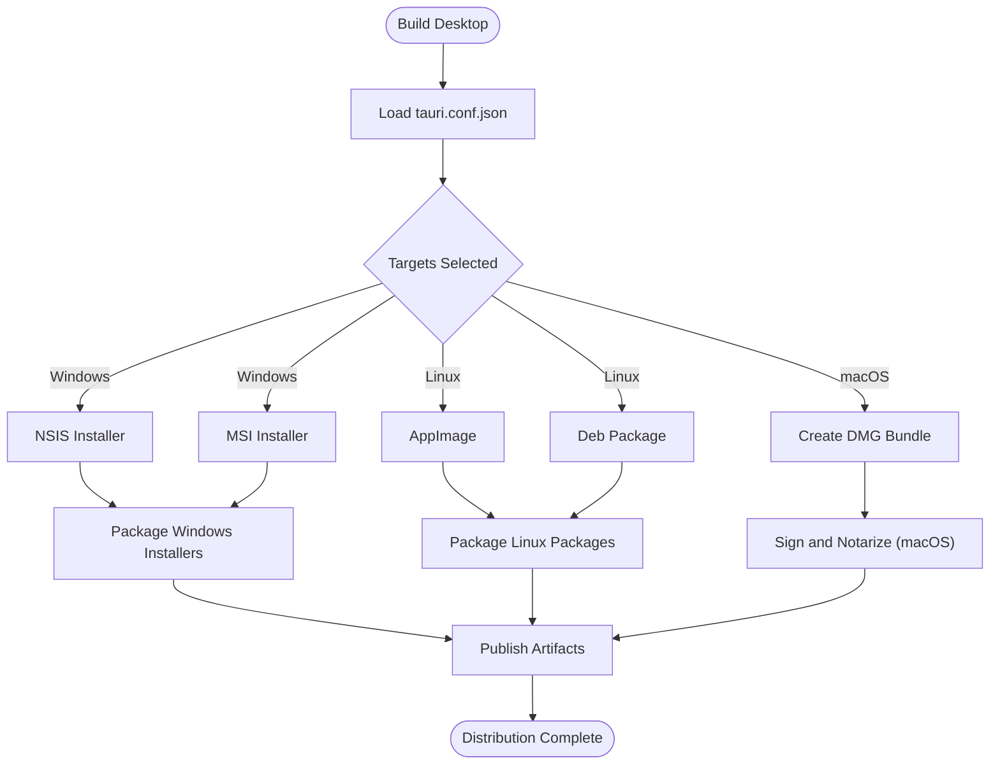
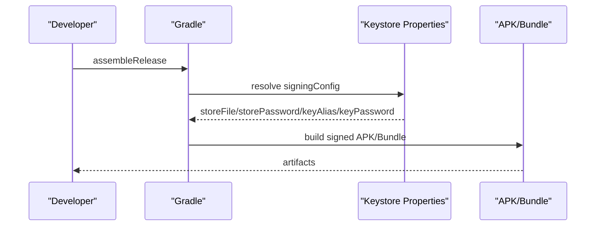
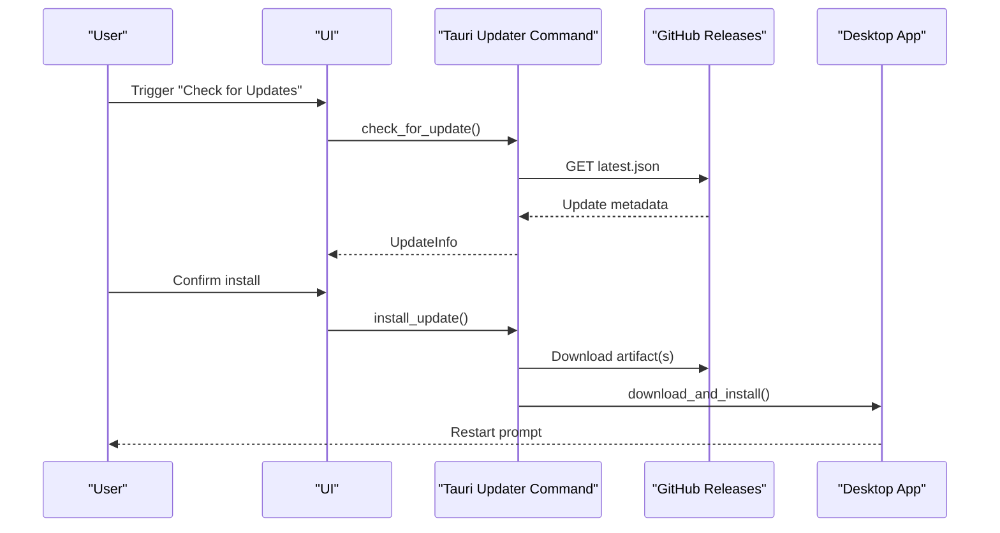
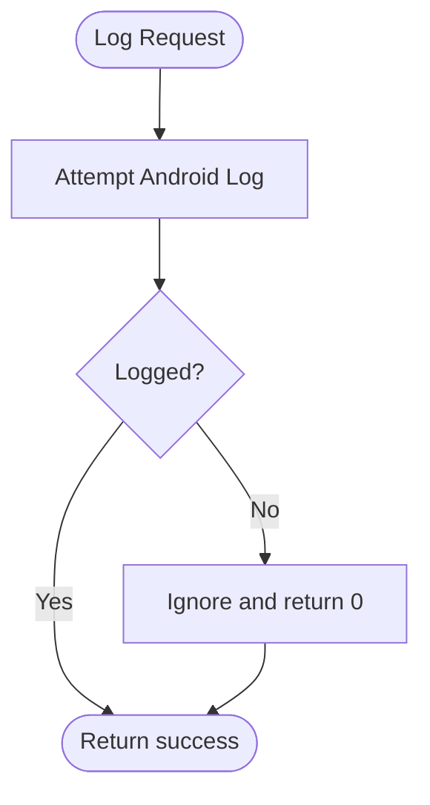
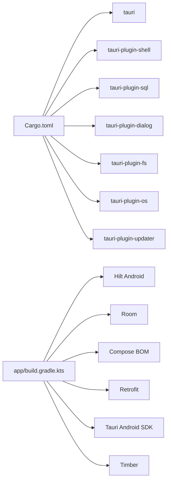

# Deployment and Maintenance

<cite>
**Referenced Files in This Document**
- [Cargo.toml](file://src-tauri/Cargo.toml)
- [tauri.conf.json](file://src-tauri/tauri.conf.json)
- [build.rs](file://src-tauri/build.rs)
- [updater.rs](file://src-tauri/src/commands/updater.rs)
- [build.gradle.kts](file://build.gradle.kts)
- [app/build.gradle.kts](file://app/build.gradle.kts)
- [libs.versions.toml](file://gradle/libs.versions.toml)
- [package.json](file://package.json)
- [settings.gradle.kts](file://settings.gradle.kts)
- [SafeLog.kt](file://app/src/main/kotlin/com/deepeye/otg/logging/SafeLog.kt)
- [UpdateManager.kt](file://app/src/main/kotlin/com/deepeye/otg/service/UpdateManager.kt)
- [setup_ios_module.sh](file://scripts/setup_ios_module.sh)
- [bypass_icloud.sh](file://scripts/bypass_icloud.sh)
</cite>

## Table of Contents
1. [Introduction](#introduction)
2. [Project Structure](#project-structure)
3. [Core Components](#core-components)
4. [Architecture Overview](#architecture-overview)
5. [Detailed Component Analysis](#detailed-component-analysis)
6. [Dependency Analysis](#dependency-analysis)
7. [Performance Considerations](#performance-considerations)
8. [Troubleshooting Guide](#troubleshooting-guide)
9. [Conclusion](#conclusion)
10. [Appendices](#appendices)

## Introduction
This document provides comprehensive guidance for deploying and maintaining DeepEye Unlocker across Windows, macOS, and Linux. It covers build configuration, platform-specific packaging and distribution, Tauri bundling, Android APK generation, cross-platform compatibility, update mechanisms (automatic and manual), monitoring and logging systems, maintenance procedures, deployment best practices, environment configuration, scaling considerations, backup and recovery, disaster recovery planning, and troubleshooting common issues.

## Project Structure
DeepEye Unlocker combines a React-based frontend with a Tauri shell and a Kotlin/Android application for device operations. The Rust-based Tauri backend handles OS-level integrations, packaging, and updates. The Android app integrates Tauri SDK and uses Hilt/Dagger for DI, Room for persistence, and Compose UI.

**Diagram sources**
- [tauri.conf.json:1-192](file://src-tauri/tauri.conf.json#L1-L192)
- [Cargo.toml:1-42](file://src-tauri/Cargo.toml#L1-L42)
- [updater.rs:1-53](file://src-tauri/src/commands/updater.rs#L1-L53)
- [build.gradle.kts:1-19](file://build.gradle.kts#L1-L19)
- [app/build.gradle.kts:1-143](file://app/build.gradle.kts#L1-L143)
- [libs.versions.toml:1-53](file://gradle/libs.versions.toml#L1-L53)
- [settings.gradle.kts:1-18](file://settings.gradle.kts#L1-L18)
- [UpdateManager.kt:1-81](file://app/src/main/kotlin/com/deepeye/otg/service/UpdateManager.kt#L1-L81)
- [SafeLog.kt:1-27](file://app/src/main/kotlin/com/deepeye/otg/logging/SafeLog.kt#L1-L27)
- [setup_ios_module.sh:1-55](file://scripts/setup_ios_module.sh#L1-L55)
- [bypass_icloud.sh:1-48](file://scripts/bypass_icloud.sh#L1-L48)

**Section sources**
- [tauri.conf.json:1-192](file://src-tauri/tauri.conf.json#L1-L192)
- [Cargo.toml:1-42](file://src-tauri/Cargo.toml#L1-L42)
- [build.gradle.kts:1-19](file://build.gradle.kts#L1-L19)
- [app/build.gradle.kts:1-143](file://app/build.gradle.kts#L1-L143)
- [libs.versions.toml:1-53](file://gradle/libs.versions.toml#L1-L53)
- [settings.gradle.kts:1-18](file://settings.gradle.kts#L1-L18)
- [package.json:1-30](file://package.json#L1-L30)

## Core Components
- Tauri Desktop runtime and bundler with platform targets for macOS DMG, Windows NSIS/MSI, and Linux AppImage/Deb.
- Android application module with Hilt DI, Room persistence, Compose UI, and Tauri Android SDK integration.
- Rust updater plugin commands for checking and installing updates.
- Kotlin-based OTA update manager for GitHub Releases and SafeLog for resilient logging.

**Section sources**
- [tauri.conf.json:31-92](file://src-tauri/tauri.conf.json#L31-L92)
- [Cargo.toml:12-26](file://src-tauri/Cargo.toml#L12-L26)
- [updater.rs:1-53](file://src-tauri/src/commands/updater.rs#L1-L53)
- [app/build.gradle.kts:84-135](file://app/build.gradle.kts#L84-L135)
- [UpdateManager.kt:1-81](file://app/src/main/kotlin/com/deepeye/otg/service/UpdateManager.kt#L1-L81)
- [SafeLog.kt:1-27](file://app/src/main/kotlin/com/deepeye/otg/logging/SafeLog.kt#L1-L27)

## Architecture Overview
The system architecture integrates a React frontend served by Tauri, a Rust backend for OS-level tasks and updates, and an Android app for device operations. iOS tooling is integrated via Python modules synchronized during development.

**Diagram sources**
- [tauri.conf.json:1-192](file://src-tauri/tauri.conf.json#L1-L192)
- [updater.rs:1-53](file://src-tauri/src/commands/updater.rs#L1-L53)
- [package.json:12-20](file://package.json#L12-L20)
- [UpdateManager.kt:1-81](file://app/src/main/kotlin/com/deepeye/otg/service/UpdateManager.kt#L1-L81)
- [SafeLog.kt:1-27](file://app/src/main/kotlin/com/deepeye/otg/logging/SafeLog.kt#L1-L27)

## Detailed Component Analysis

### Tauri Desktop Packaging and Distribution
- Targets: macOS DMG, Windows NSIS/MSI, Linux AppImage/Deb.
- Resources: Python modules for iOS backup/bypass/exploit and platform-specific resources.
- Plugins: shell and updater plugins configured with GitHub Releases endpoint.
- macOS: hardened runtime enabled, entitlements and Info.plist integration.
- Windows: NSIS installer configuration and WiX language settings.

**Diagram sources**
- [tauri.conf.json:31-92](file://src-tauri/tauri.conf.json#L31-L92)
- [Cargo.toml:28-41](file://src-tauri/Cargo.toml#L28-L41)

**Section sources**
- [tauri.conf.json:31-92](file://src-tauri/tauri.conf.json#L31-L92)
- [Cargo.toml:28-41](file://src-tauri/Cargo.toml#L28-L41)

### Android APK Generation and Signing
- Android Gradle configuration defines compile/target SDK, min SDK, signing configs, and build types.
- Release signing supports environment variables for CI and local keystore.properties fallback.
- Dependencies include Hilt, Room, Retrofit, Compose, and Tauri Android SDK.
- Packaging excludes META-INF license files to reduce conflicts.

**Diagram sources**
- [app/build.gradle.kts:26-62](file://app/build.gradle.kts#L26-L62)

**Section sources**
- [app/build.gradle.kts:9-82](file://app/build.gradle.kts#L9-L82)
- [build.gradle.kts:1-19](file://build.gradle.kts#L1-L19)

### Cross-Platform Compatibility
- Rust crate compiles to staticlib/cdylib/rlib for Tauri integration.
- macOS universal binary linking for arm64/x86_64 architectures.
- Frontend built via Vite and served by Tauri, ensuring consistent UI across platforms.

**Section sources**
- [Cargo.toml:8-10](file://src-tauri/Cargo.toml#L8-L10)
- [Cargo.toml:35-41](file://src-tauri/Cargo.toml#L35-L41)
- [package.json:5-11](file://package.json#L5-L11)

### Update Mechanisms
- Automatic updates via Tauri updater plugin pointing to GitHub Releases metadata endpoint.
- Manual updates via Tauri commands to check and download/install updates.
- OTA updates via Android UpdateManager querying GitHub Releases API and comparing semantic-like version strings.

**Diagram sources**
- [tauri.conf.json:184-189](file://src-tauri/tauri.conf.json#L184-L189)
- [updater.rs:14-52](file://src-tauri/src/commands/updater.rs#L14-L52)

**Section sources**
- [tauri.conf.json:184-189](file://src-tauri/tauri.conf.json#L184-L189)
- [updater.rs:1-53](file://src-tauri/src/commands/updater.rs#L1-L53)
- [UpdateManager.kt:1-81](file://app/src/main/kotlin/com/deepeye/otg/service/UpdateManager.kt#L1-L81)

### Monitoring and Logging Systems
- SafeLog provides a resilient logging shim that tolerates environments where Android’s Log is unavailable (e.g., unit tests), preventing failures and enabling graceful degradation.
- Android app uses Timber for structured logging; SafeLog ensures robustness across contexts.

**Diagram sources**
- [SafeLog.kt:20-26](file://app/src/main/kotlin/com/deepeye/otg/logging/SafeLog.kt#L20-L26)

**Section sources**
- [SafeLog.kt:1-27](file://app/src/main/kotlin/com/deepeye/otg/logging/SafeLog.kt#L1-L27)
- [app/build.gradle.kts:105-106](file://app/build.gradle.kts#L105-L106)

### iOS Tooling Integration
- Setup script verifies Python availability, installs dependencies, syncs Python modules into Tauri resources, and validates imports.
- Bypass script automates iCloud bypass prerequisites (DFU mode, checkm8) and device responsiveness checks.

**Section sources**
- [setup_ios_module.sh:1-55](file://scripts/setup_ios_module.sh#L1-L55)
- [bypass_icloud.sh:1-48](file://scripts/bypass_icloud.sh#L1-L48)

## Dependency Analysis
- Tauri dependencies include shell, SQL, dialog, fs, os, and updater plugins.
- Android dependencies include Hilt, Room, Retrofit, Compose BOM, and Tauri Android SDK.
- Version catalogs centralize library versions for consistency.

**Diagram sources**
- [Cargo.toml:12-26](file://src-tauri/Cargo.toml#L12-L26)
- [app/build.gradle.kts:84-135](file://app/build.gradle.kts#L84-L135)
- [libs.versions.toml:21-53](file://gradle/libs.versions.toml#L21-L53)

**Section sources**
- [Cargo.toml:12-26](file://src-tauri/Cargo.toml#L12-L26)
- [app/build.gradle.kts:84-135](file://app/build.gradle.kts#L84-L135)
- [libs.versions.toml:1-53](file://gradle/libs.versions.toml#L1-L53)

## Performance Considerations
- Rust release profile enables aggressive optimizations (LTO, strip, single-codegen unit) to reduce binary size and improve startup performance.
- Android minification disabled in current release configuration; consider enabling R8/proguard for production builds to reduce APK size and obfuscate code.
- Use Tauri’s resource bundling strategically to avoid shipping unnecessary files; keep Python modules lean and only include required assets.

[No sources needed since this section provides general guidance]

## Troubleshooting Guide
- Tauri updater initialization or update check failures: verify GitHub Releases endpoint and public key configuration in tauri.conf.json.
- Android signing failures: ensure KEYSTORE_PATH, STORE_PASSWORD, KEY_ALIAS, and KEY_PASSWORD environment variables are set in CI or keystore.properties exists locally.
- SafeLog exceptions: SafeLog gracefully ignores logging failures; if logs are missing, confirm logging environment and test in-app logging paths.
- iOS tooling setup: ensure Python 3 is available, dependencies are installed, and Python modules are synced into src-tauri/python; validate imports via the setup script.
- iCloud bypass prerequisites: confirm device is in DFU mode and checkm8 exploit succeeded before running bypass script.

**Section sources**
- [tauri.conf.json:184-189](file://src-tauri/tauri.conf.json#L184-L189)
- [app/build.gradle.kts:26-62](file://app/build.gradle.kts#L26-L62)
- [SafeLog.kt:20-26](file://app/src/main/kotlin/com/deepeye/otg/logging/SafeLog.kt#L20-L26)
- [setup_ios_module.sh:8-43](file://scripts/setup_ios_module.sh#L8-L43)
- [bypass_icloud.sh:12-34](file://scripts/bypass_icloud.sh#L12-L34)

## Conclusion
DeepEye Unlocker employs a robust multi-platform stack combining Tauri for desktop packaging, Android for device operations, and iOS tooling via Python modules. The system supports automated updates via Tauri and manual OTA updates via GitHub Releases, with resilient logging through SafeLog. Proper environment configuration, CI-friendly signing, and careful resource bundling are essential for reliable deployments and maintenance.

[No sources needed since this section summarizes without analyzing specific files]

## Appendices

### Build and Run Commands
- Desktop development: use Tauri CLI scripts defined in package.json to launch dev server and Tauri dev.
- Desktop build: use Tauri CLI build to produce platform-specific bundles per tauri.conf.json targets.
- Android build: assembleRelease via Gradle to produce signed APK/Bundle; ensure keystore properties are configured.

**Section sources**
- [package.json:5-11](file://package.json#L5-L11)
- [tauri.conf.json:5-10](file://src-tauri/tauri.conf.json#L5-L10)
- [app/build.gradle.kts:49-62](file://app/build.gradle.kts#L49-L62)

### Environment Configuration Checklist
- Tauri:
  - Configure tauri.conf.json bundle targets and resources.
  - Set up macOS signing entitlements and hardened runtime.
  - Configure Windows installer languages and modes.
- Android:
  - Provide keystore.properties or set environment variables for CI.
  - Align compile/target/min SDK versions with app/build.gradle.kts.
- iOS Tooling:
  - Run setup_ios_module.sh to synchronize Python modules and validate imports.
  - Ensure Python dependencies are installed and reachable via PYTHONPATH.

**Section sources**
- [tauri.conf.json:31-92](file://src-tauri/tauri.conf.json#L31-L92)
- [app/build.gradle.kts:26-47](file://app/build.gradle.kts#L26-L47)
- [setup_ios_module.sh:15-43](file://scripts/setup_ios_module.sh#L15-L43)

### Maintenance Procedures
- Dependency updates:
  - Update Cargo.toml dependencies and run cargo update.
  - Refresh gradle/libs.versions.toml and sync app/build.gradle.kts dependencies.
  - Validate Tauri plugin versions and updater endpoint compatibility.
- Security patches:
  - Apply Rust and Android security advisories promptly.
  - Review shell scope permissions in tauri.conf.json and restrict to necessary tools.
- Performance monitoring:
  - Monitor update check latency and installer download speeds.
  - Track Android app startup time and APK size metrics post-proguard.

**Section sources**
- [Cargo.toml:12-26](file://src-tauri/Cargo.toml#L12-L26)
- [libs.versions.toml:25-53](file://gradle/libs.versions.toml#L25-L53)
- [tauri.conf.json:93-189](file://src-tauri/tauri.conf.json#L93-L189)

### Backup and Recovery, Disaster Recovery
- Backup:
  - Preserve signed keystores and keystore.properties backups.
  - Archive Tauri release artifacts and checksums.
  - Back up Android source code and local.properties (avoid committing secrets).
- Recovery:
  - Restore keystore and rebuild Android release artifacts.
  - Rebuild Tauri bundles from tagged releases using tauri.conf.json configurations.
- Health monitoring:
  - Track update failure rates and user-reported issues.
  - Monitor SafeLog output for recurring exceptions in CI/test environments.

[No sources needed since this section provides general guidance]