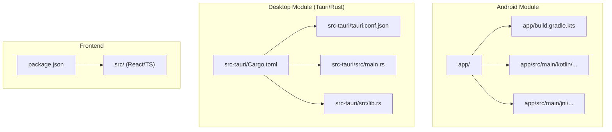
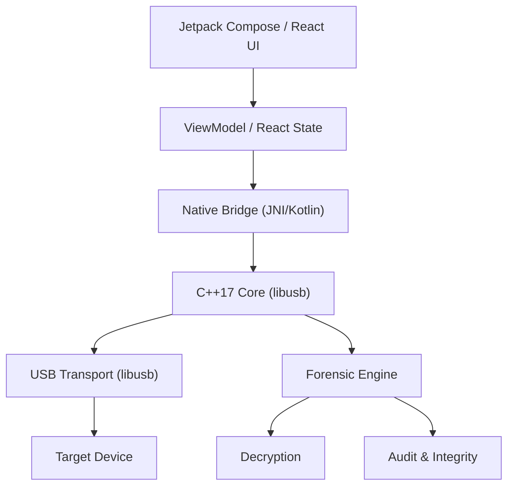
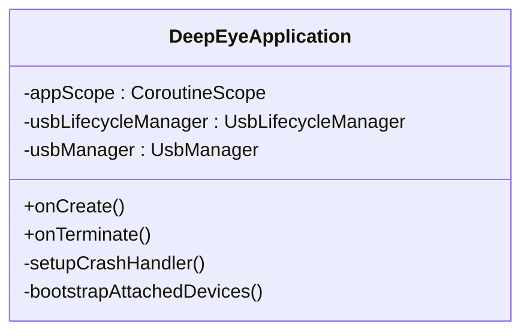
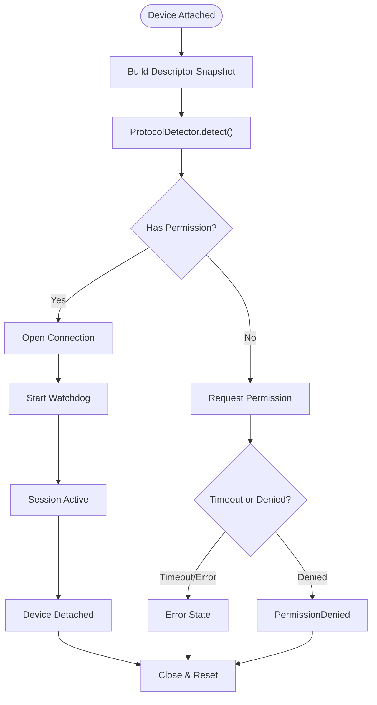
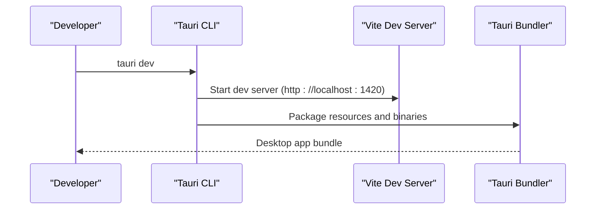
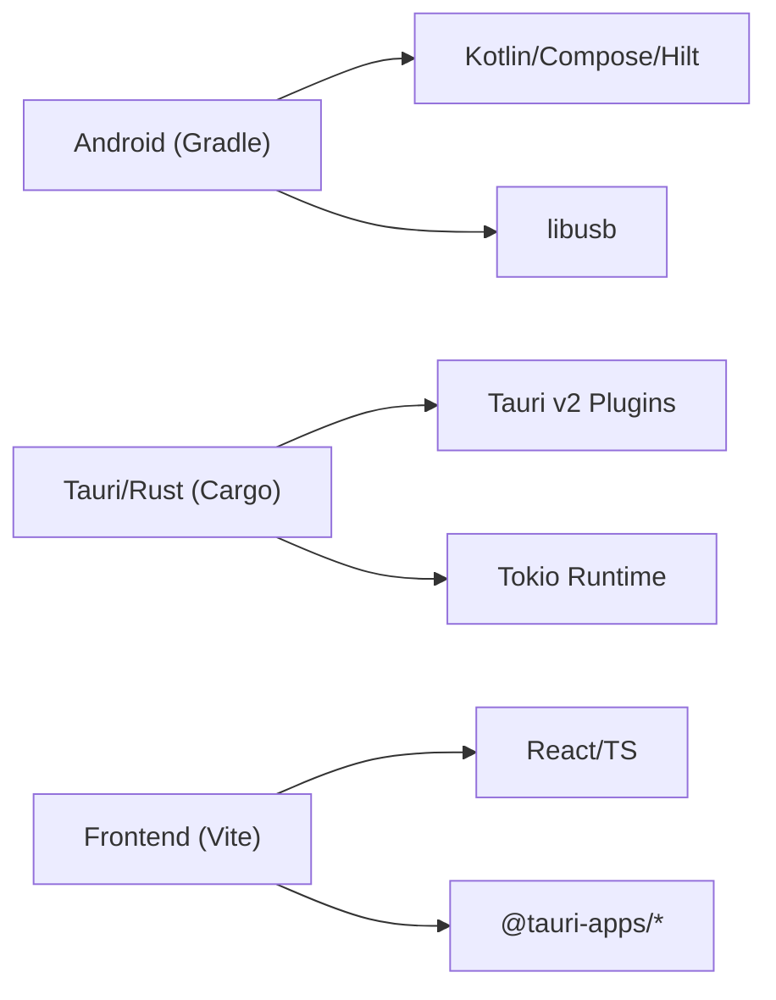
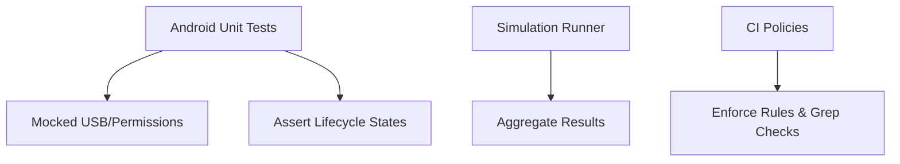

# Development Guide

<cite>
**Referenced Files in This Document**
- [README.md](file://README.md)
- [CONTRIBUTING.md](file://CONTRIBUTING.md)
- [build.gradle.kts](file://build.gradle.kts)
- [gradle/libs.versions.toml](file://gradle/libs.versions.toml)
- [app/build.gradle.kts](file://app/build.gradle.kts)
- [package.json](file://package.json)
- [src-tauri/Cargo.toml](file://src-tauri/Cargo.toml)
- [src-tauri/tauri.conf.json](file://src-tauri/tauri.conf.json)
- [src-tauri/src/main.rs](file://src-tauri/src/main.rs)
- [app/src/main/kotlin/com/deepeye/otg/DeepEyeApplication.kt](file://app/src/main/kotlin/com/deepeye/otg/DeepEyeApplication.kt)
- [ARCHITECTURE_USB.md](file://ARCHITECTURE_USB.md)
- [app/src/test/java/com/deepeye/otg/usb/UsbLifecycleManagerTest.kt](file://app/src/test/java/com/deepeye/otg/usb/UsbLifecycleManagerTest.kt)
- [app/src/test/kotlin/com/deepeye/simulation/SimulationRunner.kt](file://app/src/test/kotlin/com/deepeye/simulation/SimulationRunner.kt)
</cite>

## Table of Contents
1. [Introduction](#introduction)
2. [Project Structure](#project-structure)
3. [Core Components](#core-components)
4. [Architecture Overview](#architecture-overview)
5. [Detailed Component Analysis](#detailed-component-analysis)
6. [Dependency Analysis](#dependency-analysis)
7. [Performance Considerations](#performance-considerations)
8. [Testing Strategies](#testing-strategies)
9. [Development Environment Setup](#development-environment-setup)
10. [Contribution Guidelines](#contribution-guidelines)
11. [Debugging Techniques](#debugging-techniques)
12. [Adding New Device Support](#adding-new-device-support)
13. [Implementing Custom Protocols](#implementing-custom-protocols)
14. [Extending Forensic Capabilities](#extending-forensic-capabilities)
15. [Common Development Tasks](#common-development-tasks)
16. [Troubleshooting Development Issues](#troubleshooting-development-issues)
17. [Maintaining Code Quality](#maintaining-code-quality)
18. [Continuous Integration and Releases](#continuous-integration-and-releases)
19. [Conclusion](#conclusion)

## Introduction
DeepEye Unlocker is a professional-grade mobile forensic engine focused on high-assurance device acquisition and decryption. It integrates Android, Rust/Tauri, and React/TypeScript components to deliver low-latency USB orchestration, hardened protocol support, and advanced forensic capabilities across multiple SoCs and device families.

## Project Structure
The repository follows a multi-module layout:
- Android module under app/: Kotlin, Jetpack Compose, Hilt, NDK, and libusb integration
- Tauri/Rust desktop module under src-tauri/: Rust libraries, Tauri v2 shell/fs/os plugins, and cross-platform bundling
- Frontend module under src/: React/TypeScript with Vite, used by Tauri during development and packaging
- Shared assets and scripts under assets/, scripts/, and root-level docs and configs

**Diagram sources**
- [app/build.gradle.kts:1-143](file://app/build.gradle.kts#L1-L143)
- [src-tauri/Cargo.toml:1-42](file://src-tauri/Cargo.toml#L1-L42)
- [src-tauri/tauri.conf.json:1-192](file://src-tauri/tauri.conf.json#L1-L192)
- [src-tauri/src/main.rs:1-7](file://src-tauri/src/main.rs#L1-L7)
- [package.json:1-30](file://package.json#L1-L30)

**Section sources**
- [README.md:219-231](file://README.md#L219-L231)
- [build.gradle.kts:1-19](file://build.gradle.kts#L1-L19)
- [gradle/libs.versions.toml:1-53](file://gradle/libs.versions.toml#L1-L53)
- [app/build.gradle.kts:1-143](file://app/build.gradle.kts#L1-L143)
- [src-tauri/Cargo.toml:1-42](file://src-tauri/Cargo.toml#L1-L42)
- [src-tauri/tauri.conf.json:1-192](file://src-tauri/tauri.conf.json#L1-L192)
- [package.json:1-30](file://package.json#L1-L30)

## Core Components
- Android Application: Initializes logging, native bridge loading, crash handling, and USB lifecycle management
- USB Protocol Classification and Lifecycle: Robust classification pipeline, lifecycle manager, session manager, and transfer/watchdog subsystems
- Tauri Desktop Runtime: Cross-platform windowing, shell plugin integrations, resource bundling, and updater configuration
- Frontend UI: React/TypeScript pages and components wired to Tauri commands and state

Key implementation references:
- Application initialization and native bridge loading
- USB detection, classification, lifecycle, and session management
- Tauri configuration for build/dev, bundling, and plugin scopes
- Frontend scripts and dependencies

**Section sources**
- [app/src/main/kotlin/com/deepeye/otg/DeepEyeApplication.kt:1-112](file://app/src/main/kotlin/com/deepeye/otg/DeepEyeApplication.kt#L1-L112)
- [ARCHITECTURE_USB.md:1-171](file://ARCHITECTURE_USB.md#L1-L171)
- [src-tauri/tauri.conf.json:1-192](file://src-tauri/tauri.conf.json#L1-L192)
- [package.json:1-30](file://package.json#L1-L30)

## Architecture Overview
The system architecture emphasizes low-latency USB orchestration and hardened protocol handling:
- UI: Jetpack Compose (Android) and React (Tauri desktop)
- Bridge: Kotlin/Native bridge to C++ core
- Core: C++17 with libusb-1.0.26 for asynchronous I/O
- Forensics: Decryption and integrity layers integrated with the protocol engine

**Diagram sources**
- [README.md:39-51](file://README.md#L39-L51)
- [ARCHITECTURE_USB.md:1-171](file://ARCHITECTURE_USB.md#L1-L171)

**Section sources**
- [README.md:39-62](file://README.md#L39-L62)
- [ARCHITECTURE_USB.md:1-171](file://ARCHITECTURE_USB.md#L1-L171)

## Detailed Component Analysis

### Android Application and Native Bridge
The Android application initializes logging, loads the native library asynchronously on IO, sets up a crash handler, and bootstraps attached devices. It uses Hilt for DI and manages a SupervisorJob-based coroutine scope.

**Diagram sources**
- [app/src/main/kotlin/com/deepeye/otg/DeepEyeApplication.kt:1-112](file://app/src/main/kotlin/com/deepeye/otg/DeepEyeApplication.kt#L1-L112)

**Section sources**
- [app/src/main/kotlin/com/deepeye/otg/DeepEyeApplication.kt:1-112](file://app/src/main/kotlin/com/deepeye/otg/DeepEyeApplication.kt#L1-L112)

### USB Protocol Classification and Lifecycle
The USB subsystem classifies devices, manages lifecycle states, and coordinates sessions with watchdogs and transfer queues.

**Diagram sources**
- [ARCHITECTURE_USB.md:40-120](file://ARCHITECTURE_USB.md#L40-L120)

**Section sources**
- [ARCHITECTURE_USB.md:1-171](file://ARCHITECTURE_USB.md#L1-L171)

### Tauri Desktop Runtime and Bundling
Tauri configuration defines build/dev URLs, bundling targets, plugin scopes, and updater endpoints. The Rust crate exposes a library and binary entrypoint.

**Diagram sources**
- [src-tauri/tauri.conf.json:5-10](file://src-tauri/tauri.conf.json#L5-L10)
- [src-tauri/src/main.rs:1-7](file://src-tauri/src/main.rs#L1-L7)

**Section sources**
- [src-tauri/tauri.conf.json:1-192](file://src-tauri/tauri.conf.json#L1-L192)
- [src-tauri/Cargo.toml:1-42](file://src-tauri/Cargo.toml#L1-L42)
- [src-tauri/src/main.rs:1-7](file://src-tauri/src/main.rs#L1-L7)

### Frontend Build and Dependencies
The frontend uses Vite and React with TypeScript. Scripts define dev/build/tauri commands and dependencies include Tauri APIs and UI libraries.

**Section sources**
- [package.json:1-30](file://package.json#L1-L30)

## Dependency Analysis
High-level module dependencies:
- Android depends on Kotlin, Compose, Hilt, coroutines, Room, Retrofit, and libusb integration
- Tauri/Rust depends on Tauri v2 plugins, Tokio runtime, and serde JSON
- Frontend depends on React, Tauri APIs, and Vite toolchain

**Diagram sources**
- [app/build.gradle.kts:84-135](file://app/build.gradle.kts#L84-L135)
- [src-tauri/Cargo.toml:12-26](file://src-tauri/Cargo.toml#L12-L26)
- [package.json:12-29](file://package.json#L12-L29)

**Section sources**
- [app/build.gradle.kts:84-135](file://app/build.gradle.kts#L84-L135)
- [src-tauri/Cargo.toml:12-26](file://src-tauri/Cargo.toml#L12-L26)
- [package.json:12-29](file://package.json#L12-L29)

## Performance Considerations
- Target latencies are defined for UI, bridge, core, USB, and decryption layers
- USB transfers leverage asynchronous libusb I/O and chunked bulk operations
- Rust release profile enables optimizations (LTO, strip, panic abort)
- Android uses IO dispatcher for USB I/O and lifecycle-safe state collection

**Section sources**
- [README.md:53-62](file://README.md#L53-L62)
- [ARCHITECTURE_USB.md:123-149](file://ARCHITECTURE_USB.md#L123-L149)
- [src-tauri/Cargo.toml:28-34](file://src-tauri/Cargo.toml#L28-L34)

## Testing Strategies
- Android unit tests with coroutines test dispatcher and mocked USB components
- Simulation runner aggregates pass/fail reports across scenarios
- CI enforces grep policies and stability checks across modules

**Diagram sources**
- [app/src/test/java/com/deepeye/otg/usb/UsbLifecycleManagerTest.kt:1-119](file://app/src/test/java/com/deepeye/otg/usb/UsbLifecycleManagerTest.kt#L1-L119)
- [app/src/test/kotlin/com/deepeye/simulation/SimulationRunner.kt:1-45](file://app/src/test/kotlin/com/deepeye/simulation/SimulationRunner.kt#L1-L45)
- [CONTRIBUTING.md:38-48](file://CONTRIBUTING.md#L38-L48)

**Section sources**
- [app/src/test/java/com/deepeye/otg/usb/UsbLifecycleManagerTest.kt:1-119](file://app/src/test/java/com/deepeye/otg/usb/UsbLifecycleManagerTest.kt#L1-L119)
- [app/src/test/kotlin/com/deepeye/simulation/SimulationRunner.kt:1-45](file://app/src/test/kotlin/com/deepeye/simulation/SimulationRunner.kt#L1-L45)
- [CONTRIBUTING.md:38-69](file://CONTRIBUTING.md#L38-L69)

## Development Environment Setup
- Android: SDK 34, NDK r25, JDK 17, Gradle 8.0+, CMake 3.18+
- Desktop: Tauri v2, Rust stable, Node.js/npm/yarn
- Frontend: React 18, TypeScript 5.x, Vite 5.x
- USB drivers: Platform-specific drivers for target devices
- Hardware: USB 3.0 port, minimum 8GB RAM recommended

Build commands:
- Android: assembleDebug / assembleRelease
- Desktop: tauri dev / tauri build
- Frontend: dev / build

**Section sources**
- [README.md:87-101](file://README.md#L87-L101)
- [README.md:104-144](file://README.md#L104-L144)
- [build.gradle.kts:1-19](file://build.gradle.kts#L1-L19)
- [gradle/libs.versions.toml:1-53](file://gradle/libs.versions.toml#L1-L53)
- [src-tauri/Cargo.toml:1-42](file://src-tauri/Cargo.toml#L1-L42)
- [package.json:5-11](file://package.json#L5-L11)

## Contribution Guidelines
- Required stack: Android (Kotlin + Jetpack Compose + Hilt + NDK + libusb), Tauri/Rust (Tauri v2 + Rust + React/TypeScript), Python 3.10+, Java 17
- Non-negotiable constraints:
  - Android: ForegroundService owns USB sessions, IO dispatcher for I/O, SupervisorJob, lifecycle-safe state collection
  - Tauri/Rust: tauri_plugin_shell only, avoid std::process::Command, preserve Result<_, String> at Tauri boundary, emit events via app.emit
- Apple device rules: tool-mediated operations only (irecovery/ideviceinfo/idevicerestore), no raw USB bulk transfers, DFU mode verification
- PR checklist: compile locally, add/update tests, no grep-policy violations, lifecycle-safe state, preserve Result<_, String>, change log entry for user-visible features
- CI workflows: Android audit/test/release, Tauri audit/clippy/tests/frontend checks, auto-release notes and artifacts

**Section sources**
- [CONTRIBUTING.md:1-69](file://CONTRIBUTING.md#L1-L69)

## Debugging Techniques
- Crash logs: Application crash handler writes structured crash logs to external files for diagnostics
- USB lifecycle: Detailed logging for attach, classify, permission, open, and detach events
- Watchdog: Health checks expose HEALTHY/DEGRADED/DEAD/Paused states
- Detekt: Static analysis configured via detekt config

**Section sources**
- [app/src/main/kotlin/com/deepeye/otg/DeepEyeApplication.kt:70-94](file://app/src/main/kotlin/com/deepeye/otg/DeepEyeApplication.kt#L70-L94)
- [ARCHITECTURE_USB.md:26-31](file://ARCHITECTURE_USB.md#L26-L31)
- [ARCHITECTURE_USB.md:143-149](file://ARCHITECTURE_USB.md#L143-L149)
- [app/build.gradle.kts:137-143](file://app/build.gradle.kts#L137-L143)

## Adding New Device Support
- Extend protocol detection rules and device matrices for new vendors/PIDs
- Add device descriptors and firmware assets under assets and app/src/main/assets
- Integrate OEM compatibility layer and session coordinator updates
- Add unit tests for classification and lifecycle transitions
- Validate with simulation runner and CI checks

**Section sources**
- [ARCHITECTURE_USB.md:5-37](file://ARCHITECTURE_USB.md#L5-L37)
- [CONTRIBUTING.md:12-21](file://CONTRIBUTING.md#L12-L21)

## Implementing Custom Protocols
- Define protocol executors and session handlers under usb/protocol/*
- Integrate with ProtocolDetector and SessionCoordinator
- Add safety checks and watchdog integration
- Include unit tests and simulation coverage

**Section sources**
- [ARCHITECTURE_USB.md:40-120](file://ARCHITECTURE_USB.md#L40-L120)
- [CONTRIBUTING.md:23-37](file://CONTRIBUTING.md#L23-L37)

## Extending Forensic Capabilities
- Forensic engines and artifact indexers under feature/forensics/*
- Report exporters and timeline builders
- Integrity and audit layers integrated with core decryption
- Use Tauri shell plugin to invoke external forensic tools

**Section sources**
- [src-tauri/tauri.conf.json:93-183](file://src-tauri/tauri.conf.json#L93-L183)

## Common Development Tasks
- Build Android: ./gradlew assembleDebug / assembleRelease
- Build Desktop: tauri dev / tauri build
- Build Frontend: npm run dev / npm run build
- Run simulations: ./gradlew test --tests "*SimulationRunner*"
- Run Android tests: ./gradlew test

**Section sources**
- [README.md:108-120](file://README.md#L108-L120)
- [package.json:5-11](file://package.json#L5-L11)
- [app/src/test/kotlin/com/deepeye/simulation/SimulationRunner.kt:4-6](file://app/src/test/kotlin/com/deepeye/simulation/SimulationRunner.kt#L4-L6)

## Troubleshooting Development Issues
- Permission timeouts: Verify UsbPermissionGuard and lifecycle state transitions
- Unknown protocol classification: Review ProtocolDetector rules and descriptor snapshots
- Crash logs: Inspect crash files written by the crash handler
- CI failures: Address grep-policy violations and stability checks

**Section sources**
- [app/src/test/java/com/deepeye/otg/usb/UsbLifecycleManagerTest.kt:49-80](file://app/src/test/java/com/deepeye/otg/usb/UsbLifecycleManagerTest.kt#L49-L80)
- [ARCHITECTURE_USB.md:32-37](file://ARCHITECTURE_USB.md#L32-L37)
- [app/src/main/kotlin/com/deepeye/otg/DeepEyeApplication.kt:70-94](file://app/src/main/kotlin/com/deepeye/otg/DeepEyeApplication.kt#L70-L94)
- [CONTRIBUTING.md:38-48](file://CONTRIBUTING.md#L38-L48)

## Maintaining Code Quality
- Follow architecture constraints for Android and Tauri/Rust
- Use lifecycle-safe state collection and IO-bound work on Dispatchers.IO
- Preserve Result<_, String> at Tauri boundaries and avoid unwrap() on production paths
- Keep changes scoped, avoid placeholders, prefer explicit error handling

**Section sources**
- [CONTRIBUTING.md:12-30](file://CONTRIBUTING.md#L12-L30)
- [CONTRIBUTING.md:64-69](file://CONTRIBUTING.md#L64-L69)

## Continuous Integration and Releases
- Workflows:
  - Android audit, test, and release build artifact
  - Tauri audit, clippy/tests, and frontend TS/Vitest checks
  - Tag-driven release notes extraction and artifact publishing
- Release configuration: Tauri updater endpoints and bundling targets

**Section sources**
- [CONTRIBUTING.md:58-63](file://CONTRIBUTING.md#L58-L63)
- [src-tauri/tauri.conf.json:184-189](file://src-tauri/tauri.conf.json#L184-L189)

## Conclusion
This guide outlined the multi-module architecture, build systems, testing strategies, contribution standards, and operational practices for DeepEye Unlocker. By adhering to the documented constraints and leveraging the provided tools and workflows, contributors can reliably extend device support, integrate custom protocols, and enhance forensic capabilities while maintaining high performance and stability.