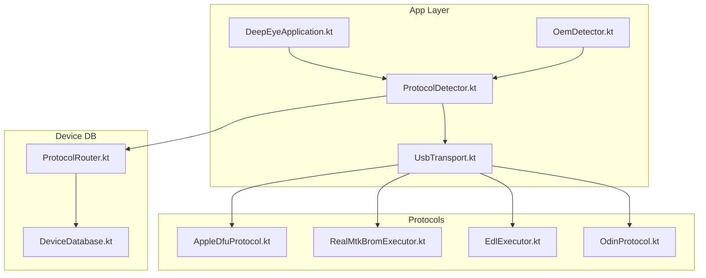
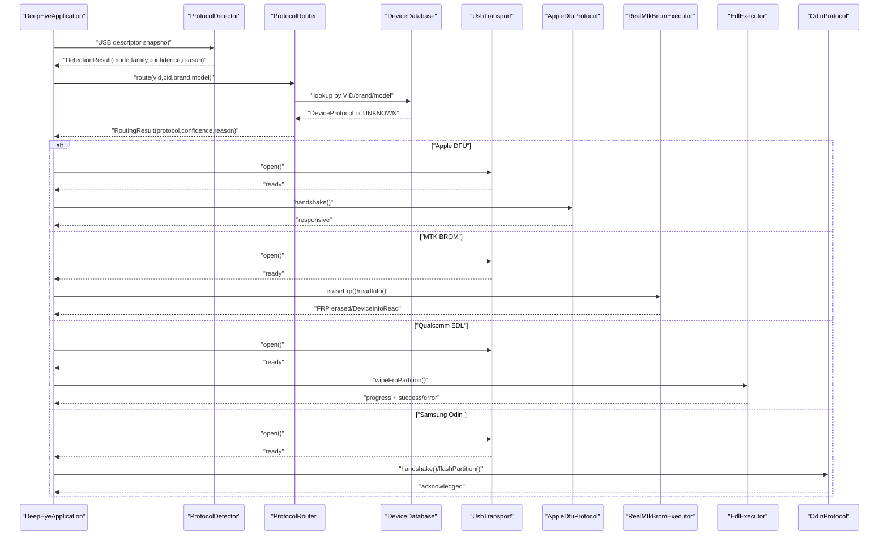
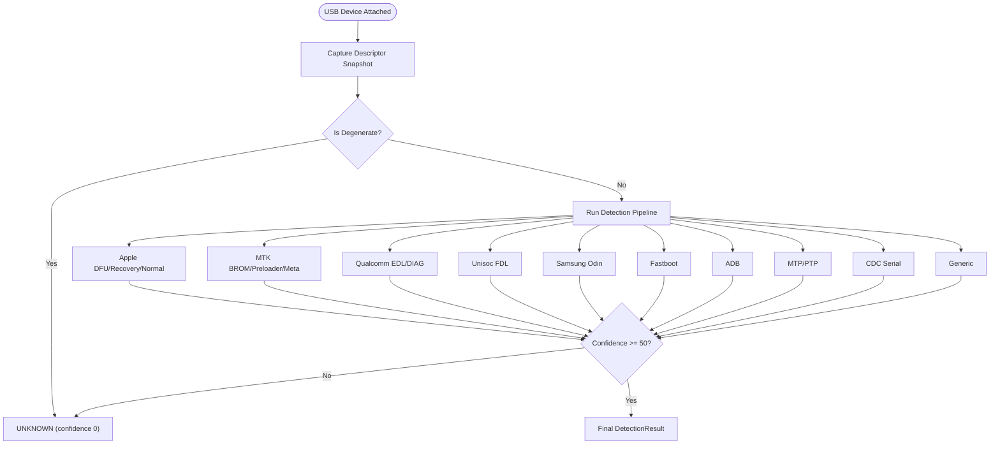
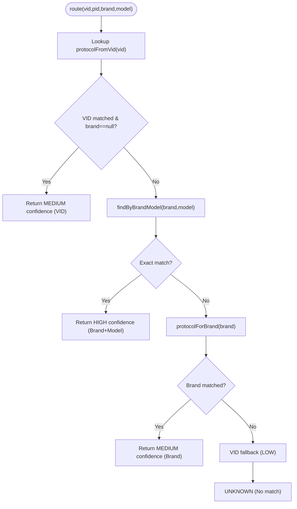
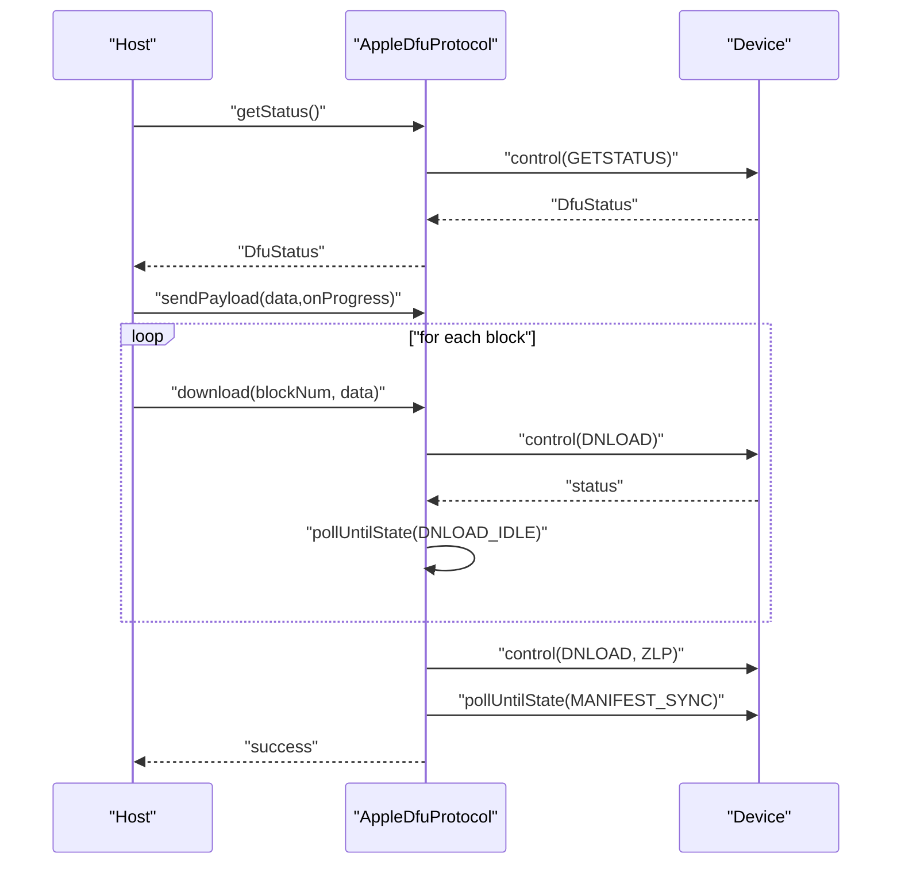
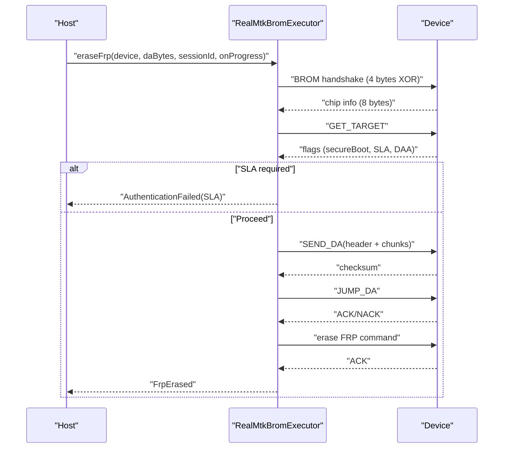
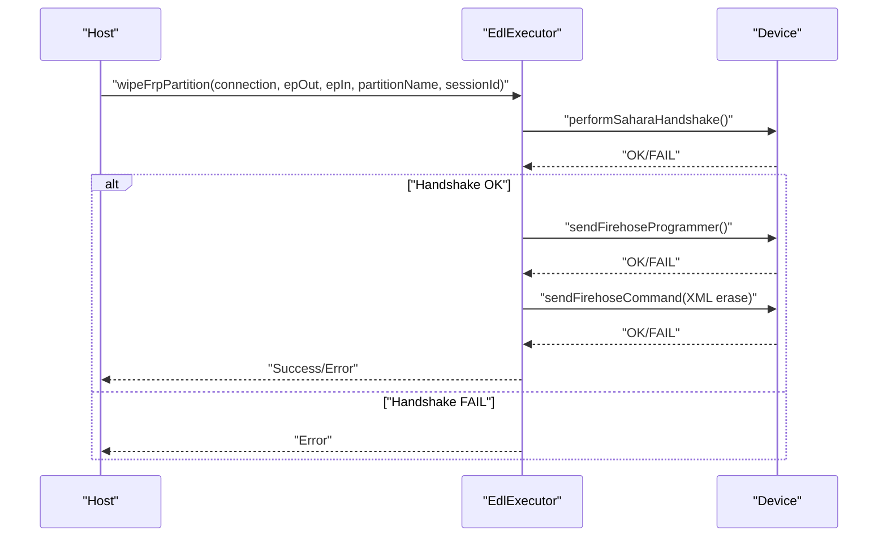
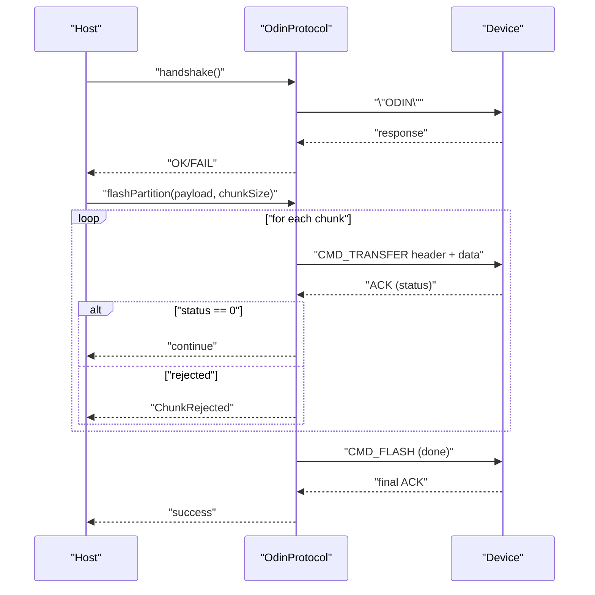
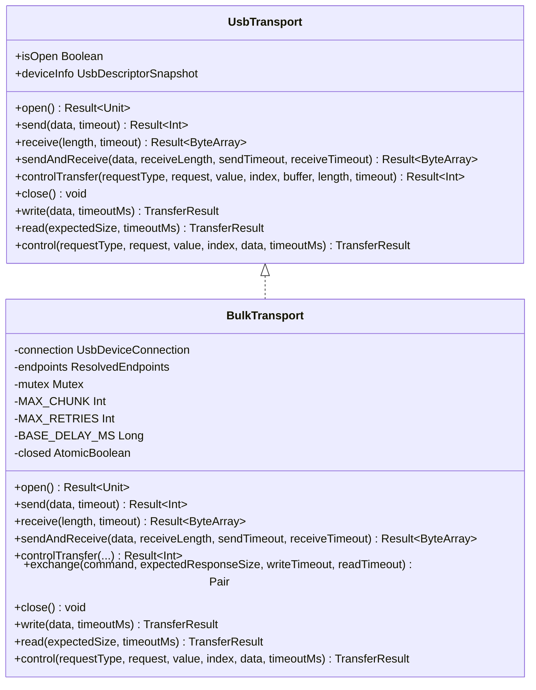
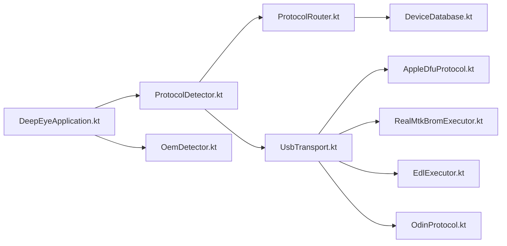

# Device Support and Protocols

<cite>
**Referenced Files in This Document**
- [DeepEyeApplication.kt](file://app/src/main/kotlin/com/deepeye/otg/DeepEyeApplication.kt)
- [DeviceDatabase.kt](file://DeepEyeDeviceDB/DeviceDatabase.kt)
- [ProtocolRouter.kt](file://DeepEyeDeviceDB/ProtocolRouter.kt)
- [ProtocolDetector.kt](file://app/src/main/kotlin/com/deepeye/otg/usb/ProtocolDetector.kt)
- [OemDetector.kt](file://app/src/main/kotlin/com/deepeye/otg/usb/OemDetector.kt)
- [UsbTransport.kt](file://app/src/main/kotlin/com/deepeye/otg/usb/UsbTransport.kt)
- [AppleDfuProtocol.kt](file://app/src/main/kotlin/com/deepeye/otg/protocol/apple/AppleDfuProtocol.kt)
- [RealMtkBromExecutor.kt](file://app/src/main/kotlin/com/deepeye/otg/protocol/mtk/RealMtkBromExecutor.kt)
- [EdlExecutor.kt](file://app/src/main/kotlin/com/deepeye/otg/usb/EdlExecutor.kt)
- [OdinProtocol.kt](file://app/src/main/kotlin/com/deepeye/otg/protocol/samsung/OdinProtocol.kt)
</cite>

## Table of Contents
1. [Introduction](#introduction)
2. [Project Structure](#project-structure)
3. [Core Components](#core-components)
4. [Architecture Overview](#architecture-overview)
5. [Detailed Component Analysis](#detailed-component-analysis)
6. [Dependency Analysis](#dependency-analysis)
7. [Performance Considerations](#performance-considerations)
8. [Troubleshooting Guide](#troubleshooting-guide)
9. [Conclusion](#conclusion)

## Introduction
This document explains the multi-platform device support and protocol implementations in DeepEye Unlocker. It covers Android devices (8.0+), iOS devices with DFU mode, MediaTek (MTK) devices with BROM protocol, Qualcomm devices with Sahara/EDL/Firehose, and Samsung devices with Odin protocol. It documents detection and enumeration, protocol routing and negotiation, fallback strategies, SoC coverage, manufacturer variants, bootloader states, and protocol-specific features such as fastboot and recovery mode operations. It also provides troubleshooting guidance for protocol-specific issues and compatibility problems.

## Project Structure
DeepEye Unlocker organizes device support around:
- Device database and protocol routing
- USB descriptor-based protocol detection
- Unified USB transport abstraction
- Protocol-specific executors and sessions

**Diagram sources**
- [DeepEyeApplication.kt:1-112](file://app/src/main/kotlin/com/deepeye/otg/DeepEyeApplication.kt#L1-L112)
- [OemDetector.kt:1-28](file://app/src/main/kotlin/com/deepeye/otg/usb/OemDetector.kt#L1-L28)
- [ProtocolDetector.kt:1-377](file://app/src/main/kotlin/com/deepeye/otg/usb/ProtocolDetector.kt#L1-L377)
- [UsbTransport.kt:1-311](file://app/src/main/kotlin/com/deepeye/otg/usb/UsbTransport.kt#L1-L311)
- [DeviceDatabase.kt:1-800](file://DeepEyeDeviceDB/DeviceDatabase.kt#L1-L800)
- [ProtocolRouter.kt:1-137](file://DeepEyeDeviceDB/ProtocolRouter.kt#L1-L137)
- [AppleDfuProtocol.kt:1-211](file://app/src/main/kotlin/com/deepeye/otg/protocol/apple/AppleDfuProtocol.kt#L1-L211)
- [RealMtkBromExecutor.kt:1-551](file://app/src/main/kotlin/com/deepeye/otg/protocol/mtk/RealMtkBromExecutor.kt#L1-L551)
- [EdlExecutor.kt:1-94](file://app/src/main/kotlin/com/deepeye/otg/usb/EdlExecutor.kt#L1-L94)
- [OdinProtocol.kt:1-172](file://app/src/main/kotlin/com/deepeye/otg/protocol/samsung/OdinProtocol.kt#L1-L172)

**Section sources**
- [DeepEyeApplication.kt:1-112](file://app/src/main/kotlin/com/deepeye/otg/DeepEyeApplication.kt#L1-L112)
- [ProtocolDetector.kt:1-377](file://app/src/main/kotlin/com/deepeye/otg/usb/ProtocolDetector.kt#L1-L377)
- [DeviceDatabase.kt:1-800](file://DeepEyeDeviceDB/DeviceDatabase.kt#L1-L800)
- [ProtocolRouter.kt:1-137](file://DeepEyeDeviceDB/ProtocolRouter.kt#L1-L137)
- [UsbTransport.kt:1-311](file://app/src/main/kotlin/com/deepeye/otg/usb/UsbTransport.kt#L1-L311)

## Core Components
- DeviceDatabase and ProtocolRouter: Maintain device-to-protocol mapping and route devices to appropriate protocols with confidence levels.
- ProtocolDetector: Performs USB descriptor-based detection across Apple, MTK, Qualcomm, Unisoc, Samsung, fastboot, ADB, MTP, CDC-serial, and generic modes.
- UsbTransport: Provides unified bulk/control transfer APIs with retry, stall handling, and timeouts.
- Protocol Executors: Implement handshake, command sequences, and FRP/partition operations per vendor/SoC.

**Section sources**
- [DeviceDatabase.kt:1-800](file://DeepEyeDeviceDB/DeviceDatabase.kt#L1-L800)
- [ProtocolRouter.kt:1-137](file://DeepEyeDeviceDB/ProtocolRouter.kt#L1-L137)
- [ProtocolDetector.kt:1-377](file://app/src/main/kotlin/com/deepeye/otg/usb/ProtocolDetector.kt#L1-L377)
- [UsbTransport.kt:1-311](file://app/src/main/kotlin/com/deepeye/otg/usb/UsbTransport.kt#L1-L311)

## Architecture Overview
The system detects devices via USB descriptors, routes them to a protocol, negotiates a session, and executes protocol-specific operations.

**Diagram sources**
- [DeepEyeApplication.kt:1-112](file://app/src/main/kotlin/com/deepeye/otg/DeepEyeApplication.kt#L1-L112)
- [ProtocolDetector.kt:1-377](file://app/src/main/kotlin/com/deepeye/otg/usb/ProtocolDetector.kt#L1-L377)
- [ProtocolRouter.kt:1-137](file://DeepEyeDeviceDB/ProtocolRouter.kt#L1-L137)
- [DeviceDatabase.kt:1-800](file://DeepEyeDeviceDB/DeviceDatabase.kt#L1-L800)
- [UsbTransport.kt:1-311](file://app/src/main/kotlin/com/deepeye/otg/usb/UsbTransport.kt#L1-L311)
- [AppleDfuProtocol.kt:1-211](file://app/src/main/kotlin/com/deepeye/otg/protocol/apple/AppleDfuProtocol.kt#L1-L211)
- [RealMtkBromExecutor.kt:1-551](file://app/src/main/kotlin/com/deepeye/otg/protocol/mtk/RealMtkBromExecutor.kt#L1-L551)
- [EdlExecutor.kt:1-94](file://app/src/main/kotlin/com/deepeye/otg/usb/EdlExecutor.kt#L1-L94)
- [OdinProtocol.kt:1-172](file://app/src/main/kotlin/com/deepeye/otg/protocol/samsung/OdinProtocol.kt#L1-L172)

## Detailed Component Analysis

### Device Detection and Enumeration
- USB descriptor inspection determines device mode and protocol family.
- Strict precedence ensures accurate classification across Apple, MTK, Qualcomm, Unisoc, Samsung, fastboot, ADB, MTP, CDC-serial, and generic.
- Confidence thresholds reject ambiguous matches.

**Diagram sources**
- [ProtocolDetector.kt:44-93](file://app/src/main/kotlin/com/deepeye/otg/usb/ProtocolDetector.kt#L44-L93)

**Section sources**
- [ProtocolDetector.kt:1-377](file://app/src/main/kotlin/com/deepeye/otg/usb/ProtocolDetector.kt#L1-L377)

### Protocol Routing and Negotiation
- VID fast-path for quick matching.
- Exact brand+model match yields highest confidence.
- Brand-only fallback and vendor-specific VID fallback with lower confidence.
- Xiaomi and OPlus special-case resolution by series/year.

**Diagram sources**
- [ProtocolRouter.kt:37-115](file://DeepEyeDeviceDB/ProtocolRouter.kt#L37-L115)
- [DeviceDatabase.kt:1-800](file://DeepEyeDeviceDB/DeviceDatabase.kt#L1-L800)

**Section sources**
- [ProtocolRouter.kt:1-137](file://DeepEyeDeviceDB/ProtocolRouter.kt#L1-L137)
- [DeviceDatabase.kt:1-800](file://DeepEyeDeviceDB/DeviceDatabase.kt#L1-L800)

### Apple DFU Protocol
- Implements DFU control transfers: GETSTATUS, CLRSTATUS, ABORT, DNLOAD, UPLOAD.
- Supports payload sending with block-wise upload and state polling.
- Handshake confirms device responsiveness.

**Diagram sources**
- [AppleDfuProtocol.kt:38-202](file://app/src/main/kotlin/com/deepeye/otg/protocol/apple/AppleDfuProtocol.kt#L38-L202)

**Section sources**
- [AppleDfuProtocol.kt:1-211](file://app/src/main/kotlin/com/deepeye/otg/protocol/apple/AppleDfuProtocol.kt#L1-L211)

### MediaTek BROM Protocol (Classic)
- Classic BROM handshake with exact 4-byte XOR sequence and 8-byte chip info.
- Commands include SEND_DA, JUMP_DA, GET_TARGET, and FRP erase.
- DA checksum verification and chunked transfers with ZLP handling.
- SLA/DAA/SecureBoot flags checked prior to operations.

**Diagram sources**
- [RealMtkBromExecutor.kt:65-160](file://app/src/main/kotlin/com/deepeye/otg/protocol/mtk/RealMtkBromExecutor.kt#L65-L160)
- [RealMtkBromExecutor.kt:198-258](file://app/src/main/kotlin/com/deepeye/otg/protocol/mtk/RealMtkBromExecutor.kt#L198-L258)
- [RealMtkBromExecutor.kt:262-290](file://app/src/main/kotlin/com/deepeye/otg/protocol/mtk/RealMtkBromExecutor.kt#L262-L290)
- [RealMtkBromExecutor.kt:294-373](file://app/src/main/kotlin/com/deepeye/otg/protocol/mtk/RealMtkBromExecutor.kt#L294-L373)
- [RealMtkBromExecutor.kt:377-404](file://app/src/main/kotlin/com/deepeye/otg/protocol/mtk/RealMtkBromExecutor.kt#L377-L404)
- [RealMtkBromExecutor.kt:408-433](file://app/src/main/kotlin/com/deepeye/otg/protocol/mtk/RealMtkBromExecutor.kt#L408-L433)

**Section sources**
- [RealMtkBromExecutor.kt:1-551](file://app/src/main/kotlin/com/deepeye/otg/protocol/mtk/RealMtkBromExecutor.kt#L1-L551)

### Qualcomm EDL/Firehose Protocol
- Wipes FRP partition via Sahara handshake, programmer upload, and Firehose XML erase.
- Uses EDL executor to orchestrate steps and report progress.

**Diagram sources**
- [EdlExecutor.kt:15-62](file://app/src/main/kotlin/com/deepeye/otg/usb/EdlExecutor.kt#L15-L62)

**Section sources**
- [EdlExecutor.kt:1-94](file://app/src/main/kotlin/com/deepeye/otg/usb/EdlExecutor.kt#L1-L94)

### Samsung Odin Protocol
- Handshake starts with "ODIN" and expects "LOKE"/"ODIN" response.
- Flashing uses chunked transfer with headers and acknowledgment packets.
- Supports PIT read and reboot commands.

**Diagram sources**
- [OdinProtocol.kt:37-53](file://app/src/main/kotlin/com/deepeye/otg/protocol/samsung/OdinProtocol.kt#L37-L53)
- [OdinProtocol.kt:115-156](file://app/src/main/kotlin/com/deepeye/otg/protocol/samsung/OdinProtocol.kt#L115-L156)

**Section sources**
- [OdinProtocol.kt:1-172](file://app/src/main/kotlin/com/deepeye/otg/protocol/samsung/OdinProtocol.kt#L1-L172)

### USB Transport Abstraction
- Unified interface for bulk and control transfers with timeouts and retries.
- Mutex-protected operations, stall detection/clear, and exponential backoff.
- Compatibility shim for existing code paths.

**Diagram sources**
- [UsbTransport.kt:43-77](file://app/src/main/kotlin/com/deepeye/otg/usb/UsbTransport.kt#L43-L77)
- [UsbTransport.kt:82-311](file://app/src/main/kotlin/com/deepeye/otg/usb/UsbTransport.kt#L82-L311)

**Section sources**
- [UsbTransport.kt:1-311](file://app/src/main/kotlin/com/deepeye/otg/usb/UsbTransport.kt#L1-L311)

### OEM Brand Detection
- Heuristics derive OEM brand from manufacturer/product strings for downstream routing.

**Section sources**
- [OemDetector.kt:1-28](file://app/src/main/kotlin/com/deepeye/otg/usb/OemDetector.kt#L1-L28)

## Dependency Analysis
- Application bootstrap initializes USB lifecycle and native bridge.
- Protocol detection depends on USB descriptor snapshots and OEM heuristics.
- Protocol routing depends on DeviceDatabase and ProtocolRouter.
- Protocol executors depend on UsbTransport for reliable communication.

**Diagram sources**
- [DeepEyeApplication.kt:1-112](file://app/src/main/kotlin/com/deepeye/otg/DeepEyeApplication.kt#L1-L112)
- [ProtocolDetector.kt:1-377](file://app/src/main/kotlin/com/deepeye/otg/usb/ProtocolDetector.kt#L1-L377)
- [OemDetector.kt:1-28](file://app/src/main/kotlin/com/deepeye/otg/usb/OemDetector.kt#L1-L28)
- [ProtocolRouter.kt:1-137](file://DeepEyeDeviceDB/ProtocolRouter.kt#L1-L137)
- [DeviceDatabase.kt:1-800](file://DeepEyeDeviceDB/DeviceDatabase.kt#L1-L800)
- [UsbTransport.kt:1-311](file://app/src/main/kotlin/com/deepeye/otg/usb/UsbTransport.kt#L1-L311)
- [AppleDfuProtocol.kt:1-211](file://app/src/main/kotlin/com/deepeye/otg/protocol/apple/AppleDfuProtocol.kt#L1-L211)
- [RealMtkBromExecutor.kt:1-551](file://app/src/main/kotlin/com/deepeye/otg/protocol/mtk/RealMtkBromExecutor.kt#L1-L551)
- [EdlExecutor.kt:1-94](file://app/src/main/kotlin/com/deepeye/otg/usb/EdlExecutor.kt#L1-L94)
- [OdinProtocol.kt:1-172](file://app/src/main/kotlin/com/deepeye/otg/protocol/samsung/OdinProtocol.kt#L1-L172)

**Section sources**
- [DeepEyeApplication.kt:1-112](file://app/src/main/kotlin/com/deepeye/otg/DeepEyeApplication.kt#L1-L112)
- [ProtocolDetector.kt:1-377](file://app/src/main/kotlin/com/deepeye/otg/usb/ProtocolDetector.kt#L1-L377)
- [ProtocolRouter.kt:1-137](file://DeepEyeDeviceDB/ProtocolRouter.kt#L1-L137)
- [DeviceDatabase.kt:1-800](file://DeepEyeDeviceDB/DeviceDatabase.kt#L1-L800)
- [UsbTransport.kt:1-311](file://app/src/main/kotlin/com/deepeye/otg/usb/UsbTransport.kt#L1-L311)

## Performance Considerations
- BulkTransport uses chunked writes and exponential backoff to improve reliability under varying host conditions.
- Endpoint stall detection/clear prevents indefinite stalls.
- Confidence gating avoids false-positive protocol selection.
- DA chunk sizing adapts to Android API levels to balance throughput and stability.

[No sources needed since this section provides general guidance]

## Troubleshooting Guide
- Apple DFU
  - Symptoms: handshake fails or device remains in error state.
  - Actions: verify DFU VID/PID, ensure device is in DFU mode, retry status polling.
  - References: [AppleDfuProtocol.kt:191-202](file://app/src/main/kotlin/com/deepeye/otg/protocol/apple/AppleDfuProtocol.kt#L191-L202)

- MediaTek BROM
  - Symptoms: handshake mismatch, checksum mismatch, SLA required.
  - Actions: confirm BROM endpoints, verify DA availability, handle SLA/DAA flags.
  - References: [RealMtkBromExecutor.kt:204-258](file://app/src/main/kotlin/com/deepeye/otg/protocol/mtk/RealMtkBromExecutor.kt#L204-L258), [RealMtkBromExecutor.kt:364-369](file://app/src/main/kotlin/com/deepeye/otg/protocol/mtk/RealMtkBromExecutor.kt#L364-L369), [RealMtkBromExecutor.kt:113-123](file://app/src/main/kotlin/com/deepeye/otg/protocol/mtk/RealMtkBromExecutor.kt#L113-L123)

- Qualcomm EDL
  - Symptoms: Sahara handshake failure, programmer upload failure, erase command rejection.
  - Actions: ensure device is in EDL mode, verify programmer presence, check Firehose XML correctness.
  - References: [EdlExecutor.kt:24-35](file://app/src/main/kotlin/com/deepeye/otg/usb/EdlExecutor.kt#L24-L35), [EdlExecutor.kt:49-53](file://app/src/main/kotlin/com/deepeye/otg/usb/EdlExecutor.kt#L49-L53)

- Samsung Odin
  - Symptoms: chunk rejected, ACK timeout, invalid ACK size.
  - Actions: reduce chunk size, verify device in Download mode, ensure correct headers.
  - References: [OdinProtocol.kt:106-113](file://app/src/main/kotlin/com/deepeye/otg/protocol/samsung/OdinProtocol.kt#L106-L113), [OdinProtocol.kt:158-170](file://app/src/main/kotlin/com/deepeye/otg/protocol/samsung/OdinProtocol.kt#L158-L170)

- General USB Issues
  - Symptoms: timeouts, stalls, device gone.
  - Actions: enable retries, clear stalls, verify endpoint directions, check permissions.
  - References: [UsbTransport.kt:174-195](file://app/src/main/kotlin/com/deepeye/otg/usb/UsbTransport.kt#L174-L195), [UsbTransport.kt:202-230](file://app/src/main/kotlin/com/deepeye/otg/usb/UsbTransport.kt#L202-L230), [UsbTransport.kt:301-310](file://app/src/main/kotlin/com/deepeye/otg/usb/UsbTransport.kt#L301-L310)

**Section sources**
- [AppleDfuProtocol.kt:1-211](file://app/src/main/kotlin/com/deepeye/otg/protocol/apple/AppleDfuProtocol.kt#L1-L211)
- [RealMtkBromExecutor.kt:1-551](file://app/src/main/kotlin/com/deepeye/otg/protocol/mtk/RealMtkBromExecutor.kt#L1-L551)
- [EdlExecutor.kt:1-94](file://app/src/main/kotlin/com/deepeye/otg/usb/EdlExecutor.kt#L1-L94)
- [OdinProtocol.kt:1-172](file://app/src/main/kotlin/com/deepeye/otg/protocol/samsung/OdinProtocol.kt#L1-L172)
- [UsbTransport.kt:1-311](file://app/src/main/kotlin/com/deepeye/otg/usb/UsbTransport.kt#L1-L311)

## Conclusion
DeepEye Unlocker integrates robust device detection, precise protocol routing, and reliable transport abstractions to support diverse platforms and SoCs. Its staged detection pipeline, confidence gating, and protocol-specific executors enable dependable operations across Apple DFU, MediaTek BROM, Qualcomm EDL/Firehose, and Samsung Odin. The modular design facilitates extension to new devices and protocols while maintaining strong error handling and diagnostic capabilities.