# Forensic Operations

<cite>
**Referenced Files in This Document**
- [forensic_engine.h](file://app/src/main/jni/core/include/forensic_engine.h)
- [forensic_engine.cpp](file://app/src/main/jni/core/src/forensics/forensic_engine.cpp)
- [ArtifactIndexer.kt](file://app/src/main/kotlin/com/deepeye/otg/feature/forensics/ArtifactIndexer.kt)
- [HashVerifier.kt](file://app/src/main/kotlin/com/deepeye/otg/feature/forensics/HashVerifier.kt)
- [ReportExporter.kt](file://app/src/main/kotlin/com/deepeye/otg/feature/forensics/ReportExporter.kt)
- [TimelineBuilder.kt](file://app/src/main/kotlin/com/deepeye/otg/feature/forensics/TimelineBuilder.kt)
- [MassExtractor.kt](file://app/src/main/kotlin/com/deepeye/otg/service/MassExtractor.kt)
- [PhysicalIntegrityService.kt](file://app/src/main/kotlin/com/deepeye/otg/service/PhysicalIntegrityService.kt)
- [ReportManager.kt](file://app/src/main/kotlin/com/deepeye/otg/service/ReportManager.kt)
- [ForensicReportGenerator.kt](file://app/src/main/kotlin/com/deepeye/otg/service/ForensicReportGenerator.kt)
</cite>

## Table of Contents
1. [Introduction](#introduction)
2. [Project Structure](#project-structure)
3. [Core Components](#core-components)
4. [Architecture Overview](#architecture-overview)
5. [Detailed Component Analysis](#detailed-component-analysis)
6. [Dependency Analysis](#dependency-analysis)
7. [Performance Considerations](#performance-considerations)
8. [Troubleshooting Guide](#troubleshooting-guide)
9. [Conclusion](#conclusion)
10. [Appendices](#appendices)

## Introduction
This document describes the forensic operations implemented in DeepEye Unlocker. It explains the end-to-end forensic acquisition workflow from device detection and protocol-level dumping to file system extraction, carving, integrity verification, timeline construction, and report generation. It also documents the integration points between modules, real-time monitoring, error logging, and compliance-oriented reporting. Practical workflows and best practices for evidence handling are included to guide examiners in maintaining chain of custody and producing admissible forensic outputs.

## Project Structure
The forensic stack spans Kotlin services and modules in the Android app and a native C++ forensic engine. The Kotlin modules implement artifact indexing, hashing, timeline building, and report exports. The native engine exposes acquisition primitives for safe dumping, carving, decryption orchestration, and physical integrity checks. Services coordinate multi-device extraction and audit logging.

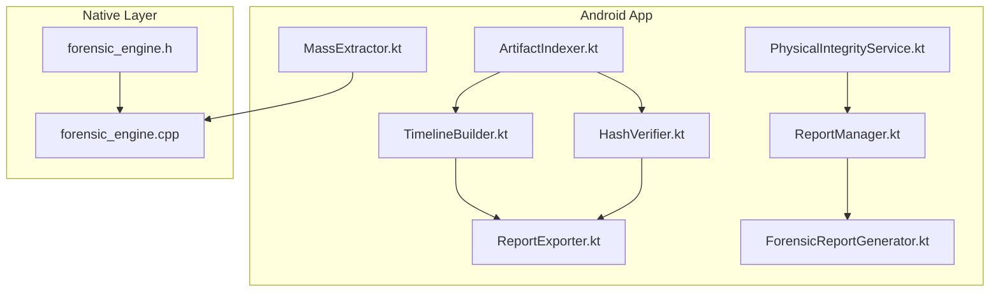

**Diagram sources**
- [forensic_engine.h:1-92](file://app/src/main/jni/core/include/forensic_engine.h#L1-L92)
- [forensic_engine.cpp:1-126](file://app/src/main/jni/core/src/forensics/forensic_engine.cpp#L1-L126)
- [ArtifactIndexer.kt:1-237](file://app/src/main/kotlin/com/deepeye/otg/feature/forensics/ArtifactIndexer.kt#L1-L237)
- [HashVerifier.kt:1-253](file://app/src/main/kotlin/com/deepeye/otg/feature/forensics/HashVerifier.kt#L1-L253)
- [TimelineBuilder.kt:1-244](file://app/src/main/kotlin/com/deepeye/otg/feature/forensics/TimelineBuilder.kt#L1-L244)
- [ReportExporter.kt:1-301](file://app/src/main/kotlin/com/deepeye/otg/feature/forensics/ReportExporter.kt#L1-L301)
- [MassExtractor.kt:1-95](file://app/src/main/kotlin/com/deepeye/otg/service/MassExtractor.kt#L1-L95)
- [PhysicalIntegrityService.kt:1-64](file://app/src/main/kotlin/com/deepeye/otg/service/PhysicalIntegrityService.kt#L1-L64)
- [ReportManager.kt:1-123](file://app/src/main/kotlin/com/deepeye/otg/service/ReportManager.kt#L1-L123)
- [ForensicReportGenerator.kt:1-169](file://app/src/main/kotlin/com/deepeye/otg/service/ForensicReportGenerator.kt#L1-L169)

**Section sources**
- [forensic_engine.h:1-92](file://app/src/main/jni/core/include/forensic_engine.h#L1-L92)
- [forensic_engine.cpp:1-126](file://app/src/main/jni/core/src/forensics/forensic_engine.cpp#L1-L126)

## Core Components
- Forensic Engine (native): Provides safe dumping, deleted data carving, filesystem decryption hooks, adoptable storage key extraction, directory listing, file reading, and physical integrity examination.
- Artifact Indexer (Kotlin): Recursively indexes accessible file system artifacts, classifies by type, computes integrity hashes, and aggregates counts and durations.
- Hash Verifier (Kotlin): Computes streaming hashes (MD5, SHA-1, SHA-256, SHA-512), supports batch verification, and generates chain-of-custody records.
- Timeline Builder (Kotlin): Builds chronological timelines from indexed artifacts, categorizing events and supporting filtering and grouping.
- Report Exporter (Kotlin): Exports forensic results in JSON, text, CSV, and HTML formats, embedding provenance and metadata.
- Mass Extractor (Kotlin): Orchestrates multi-device extraction, coordinates decryption for MTK devices, and streams progress.
- Physical Integrity Service (Kotlin): Analyzes USB signal integrity via native bridge and produces integrity reports.
- Report Manager (Kotlin): Aggregates audit trails across devices and generates consolidated JSON reports.
- Forensic Report Generator (Kotlin): Produces official PDF reports from consolidated JSON audits.

**Section sources**
- [forensic_engine.h:23-86](file://app/src/main/jni/core/include/forensic_engine.h#L23-L86)
- [forensic_engine.cpp:9-122](file://app/src/main/jni/core/src/forensics/forensic_engine.cpp#L9-L122)
- [ArtifactIndexer.kt:85-236](file://app/src/main/kotlin/com/deepeye/otg/feature/forensics/ArtifactIndexer.kt#L85-L236)
- [HashVerifier.kt:53-231](file://app/src/main/kotlin/com/deepeye/otg/feature/forensics/HashVerifier.kt#L53-L231)
- [TimelineBuilder.kt:78-243](file://app/src/main/kotlin/com/deepeye/otg/feature/forensics/TimelineBuilder.kt#L78-L243)
- [ReportExporter.kt:43-300](file://app/src/main/kotlin/com/deepeye/otg/feature/forensics/ReportExporter.kt#L43-L300)
- [MassExtractor.kt:17-94](file://app/src/main/kotlin/com/deepeye/otg/service/MassExtractor.kt#L17-L94)
- [PhysicalIntegrityService.kt:14-62](file://app/src/main/kotlin/com/deepeye/otg/service/PhysicalIntegrityService.kt#L14-L62)
- [ReportManager.kt:18-122](file://app/src/main/kotlin/com/deepeye/otg/service/ReportManager.kt#L18-L122)
- [ForensicReportGenerator.kt:19-168](file://app/src/main/kotlin/com/deepeye/otg/service/ForensicReportGenerator.kt#L19-L168)

## Architecture Overview
The forensic workflow integrates native acquisition primitives with Kotlin forensic services. The native engine handles protocol-level dumping and decryption hooks. Kotlin services manage artifact discovery, integrity checks, timelines, and reporting. Audit trails and multi-device consolidation are handled centrally.

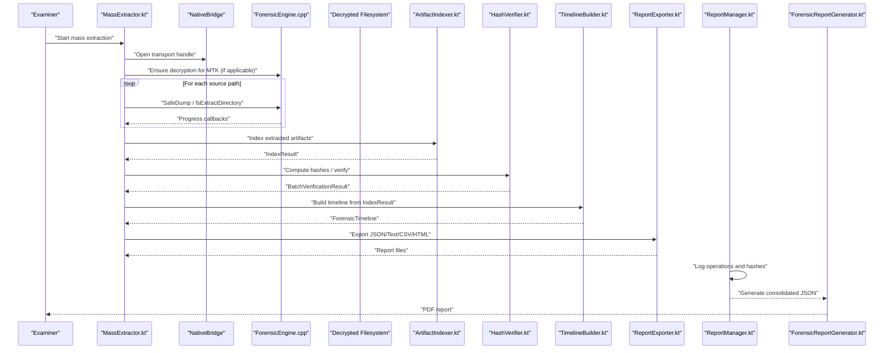

**Diagram sources**
- [MassExtractor.kt:36-93](file://app/src/main/kotlin/com/deepeye/otg/service/MassExtractor.kt#L36-L93)
- [forensic_engine.cpp:12-42](file://app/src/main/jni/core/src/forensics/forensic_engine.cpp#L12-L42)
- [ArtifactIndexer.kt:130-161](file://app/src/main/kotlin/com/deepeye/otg/feature/forensics/ArtifactIndexer.kt#L130-L161)
- [HashVerifier.kt:137-175](file://app/src/main/kotlin/com/deepeye/otg/feature/forensics/HashVerifier.kt#L137-L175)
- [TimelineBuilder.kt:86-108](file://app/src/main/kotlin/com/deepeye/otg/feature/forensics/TimelineBuilder.kt#L86-L108)
- [ReportExporter.kt:57-181](file://app/src/main/kotlin/com/deepeye/otg/feature/forensics/ReportExporter.kt#L57-L181)
- [ReportManager.kt:40-57](file://app/src/main/kotlin/com/deepeye/otg/service/ReportManager.kt#L40-L57)
- [ForensicReportGenerator.kt:22-167](file://app/src/main/kotlin/com/deepeye/otg/service/ForensicReportGenerator.kt#L22-L167)

## Detailed Component Analysis

### Forensic Engine (Native)
The native ForensicEngine exposes acquisition and analysis APIs:
- SafeDump: Initiates a protocol-level partition dump and verifies integrity via SHA-256.
- CarveDeletedData: Scans partitions for file signatures (placeholder implementation).
- AcquireForensicImage: Convenience wrapper around SafeDump that returns the output path.
- DecryptFileSystem: Placeholder for FBE/ext4 decryption logic.
- ExtractAdoptableStorageKey: Placeholder for extracting adoptable storage keys from userdata.
- ListDirectory / ReadFile: Helpers for decrypted filesystem navigation and reading.
- ExaminePhysicalIntegrity: Returns a JSON string with integrity metrics.

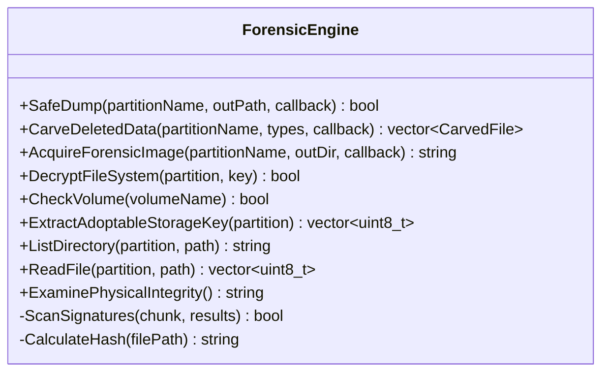

**Diagram sources**
- [forensic_engine.h:23-86](file://app/src/main/jni/core/include/forensic_engine.h#L23-L86)
- [forensic_engine.cpp:9-122](file://app/src/main/jni/core/src/forensics/forensic_engine.cpp#L9-L122)

**Section sources**
- [forensic_engine.h:23-86](file://app/src/main/jni/core/include/forensic_engine.h#L23-L86)
- [forensic_engine.cpp:12-122](file://app/src/main/jni/core/src/forensics/forensic_engine.cpp#L12-L122)

### Artifact Indexer (Kotlin)
Indexes accessible files under a root path, classifies by type, computes MD5/SHA-256 when requested, and aggregates statistics. Designed to be thread-safe and suitable for background coroutines.

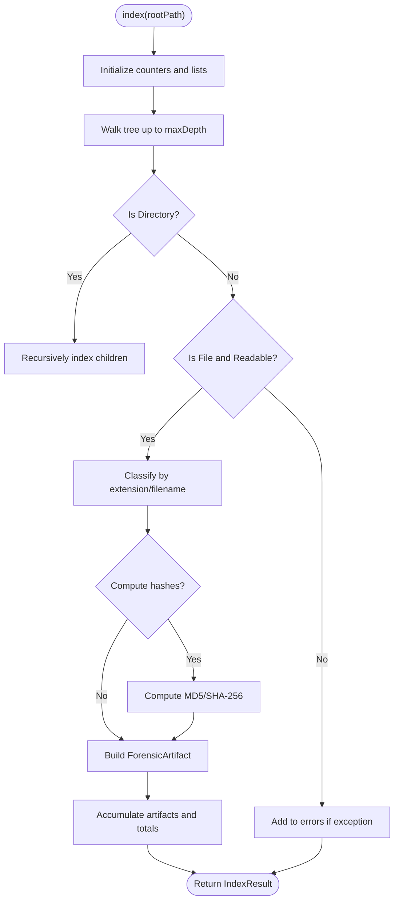

**Diagram sources**
- [ArtifactIndexer.kt:130-213](file://app/src/main/kotlin/com/deepeye/otg/feature/forensics/ArtifactIndexer.kt#L130-L213)

**Section sources**
- [ArtifactIndexer.kt:85-236](file://app/src/main/kotlin/com/deepeye/otg/feature/forensics/ArtifactIndexer.kt#L85-L236)

### Hash Verifier (Kotlin)
Computes streaming hashes for large files, supports multiple algorithms, performs batch verification against manifests, and generates chain-of-custody records.

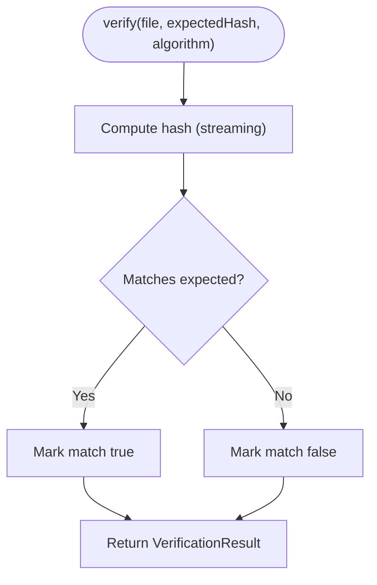

**Diagram sources**
- [HashVerifier.kt:107-129](file://app/src/main/kotlin/com/deepeye/otg/feature/forensics/HashVerifier.kt#L107-L129)

**Section sources**
- [HashVerifier.kt:53-231](file://app/src/main/kotlin/com/deepeye/otg/feature/forensics/HashVerifier.kt#L53-L231)

### Timeline Builder (Kotlin)
Constructs a unified chronological timeline from indexed artifacts, assigning categories and confidence levels, and supports filtering and grouping.

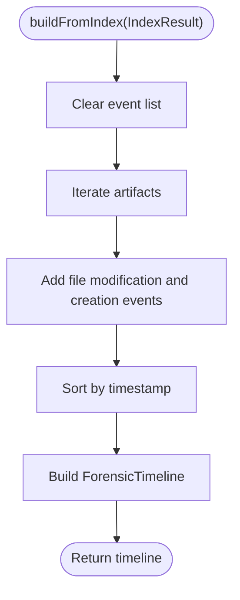

**Diagram sources**
- [TimelineBuilder.kt:86-108](file://app/src/main/kotlin/com/deepeye/otg/feature/forensics/TimelineBuilder.kt#L86-L108)

**Section sources**
- [TimelineBuilder.kt:78-243](file://app/src/main/kotlin/com/deepeye/otg/feature/forensics/TimelineBuilder.kt#L78-L243)

### Report Exporter (Kotlin)
Exports forensic results in multiple formats, embedding provenance metadata and artifact details.

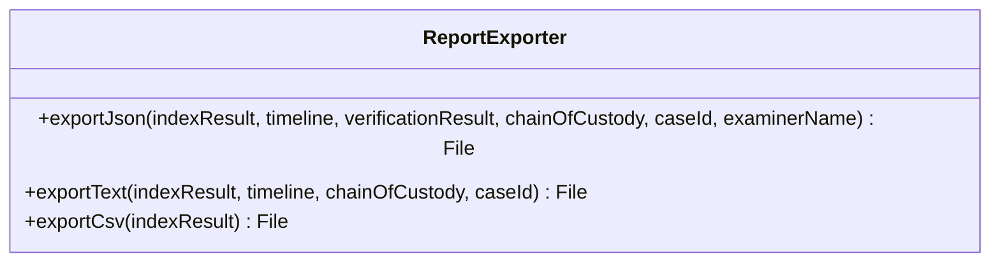

**Diagram sources**
- [ReportExporter.kt:43-300](file://app/src/main/kotlin/com/deepeye/otg/feature/forensics/ReportExporter.kt#L43-L300)

**Section sources**
- [ReportExporter.kt:43-300](file://app/src/main/kotlin/com/deepeye/otg/feature/forensics/ReportExporter.kt#L43-L300)

### Mass Extractor (Kotlin)
Coordinates multi-device extraction, initializes decryption for MTK devices, and streams progress updates.

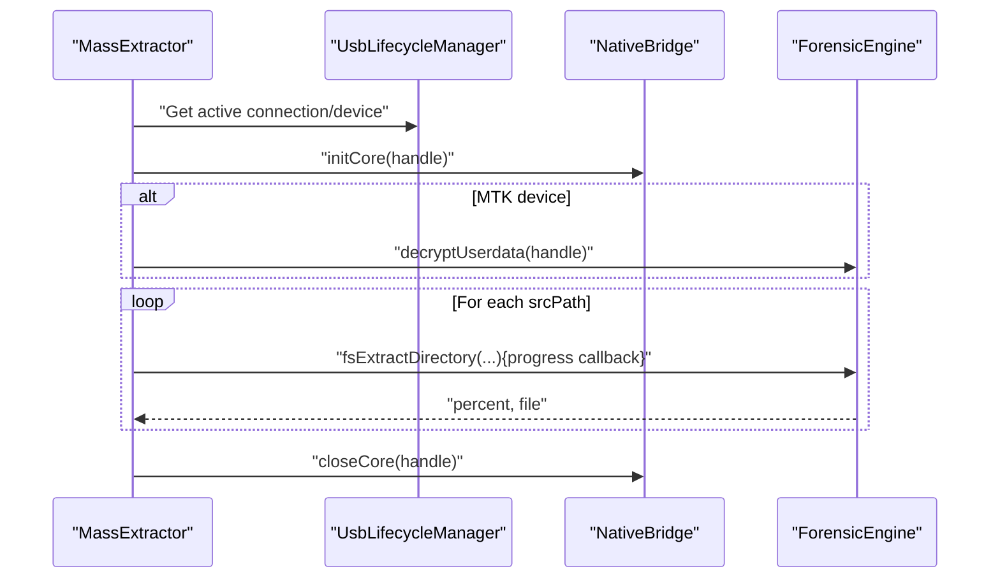

**Diagram sources**
- [MassExtractor.kt:36-93](file://app/src/main/kotlin/com/deepeye/otg/service/MassExtractor.kt#L36-L93)

**Section sources**
- [MassExtractor.kt:17-94](file://app/src/main/kotlin/com/deepeye/otg/service/MassExtractor.kt#L17-L94)

### Physical Integrity Service (Kotlin)
Performs USB signal integrity analysis via native bridge and returns a structured integrity report.

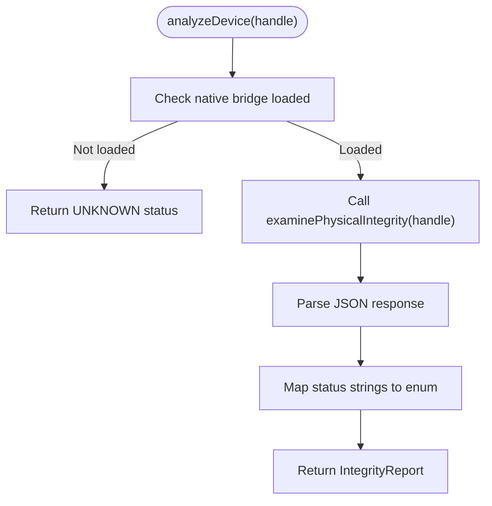

**Diagram sources**
- [PhysicalIntegrityService.kt:36-62](file://app/src/main/kotlin/com/deepeye/otg/service/PhysicalIntegrityService.kt#L36-L62)

**Section sources**
- [PhysicalIntegrityService.kt:14-62](file://app/src/main/kotlin/com/deepeye/otg/service/PhysicalIntegrityService.kt#L14-L62)

### Report Manager (Kotlin)
Aggregates audit entries per device and generates a consolidated JSON report containing device info, audit trails, and exploit findings.

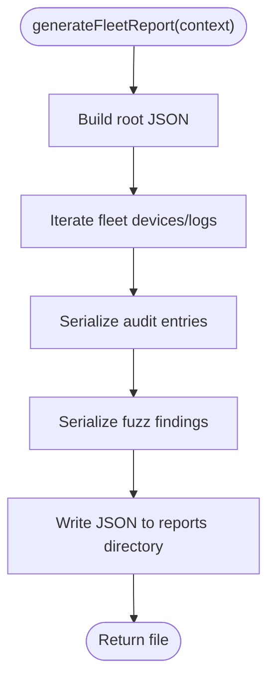

**Diagram sources**
- [ReportManager.kt:62-116](file://app/src/main/kotlin/com/deepeye/otg/service/ReportManager.kt#L62-L116)

**Section sources**
- [ReportManager.kt:18-122](file://app/src/main/kotlin/com/deepeye/otg/service/ReportManager.kt#L18-L122)

### Forensic Report Generator (Kotlin)
Generates a PDF report from consolidated JSON, rendering device audit trails and exploit findings.

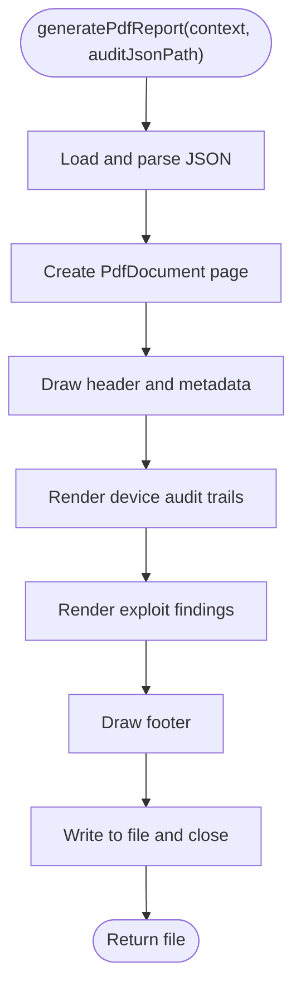

**Diagram sources**
- [ForensicReportGenerator.kt:22-167](file://app/src/main/kotlin/com/deepeye/otg/service/ForensicReportGenerator.kt#L22-L167)

**Section sources**
- [ForensicReportGenerator.kt:19-168](file://app/src/main/kotlin/com/deepeye/otg/service/ForensicReportGenerator.kt#L19-L168)

## Dependency Analysis
- ForensicEngine (native) depends on the core protocol engine for device communication and acquisition.
- Kotlin services depend on the native bridge for low-level operations and on each other for workflow orchestration.
- ReportManager consolidates logs across devices and feeds ForensicReportGenerator.
- ArtifactIndexer and HashVerifier feed TimelineBuilder and ReportExporter.
- MassExtractor coordinates native acquisition and decryption steps.

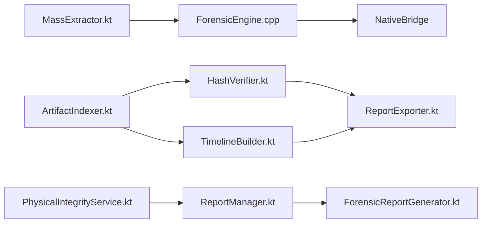

**Diagram sources**
- [forensic_engine.cpp:9-122](file://app/src/main/jni/core/src/forensics/forensic_engine.cpp#L9-L122)
- [MassExtractor.kt:58-87](file://app/src/main/kotlin/com/deepeye/otg/service/MassExtractor.kt#L58-L87)
- [ArtifactIndexer.kt:130-161](file://app/src/main/kotlin/com/deepeye/otg/feature/forensics/ArtifactIndexer.kt#L130-L161)
- [HashVerifier.kt:137-175](file://app/src/main/kotlin/com/deepeye/otg/feature/forensics/HashVerifier.kt#L137-L175)
- [TimelineBuilder.kt:86-108](file://app/src/main/kotlin/com/deepeye/otg/feature/forensics/TimelineBuilder.kt#L86-L108)
- [ReportExporter.kt:57-181](file://app/src/main/kotlin/com/deepeye/otg/feature/forensics/ReportExporter.kt#L57-L181)
- [ReportManager.kt:62-116](file://app/src/main/kotlin/com/deepeye/otg/service/ReportManager.kt#L62-L116)
- [ForensicReportGenerator.kt:22-167](file://app/src/main/kotlin/com/deepeye/otg/service/ForensicReportGenerator.kt#L22-L167)
- [PhysicalIntegrityService.kt:36-62](file://app/src/main/kotlin/com/deepeye/otg/service/PhysicalIntegrityService.kt#L36-L62)

**Section sources**
- [forensic_engine.cpp:9-122](file://app/src/main/jni/core/src/forensics/forensic_engine.cpp#L9-L122)
- [MassExtractor.kt:36-93](file://app/src/main/kotlin/com/deepeye/otg/service/MassExtractor.kt#L36-L93)
- [ReportManager.kt:62-116](file://app/src/main/kotlin/com/deepeye/otg/service/ReportManager.kt#L62-L116)

## Performance Considerations
- Streaming hashing avoids loading large files entirely into memory, improving scalability for big acquisitions.
- Artifact indexing limits hashing for very large files to reduce overhead while still enabling chain-of-custody.
- Timeline building sorts a bounded number of events; filtering and grouping reduce post-processing costs.
- Native acquisition uses protocol engines and callbacks to provide progress feedback without blocking UI threads.
- Multi-device extraction runs in parallel per device key, with centralized progress aggregation.

[No sources needed since this section provides general guidance]

## Troubleshooting Guide
Common issues and remedies:
- Acquisition failures during protocol layer: Check device connectivity, permissions, and protocol detection. Review progress callbacks and error messages emitted by the native engine.
- Hash mismatches: Verify file readability, ensure correct algorithm selection, and re-run verification after confirming file integrity.
- Missing artifacts: Increase max depth in indexing, confirm read permissions, and exclude overly large files from hashing.
- Timeline gaps: Confirm artifact timestamps and ensure sufficient metadata is present; consider adding custom events where appropriate.
- Audit trail inconsistencies: Validate device keys and ensure ReportManager initialization per device before logging operations.
- PDF generation errors: Confirm consolidated JSON validity and available storage space.

**Section sources**
- [forensic_engine.cpp:26-42](file://app/src/main/jni/core/src/forensics/forensic_engine.cpp#L26-L42)
- [HashVerifier.kt:146-175](file://app/src/main/kotlin/com/deepeye/otg/feature/forensics/HashVerifier.kt#L146-L175)
- [ArtifactIndexer.kt:173-213](file://app/src/main/kotlin/com/deepeye/otg/feature/forensics/ArtifactIndexer.kt#L173-L213)
- [ReportManager.kt:40-57](file://app/src/main/kotlin/com/deepeye/otg/service/ReportManager.kt#L40-L57)
- [ForensicReportGenerator.kt:157-167](file://app/src/main/kotlin/com/deepeye/otg/service/ForensicReportGenerator.kt#L157-L167)

## Conclusion
DeepEye Unlocker’s forensic stack combines native acquisition primitives with robust Kotlin services to deliver a complete forensic workflow. From device detection and protocol-level dumping to artifact indexing, integrity verification, timeline construction, and multi-format reporting, the system emphasizes chain-of-custody, real-time monitoring, and compliance-ready outputs. Integrations among modules enable scalable, multi-device operations with centralized auditing and consolidated reporting.

[No sources needed since this section summarizes without analyzing specific files]

## Appendices

### Forensic Acquisition Workflow (End-to-End)
- Device detection and transport initialization.
- Optional decryption for MTK devices.
- Protocol-level partition dump with integrity verification.
- File system extraction and optional carving.
- Artifact indexing and classification.
- Integrity checks and chain-of-custody generation.
- Timeline construction and report export in multiple formats.
- Consolidated JSON and PDF reporting for multi-device audits.

**Section sources**
- [MassExtractor.kt:36-93](file://app/src/main/kotlin/com/deepeye/otg/service/MassExtractor.kt#L36-L93)
- [forensic_engine.cpp:12-42](file://app/src/main/jni/core/src/forensics/forensic_engine.cpp#L12-L42)
- [ArtifactIndexer.kt:130-161](file://app/src/main/kotlin/com/deepeye/otg/feature/forensics/ArtifactIndexer.kt#L130-L161)
- [HashVerifier.kt:137-175](file://app/src/main/kotlin/com/deepeye/otg/feature/forensics/HashVerifier.kt#L137-L175)
- [TimelineBuilder.kt:86-108](file://app/src/main/kotlin/com/deepeye/otg/feature/forensics/TimelineBuilder.kt#L86-L108)
- [ReportExporter.kt:57-181](file://app/src/main/kotlin/com/deepeye/otg/feature/forensics/ReportExporter.kt#L57-L181)
- [ReportManager.kt:62-116](file://app/src/main/kotlin/com/deepeye/otg/service/ReportManager.kt#L62-L116)
- [ForensicReportGenerator.kt:22-167](file://app/src/main/kotlin/com/deepeye/otg/service/ForensicReportGenerator.kt#L22-L167)

### Bit-Level Imaging and Live Memory Analysis
- Bit-level imaging: Implemented via SafeDump and AcquireForensicImage, leveraging protocol engines to perform sector-by-sector dumps and post-acquisition SHA-256 verification.
- Live memory analysis: Not implemented in the referenced files; future enhancements could integrate memory capture primitives and integrity checks.

**Section sources**
- [forensic_engine.h:27-48](file://app/src/main/jni/core/include/forensic_engine.h#L27-L48)
- [forensic_engine.cpp:12-42](file://app/src/main/jni/core/src/forensics/forensic_engine.cpp#L12-L42)

### File System Extraction Support
- Accessible file system artifacts: Indexed and classified by ArtifactIndexer.
- Decryption operations: DecryptFileSystem is exposed as a placeholder for FBE/ext4 and adoptable storage key extraction is supported via ExtractAdoptableStorageKey.
- Proprietary file systems: Not explicitly implemented in the referenced files; decryption hooks are available for integration.

**Section sources**
- [ArtifactIndexer.kt:85-236](file://app/src/main/kotlin/com/deepeye/otg/feature/forensics/ArtifactIndexer.kt#L85-L236)
- [forensic_engine.h:51-63](file://app/src/main/jni/core/include/forensic_engine.h#L51-L63)
- [forensic_engine.cpp:94-108](file://app/src/main/jni/core/src/forensics/forensic_engine.cpp#L94-L108)

### Decryption Operations
- Double-layer decryption for FBE-encrypted UserData and adoptable storage: DecryptFileSystem and ExtractAdoptableStorageKey are placeholders for integration with underlying decryption logic.
- TEE key extraction from RPMB/Secure Contexts: Not implemented in the referenced files.
- AES-256 hardware acceleration: Not implemented in the referenced files.

**Section sources**
- [forensic_engine.h:51-63](file://app/src/main/jni/core/include/forensic_engine.h#L51-L63)
- [forensic_engine.cpp:94-108](file://app/src/main/jni/core/src/forensics/forensic_engine.cpp#L94-L108)

### Forensic Report Generation and Compliance
- Evidence chain of custody: Generated via HashVerifier.generateChainOfCustody and embedded in reports.
- Compliance reporting: ReportExporter supports JSON, text, CSV, and HTML formats; ReportManager and ForensicReportGenerator produce consolidated JSON and PDF outputs.

**Section sources**
- [HashVerifier.kt:207-231](file://app/src/main/kotlin/com/deepeye/otg/feature/forensics/HashVerifier.kt#L207-L231)
- [ReportExporter.kt:57-181](file://app/src/main/kotlin/com/deepeye/otg/feature/forensics/ReportExporter.kt#L57-L181)
- [ReportManager.kt:62-116](file://app/src/main/kotlin/com/deepeye/otg/service/ReportManager.kt#L62-L116)
- [ForensicReportGenerator.kt:22-167](file://app/src/main/kotlin/com/deepeye/otg/service/ForensicReportGenerator.kt#L22-L167)

### Real-Time Monitoring, Integrity Checks, and Error Logging
- Real-time monitoring: MassExtractor emits progress updates; ForensicEngine callbacks provide acquisition status; PhysicalIntegrityService returns integrity reports.
- Integrity checks: HashVerifier computes streaming hashes; ForensicEngine calculates SHA-256 post-dump; PhysicalIntegrityService evaluates USB signal metrics.
- Error logging: Services log errors and exceptions; ReportManager logs operation outcomes with hashes and paths.

**Section sources**
- [MassExtractor.kt:76-82](file://app/src/main/kotlin/com/deepeye/otg/service/MassExtractor.kt#L76-L82)
- [forensic_engine.cpp:18-42](file://app/src/main/jni/core/src/forensics/forensic_engine.cpp#L18-L42)
- [HashVerifier.kt:146-175](file://app/src/main/kotlin/com/deepeye/otg/feature/forensics/HashVerifier.kt#L146-L175)
- [PhysicalIntegrityService.kt:36-62](file://app/src/main/kotlin/com/deepeye/otg/service/PhysicalIntegrityService.kt#L36-L62)
- [ReportManager.kt:40-57](file://app/src/main/kotlin/com/deepeye/otg/service/ReportManager.kt#L40-L57)

### Practical Forensic Workflows and Best Practices
- Workflow 1: Single-device acquisition
  - Initialize transport, optionally decrypt MTK userdata, perform SafeDump, index artifacts, compute hashes, build timeline, export reports, and log audit trail.
- Workflow 2: Multi-device mass extraction
  - Initialize fleet, iterate device keys, pull target paths in parallel, aggregate progress, and generate consolidated reports.
- Best practices
  - Always compute and preserve SHA-256 hashes for chain of custody.
  - Limit hashing for very large files to maintain performance.
  - Use filtering and grouping in timelines to focus on relevant events.
  - Maintain device-specific audit logs and consolidate into fleet reports.

**Section sources**
- [MassExtractor.kt:36-93](file://app/src/main/kotlin/com/deepeye/otg/service/MassExtractor.kt#L36-L93)
- [ArtifactIndexer.kt:130-161](file://app/src/main/kotlin/com/deepeye/otg/feature/forensics/ArtifactIndexer.kt#L130-L161)
- [HashVerifier.kt:137-175](file://app/src/main/kotlin/com/deepeye/otg/feature/forensics/HashVerifier.kt#L137-L175)
- [TimelineBuilder.kt:86-108](file://app/src/main/kotlin/com/deepeye/otg/feature/forensics/TimelineBuilder.kt#L86-L108)
- [ReportExporter.kt:57-181](file://app/src/main/kotlin/com/deepeye/otg/feature/forensics/ReportExporter.kt#L57-L181)
- [ReportManager.kt:62-116](file://app/src/main/kotlin/com/deepeye/otg/service/ReportManager.kt#L62-L116)