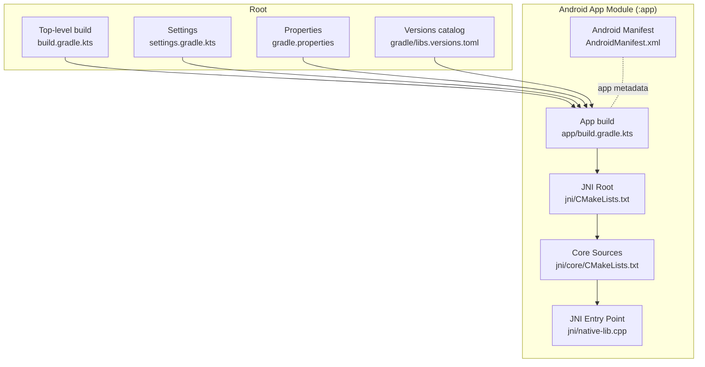
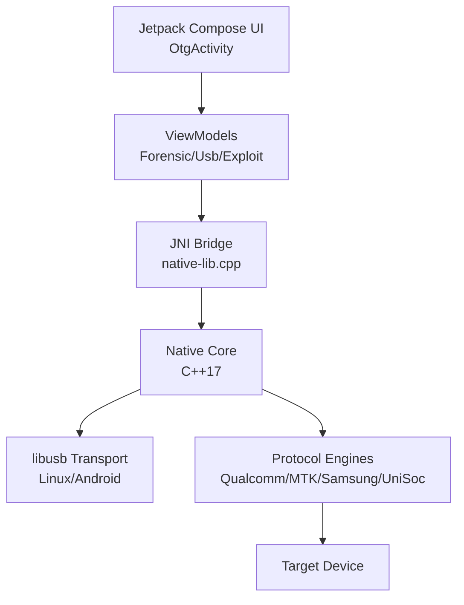
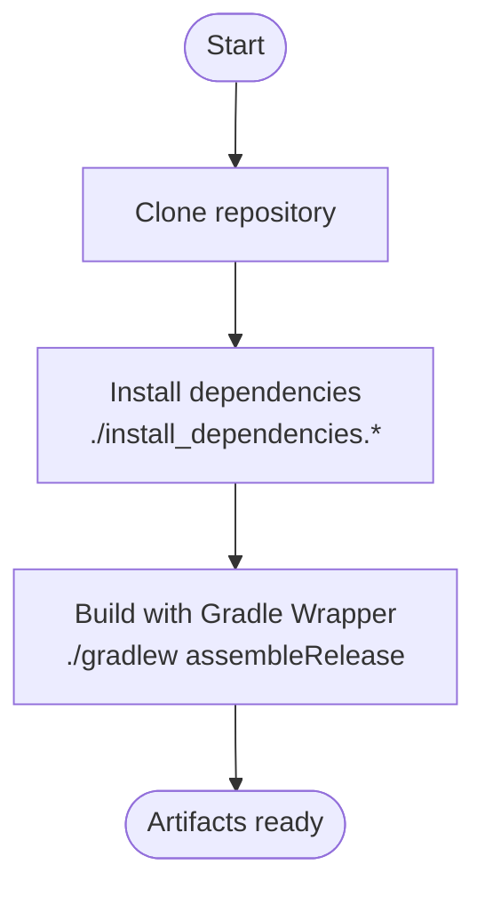
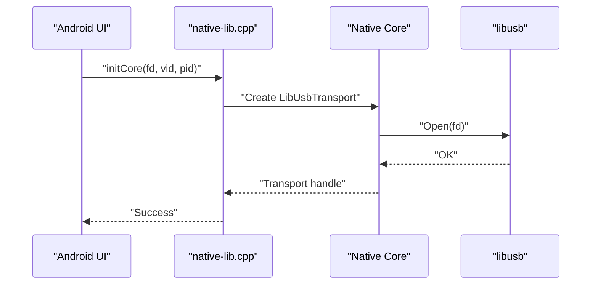
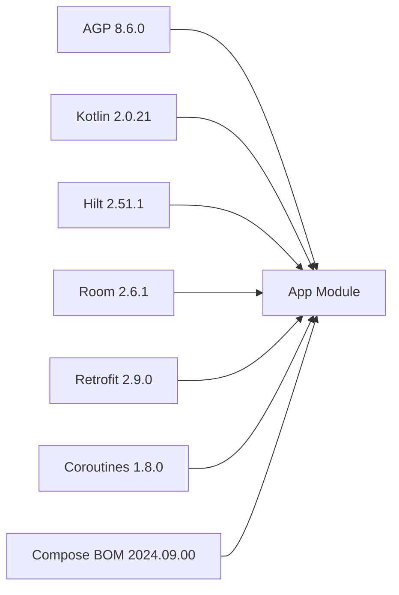

# Getting Started

<cite>
**Referenced Files in This Document**
- [README.md](file://README.md)
- [gradlew](file://gradlew)
- [gradlew.bat](file://gradlew.bat)
- [build.gradle.kts](file://build.gradle.kts)
- [settings.gradle.kts](file://settings.gradle.kts)
- [gradle.properties](file://gradle.properties)
- [gradle/libs.versions.toml](file://gradle/libs.versions.toml)
- [app/build.gradle.kts](file://app/build.gradle.kts)
- [app/src/main/AndroidManifest.xml](file://app/src/main/AndroidManifest.xml)
- [app/src/main/jni/CMakeLists.txt](file://app/src/main/jni/CMakeLists.txt)
- [app/src/main/jni/core/CMakeLists.txt](file://app/src/main/jni/core/CMakeLists.txt)
- [app/src/main/jni/native-lib.cpp](file://app/src/main/jni/native-lib.cpp)
</cite>

## Table of Contents
1. [Introduction](#introduction)
2. [Project Structure](#project-structure)
3. [Core Components](#core-components)
4. [Architecture Overview](#architecture-overview)
5. [Detailed Component Analysis](#detailed-component-analysis)
6. [Dependency Analysis](#dependency-analysis)
7. [Performance Considerations](#performance-considerations)
8. [Troubleshooting Guide](#troubleshooting-guide)
9. [Conclusion](#conclusion)
10. [Appendices](#appendices)

## Introduction
This guide helps you install, build, and verify DeepEye Unlocker for Android development and forensic workflows. It covers prerequisites, platform-specific setup, building with Gradle Wrapper, manual configuration, post-installation steps, and troubleshooting.

## Project Structure
DeepEye Unlocker is a Kotlin/Android application with a native C++ core integrated via JNI and CMake. The Android app module compiles with Gradle and links against a native library that orchestrates low-level USB protocols for device acquisition.

**Diagram sources**
- [build.gradle.kts:1-19](file://build.gradle.kts#L1-L19)
- [settings.gradle.kts:1-18](file://settings.gradle.kts#L1-L18)
- [gradle.properties:1-11](file://gradle.properties#L1-L11)
- [gradle/libs.versions.toml:1-53](file://gradle/libs.versions.toml#L1-L53)
- [app/build.gradle.kts:1-143](file://app/build.gradle.kts#L1-L143)
- [app/src/main/AndroidManifest.xml:1-47](file://app/src/main/AndroidManifest.xml#L1-L47)
- [app/src/main/jni/CMakeLists.txt:1-84](file://app/src/main/jni/CMakeLists.txt#L1-L84)
- [app/src/main/jni/core/CMakeLists.txt:1-52](file://app/src/main/jni/core/CMakeLists.txt#L1-L52)
- [app/src/main/jni/native-lib.cpp:1-800](file://app/src/main/jni/native-lib.cpp#L1-L800)

**Section sources**
- [README.md:219-232](file://README.md#L219-L232)
- [build.gradle.kts:1-19](file://build.gradle.kts#L1-L19)
- [settings.gradle.kts:1-18](file://settings.gradle.kts#L1-L18)
- [gradle.properties:1-11](file://gradle.properties#L1-L11)
- [gradle/libs.versions.toml:1-53](file://gradle/libs.versions.toml#L1-L53)
- [app/build.gradle.kts:1-143](file://app/build.gradle.kts#L1-L143)
- [app/src/main/AndroidManifest.xml:1-47](file://app/src/main/AndroidManifest.xml#L1-L47)
- [app/src/main/jni/CMakeLists.txt:1-84](file://app/src/main/jni/CMakeLists.txt#L1-L84)
- [app/src/main/jni/core/CMakeLists.txt:1-52](file://app/src/main/jni/core/CMakeLists.txt#L1-L52)
- [app/src/main/jni/native-lib.cpp:1-800](file://app/src/main/jni/native-lib.cpp#L1-L800)

## Core Components
- Android app module configured for Kotlin, Compose, Hilt, and Room.
- Native C++ core compiled via CMake with libusb integration for USB transport.
- JNI bridge exposing native functions to Kotlin/Android UI.
- Gradle build with Android Gradle Plugin and Kotlin plugin versions aligned in the versions catalog.

Key build and runtime properties:
- Compile SDK and target SDK set to 34.
- Minimum SDK 24.
- Compose enabled with BOM.
- Kotlin JVM target compatibility aligned to Java 1.8.
- Signing handled via environment variables or local keystore properties.

**Section sources**
- [app/build.gradle.kts:9-82](file://app/build.gradle.kts#L9-L82)
- [app/build.gradle.kts:84-135](file://app/build.gradle.kts#L84-L135)
- [gradle/libs.versions.toml:1-53](file://gradle/libs.versions.toml#L1-L53)
- [build.gradle.kts:1-19](file://build.gradle.kts#L1-L19)
- [gradle.properties:1-11](file://gradle.properties#L1-L11)

## Architecture Overview
High-level architecture ties the Android UI to native USB orchestration and forensic engines.

**Diagram sources**
- [README.md:39-52](file://README.md#L39-L52)
- [app/src/main/jni/native-lib.cpp:1-800](file://app/src/main/jni/native-lib.cpp#L1-L800)
- [app/src/main/jni/CMakeLists.txt:43-84](file://app/src/main/jni/CMakeLists.txt#L43-L84)

## Detailed Component Analysis

### Prerequisites and Platform Setup
- Software requirements:
  - Android SDK with platforms and build-tools.
  - Android NDK r25+.
  - JDK 17.
  - Gradle 8.0+ and CMake 3.18+.
  - Platform-specific USB drivers for target devices.
- Hardware requirements:
  - USB 3.0 port.
  - Minimum 8GB RAM; recommended 16GB+.
  - SSD storage for acquisition performance.
- Supported platforms:
  - Windows 10/11, macOS 12+, Linux (Ubuntu 20.04+).

Platform-specific notes:
- Windows: Ensure JAVA_HOME is set; the Gradle wrapper validates JAVA_HOME presence.
- macOS/Linux: Ensure Java is on PATH; the Gradle wrapper validates java availability.

Verification steps:
- Confirm Gradle wrapper runs without errors.
- Confirm CMake and NDK paths are accessible.

**Section sources**
- [README.md:87-101](file://README.md#L87-L101)
- [gradlew:119-141](file://gradlew#L119-L141)
- [gradlew.bat:40-66](file://gradlew.bat#L40-L66)

### Quick Start Build
- Clone the repository and navigate to the project root.
- Install dependencies using the provided scripts for your platform.
- Build the release variant using the Gradle Wrapper.

**Section sources**
- [README.md:104-121](file://README.md#L104-L121)
- [gradlew:1-250](file://gradlew#L1-L250)
- [gradlew.bat:1-93](file://gradlew.bat#L1-L93)

### Manual Installation and Build Configuration
- Install Android SDK and platform-tools.
- Configure NDK path in local.properties.
- Build variants:
  - Debug: assembleDebug
  - Release: assembleRelease

Signing:
- Release signing is controlled by environment variables or keystore.properties in the project root.

**Section sources**
- [README.md:122-144](file://README.md#L122-L144)
- [app/build.gradle.kts:26-47](file://app/build.gradle.kts#L26-L47)

### Post-Installation Setup
- Enable USB debugging on the target device.
- Install manufacturer-specific USB drivers.
- Configure security settings as needed.
- Test device connection using the built-in device detection.

**Section sources**
- [README.md:146-152](file://README.md#L146-L152)

### Native Build and JNI Integration
- CMake builds a shared library named deepeye_core.
- Includes libusb sources tailored for Android.
- JNI entry points exposed for device operations, protocol handshakes, and forensic services.

**Diagram sources**
- [app/src/main/jni/native-lib.cpp:62-108](file://app/src/main/jni/native-lib.cpp#L62-L108)
- [app/src/main/jni/CMakeLists.txt:47-84](file://app/src/main/jni/CMakeLists.txt#L47-L84)

**Section sources**
- [app/src/main/jni/CMakeLists.txt:1-84](file://app/src/main/jni/CMakeLists.txt#L1-L84)
- [app/src/main/jni/core/CMakeLists.txt:1-52](file://app/src/main/jni/core/CMakeLists.txt#L1-L52)
- [app/src/main/jni/native-lib.cpp:1-800](file://app/src/main/jni/native-lib.cpp#L1-L800)

## Dependency Analysis
- Android Gradle Plugin and Kotlin plugin versions are declared in the versions catalog and applied in the top-level build script.
- The app module declares Compose BOM, Hilt, Room, Retrofit, Coroutines, and other libraries.
- Repositories include Google, Maven Central, and JitPack.

**Diagram sources**
- [gradle/libs.versions.toml:1-53](file://gradle/libs.versions.toml#L1-L53)
- [build.gradle.kts:8-14](file://build.gradle.kts#L8-L14)
- [app/build.gradle.kts:84-135](file://app/build.gradle.kts#L84-L135)

**Section sources**
- [gradle/libs.versions.toml:1-53](file://gradle/libs.versions.toml#L1-L53)
- [build.gradle.kts:1-19](file://build.gradle.kts#L1-L19)
- [app/build.gradle.kts:84-135](file://app/build.gradle.kts#L84-L135)

## Performance Considerations
- Use USB 3.0 ports for optimal throughput.
- Prefer SSD storage for acquisition and analysis tasks.
- Ensure adequate RAM (minimum 8GB; 16GB+ recommended) for large datasets.
- Keep Gradle and Kotlin incremental compilation enabled to speed up builds.

[No sources needed since this section provides general guidance]

## Troubleshooting Guide
Common issues and resolutions:
- JAVA_HOME not set (Windows):
  - The Gradle wrapper prints an error and instructs setting JAVA_HOME to the Java installation directory.
- Java not found (macOS/Linux):
  - The Gradle wrapper checks PATH for java and fails with guidance to set it.
- NDK path missing:
  - Ensure ndk.dir is set in local.properties as per manual installation instructions.
- Gradle sync failures:
  - Verify repositories in settings.gradle.kts and gradle.properties.
  - Confirm AGP and Kotlin versions match the versions catalog.

Verification checklist:
- Run ./gradlew assembleDebug and ./gradlew assembleRelease successfully.
- Confirm native library compiles with CMake and links libusb.
- Test device detection and basic operations in the app after enabling USB debugging and installing drivers.

**Section sources**
- [gradlew.bat:40-66](file://gradlew.bat#L40-L66)
- [gradlew:119-141](file://gradlew#L119-L141)
- [README.md:122-144](file://README.md#L122-L144)
- [settings.gradle.kts:9-16](file://settings.gradle.kts#L9-L16)
- [gradle.properties:1-11](file://gradle.properties#L1-L11)
- [gradle/libs.versions.toml:1-53](file://gradle/libs.versions.toml#L1-L53)

## Conclusion
You now have the essentials to install, build, and verify DeepEye Unlocker across Windows, macOS, and Linux. Proceed to enable device debugging, install drivers, and test connectivity before performing forensic operations.

[No sources needed since this section summarizes without analyzing specific files]

## Appendices

### Appendix A: Build Commands Reference
- Build debug APK: ./gradlew assembleDebug
- Build release APK: ./gradlew assembleRelease
- Clean build cache: ./gradlew clean

**Section sources**
- [README.md:118-121](file://README.md#L118-L121)
- [build.gradle.kts:17-19](file://build.gradle.kts#L17-L19)

### Appendix B: Android Manifest Highlights
- USB host feature required.
- Permissions for boot, biometric, internet, wake lock, foreground services, and storage.
- Activities, receivers, services, and providers declared for device lifecycle and file sharing.

**Section sources**
- [app/src/main/AndroidManifest.xml:1-47](file://app/src/main/AndroidManifest.xml#L1-L47)