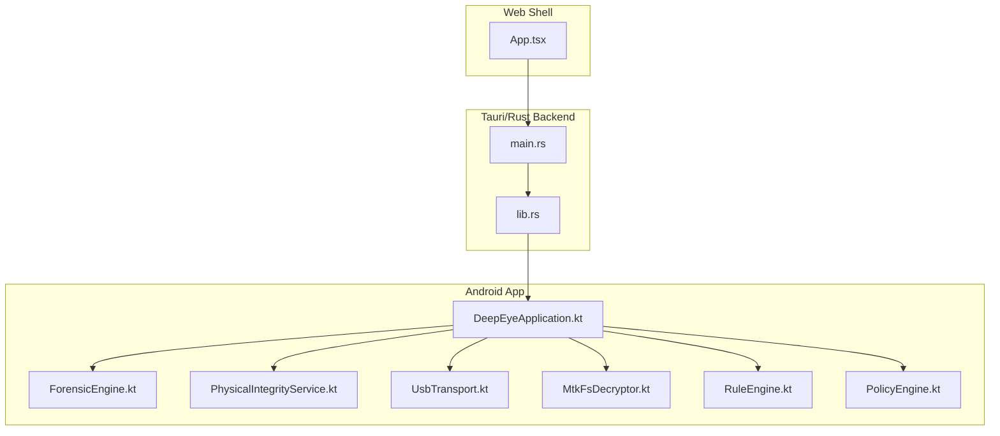
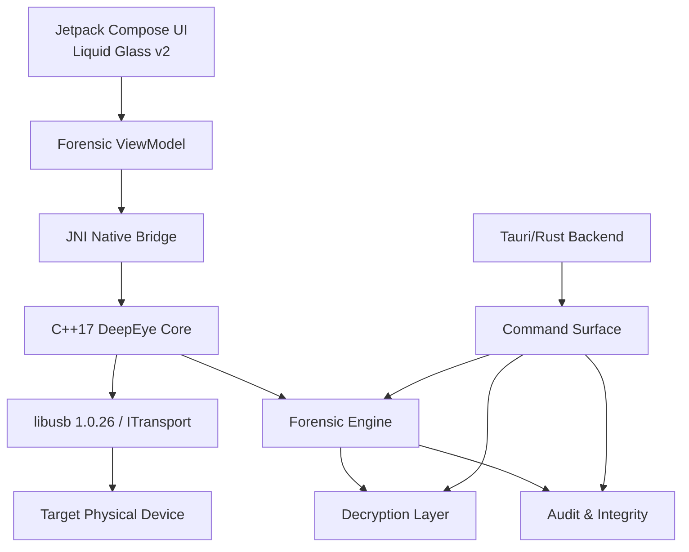
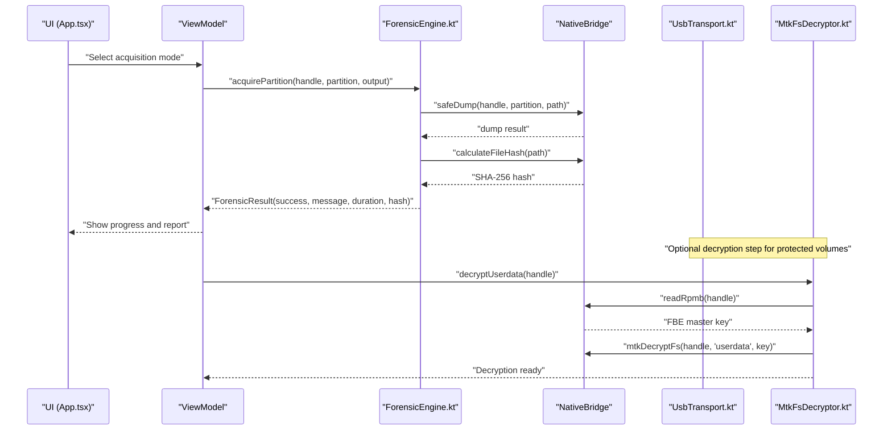
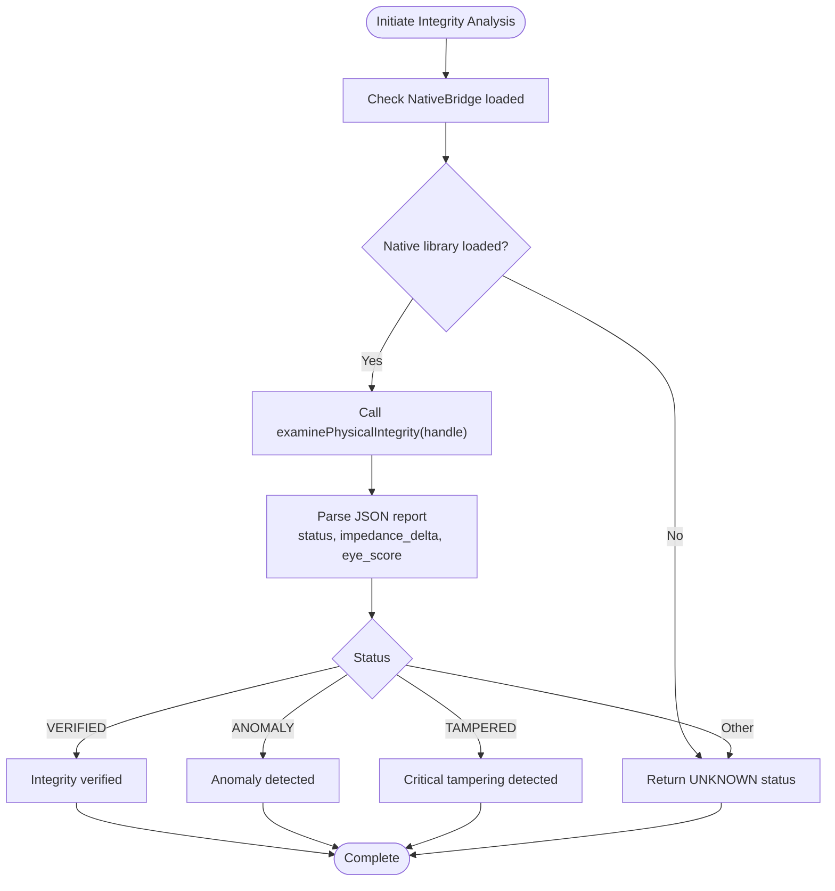
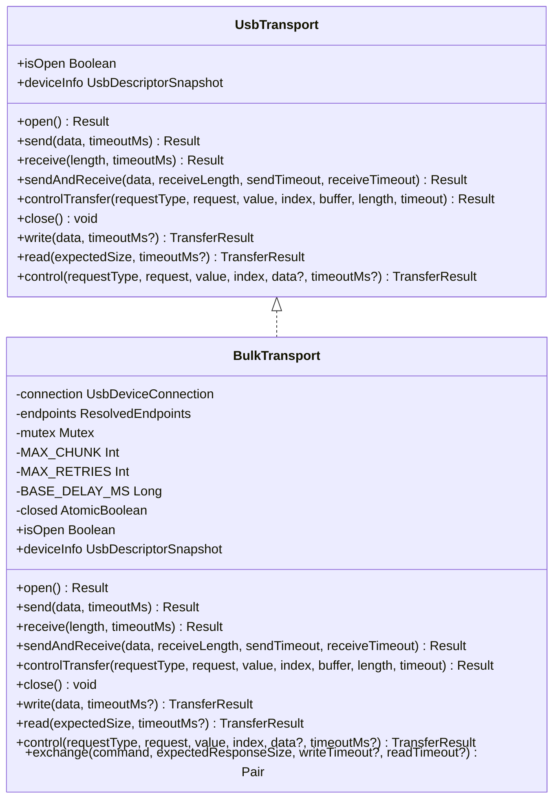
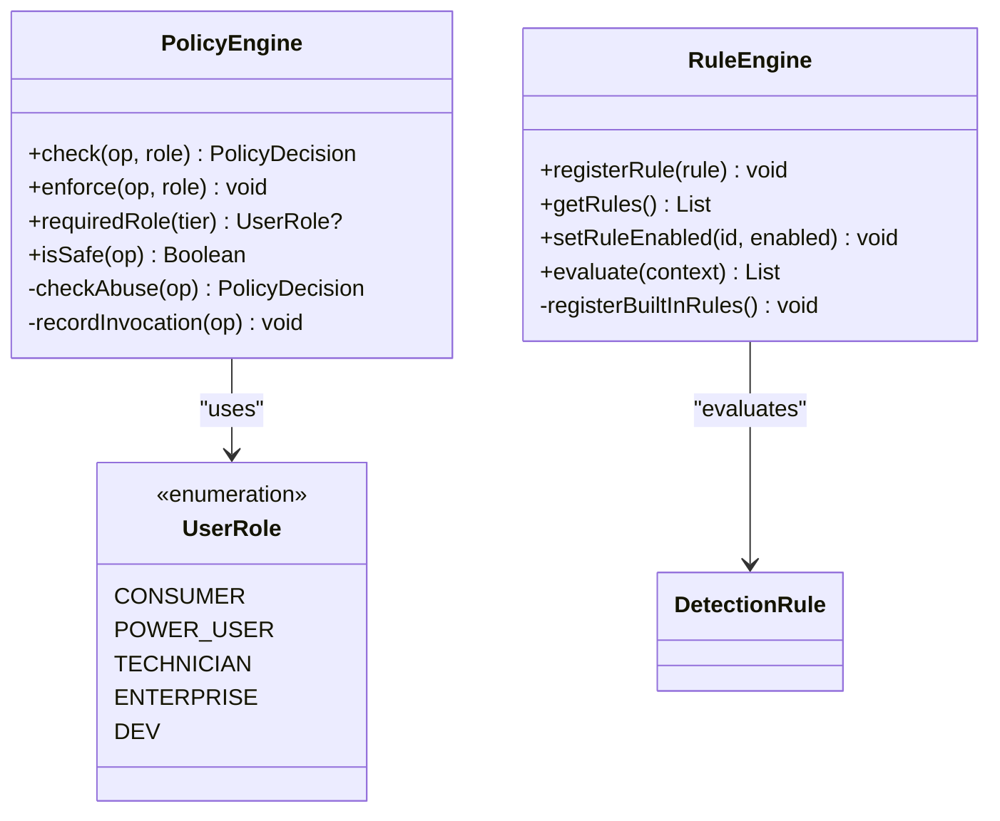
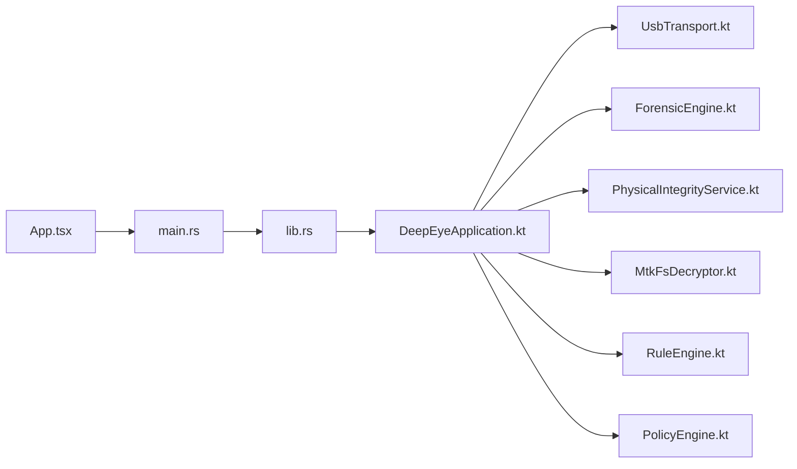

# Project Overview

<cite>
**Referenced Files in This Document**
- [README.md](file://README.md)
- [main.rs](file://src-tauri/src/main.rs)
- [lib.rs](file://src-tauri/src/lib.rs)
- [DeepEyeApplication.kt](file://app/src/main/kotlin/com/deepeye/otg/DeepEyeApplication.kt)
- [App.tsx](file://src/App.tsx)
- [ForensicEngine.kt](file://app/src/main/kotlin/com/deepeye/otg/engine/ForensicEngine.kt)
- [PhysicalIntegrityService.kt](file://app/src/main/kotlin/com/deepeye/otg/service/PhysicalIntegrityService.kt)
- [UsbTransport.kt](file://app/src/main/kotlin/com/deepeye/otg/usb/UsbTransport.kt)
- [MtkFsDecryptor.kt](file://app/src/main/kotlin/com/deepeye/otg/service/MtkFsDecryptor.kt)
- [RuleEngine.kt](file://app/src/main/kotlin/com/deepeye/otg/security/RuleEngine.kt)
- [PolicyEngine.kt](file://app/src/main/kotlin/com/deepeye/otg/policy/PolicyEngine.kt)
- [CONTRIBUTING.md](file://CONTRIBUTING.md)
</cite>

## Table of Contents
1. [Introduction](#introduction)
2. [Project Structure](#project-structure)
3. [Core Components](#core-components)
4. [Architecture Overview](#architecture-overview)
5. [Detailed Component Analysis](#detailed-component-analysis)
6. [Dependency Analysis](#dependency-analysis)
7. [Performance Considerations](#performance-considerations)
8. [Troubleshooting Guide](#troubleshooting-guide)
9. [Conclusion](#conclusion)

## Introduction
DeepEye Unlocker is a professional-grade mobile forensic engine designed for high-assurance device acquisition and decryption. It targets security researchers and digital forensics experts who require bit-level access to secure storage via ultra-low latency USB orchestration. The project emphasizes hardened protocol engines, double-layer decryption, and physical integrity protection to ensure reliable and tamper-evident acquisitions.

Key mission areas:
- Bit-level device acquisition and live memory analysis
- Double-layer decryption for FBE-encrypted UserData and adoptable storage volumes
- Physical integrity monitoring and tamper detection for USB acquisition
- Zero-knowledge architecture and end-to-end encryption for secure operations
- Compliance-ready tooling aligned with privacy regulations

Target audience:
- Digital forensics examiners
- Academic researchers studying mobile security
- Law enforcement and corporate incident response teams

Legal and ethical use:
- Intended solely for authorized forensic audits and academic study
- Strict adherence to applicable privacy and data protection laws

**Section sources**
- [README.md:11](file://README.md#L11)
- [README.md:201](file://README.md#L201)

## Project Structure
The project combines an Android application (Kotlin/Compose), a Tauri/Rust desktop runtime, and a React/TypeScript web shell. The Android app manages native USB transport, forensic acquisition, and decryption services. The Tauri backend exposes a command surface for Apple, MediaTek, and other SoC-specific operations. The web shell provides a dashboard and operational console.

**Diagram sources**
- [main.rs:4](file://src-tauri/src/main.rs#L4-L6)
- [lib.rs:154](file://src-tauri/src/lib.rs#L154-L350)
- [DeepEyeApplication.kt:21](file://app/src/main/kotlin/com/deepeye/otg/DeepEyeApplication.kt#L21-L63)
- [App.tsx:48](file://src/App.tsx#L48-L86)

**Section sources**
- [README.md:219](file://README.md#L219-L231)
- [CONTRIBUTING.md:7](file://CONTRIBUTING.md#L7)

## Core Components
- Forensic Engine: Performs bit-stream acquisition, carving, and integrity verification using native bridges and SHA-256 hashing.
- Physical Integrity Service: Analyzes USB signal metrics to detect anomalies and tampering.
- USB Transport: Provides unified bulk/control transfers with retry logic, stall handling, and endpoint safety.
- MTK Decryption: Orchestrates stage-300.1 decryption for MediaTek devices, including double-layer access to UserData and adoptable storage.
- Security Rule Engine: Evaluates device state against built-in detection rules for exposure, USB anomalies, and trust relationships.
- Policy Engine: Enforces a 4-tier × 5-role policy matrix with abuse detection and invocation logging.

**Section sources**
- [ForensicEngine.kt:18](file://app/src/main/kotlin/com/deepeye/otg/engine/ForensicEngine.kt#L18-L144)
- [PhysicalIntegrityService.kt:14](file://app/src/main/kotlin/com/deepeye/otg/service/PhysicalIntegrityService.kt#L14-L64)
- [UsbTransport.kt:43](file://app/src/main/kotlin/com/deepeye/otg/usb/UsbTransport.kt#L43-L77)
- [MtkFsDecryptor.kt:12](file://app/src/main/kotlin/com/deepeye/otg/service/MtkFsDecryptor.kt#L12-L66)
- [RuleEngine.kt:79](file://app/src/main/kotlin/com/deepeye/otg/security/RuleEngine.kt#L79-L337)
- [PolicyEngine.kt:43](file://app/src/main/kotlin/com/deepeye/otg/policy/PolicyEngine.kt#L43-L160)

## Architecture Overview
The system architecture centers on a layered design:
- Frontend: Jetpack Compose UI with a liquid glass theme
- Bridge: Kotlin/Native bridge for high-performance operations
- Core: C++17 NDK for ultra-low latency processing
- Transport: libusb-based USB orchestration
- Engines: Forensic, decryption, and integrity services
- Backend: Tauri/Rust command surface for cross-platform operations

**Diagram sources**
- [README.md:41](file://README.md#L41-L51)
- [lib.rs:154](file://src-tauri/src/lib.rs#L154-L350)
- [UsbTransport.kt:43](file://app/src/main/kotlin/com/deepeye/otg/usb/UsbTransport.kt#L43-L77)

**Section sources**
- [README.md:39](file://README.md#L39-L62)

## Detailed Component Analysis

### Forensic Acquisition Workflow
This workflow demonstrates a typical forensic acquisition from UI selection to completion with integrity checks.

**Diagram sources**
- [App.tsx:48](file://src/App.tsx#L48-L86)
- [ForensicEngine.kt:33](file://app/src/main/kotlin/com/deepeye/otg/engine/ForensicEngine.kt#L33-L67)
- [MtkFsDecryptor.kt:19](file://app/src/main/kotlin/com/deepeye/otg/service/MtkFsDecryptor.kt#L19-L50)
- [UsbTransport.kt:102](file://app/src/main/kotlin/com/deepeye/otg/usb/UsbTransport.kt#L102-L137)

**Section sources**
- [README.md:155](file://README.md#L155-L198)
- [ForensicEngine.kt:33](file://app/src/main/kotlin/com/deepeye/otg/engine/ForensicEngine.kt#L33-L144)
- [MtkFsDecryptor.kt:19](file://app/src/main/kotlin/com/deepeye/otg/service/MtkFsDecryptor.kt#L19-L66)

### Physical Integrity Protection
The integrity service performs real-time USB signal analysis to detect anomalies and potential tampering.

**Diagram sources**
- [PhysicalIntegrityService.kt:36](file://app/src/main/kotlin/com/deepeye/otg/service/PhysicalIntegrityService.kt#L36-L62)

**Section sources**
- [README.md:25](file://README.md#L25-L30)
- [PhysicalIntegrityService.kt:14](file://app/src/main/kotlin/com/deepeye/otg/service/PhysicalIntegrityService.kt#L14-L64)

### Hardened Protocol Engine
The USB transport layer ensures robust, low-latency communication with retry logic, stall handling, and endpoint safety.

**Diagram sources**
- [UsbTransport.kt:43](file://app/src/main/kotlin/com/deepeye/otg/usb/UsbTransport.kt#L43-L77)
- [UsbTransport.kt:82](file://app/src/main/kotlin/com/deepeye/otg/usb/UsbTransport.kt#L82-L311)

**Section sources**
- [README.md:31](file://README.md#L31-L36)
- [UsbTransport.kt:82](file://app/src/main/kotlin/com/deepeye/otg/usb/UsbTransport.kt#L82-L311)

### Zero-Knowledge Architecture and Compliance
- Zero-knowledge: No data is stored on remote servers; all processing occurs locally.
- End-to-end encryption: All communications are encrypted in transit.
- Audit trail: Comprehensive logging of all operations for chain of custody.
- Compliance: Built-in tools to support GDPR, CCPA, ECPA, and CFAA requirements.

**Section sources**
- [README.md:79](file://README.md#L79-L84)

### Security and Policy Enforcement
The policy engine enforces a 4-tier × 5-role matrix with abuse detection and invocation logging. The rule engine evaluates device state against detection rules for exposure, USB anomalies, and trust relationships.

**Diagram sources**
- [PolicyEngine.kt:43](file://app/src/main/kotlin/com/deepeye/otg/policy/PolicyEngine.kt#L43-L160)
- [RuleEngine.kt:79](file://app/src/main/kotlin/com/deepeye/otg/security/RuleEngine.kt#L79-L337)

**Section sources**
- [PolicyEngine.kt:43](file://app/src/main/kotlin/com/deepeye/otg/policy/PolicyEngine.kt#L43-L160)
- [RuleEngine.kt:79](file://app/src/main/kotlin/com/deepeye/otg/security/RuleEngine.kt#L79-L337)

## Dependency Analysis
The Android application initializes the native bridge and manages USB lifecycle. The Tauri backend exposes a comprehensive command surface for device operations. The web shell integrates with the backend to present a unified dashboard.

**Diagram sources**
- [DeepEyeApplication.kt:52](file://app/src/main/kotlin/com/deepeye/otg/DeepEyeApplication.kt#L52-L54)
- [main.rs:4](file://src-tauri/src/main.rs#L4-L6)
- [lib.rs:154](file://src-tauri/src/lib.rs#L154-L350)
- [App.tsx:48](file://src/App.tsx#L48-L86)

**Section sources**
- [DeepEyeApplication.kt:21](file://app/src/main/kotlin/com/deepeye/otg/DeepEyeApplication.kt#L21-L112)
- [lib.rs:154](file://src-tauri/src/lib.rs#L154-L350)

## Performance Considerations
- Target latencies are optimized across layers:
  - Frontend: < 16.7 ms (60 FPS)
  - Bridge: < 0.5 ms
  - Core: < 0.1 ms
  - USB: < 2.0 ms (bulk transfer)
  - Decryption: < 5 ms per GB
- Ultra-low latency USB orchestration using libusb with asynchronous I/O
- AES-256 hardware acceleration for decryption
- Fail-safe recovery and automatic protocol fallback

**Section sources**
- [README.md:53](file://README.md#L53-L62)

## Troubleshooting Guide
- USB connectivity issues:
  - Ensure USB 3.0 port usage and proper drivers installation
  - Verify device detection and enable USB debugging
- Integrity warnings:
  - Investigate hardware interposers or signal anomalies
  - Auto-disconnect on signal anomalies prevents data corruption
- Policy denials:
  - Confirm role tier meets operation requirements
  - Review invocation logs and rate limits for abuse detection
- Forensic failures:
  - Validate native library load and device permissions
  - Check SHA-256 integrity post-acquisition

**Section sources**
- [README.md:87](file://README.md#L87-L101)
- [PhysicalIntegrityService.kt:36](file://app/src/main/kotlin/com/deepeye/otg/service/PhysicalIntegrityService.kt#L36-L62)
- [PolicyEngine.kt:67](file://app/src/main/kotlin/com/deepeye/otg/policy/PolicyEngine.kt#L67-L96)
- [CONTRIBUTING.md:38](file://CONTRIBUTING.md#L38-L48)

## Conclusion
DeepEye Unlocker delivers a hardened, professional-grade forensic platform with advanced capabilities in bit-level acquisition, double-layer decryption, and physical integrity protection. Its zero-knowledge architecture, end-to-end encryption, and compliance features ensure responsible use. The layered architecture, robust USB transport, and comprehensive policy and security enforcement make it suitable for demanding forensic and research environments.