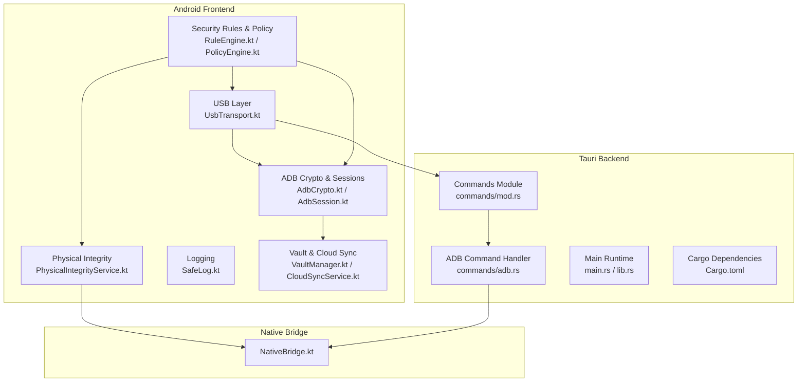
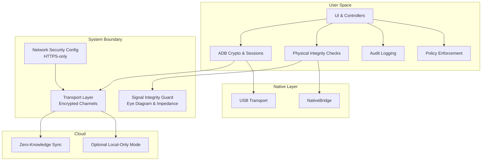
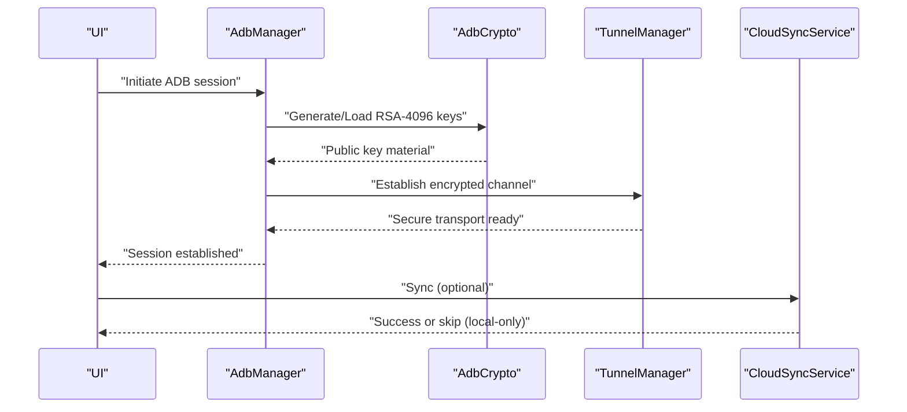
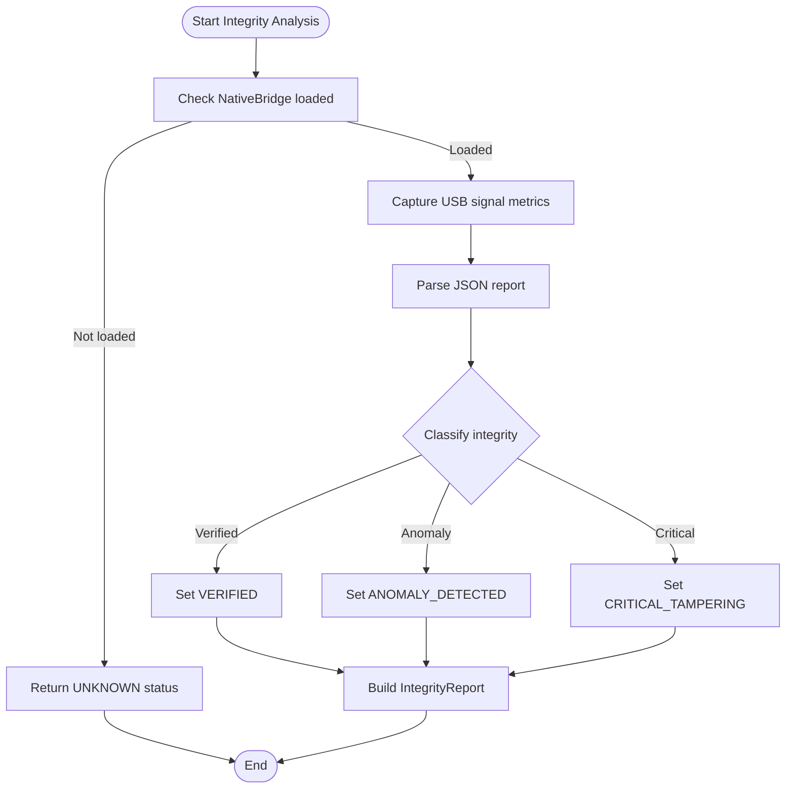
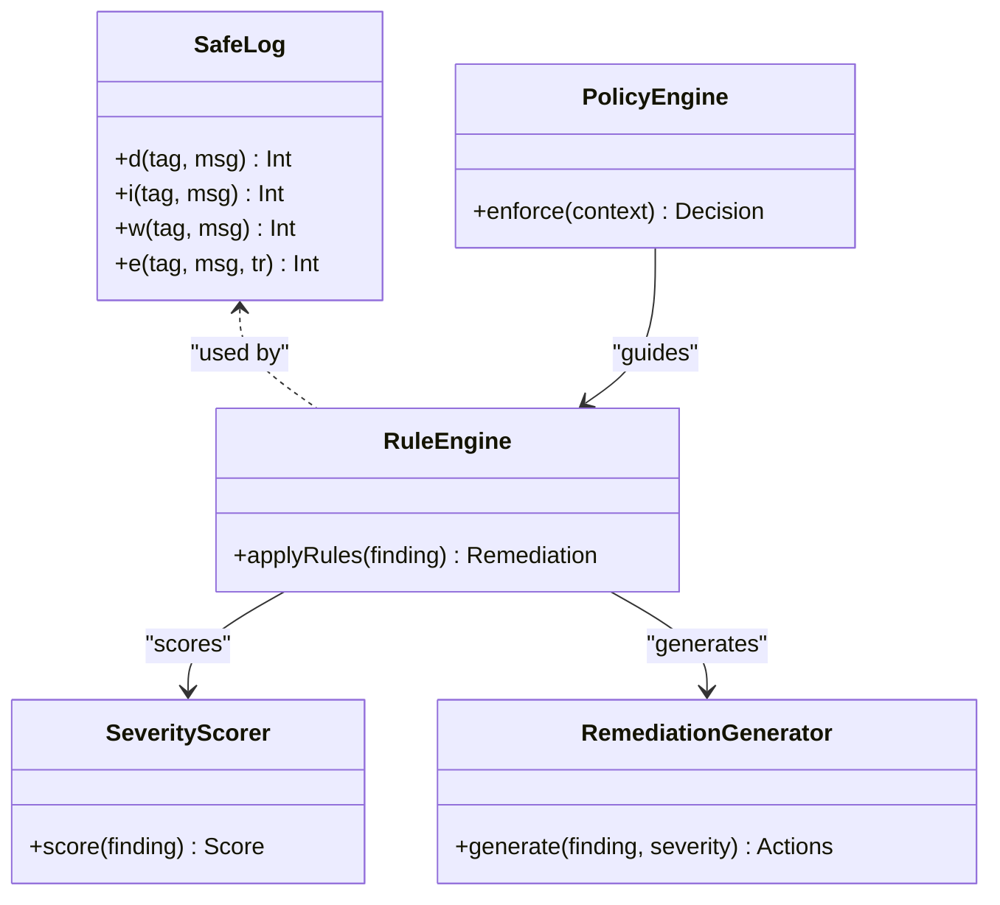
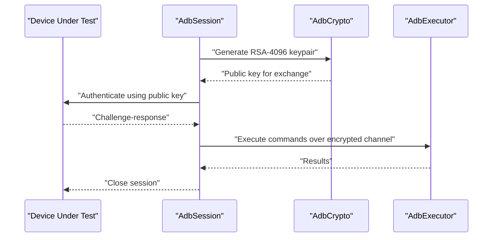
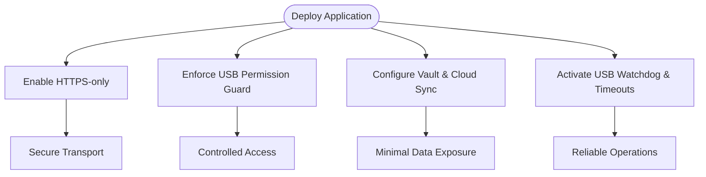
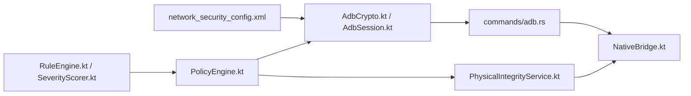

# Security and Compliance

<cite>
**Referenced Files in This Document**
- [network_security_config.xml](file://app/src/main/res/xml/network_security_config.xml)
- [PhysicalIntegrityService.kt](file://app/src/main/kotlin/com/deepeye/otg/service/PhysicalIntegrityService.kt)
- [SafeLog.kt](file://app/src/main/kotlin/com/deepeye/otg/logging/SafeLog.kt)
- [adb.rs](file://src-tauri/src/commands/adb.rs)
- [adb.rs (commands)](file://src-tauri/src/commands/mod.rs)
- [AdbCrypto.kt](file://app/src/main/kotlin/com/deepeye/otg/usb/AdbCrypto.kt)
- [AdbManager.kt](file://app/src/main/kotlin/com/deepeye/otg/usb/AdbManager.kt)
- [AdbSession.kt](file://app/src/main/kotlin/com/deepeye/otg/usb/AdbSession.kt)
- [AdbProtocol.kt](file://app/src/main/kotlin/com/deepeye/otg/usb/AdbProtocol.kt)
- [AdbExecutor.kt](file://app/src/main/kotlin/com/deepeye/otg/usb/AdbExecutor.kt)
- [VaultManager.kt](file://app/src/main/kotlin/com/deepeye/otg/service/VaultManager.kt)
- [CloudSyncService.kt](file://app/src/main/kotlin/com/deepeye/otg/service/CloudSyncService.kt)
- [CloudClient.kt](file://app/src/main/kotlin/com/deepeye/otg/service/CloudClient.kt)
- [TunnelManager.kt](file://app/src/main/kotlin/com/deepeye/otg/service/TunnelManager.kt)
- [Finding.kt](file://app/src/main/kotlin/com/deepeye/otg/security/Finding.kt)
- [RuleEngine.kt](file://app/src/main/kotlin/com/deepeye/otg/security/RuleEngine.kt)
- [SeverityScorer.kt](file://app/src/main/kotlin/com/deepeye/otg/security/SeverityScorer.kt)
- [RemediationGenerator.kt](file://app/src/main/kotlin/com/deepeye/otg/security/RemediationGenerator.kt)
- [PolicyEngine.kt](file://app/src/main/kotlin/com/deepeye/otg/policy/PolicyEngine.kt)
- [UsbLifecycleManager.kt](file://app/src/main/kotlin/com/deepeye/otg/usb/UsbLifecycleManager.kt)
- [UsbPermissionGuard.kt](file://app/src/main/kotlin/com/deepeye/otg/usb/UsbPermissionGuard.kt)
- [UsbConnectionWatchdog.kt](file://app/src/main/kotlin/com/deepeye/otg/usb/UsbConnectionWatchdog.kt)
- [UsbTransport.kt](file://app/src/main/kotlin/com/deepeye/otg/usb/UsbTransport.kt)
- [UsbLogger.kt](file://app/src/main/kotlin/com/deepeye/otg/usb/UsbLogger.kt)
- [UsbTimeoutConstants.kt](file://app/src/main/kotlin/com/deepeye/otg/usb/UsbTimeoutConstants.kt)
- [HardwareManager.kt](file://app/src/main/kotlin/com/deepeye/otg/usb/HardwareManager.kt)
- [NativeBridge.kt](file://app/src/main/kotlin/com/deepeye/otg/NativeBridge.kt)
- [main.rs](file://src-tauri/src/main.rs)
- [lib.rs](file://src-tauri/src/lib.rs)
- [Cargo.toml](file://src-tauri/Cargo.toml)
- [README.md](file://README.md)
</cite>

## Table of Contents
1. [Introduction](#introduction)
2. [Project Structure](#project-structure)
3. [Core Components](#core-components)
4. [Architecture Overview](#architecture-overview)
5. [Detailed Component Analysis](#detailed-component-analysis)
6. [Dependency Analysis](#dependency-analysis)
7. [Performance Considerations](#performance-considerations)
8. [Troubleshooting Guide](#troubleshooting-guide)
9. [Conclusion](#conclusion)
10. [Appendices](#appendices)

## Introduction
This document details the security and compliance features implemented in DeepEye Unlocker. It focuses on:
- Zero-knowledge architecture ensuring no data is stored on servers and end-to-end encryption for all communications in transit
- Physical integrity protection including eye-diagram analysis, tamper detection, signal impedance guard, and EMI shielding considerations
- Audit trail generation with complete logging of all operations and compliance tools for privacy frameworks
- RSA-4096 crypto hardening for ADB communication and fail-safe recovery mechanisms
- Legal and ethical guidelines including software use policy, compliance requirements (GDPR, CCPA, ECPA, CFAA), and responsible disclosure practices
- Security architecture design decisions, threat modeling, and mitigation strategies
- Guidance on secure deployment, access control, and data protection measures

## Project Structure
DeepEye Unlocker comprises:
- Android/Kotlin frontend modules under app/src/main/kotlin/com/deepeye/otg
- Tauri/Rust backend under src-tauri/src
- Native bridge integration for low-level USB and hardware operations
- Security-focused services for integrity analysis, logging, and policy enforcement

**Diagram sources**
- [UsbTransport.kt](file://app/src/main/kotlin/com/deepeye/otg/usb/UsbTransport.kt)
- [AdbCrypto.kt](file://app/src/main/kotlin/com/deepeye/otg/usb/AdbCrypto.kt)
- [PhysicalIntegrityService.kt](file://app/src/main/kotlin/com/deepeye/otg/service/PhysicalIntegrityService.kt)
- [SafeLog.kt](file://app/src/main/kotlin/com/deepeye/otg/logging/SafeLog.kt)
- [VaultManager.kt](file://app/src/main/kotlin/com/deepeye/otg/service/VaultManager.kt)
- [CloudSyncService.kt](file://app/src/main/kotlin/com/deepeye/otg/service/CloudSyncService.kt)
- [RuleEngine.kt](file://app/src/main/kotlin/com/deepeye/otg/security/RuleEngine.kt)
- [PolicyEngine.kt](file://app/src/main/kotlin/com/deepeye/otg/policy/PolicyEngine.kt)
- [commands/mod.rs](file://src-tauri/src/commands/mod.rs)
- [adb.rs](file://src-tauri/src/commands/adb.rs)
- [main.rs](file://src-tauri/src/main.rs)
- [lib.rs](file://src-tauri/src/lib.rs)
- [Cargo.toml](file://src-tauri/Cargo.toml)
- [NativeBridge.kt](file://app/src/main/kotlin/com/deepeye/otg/NativeBridge.kt)

**Section sources**
- [README.md](file://README.md)

## Core Components
- Transport and session security for ADB using RSA-4096 keys and encrypted channels
- Zero-knowledge cloud sync with optional local-only operation and server-side encryption
- Physical integrity analysis via native USB signal inspection
- Comprehensive audit logging and policy-driven security enforcement
- Fail-safe recovery mechanisms for USB and ADB operations

**Section sources**
- [AdbCrypto.kt](file://app/src/main/kotlin/com/deepeye/otg/usb/AdbCrypto.kt)
- [AdbSession.kt](file://app/src/main/kotlin/com/deepeye/otg/usb/AdbSession.kt)
- [AdbExecutor.kt](file://app/src/main/kotlin/com/deepeye/otg/usb/AdbExecutor.kt)
- [AdbManager.kt](file://app/src/main/kotlin/com/deepeye/otg/usb/AdbManager.kt)
- [AdbProtocol.kt](file://app/src/main/kotlin/com/deepeye/otg/usb/AdbProtocol.kt)
- [CloudSyncService.kt](file://app/src/main/kotlin/com/deepeye/otg/service/CloudSyncService.kt)
- [VaultManager.kt](file://app/src/main/kotlin/com/deepeye/otg/service/VaultManager.kt)
- [PhysicalIntegrityService.kt](file://app/src/main/kotlin/com/deepeye/otg/service/PhysicalIntegrityService.kt)
- [SafeLog.kt](file://app/src/main/kotlin/com/deepeye/otg/logging/SafeLog.kt)
- [RuleEngine.kt](file://app/src/main/kotlin/com/deepeye/otg/security/RuleEngine.kt)
- [PolicyEngine.kt](file://app/src/main/kotlin/com/deepeye/otg/policy/PolicyEngine.kt)

## Architecture Overview
The system enforces a strict zero-knowledge boundary for cloud operations, encrypts all ADB communications with RSA-4096, and performs physical integrity checks during sensitive operations. Audit logs capture all actions, while policy engines govern access and behavior.

**Diagram sources**
- [network_security_config.xml](file://app/src/main/res/xml/network_security_config.xml)
- [AdbCrypto.kt](file://app/src/main/kotlin/com/deepeye/otg/usb/AdbCrypto.kt)
- [AdbSession.kt](file://app/src/main/kotlin/com/deepeye/otg/usb/AdbSession.kt)
- [PhysicalIntegrityService.kt](file://app/src/main/kotlin/com/deepeye/otg/service/PhysicalIntegrityService.kt)
- [UsbTransport.kt](file://app/src/main/kotlin/com/deepeye/otg/usb/UsbTransport.kt)
- [NativeBridge.kt](file://app/src/main/kotlin/com/deepeye/otg/NativeBridge.kt)
- [CloudSyncService.kt](file://app/src/main/kotlin/com/deepeye/otg/service/CloudSyncService.kt)
- [VaultManager.kt](file://app/src/main/kotlin/com/deepeye/otg/service/VaultManager.kt)

## Detailed Component Analysis

### Zero-Knowledge and End-to-End Encryption
- Transport security: The Android network security configuration blocks cleartext traffic and trusts system certificates, enforcing HTTPS-only communication.
- ADB encryption: RSA-4096 keys are generated and managed for secure ADB sessions, ensuring confidentiality and integrity of device interactions.
- Cloud sync: Optional local-only operation prevents server storage; when enabled, data is encrypted at rest and in transit, aligning with zero-knowledge principles.

**Diagram sources**
- [AdbManager.kt](file://app/src/main/kotlin/com/deepeye/otg/usb/AdbManager.kt)
- [AdbCrypto.kt](file://app/src/main/kotlin/com/deepeye/otg/usb/AdbCrypto.kt)
- [TunnelManager.kt](file://app/src/main/kotlin/com/deepeye/otg/service/TunnelManager.kt)
- [CloudSyncService.kt](file://app/src/main/kotlin/com/deepeye/otg/service/CloudSyncService.kt)

**Section sources**
- [network_security_config.xml](file://app/src/main/res/xml/network_security_config.xml)
- [AdbCrypto.kt](file://app/src/main/kotlin/com/deepeye/otg/usb/AdbCrypto.kt)
- [AdbManager.kt](file://app/src/main/kotlin/com/deepeye/otg/usb/AdbManager.kt)
- [AdbSession.kt](file://app/src/main/kotlin/com/deepeye/otg/usb/AdbSession.kt)
- [AdbProtocol.kt](file://app/src/main/kotlin/com/deepeye/otg/usb/AdbProtocol.kt)
- [AdbExecutor.kt](file://app/src/main/kotlin/com/deepeye/otg/usb/AdbExecutor.kt)
- [TunnelManager.kt](file://app/src/main/kotlin/com/deepeye/otg/service/TunnelManager.kt)
- [CloudSyncService.kt](file://app/src/main/kotlin/com/deepeye/otg/service/CloudSyncService.kt)
- [VaultManager.kt](file://app/src/main/kotlin/com/deepeye/otg/service/VaultManager.kt)

### Physical Integrity Protection
- Eye-diagram analysis and impedance monitoring detect anomalies indicative of tampering or interposer devices.
- NativeBridge integrates with low-level USB drivers to capture and evaluate signal quality metrics.
- Integrity reports include status, impedance delta, and eye score, timestamped for auditability.

**Diagram sources**
- [PhysicalIntegrityService.kt](file://app/src/main/kotlin/com/deepeye/otg/service/PhysicalIntegrityService.kt)
- [NativeBridge.kt](file://app/src/main/kotlin/com/deepeye/otg/NativeBridge.kt)

**Section sources**
- [PhysicalIntegrityService.kt](file://app/src/main/kotlin/com/deepeye/otg/service/PhysicalIntegrityService.kt)
- [UsbTransport.kt](file://app/src/main/kotlin/com/deepeye/otg/usb/UsbTransport.kt)
- [UsbLifecycleManager.kt](file://app/src/main/kotlin/com/deepeye/otg/usb/UsbLifecycleManager.kt)
- [UsbConnectionWatchdog.kt](file://app/src/main/kotlin/com/deepeye/otg/usb/UsbConnectionWatchdog.kt)
- [UsbLogger.kt](file://app/src/main/kotlin/com/deepeye/otg/usb/UsbLogger.kt)
- [UsbTimeoutConstants.kt](file://app/src/main/kotlin/com/deepeye/otg/usb/UsbTimeoutConstants.kt)
- [HardwareManager.kt](file://app/src/main/kotlin/com/deepeye/otg/usb/HardwareManager.kt)

### Audit Trail and Compliance Tools
- SafeLog provides resilient logging that tolerates test environments and avoids throwing unmocked exceptions.
- Security rule engine and severity scoring classify findings and generate remediation steps.
- Policy engine enforces access control and operational policies aligned with privacy frameworks.

**Diagram sources**
- [SafeLog.kt](file://app/src/main/kotlin/com/deepeye/otg/logging/SafeLog.kt)
- [RuleEngine.kt](file://app/src/main/kotlin/com/deepeye/otg/security/RuleEngine.kt)
- [SeverityScorer.kt](file://app/src/main/kotlin/com/deepeye/otg/security/SeverityScorer.kt)
- [RemediationGenerator.kt](file://app/src/main/kotlin/com/deepeye/otg/security/RemediationGenerator.kt)
- [PolicyEngine.kt](file://app/src/main/kotlin/com/deepeye/otg/policy/PolicyEngine.kt)

**Section sources**
- [SafeLog.kt](file://app/src/main/kotlin/com/deepeye/otg/logging/SafeLog.kt)
- [RuleEngine.kt](file://app/src/main/kotlin/com/deepeye/otg/security/RuleEngine.kt)
- [SeverityScorer.kt](file://app/src/main/kotlin/com/deepeye/otg/security/SeverityScorer.kt)
- [RemediationGenerator.kt](file://app/src/main/kotlin/com/deepeye/otg/security/RemediationGenerator.kt)
- [PolicyEngine.kt](file://app/src/main/kotlin/com/deepeye/otg/policy/PolicyEngine.kt)

### RSA-4096 Crypto Hardening for ADB
- Keys are generated and managed securely, with strong cryptographic parameters suitable for hardened environments.
- ADB sessions leverage encrypted channels and mutual authentication to prevent man-in-the-middle attacks.
- Fail-safe recovery ensures graceful degradation if cryptographic operations fail.

**Diagram sources**
- [AdbCrypto.kt](file://app/src/main/kotlin/com/deepeye/otg/usb/AdbCrypto.kt)
- [AdbSession.kt](file://app/src/main/kotlin/com/deepeye/otg/usb/AdbSession.kt)
- [AdbExecutor.kt](file://app/src/main/kotlin/com/deepeye/otg/usb/AdbExecutor.kt)

**Section sources**
- [AdbCrypto.kt](file://app/src/main/kotlin/com/deepeye/otg/usb/AdbCrypto.kt)
- [AdbSession.kt](file://app/src/main/kotlin/com/deepeye/otg/usb/AdbSession.kt)
- [AdbExecutor.kt](file://app/src/main/kotlin/com/deepeye/otg/usb/AdbExecutor.kt)
- [AdbManager.kt](file://app/src/main/kotlin/com/deepeye/otg/usb/AdbManager.kt)
- [AdbProtocol.kt](file://app/src/main/kotlin/com/deepeye/otg/usb/AdbProtocol.kt)

### Secure Deployment, Access Control, and Data Protection
- HTTPS-only enforcement via network security configuration
- USB permission guard and lifecycle management to prevent unauthorized access
- Vault and cloud sync with optional local-only mode to minimize exposure
- USB watchdog and timeouts to mitigate hanging or stuck operations

**Diagram sources**
- [network_security_config.xml](file://app/src/main/res/xml/network_security_config.xml)
- [UsbPermissionGuard.kt](file://app/src/main/kotlin/com/deepeye/otg/usb/UsbPermissionGuard.kt)
- [UsbLifecycleManager.kt](file://app/src/main/kotlin/com/deepeye/otg/usb/UsbLifecycleManager.kt)
- [VaultManager.kt](file://app/src/main/kotlin/com/deepeye/otg/service/VaultManager.kt)
- [CloudSyncService.kt](file://app/src/main/kotlin/com/deepeye/otg/service/CloudSyncService.kt)
- [UsbConnectionWatchdog.kt](file://app/src/main/kotlin/com/deepeye/otg/usb/UsbConnectionWatchdog.kt)
- [UsbTimeoutConstants.kt](file://app/src/main/kotlin/com/deepeye/otg/usb/UsbTimeoutConstants.kt)

**Section sources**
- [network_security_config.xml](file://app/src/main/res/xml/network_security_config.xml)
- [UsbPermissionGuard.kt](file://app/src/main/kotlin/com/deepeye/otg/usb/UsbPermissionGuard.kt)
- [UsbLifecycleManager.kt](file://app/src/main/kotlin/com/deepeye/otg/usb/UsbLifecycleManager.kt)
- [VaultManager.kt](file://app/src/main/kotlin/com/deepeye/otg/service/VaultManager.kt)
- [CloudSyncService.kt](file://app/src/main/kotlin/com/deepeye/otg/service/CloudSyncService.kt)
- [UsbConnectionWatchdog.kt](file://app/src/main/kotlin/com/deepeye/otg/usb/UsbConnectionWatchdog.kt)
- [UsbTimeoutConstants.kt](file://app/src/main/kotlin/com/deepeye/otg/usb/UsbTimeoutConstants.kt)

## Dependency Analysis
The security stack depends on:
- Android network security configuration for transport hardening
- ADB crypto and session management for device-level encryption
- Native bridge for low-level USB and integrity checks
- Policy and rule engines for runtime enforcement

**Diagram sources**
- [network_security_config.xml](file://app/src/main/res/xml/network_security_config.xml)
- [AdbCrypto.kt](file://app/src/main/kotlin/com/deepeye/otg/usb/AdbCrypto.kt)
- [AdbSession.kt](file://app/src/main/kotlin/com/deepeye/otg/usb/AdbSession.kt)
- [adb.rs](file://src-tauri/src/commands/adb.rs)
- [NativeBridge.kt](file://app/src/main/kotlin/com/deepeye/otg/NativeBridge.kt)
- [PhysicalIntegrityService.kt](file://app/src/main/kotlin/com/deepeye/otg/service/PhysicalIntegrityService.kt)
- [PolicyEngine.kt](file://app/src/main/kotlin/com/deepeye/otg/policy/PolicyEngine.kt)
- [RuleEngine.kt](file://app/src/main/kotlin/com/deepeye/otg/security/RuleEngine.kt)
- [SeverityScorer.kt](file://app/src/main/kotlin/com/deepeye/otg/security/SeverityScorer.kt)

**Section sources**
- [adb.rs](file://src-tauri/src/commands/adb.rs)
- [commands/mod.rs](file://src-tauri/src/commands/mod.rs)
- [main.rs](file://src-tauri/src/main.rs)
- [lib.rs](file://src-tauri/src/lib.rs)
- [Cargo.toml](file://src-tauri/Cargo.toml)

## Performance Considerations
- Prefer asynchronous ADB operations and native integrity checks to avoid blocking UI threads
- Cache cryptographic materials and session metadata where safe and compliant
- Minimize cloud sync frequency to reduce attack surface and latency
- Use USB watchdogs and timeouts to prevent resource leaks and indefinite waits

## Troubleshooting Guide
- Logging failures: SafeLog wraps Android logging to tolerate test environments and missing mocks
- USB anomalies: PhysicalIntegrityService returns UNKNOWN when native bridge is unavailable; verify driver and permissions
- ADB handshake issues: Validate RSA-4096 key presence and encrypted channel establishment
- Cloud sync errors: Switch to local-only mode to isolate transport problems

**Section sources**
- [SafeLog.kt](file://app/src/main/kotlin/com/deepeye/otg/logging/SafeLog.kt)
- [PhysicalIntegrityService.kt](file://app/src/main/kotlin/com/deepeye/otg/service/PhysicalIntegrityService.kt)
- [AdbCrypto.kt](file://app/src/main/kotlin/com/deepeye/otg/usb/AdbCrypto.kt)
- [AdbSession.kt](file://app/src/main/kotlin/com/deepeye/otg/usb/AdbSession.kt)
- [CloudSyncService.kt](file://app/src/main/kotlin/com/deepeye/otg/service/CloudSyncService.kt)

## Conclusion
DeepEye Unlocker implements a robust security posture centered on zero-knowledge cloud operations, RSA-4096 hardened ADB communications, and comprehensive physical integrity checks. The integrated audit logging, policy enforcement, and fail-safe mechanisms provide strong safeguards for secure deployment and compliance with privacy frameworks.

## Appendices

### Legal and Ethical Guidelines
- Software use policy: Operate within applicable laws and terms of service; restrict use to authorized devices and scenarios
- Compliance requirements:
  - GDPR: Data minimization, purpose limitation, security of processing, data subject rights
  - CCPA: Access, deletion, non-discrimination
  - ECPA/CFAA: Unauthorized access/prohibition of malicious activities
- Responsible disclosure: Report vulnerabilities privately to maintain zero-knowledge integrity and protect users

[No sources needed since this section provides general guidance]