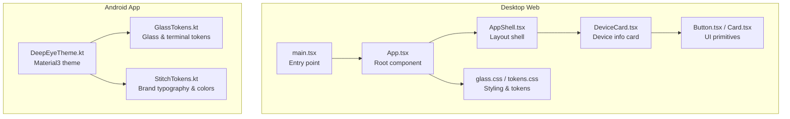
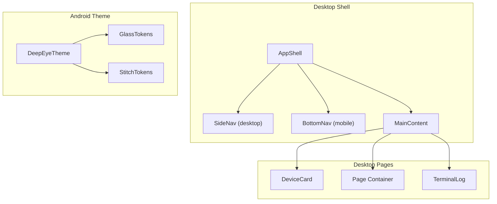
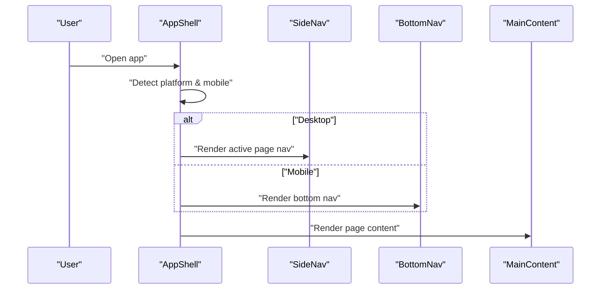
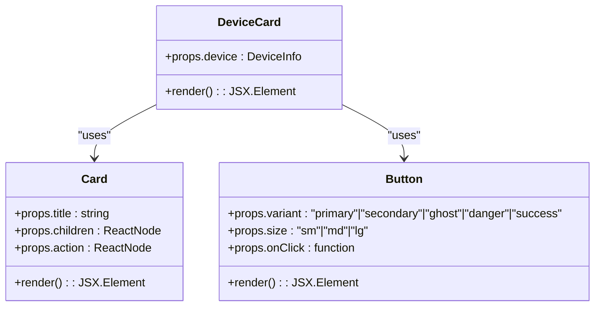
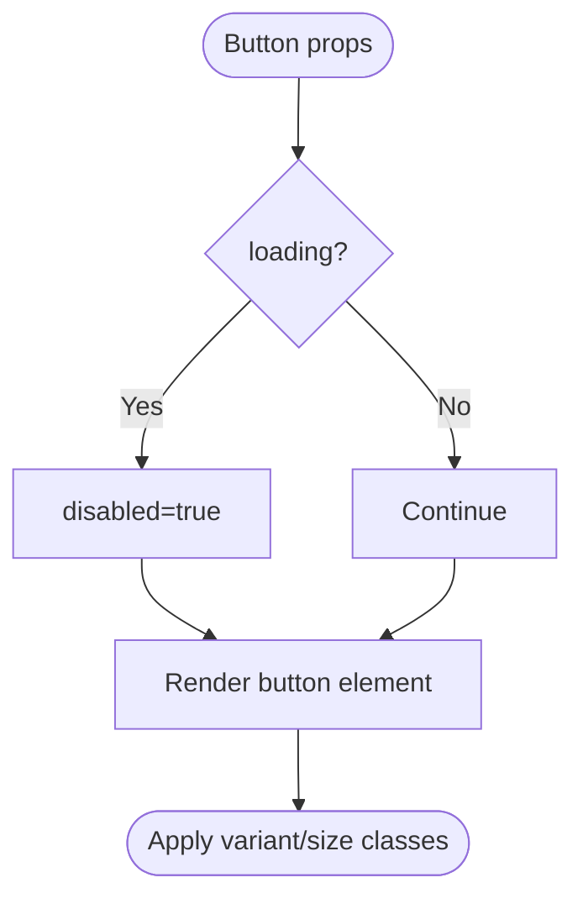
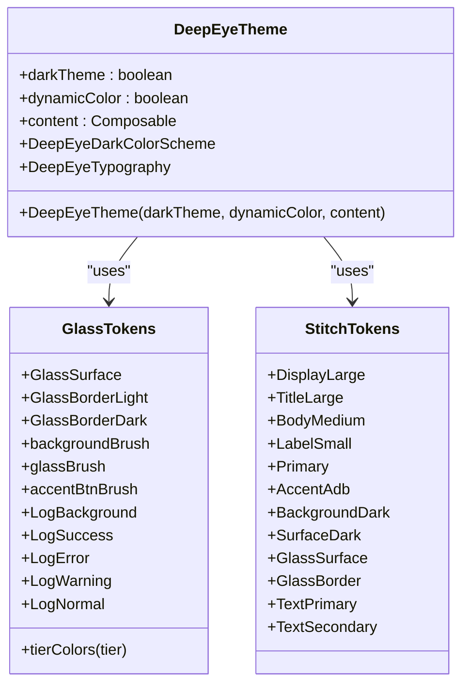
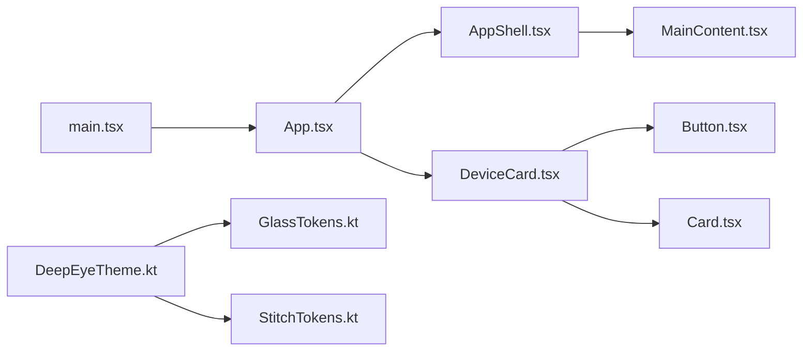

# User Interface

<cite>
**Referenced Files in This Document**
- [App.tsx](file://src/App.tsx)
- [main.tsx](file://src/main.tsx)
- [glass.css](file://src/styles/glass.css)
- [tokens.css](file://src/styles/tokens.css)
- [AppShell.tsx](file://src/components/Layout/AppShell.tsx)
- [MainContent.tsx](file://src/components/Layout/MainContent.tsx)
- [DeviceCard.tsx](file://src/components/DeviceCard.tsx)
- [Button.tsx](file://src/components/ui/Button.tsx)
- [Card.tsx](file://src/components/ui/Card.tsx)
- [DeepEyeTheme.kt](file://app/src/main/kotlin/com/deepeye/otg/ui/theme/DeepEyeTheme.kt)
- [GlassTokens.kt](file://app/src/main/kotlin/com/deepeye/otg/ui/theme/GlassTokens.kt)
- [StitchTokens.kt](file://app/src/main/kotlin/com/deepeye/otg/ui/theme/StitchTokens.kt)
</cite>

## Table of Contents
1. [Introduction](#introduction)
2. [Project Structure](#project-structure)
3. [Core Components](#core-components)
4. [Architecture Overview](#architecture-overview)
5. [Detailed Component Analysis](#detailed-component-analysis)
6. [Dependency Analysis](#dependency-analysis)
7. [Performance Considerations](#performance-considerations)
8. [Accessibility Compliance](#accessibility-compliance)
9. [Responsive Design](#responsive-design)
10. [Cross-Platform UI Consistency](#cross-platform-ui-consistency)
11. [Component State Management](#component-state-management)
12. [Event Handling and Interaction Patterns](#event-handling-and-interaction-patterns)
13. [UI Customization and Theming Guidelines](#ui-customization-and-theming-guidelines)
14. [Extending the Interface](#extending-the-interface)
15. [Troubleshooting Guide](#troubleshooting-guide)
16. [Conclusion](#conclusion)

## Introduction
This document describes the user interface components of DeepEye Unlocker across both the desktop web application and the Android application. It focuses on the desktop React-based UI with liquid glass design elements, the Android Jetpack Compose UI with a cohesive theme system, and the shared design tokens and component primitives that enable consistent visuals and behavior across platforms. The documentation covers main screen layouts, navigation patterns, component hierarchy, state management, event handling, responsive design, accessibility, and practical guidelines for customization and extension.

## Project Structure
The UI is split into two primary environments:
- Desktop web application: Built with React, styled via CSS modules and design tokens, organized under src/.
- Android application: Built with Jetpack Compose, themed via DeepEyeTheme.kt, GlassTokens.kt, and StitchTokens.kt.

**Diagram sources**
- [main.tsx:1-17](file://src/main.tsx#L1-L17)
- [App.tsx:1-88](file://src/App.tsx#L1-L88)
- [AppShell.tsx:1-31](file://src/components/Layout/AppShell.tsx#L1-L31)
- [DeviceCard.tsx:1-53](file://src/components/DeviceCard.tsx#L1-L53)
- [Button.tsx:1-40](file://src/components/ui/Button.tsx#L1-L40)
- [Card.tsx:1-24](file://src/components/ui/Card.tsx#L1-L24)
- [glass.css:1-125](file://src/styles/glass.css#L1-L125)
- [tokens.css:1-90](file://src/styles/tokens.css#L1-L90)
- [DeepEyeTheme.kt:1-83](file://app/src/main/kotlin/com/deepeye/otg/ui/theme/DeepEyeTheme.kt#L1-L83)
- [GlassTokens.kt:1-71](file://app/src/main/kotlin/com/deepeye/otg/ui/theme/GlassTokens.kt#L1-L71)
- [StitchTokens.kt](file://app/src/main/kotlin/com/deepeye/otg/ui/theme/StitchTokens.kt)

**Section sources**
- [main.tsx:1-17](file://src/main.tsx#L1-L17)
- [App.tsx:1-88](file://src/App.tsx#L1-L88)

## Core Components
- AppShell: Provides adaptive layout with top-level navigation and responsive behavior for desktop and mobile.
- MainContent: Wraps page content for consistent spacing and layout.
- DeviceCard: Displays connected device metadata with status badges and action buttons.
- Button and Card: Reusable primitives for actions and content containers with variants and sizes.
- Theme system: DeepEyeTheme.kt defines a dark-first Material3 theme with brand-aligned colors and typography; GlassTokens.kt and StitchTokens.kt define reusable design tokens for glass surfaces, gradients, and terminal colors.

**Section sources**
- [AppShell.tsx:1-31](file://src/components/Layout/AppShell.tsx#L1-L31)
- [MainContent.tsx:1-7](file://src/components/Layout/MainContent.tsx#L1-L7)
- [DeviceCard.tsx:1-53](file://src/components/DeviceCard.tsx#L1-L53)
- [Button.tsx:1-40](file://src/components/ui/Button.tsx#L1-L40)
- [Card.tsx:1-24](file://src/components/ui/Card.tsx#L1-L24)
- [DeepEyeTheme.kt:1-83](file://app/src/main/kotlin/com/deepeye/otg/ui/theme/DeepEyeTheme.kt#L1-L83)
- [GlassTokens.kt:1-71](file://app/src/main/kotlin/com/deepeye/otg/ui/theme/GlassTokens.kt#L1-L71)
- [StitchTokens.kt](file://app/src/main/kotlin/com/deepeye/otg/ui/theme/StitchTokens.kt)

## Architecture Overview
The desktop UI composes a shell around page content, rendering a device card, a page container, and a terminal log. Navigation is centralized in AppShell, which adapts to desktop (side navigation) and mobile (bottom navigation) contexts. The Android UI composes a theme around Material3 components, applying brand colors and typography while enabling edge-to-edge transparency for immersive glass effects.

**Diagram sources**
- [AppShell.tsx:15-29](file://src/components/Layout/AppShell.tsx#L15-L29)
- [DeviceCard.tsx:33-51](file://src/components/DeviceCard.tsx#L33-L51)
- [DeepEyeTheme.kt:48-82](file://app/src/main/kotlin/com/deepeye/otg/ui/theme/DeepEyeTheme.kt#L48-L82)
- [GlassTokens.kt:6-71](file://app/src/main/kotlin/com/deepeye/otg/ui/theme/GlassTokens.kt#L6-L71)
- [StitchTokens.kt](file://app/src/main/kotlin/com/deepeye/otg/ui/theme/StitchTokens.kt)

## Detailed Component Analysis

### Desktop AppShell and Navigation
AppShell orchestrates responsive navigation:
- Determines platform and mobile state.
- Renders TitleBar on Windows, SideNav on desktop, and BottomNav on mobile.
- Wraps children in MainContent for consistent layout.

**Diagram sources**
- [AppShell.tsx:15-29](file://src/components/Layout/AppShell.tsx#L15-L29)

**Section sources**
- [AppShell.tsx:1-31](file://src/components/Layout/AppShell.tsx#L1-L31)

### DeviceCard Component
DeviceCard displays device metadata and actions:
- Accepts a device object with status, model, serial, OS, mode, bootloader status, and optional carrier.
- Uses Card for structure, StatusBadge for status, and Button variants for actions.
- Renders a grid of labeled fields with optional monospace and highlight styling.

**Diagram sources**
- [DeviceCard.tsx:33-51](file://src/components/DeviceCard.tsx#L33-L51)
- [Card.tsx:10-22](file://src/components/ui/Card.tsx#L10-L22)
- [Button.tsx:17-38](file://src/components/ui/Button.tsx#L17-L38)

**Section sources**
- [DeviceCard.tsx:1-53](file://src/components/DeviceCard.tsx#L1-L53)

### Button Primitive
Button supports multiple variants and sizes, with loading and disabled states:
- Props include variant, size, loading, disabled, icon, and onClick.
- Renders with appropriate CSS classes for styling.

**Diagram sources**
- [Button.tsx:17-38](file://src/components/ui/Button.tsx#L17-L38)

**Section sources**
- [Button.tsx:1-40](file://src/components/ui/Button.tsx#L1-L40)

### Card Primitive
Card provides a flexible container with optional header and action area:
- Supports title, children, and action nodes.
- Encapsulates consistent spacing and layout.

**Section sources**
- [Card.tsx:1-24](file://src/components/ui/Card.tsx#L1-L24)

### Android Theme System
DeepEyeTheme composes a dark-first Material3 theme:
- Defines a custom dark color scheme using brand tokens from StitchTokens and GlassTokens.
- Applies typography from StitchTokens.
- Enables edge-to-edge transparency and light-status-bar appearance for immersive glass backgrounds.
- Forces a dark theme for consistent security tool aesthetics.

**Diagram sources**
- [DeepEyeTheme.kt:14-46](file://app/src/main/kotlin/com/deepeye/otg/ui/theme/DeepEyeTheme.kt#L14-L46)
- [DeepEyeTheme.kt:48-82](file://app/src/main/kotlin/com/deepeye/otg/ui/theme/DeepEyeTheme.kt#L48-L82)
- [GlassTokens.kt:6-71](file://app/src/main/kotlin/com/deepeye/otg/ui/theme/GlassTokens.kt#L6-L71)
- [StitchTokens.kt](file://app/src/main/kotlin/com/deepeye/otg/ui/theme/StitchTokens.kt)

**Section sources**
- [DeepEyeTheme.kt:1-83](file://app/src/main/kotlin/com/deepeye/otg/ui/theme/DeepEyeTheme.kt#L1-L83)
- [GlassTokens.kt:1-71](file://app/src/main/kotlin/com/deepeye/otg/ui/theme/GlassTokens.kt#L1-L71)

## Dependency Analysis
Desktop dependencies:
- main.tsx initializes platform and renders App.
- App.tsx composes AppShell, DeviceCard, and TerminalLog.
- AppShell depends on platform detection to choose navigation.
- DeviceCard composes Card and Button.

Android dependencies:
- DeepEyeTheme depends on GlassTokens and StitchTokens for color and typography.
- GlassTokens provides reusable brushes and terminal colors.
- StitchTokens defines brand typography and semantic colors.

**Diagram sources**
- [main.tsx:1-17](file://src/main.tsx#L1-L17)
- [App.tsx:1-88](file://src/App.tsx#L1-L88)
- [AppShell.tsx:1-31](file://src/components/Layout/AppShell.tsx#L1-L31)
- [MainContent.tsx:1-7](file://src/components/Layout/MainContent.tsx#L1-L7)
- [DeviceCard.tsx:1-53](file://src/components/DeviceCard.tsx#L1-L53)
- [Button.tsx:1-40](file://src/components/ui/Button.tsx#L1-L40)
- [Card.tsx:1-24](file://src/components/ui/Card.tsx#L1-L24)
- [DeepEyeTheme.kt:1-83](file://app/src/main/kotlin/com/deepeye/otg/ui/theme/DeepEyeTheme.kt#L1-L83)
- [GlassTokens.kt:1-71](file://app/src/main/kotlin/com/deepeye/otg/ui/theme/GlassTokens.kt#L1-L71)
- [StitchTokens.kt](file://app/src/main/kotlin/com/deepeye/otg/ui/theme/StitchTokens.kt)

**Section sources**
- [main.tsx:1-17](file://src/main.tsx#L1-L17)
- [App.tsx:1-88](file://src/App.tsx#L1-L88)
- [DeepEyeTheme.kt:1-83](file://app/src/main/kotlin/com/deepeye/otg/ui/theme/DeepEyeTheme.kt#L1-L83)

## Performance Considerations
- Prefer pre-allocated brushes in GlassTokens for performance-safe gradient rendering.
- Use memoization for static terminal logs in App.tsx to avoid unnecessary re-renders.
- Minimize heavy animations in glass hover states; leverage CSS transitions for smoothness.
- On Android, defer edge-to-edge setup to SideEffect to prevent recomposition overhead.

## Accessibility Compliance
- Ensure sufficient color contrast for text and interactive elements against dark backgrounds.
- Provide focus indicators for keyboard navigation in buttons and cards.
- Use semantic HTML and ARIA attributes where applicable in desktop components.
- Maintain readable font sizes and line heights defined by tokens.

## Responsive Design
- AppShell switches navigation based on mobile detection.
- tokens.css adjusts layout tokens for macOS, Windows, and mobile platforms.
- glass.css applies backdrop blur and transitions suitable for glass surfaces across devices.

**Section sources**
- [AppShell.tsx:16-17](file://src/components/Layout/AppShell.tsx#L16-L17)
- [tokens.css:63-88](file://src/styles/tokens.css#L63-L88)
- [glass.css:14-26](file://src/styles/glass.css#L14-L26)

## Cross-Platform UI Consistency
- Desktop: Use tokens.css for consistent spacing, typography, and shadows; glass.css for glass surfaces.
- Android: DeepEyeTheme centralizes color and typography; GlassTokens and StitchTokens unify visual language.
- Shared primitives (Button, Card) reduce duplication and maintain parity.

**Section sources**
- [tokens.css:1-90](file://src/styles/tokens.css#L1-L90)
- [glass.css:1-125](file://src/styles/glass.css#L1-L125)
- [DeepEyeTheme.kt:48-82](file://app/src/main/kotlin/com/deepeye/otg/ui/theme/DeepEyeTheme.kt#L48-L82)

## Component State Management
- App.tsx manages current page state and passes navigation callbacks to AppShell.
- DeviceCard receives device props; consider lifting state for dynamic updates.
- Buttons support disabled/loading states to reflect async operations.

**Section sources**
- [App.tsx:48-61](file://src/App.tsx#L48-L61)
- [DeviceCard.tsx:33-51](file://src/components/DeviceCard.tsx#L33-L51)
- [Button.tsx:17-38](file://src/components/ui/Button.tsx#L17-L38)

## Event Handling and Interaction Patterns
- Navigation events propagate from AppShell to update the active page.
- Button onClick handlers trigger actions; loading/disabled states prevent concurrent operations.
- Mobile vs desktop navigation adapts to platform-specific affordances.

**Section sources**
- [AppShell.tsx:15-29](file://src/components/Layout/AppShell.tsx#L15-L29)
- [Button.tsx:23-32](file://src/components/ui/Button.tsx#L23-L32)

## UI Customization and Theming Guidelines
- Desktop:
  - Modify tokens.css to adjust brand colors, spacings, radii, and platform-specific overrides.
  - Extend glass.css for additional glass components or hover effects.
- Android:
  - Adjust DeepEyeTheme colorScheme and typography to reflect new brand directions.
  - Add new palette entries to GlassTokens and corresponding usages in Composables.
  - Update StitchTokens for typography and semantic colors.

**Section sources**
- [tokens.css:1-90](file://src/styles/tokens.css#L1-L90)
- [glass.css:1-125](file://src/styles/glass.css#L1-L125)
- [DeepEyeTheme.kt:14-46](file://app/src/main/kotlin/com/deepeye/otg/ui/theme/DeepEyeTheme.kt#L14-L46)
- [GlassTokens.kt:6-71](file://app/src/main/kotlin/com/deepeye/otg/ui/theme/GlassTokens.kt#L6-L71)
- [StitchTokens.kt](file://app/src/main/kotlin/com/deepeye/otg/ui/theme/StitchTokens.kt)

## Extending the Interface
- Add new pages by creating components and registering them in App.tsx navigation map.
- Introduce new primitive components following Button/Card patterns for consistency.
- For Android, create new screens and compose them within DeepEyeTheme.
- Maintain token-driven styling to preserve visual coherence.

**Section sources**
- [App.tsx:26-46](file://src/App.tsx#L26-L46)
- [Button.tsx:17-38](file://src/components/ui/Button.tsx#L17-L38)
- [Card.tsx:10-22](file://src/components/ui/Card.tsx#L10-L22)
- [DeepEyeTheme.kt:48-82](file://app/src/main/kotlin/com/deepeye/otg/ui/theme/DeepEyeTheme.kt#L48-L82)

## Troubleshooting Guide
- Navigation not switching pages:
  - Verify onNavigate callback is passed to AppShell and active state is updated.
- Glass effects not visible:
  - Confirm backdrop-filter support and CSS variables are applied in glass.css.
- Android edge-to-edge not working:
  - Ensure SideEffect executes and window transparency is set in DeepEyeTheme.
- Button states not updating:
  - Check loading/disabled prop logic and event handler wiring.

**Section sources**
- [AppShell.tsx:15-29](file://src/components/Layout/AppShell.tsx#L15-L29)
- [glass.css:14-26](file://src/styles/glass.css#L14-L26)
- [DeepEyeTheme.kt:57-68](file://app/src/main/kotlin/com/deepeye/otg/ui/theme/DeepEyeTheme.kt#L57-L68)
- [Button.tsx:23-32](file://src/components/ui/Button.tsx#L23-L32)

## Conclusion
DeepEye Unlocker’s UI combines a modern, liquid glass desktop experience with a cohesive Android theme system. The desktop relies on a shell-based layout, reusable primitives, and design tokens for consistency, while Android leverages Material3 with brand-aligned tokens for immersive, edge-to-edge visuals. By following the provided patterns and guidelines, teams can extend functionality while preserving visual coherence and responsiveness across platforms.