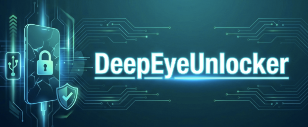

# DeepEyeUnlocker v1.1.0 "Gold"



[](https://github.com/yourusername/DeepEyeUnlocker/actions/workflows/build.yml)
[](https://github.com/yourusername/DeepEyeUnlocker/releases)
[](https://opensource.org/licenses/MIT)

## 🔷 Professional Mobile Repair. For Free. Forever

DeepEyeUnlocker is a free, open-source alternative to expensive mobile repair boxes. It provides enterprise-grade device unlocking, firmware management, and diagnostic tools.

---

## ✨ Features

### Core Operations

- **Device Detection:** Reactive USB discovery with WMI event-based detection
- **Device Info Read:** Brand, model, IMEI, bootloader status, Android version
- **Firmware Backup:** Streaming partition backup (supports 100GB+ devices)
- **Firmware Flash:** Write firmware via Qualcomm Firehose / MTK DA / Samsung Odin
- **Factory Reset / Format:** Erase userdata + cache partitions
- **FRP Bypass:** Factory Reset Protection removal (QC + MTK)
- **Pattern/PIN Removal:** Lock clearing without data loss

### v1.1.0 Highlights

- **🛡️ Cloak Center:** Advanced root & developer mode hiding (Shamiko/Zygisk optimization)
- **📱 Device Info Center:** Deep hardware diagnostics and security lifecycle telemetry
- **🔧 ADB Tools Center:** Integrated app management and input simulation
- **🔐 Lock & FRP Center:** Unified diagnostics for screen and account locks
- **MainForm 2.0:** Tabbed interface with reactive device context synchronization
- **Multi-Language:** First-class support for English and Hindi technicians
- **Error Hints:** Actionable recovery steps for over 50+ common protocol errors

---

## 📱 Supported Chipsets

| Platform                | Mode             | Protocol           |
|-------------------------|------------------|--------------------|
| **Qualcomm Snapdragon** | EDL 9008         | Sahara + Firehose  |
| **MediaTek (MTK)**      | BROM / Preloader | MTK Download Agent |
| **Samsung Exynos/QC**   | Download Mode    | Odin / Loke        |
| **Generic Android**     | Fastboot / ADB   | Standard Commands  |

---

## 🏗️ Architecture

DeepEyeUnlocker v1.1.0 follows a **Clean Layered Architecture**:

```text
┌─────────────────────────────────────────┐
│              UI Layer                   │
│         (WinForms / MainForm)           │
├─────────────────────────────────────────┤
│           Operations Layer              │
│   (DeviceInfo, Backup, Flash, FRP)      │
├─────────────────────────────────────────┤
│            Core Domain                  │
│  (DeviceContext, Profiles, Resources)   │
├─────────────────────────────────────────┤
│         Protocol Engines                │
│   (Qualcomm, MTK, Samsung, ADB)         │
├─────────────────────────────────────────┤
│          Infrastructure                 │
│    (USB, Logging, Cloud, Drivers)       │
└─────────────────────────────────────────┘
```

---

## 🛠️ Tech Stack

- **Language:** C# (.NET 8.0)
- **UI Framework:** Windows Forms
- **USB:** LibUsbDotNet + WMI Event Watcher
- **Serialization:** Newtonsoft.Json
- **Database:** SQLite (History), JSON (Profiles)
- **CI/CD:** GitHub Actions

---

## 🚀 Quick Start

### Prerequisites

- Windows 10/11
- .NET 8.0 Runtime
- USB Drivers (auto-installed via Driver Center)

### Build from Source

```powershell
git clone https://github.com/yourusername/DeepEyeUnlocker.git
cd DeepEyeUnlocker
.\scripts\setup-dev.ps1
.\scripts\build.ps1
```

### Run

```powershell
.\artifacts\portable\DeepEyeUnlocker.exe
```

---

## 📂 Project Structure

```text
DeepEyeUnlocker/
├── src/
│   ├── Core/           # Domain models, managers
│   ├── Operations/     # Business logic operations
│   ├── Protocols/      # Chipset-specific engines
│   ├── Infrastructure/ # USB, Logging, Cloud
│   └── UI/             # WinForms components
├── assets/             # Profiles.json, resources
├── tests/              # Unit & integration tests
├── docs/               # Documentation
└── scripts/            # Build & setup automation
```

---

## 🤝 Contributing

1. Fork the repository
2. Create a feature branch (`git checkout -b feature/amazing-feature`)
3. Commit your changes (`git commit -m 'feat: add amazing feature'`)
4. Push to the branch (`git push origin feature/amazing-feature`)
5. Open a Pull Request

---

## ⚖️ Legal

This tool is provided for **educational purposes** and for use on devices you legally own. Users are responsible for compliance with local laws regarding IMEI modification and device unlocking.

See [docs/LEGAL.md](docs/LEGAL.md) for full disclaimer.

---

## 📄 License

MIT License - See [LICENSE](LICENSE) for details.

---

### Built with ❤️ by the DeepEyeUnlocker Community
