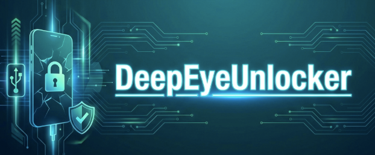

# DeepEye Unlocker v2026.1

> Universal Power. Precision Control. Zero Latency.



[](https://github.com/DeepEyeCrypto/DeepEyeUnlocker/releases/latest)
[](https://github.com/DeepEyeCrypto/DeepEyeUnlocker/actions/workflows/build.yml)
[-green.svg)](https://github.com/DeepEyeCrypto/DeepEyeUnlocker)
[](https://github.com/DeepEyeCrypto/DeepEyeUnlocker)

---

## 🔷 Professional Mobile Repair — Reimagined for Android

DeepEye Unlocker is a high-performance Android application designed for mobile technicians and security researchers. It enables full hardware-level access to connected devices via USB OTG, supporting advanced operations like firmware flashing, lock removal, and FRP bypass — all from your Android phone.

---

## ✨ Features

### 🎨 Modern Dark UI

- **Jetpack Compose Native:** Built from the ground up with a premium, zero-latency interface
- **Dark Theme:** Sleek dark UI (bg `#0D0D1A`, primary `#6C3EF4`) with Material3
- **6 Brand Tabs:** Xiaomi, Samsung, Oppo, Vivo, Realme, OnePlus
- **24 Feature Cards:** Organized across 6 groups with tier badge system
- **Terminal Console:** Real-time log overlay for deep diagnostic visibility

### 🔌 Advanced USB OTG Engine

- **Chipset Autodetect:** Instant detection of Qualcomm (EDL/Sahara), MTK (BROM), and Samsung (Odin) boot modes
- **Hardened Transport:** Production-grade USB bulk transfer with timeout handling & error recovery
- **Native Core:** High-speed C++17 engine (`libusb 1.0.26`) performing raw USB state transitions
- **ITransport Abstraction:** Clean interface for USB + TCP transport

### 🛠️ Core Operations (24 Features)

| Group | Operations |
|---|---|
| **A — Unlock** | Bootloader unlock/relock, FRP erase, Factory reset |
| **B — Security Repair** | Screen lock removal, Mi Cloud removal, Auth bypass, Demo→Retail |
| **C — FRP & Account** | Google FRP, Samsung/Mi account, Enterprise EFRP, MTK MetaMode |
| **D — Firmware** | Write/read firmware, Partition manager, EFS backup/restore |
| **E — IMEI & Network** | IMEI check/restore, 5G modem repair, Network/SIM unlock |
| **F — Advanced** | Deep device info, ADB/Diag enable, One-click root, App manager |

---

## 🚀 Quick Start

### Prerequisites

- Android Studio Hedgehog or newer
- Android SDK 26+ (Android 8.0 → 15+)
- NDK 25.1.8937393 + CMake 3.22.1
- OTG Adapter (Type-C to USB-A or C-to-C)

### Build

```bash
git clone https://github.com/DeepEyeCrypto/DeepEyeUnlocker.git
cd DeepEyeUnlocker
./gradlew :app:assembleRelease
```

Run on a **physical Android device** — emulators do not support OTG.

---

## 🏗️ Architecture

```
┌─────────────────────────────────────┐
│  Jetpack Compose UI (Kotlin)        │
│  Material3 · Dark Theme · Compose   │
├─────────────────────────────────────┤
│  Business Logic                     │
│  Coroutines · Flow · ViewModel      │
├─────────────────────────────────────┤
│  JNI Bridge                         │
│  native-lib.cpp ↔ NativeBridge.kt   │
├─────────────────────────────────────┤
│  C++17 Native Core (NDK)            │
│  EDL · BROM · Odin · FDL · Firehose │
│  libusb 1.0.26 · ITransport         │
└─────────────────────────────────────┘
```

---

## 📋 Changelog

See [CHANGELOG.md](CHANGELOG.md) for full release history.

---

## 🤝 Contributing

Contributions are welcome! Please follow clean, minimal diff practices and ensure performance-critical paths stay at sub-millisecond latency.

---

## ⚖️ Legal

This tool is provided for **educational purposes** and for use on devices you legally own. Users are responsible for compliance with local laws.

---

### Built with ❤️ by the DeepEye Community
