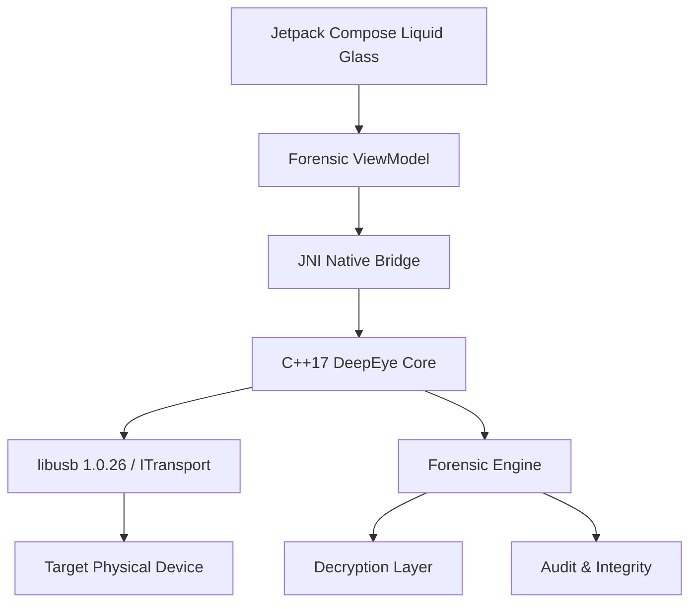

<div align="center">

# 👁️ DEEPEYE UNLOCKER

### **Advanced Mobile Forensics · Decryption · Signal Analysis**


[](https://github.com/DeepEyeCrypto/DeepEyeUnlocker/releases/latest)
[](https://github.com/DeepEyeCrypto/DeepEyeUnlocker/actions)
[](https://github.com/DeepEyeCrypto/DeepEyeUnlocker)

---

**DeepEye Unlocker** is an editor-grade mobile forensic engine designed for high-assurance device acquisition and decryption. Built for security researchers and digital forensics experts, it provides bit-level access to secure storage via ultra-low latency USB orchestration.

[**Download RC**](https://github.com/DeepEyeCrypto/DeepEyeUnlocker/releases) • [**Technical Specs**](#-technical-specifications) • [**Forensic Dashboard**](#-forensic-dashboard-v2)

</div>

---

## ⚡ CORE CAPABILITIES

### 🔓 DATA DECRYPTION (STAGE 300.1)
*   **Double-Layer Decryption**: Simultaneous access to FBE-encrypted UserData and Adoptable Storage (SD card) volumes.
*   **MTK Dimensity Support**: Native decryption for the latest MediaTek Dimensity 9000+ chipsets.
*   **TEE Key Extraction**: Automated retrieval of Keystore blobs from RPMB/Secure Contexts.

### 🛡️ PHYSICAL INTEGRITY (STAGE 600.1)
*   **Eye-Diagram Analysis**: Real-time monitoring of USB signal integrity and impedance deltas.
*   **Tamper Detection**: Detects hardware interposers and unauthorized signal relaying during acquisition.
*   **Signal Impedance Guard**: Auto-disconnect on signal anomalies to prevent data corruption or side-channel leakage.

### 🔌 HARDENED PROTOCOL ENGINE
*   **Multi-SoC Handshake**: Deep support for Qualcomm Sahara (EDL), MTK Brom, Samsung Odin, and UniSoc FDL.
*   **RSA-4096 Crypto**: ADB communication hardened with SHA256-standard 4096-bit encryption.
*   **Low-Latency I/O**: Direct `libusb` orchestration with sub-millisecond command dispatch.

---

## 🏗️ SYSTEM ARCHITECTURE


```mermaid
graph TD
    UI[Jetpack Compose Liquid Glass] --> VM[Forensic ViewModel]
    VM --> JB[JNI Native Bridge]
    JB --> CORE[C++17 DeepEye Core]
    CORE --> USB[libusb 1.0.26 / ITransport]
    CORE --> FE[Forensic Engine]
    FE --> DEC[Decryption Layer]
    FE --> AUD[Audit & Integrity]
    USB --> DEV[Target Physical Device]
```

### 🛰️ TECHNICAL SPECIFICATIONS
| LAYER | TECHNOLOGY | TARGET LATENCY |
| :--- | :--- | :--- |
| **Frontend** | Jetpack Compose / Liquid Glass v2 | < 16.7ms (60 FPS) |
| **Bridge** | JNI NativeBridge (Kotlin 2.0) | < 0.5ms |
| **Core** | C++17 NDK (Standalone STL) | < 0.1ms |
| **USB** | libusb-1.0.26 (Asynchronous I/O) | < 2.0ms (Bulk Transfer) |

---

## 🕹️ FORENSIC DASHBOARD V2

The **DeepEye Dashboard** leverages the "Liquid Glass" design system for a high-intensity, tactical user experience:

*   **Glassmorphism Cards**: Frosted semi-transparent UI with dynamic neon-purple shadows.
*   **Live Integrity Shield**: Real-time "Shielded/Verified" status based on Stage 600.1 signal analysis.
*   **Terminal Console**: macOS-style interactive terminal with blazingly fast log streaming.
*   **Consolidated Audits**: One-click generation of PDF forensic reports with SHA-256 integrity chaining.

---

## 🚀 INSTALLATION & BUILD

### 📋 PREREQUISITES
*   **Android SDK**: API 26 to 35 (Android 8.0 → 15+)
*   **NDK**: 25.1.8937393
*   **JDK**: 17 (Target 1.8 compatibility for native libs)
*   **Environment**: `GRADLE_OPTS="-Xmx4g"` recommended for R8 minification.

### 🛠️ BUILD PRODUCTION APK
```bash
# Clone the repository
git clone https://github.com/DeepEyeCrypto/DeepEyeUnlocker.git
cd DeepEyeUnlocker

# Synchronize dependencies and build
./gradlew assembleRelease
```
*Output: `app/build/outputs/apk/release/DeepEyeUnlocker_v2026.30.0.apk`*

---

## ⚖️ LEGAL & ETHICS
DeepEye Unlocker is developed for digital research and forensic audit only. **Software Use Policy**:
1. Use only on devices with explicit legal authorization.
2. Compliance with local privacy and data protection laws is mandatory.
3. Decryption features are provided for academic study.

---

<div align="center">

**Built with Precision for the Global Research Community.**
[Official Telegram](https://t.me/DeepEyeCrypto) • [Documentation](docs/INDEX.md)

</div>
