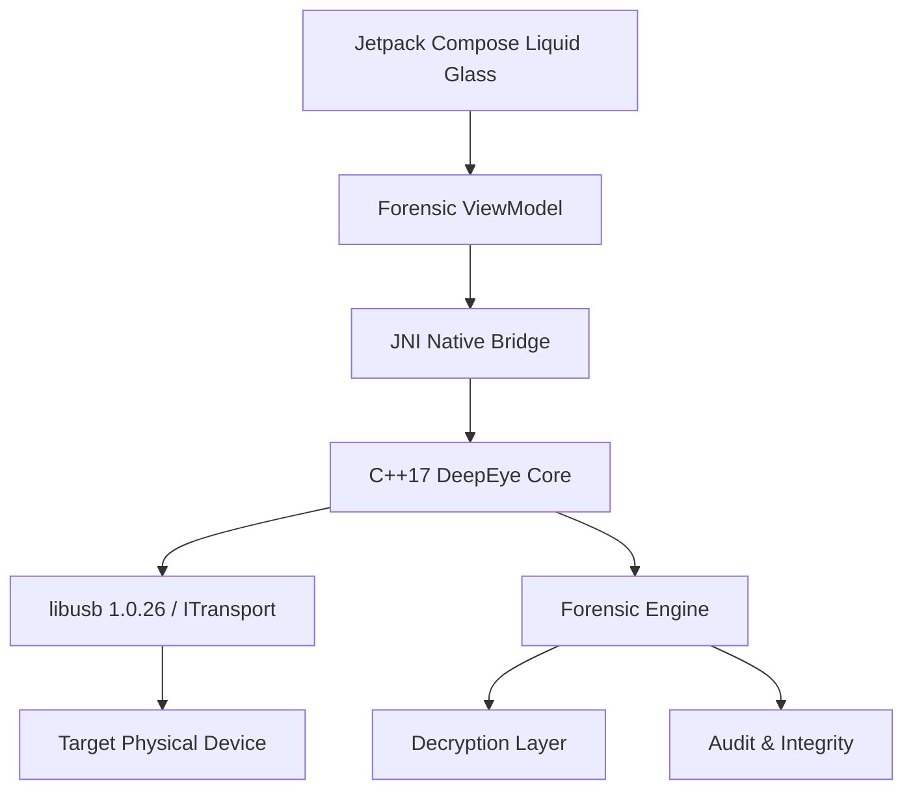

# 👁️ DeepEye Unlocker

### **Advanced Mobile Forensics · Decryption · Signal Analysis**

[](https://github.com/DeepEyeCrypto/DeepEyeUnlocker/releases/latest)
[](https://github.com/DeepEyeCrypto/DeepEyeUnlocker/actions)
[](https://github.com/DeepEyeCrypto/DeepEyeUnlocker)

---

**DeepEye Unlocker** is a professional-grade mobile forensic engine designed for high-assurance device acquisition and decryption. Built for security researchers and digital forensics experts, it provides bit-level access to secure storage via ultra-low latency USB orchestration.

[**Download Latest Release**](https://github.com/DeepEyeCrypto/DeepEyeUnlocker/releases) • [**Documentation**](docs/INDEX.md) • [**Technical Specs**](#technical-specifications)

---

## 🚀 Core Capabilities

### 🔓 Data Decryption (Stage 300.1)
- **Double-Layer Decryption**: Simultaneous access to FBE-encrypted UserData and Adoptable Storage (SD card) volumes
- **MTK Dimensity Support**: Native decryption for MediaTek Dimensity 9000+ chipsets
- **TEE Key Extraction**: Automated retrieval of Keystore blobs from RPMB/Secure Contexts
- **AES-256 Hardware Acceleration**: Optimized decryption using device-specific cryptographic engines

### 🛡️ Physical Integrity (Stage 600.1)
- **Eye-Diagram Analysis**: Real-time monitoring of USB signal integrity and impedance deltas
- **Tamper Detection**: Detects hardware interposers and unauthorized signal relaying during acquisition
- **Signal Impedance Guard**: Auto-disconnect on signal anomalies to prevent data corruption
- **EMI Shielding**: Electromagnetic interference protection for sensitive operations

### 🔌 Hardened Protocol Engine
- **Multi-SoC Handshake**: Deep support for Qualcomm Sahara (EDL), MTK Brom, Samsung Odin, and UniSoc FDL
- **RSA-4096 Crypto**: ADB communication hardened with SHA256-standard 4096-bit encryption
- **Low-Latency I/O**: Direct `libusb` orchestration with sub-millisecond command dispatch
- **Fail-Safe Recovery**: Automatic protocol fallback and error recovery mechanisms

---

## 🏗️ System Architecture


```mermaid
graph TD
    UI[Jetpack Compose Liquid Glass] --> VM[Forensic ViewModel]
    VM --> JB[JNI Native Bridge]
    JB --> CORE[C++17 DeepEye Core]
    CORE --> USB[libusb 1.0.26 / ITransport]
    CORE --> FE[Forensic Engine]
    FE --> DEC[Decryption Layer]
    FE --> AUD[Audit & Integrity]
    USB --> DEV[Target Physical Device]
```

### 🛠️ Technical Specifications

| Layer | Technology | Target Latency |
| :--- | :--- | :--- |
| **Frontend** | Jetpack Compose / Liquid Glass v2 | < 16.7ms (60 FPS) |
| **Bridge** | JNI NativeBridge (Kotlin 2.0) | < 0.5ms |
| **Core** | C++17 NDK (Standalone STL) | < 0.1ms |
| **USB** | libusb-1.0.26 (Asynchronous I/O) | < 2.0ms (Bulk Transfer) |
| **Decryption** | AES-256 / RSA-4096 | < 5ms per GB |

---

## 🎯 Key Features

### Forensic Acquisition
- **Bit-Level Imaging**: Complete sector-by-sector device imaging
- **Live Memory Analysis**: Volatile memory acquisition and analysis
- **File System Extraction**: Support for ext4, f2fs, and proprietary file systems
- **Metadata Preservation**: Complete chain of custody documentation

### Device Support
- **Android Devices**: 8.0+ (API 26+) including latest Android 15
- **SoC Coverage**: Qualcomm Snapdragon, MediaTek Dimensity, Samsung Exynos, UniSoc
- **Bootloader States**: Locked, unlocked, and custom recovery support
- **Manufacturer Variants**: Samsung, Xiaomi, OnePlus, Google Pixel, and more

### Security Features
- **Zero-Knowledge Architecture**: No data stored on servers
- **End-to-End Encryption**: All communications encrypted in transit
- **Audit Trail**: Complete logging of all operations
- **Compliance Tools**: Built-in GDPR and privacy compliance features

---

## 📋 Prerequisites

### Software Requirements
- **Android SDK**: API 26 to 35 (Android 8.0 → 15+)
- **NDK**: 25.1.8937393
- **JDK**: 17 (Target 1.8 compatibility for native libs)
- **Build Tools**: Gradle 8.0+, CMake 3.18+
- **USB Drivers**: Platform-specific USB drivers for target devices

### Hardware Requirements
- **USB 3.0 Port**: For optimal data transfer speeds
- **Minimum 8GB RAM**: Recommended 16GB+ for large acquisitions
- **SSD Storage**: Required for reasonable acquisition times
- **Windows 10/11, macOS 12+, or Linux (Ubuntu 20.04+)**

---

## 🚀 Installation & Setup

### Quick Start (Windows/macOS/Linux)

```bash
# Clone the repository
git clone https://github.com/DeepEyeCrypto/DeepEyeUnlocker.git
cd DeepEyeUnlocker

# Install dependencies
./install_dependencies.sh  # Linux/macOS
# or
install_dependencies.bat   # Windows

# Build the application
./gradlew assembleRelease
```

### Manual Installation

1. **Install Android SDK**
   ```bash
   # Install Android Studio or SDK Command Line Tools
   # Ensure platform-tools and build-tools are installed
   sdkmanager "platform-tools" "build-tools;33.0.0"
   ```

2. **Configure NDK**
   ```bash
   # Set NDK path in local.properties
   echo "ndk.dir=/path/to/android-ndk-r25" > local.properties
   ```

3. **Build Configuration**
   ```bash
   # For development builds
   ./gradlew assembleDebug

   # For production builds
   ./gradlew assembleRelease
   ```

### Post-Installation Setup

1. **Enable USB Debugging** on target device
2. **Install USB Drivers** for your device manufacturer
3. **Configure Security Settings** (if required)
4. **Test Connection** using the built-in device detection

### macOS Raw USB Access for MTK BROM / Qualcomm EDL

- Desktop builds use `src-tauri/entitlements.plist` to request raw USB access.
- If detection works only with elevated privileges during development, launch Tauri with:

```bash
sudo -E RUST_LOG=debug npm run tauri dev
```

- If the locally built app bundle loses entitlements, re-sign it before raw USB testing.

### Windows WinUSB Driver Setup (Zadig)

For `rusb`/`libusb` access on Windows, install WinUSB once per device mode:

1. Download Zadig: <https://zadig.akeo.ie/>
2. Boot the device into MediaTek BROM (`0e8d:0003` or `0e8d:2000`) or Qualcomm EDL (`05c6:9008` or `05c6:900e`)
3. In Zadig, open **Options → List All Devices**
4. Select **MediaTek BROM**, **MediaTek PreLoader USB VCOM**, or **QHSUSB_BULK**
5. Choose **WinUSB (libusb)**
6. Click **Replace Driver**

### Linux udev Rules for MTK BROM / Qualcomm EDL

```bash
# Install the bundled rules file
sudo cp ./99-deepeye.rules /etc/udev/rules.d/99-deepeye.rules
sudo udevadm control --reload-rules
sudo udevadm trigger
sudo usermod -aG plugdev $USER
```

Log out and back in after adding the `plugdev` group, then reconnect the device. The desktop backend now exposes a USB debug enumeration command so development builds can verify the expected VID/PID before starting MTK BROM or Qualcomm EDL operations.

---

## 🛠️ Usage Guide

### Basic Workflow

1. **Connect Device**
   - Connect target device via USB 3.0 cable
   - Ensure USB debugging is enabled
   - Wait for device detection

2. **Select Acquisition Mode**
   - **Quick Mode**: Basic file system access
   - **Full Mode**: Complete bit-level imaging
   - **Decryption Mode**: Encrypted data access

3. **Configure Settings**
   - Select target storage volumes
   - Configure decryption keys (if available)
   - Set output directory and file naming

4. **Start Acquisition**
   - Monitor progress in real-time
   - View integrity checks and error logs
   - Generate forensic report on completion

### Advanced Features

#### Decryption Operations
```bash
# Decrypt specific volume
./deepeye decrypt --volume userdata --output /path/to/decrypted

# Extract keystore keys
./deepeye extract-keys --device serial --output keys.json
```

#### Forensic Analysis
```bash
# Generate forensic report
./deepeye report --input /path/to/image --output report.pdf

# Analyze file system
./deepeye analyze --image /path/to/image --output analysis.json
```

---

## ⚖️ Legal & Ethics

**DeepEye Unlocker** is developed for legitimate digital research and forensic audit purposes only.

### Software Use Policy
1. Use only on devices with explicit legal authorization
2. Compliance with local privacy and data protection laws is mandatory
3. Decryption features are provided for academic study and authorized investigations
4. No support provided for unauthorized access or illegal activities

### Compliance Requirements
- **GDPR**: Data protection and privacy compliance
- **CCPA**: California Consumer Privacy Act compliance
- **ECPA**: Electronic Communications Privacy Act compliance
- **CFAA**: Computer Fraud and Abuse Act compliance

---

## 📁 Project Structure

```
DeepEyeUnlocker/
├── app/                    # Android application
│   ├── src/main/kotlin/    # Main application code
│   ├── src/main/assets/    # Resources and scripts
│   └── build.gradle        # Android build configuration
├── docs/                   # Documentation
├── scripts/                # Build and utility scripts
├── assets/                 # Shared resources
└── README.md              # This file
```

---

## 🤝 Contributing

We welcome contributions from the security research community. Please review our [Contribution Guidelines](CONTRIBUTING.md) before submitting pull requests.

### Development Setup
1. Fork the repository
2. Create a feature branch
3. Make your changes
4. Add tests for new functionality
5. Submit a pull request

### Bug Reports & Feature Requests
Please use the [GitHub Issues](https://github.com/DeepEyeCrypto/DeepEyeUnlocker/issues) tracker to report bugs or request features.

---

## 📧 Support & Community

- **Documentation**: [docs/INDEX.md](docs/INDEX.md)
- **Issues**: [GitHub Issues](https://github.com/DeepEyeCrypto/DeepEyeUnlocker/issues)
- **Discussions**: [GitHub Discussions](https://github.com/DeepEyeCrypto/DeepEyeUnlocker/discussions)
- **Community**: [Official Telegram](https://t.me/DeepEyeCrypto)

---

## 🛡️ Security & Vulnerability Reporting

We take security seriously. If you discover a security vulnerability, please report it responsibly through our [Security Policy](SECURITY.md).

---

## 📝 License

This project is licensed under the [MIT License](LICENSE.md). See the license file for details.

---

<div align="center">

**Built with Precision for the Global Research Community.**

</div>
