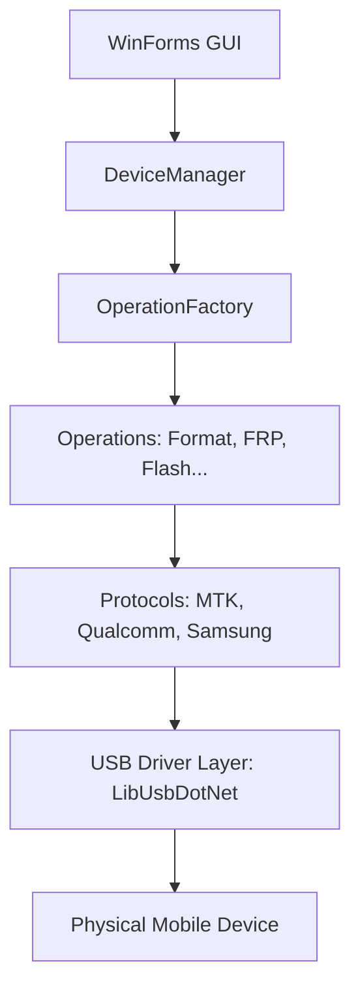

# Architecture - DeepEyeUnlocker

## Overview

DeepEyeUnlocker is designed with a modular architecture to support multiple mobile chipsets and protocols.

## Component Diagram

## Protocol Descriptions

### 1. Qualcomm EDL (Emergency Download Mode)

- **Sahara:** Initial handshake, authentication, and programmer (.mbn/.elf) upload.
- **Firehose:** XML-based protocol for partition reading, writing, and erasing once the programmer is running.

### 2. MediaTek (MTK)

- **Preloader/BROM:** Low-level USB handshake and exploit (kamakiri/brom payload) to gain execution.
- **DA (Download Agent):** Secondary bootloader that handles memory operations and partition flashing.

### 3. Samsung ODIN

- **Download Mode:** Samsung's proprietary protocol for firmware flashing.
- **Heimdall:** Open-source implementation of the ODIN protocol.

## Core Orchestration

- **DeviceManager:** Automatically detects USB plug-ins and identifies the device mode (ADB, Fastboot, EDL, BROM, Download).
- **OperationFactory:** Selects the correct chipset engine based on user selection or auto-detection.
- **Logger:** Unified NLog-based system for debugging and user feedback.
