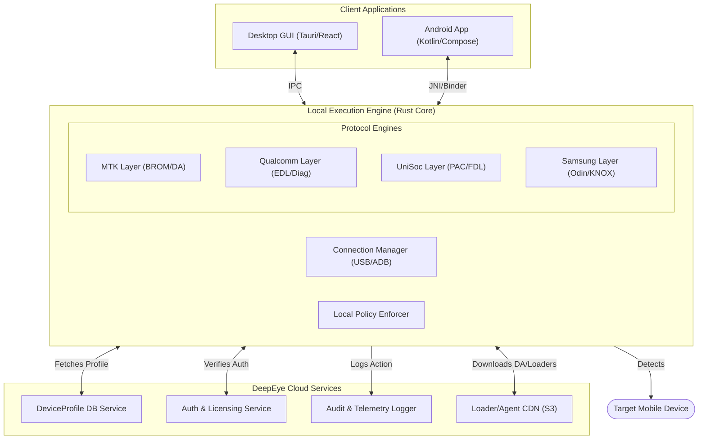

DEEPEYE UNIVERSAL – ARCHITECTURE & UI BLUEPRINT
(FLOW PHASE: **L – LAYOUT**)

FLOW FRAMEWORK ACTIVATED:

- Current phase detected: **LAYOUT (L)** – Design UI/UX, System Diagrams, API Shapes
- Output: UI Component Tree, Database Schema, API Contracts, State Management
- Next phase (ORCHESTRATION) will focus on wiring and agents.

*(Note: Since the QA from the FRAME phase was bypassed, this layout assumes: Desktop+OTG parallel development, Dongle+Digital hybrid license, Moderate legal scope with KYC for Tier 3, and Top 100 feature MVP focus.)*

========================================

1. SYSTEM TOPOLOGY & DIAGRAM
========================================



========================================
2. USER INTERFACE (UI/UX) BLUEPRINT
========================================

**Theme:** DeepEye Glassmorphism (Dark mode default, vibrant accent colors, blurred backgrounds, sharp typography).
**Responsive:** Adaptive container sizing (Desktop 16:9 down to Android Portrait).

**2.1 Unified Dashboard (Desktop & Android)**

- **Header:** Brand Logo, Online Status, License Tier (Dongle/Digital ID), User Profile.
- **Left Sidebar / Bottom Nav:**
  - `Devices` (Main operations)
  - `Loaders` (CDN Manager)
  - `History` (Local Audit Logs)
  - `Settings` (Drivers, Dark Mode, API Keys)
- **Top Brand Selector (Pills):** [Samsung] [Xiaomi] [Oppo] [Vivo] [MTK Universal] [QCOM Universal]
- **Main Interaction Area (The "Workbench"):**
  - **Left 1/3**: Device Identification Panel (Live USB polling).
    - Status: "Waiting for device...", "Port: COM5", "Mode: EDL"
    - Extracted Info: Model, IMEI, Battery, FRP State.
  - **Right 2/3**: Operations Grid (The 24 Functions).

**2.2 Operations Grid Layout (Tabbed UI)**

- **Tab 1: Flash & Backup** (Write Firmware, Read Firmware, Partition Manager).
- **Tab 2: Security & Format** (Factory Reset, Backup NV/EFS, Restore Security).
- **Tab 3: Locks & FRP** (FRP Assist, Remove Screen Lock, Mi/Sam Account).
- **Tab 4: Network & IMEI** (Repair IMEI, Network Unlock - with distinct warning colors).
- **Tab 5: Advanced** (Root, App Manager, MDM Removal, SLA Auth).

**2.3 Operational Flow UI Example (FRP Assist)**

1. User clicks "FRP Assist".
2. **Modal 1 (Policy Check):** "Tier 3 Operation. Please confirm ownership or technician status." [Checkbox] -> [Proceed]
3. **Modal 2 (Execution):**
   - Progress ring (Glassmorphic).
   - Log output (Monospace font, auto-scrolling): `[10:42:01] BROM Handshake... OK`
4. **Modal 3 (Result):** Success/Fail state with primary action (e.g., "Reboot Device").

========================================
3. DATABASE SCHEMA (PostgreSQL / SQLite Local Cache)
========================================

The `DeviceProfile` is the beating heart of DeepEye Universal.

```sql
-- Core Brand Mapping
CREATE TABLE brands (
    id SERIAL PRIMARY KEY,
    name VARCHAR(50) UNIQUE NOT NULL,
    oem_type VARCHAR(50) -- e.g., 'Transsion', 'BBK'
);

-- Complete Device Lexicon (7071+ Models)
CREATE TABLE models (
    id SERIAL PRIMARY KEY,
    brand_id INT REFERENCES brands(id),
    commercial_name VARCHAR(100) NOT NULL,
    internal_codename VARCHAR(100), -- e.g., 'sweet' for Redmi Note 10 Pro
    soc_id INT REFERENCES chipsets(id),
    base_android_ver VARCHAR(20),
    auth_sla_type VARCHAR(50), -- 'v1', 'v5', 'none'
    loader_id INT REFERENCES loaders(id)
);

-- Chipset Architectures
CREATE TABLE chipsets (
    id SERIAL PRIMARY KEY,
    vendor VARCHAR(50) NOT NULL, -- 'MTK', 'QCOM', 'SPD', 'EXYNOS'
    identifier VARCHAR(50) NOT NULL, -- e.g., 'MT6768', 'SM7125'
    architecture VARCHAR(50)
);

-- Immutable Audit Log
CREATE TABLE audit_logs (
    log_id UUID PRIMARY KEY,
    timestamp TIMESTAMPTZ DEFAULT NOW(),
    user_id UUID REFERENCES users(id),
    operation_type VARCHAR(100),
    device_model VARCHAR(100),
    imei_hash VARCHAR(255),
    policy_tier INT,
    status VARCHAR(20), -- 'SUCCESS', 'BLOCKED', 'FAILED'
    ip_address INET
);
```

========================================
4. API CONTRACTS (gRPC / REST)
========================================

**4.1 Local IPC (GUI <-> Rust Engine)**
Tauri/JNI uses serialized JSON or Protobuf for low-latency command execution.

```typescript
// Detect Device Endpoint
interface DetectDeviceRequest {
  timeout_ms: number;
  expected_mode?: 'EDL' | 'BROM' | 'FASTBOOT';
}

interface DetectDeviceResponse {
  connected: boolean;
  port: string;
  mode: string;
  handshake_data: {
    hw_code: string;
    soc_name: string;
    me_id: string;
  };
}

// Execute Operation Endpoint
interface ExecuteOpRequest {
  target_model_id: number;
  operation_id: "FRP_ASSIST" | "FLASH_PARTITION" | "READ_INFO";
  payload: Record<string, any>; // e.g., { partition: "boot", file_path: "/tmp/boot.img" }
  policy_token: string; // From the local policy engine
}
```

**4.2 Cloud API (Engine <-> DeepEye Cloud)**
Used to fetch updated loaders and verify licenses.

```http
POST /api/v1/auth/verify-license
Content-Type: application/json
{
  "hardware_id": "DONGLE_SERIAL_12345",
  "client_version": "1.0.0"
}

GET /api/v1/loaders/fetch?soc=MT6768&brand=Xiaomi&token=JWT
Response: [Binary Stream of Download Agent]
```

========================================
5. STATE MANAGEMENT (FRONTEND)
========================================

Using Zustand (React/Tauri) or StateFlow (Kotlin).

**Stores Needed:**

1. **`useDeviceStore`**: Tracks the currently connected terminal, live port list, and extracted hardware handshake info.
2. **`useOperationStore`**: Tracks the active job (Flash, FRP, etc.), progress percentage (0-100), and live streaming log arrays.
3. **`usePolicyStore`**: Tracks the logged-in user role, regional restrictions, and dynamically disables UI buttons (e.g., greys out "IMEI Repair" if user is Consumer tier).
4. **`useProfileStore`**: Caches the offline `DeviceProfile` database to eliminate network latency when selecting models from dropdowns.

========================================
6. NEXT PHASE READY?
========================================

**LAYOUT phase (L) is now complete. You have:**
✅ System Topology & Component Diagram
✅ UI/UX Desktop & Android Blueprint
✅ Relational Database Schema for Device Profiles
✅ API Contracts (Frontend <-> Rust Engine <-> Cloud)
✅ State Management mapping

**Please confirm:**
**"Next phase ready"** to move to **ORCHESTRATION (O)**, where we define the exact agent logic, protocol wiring, and CI/CD setup for building this architecture.
