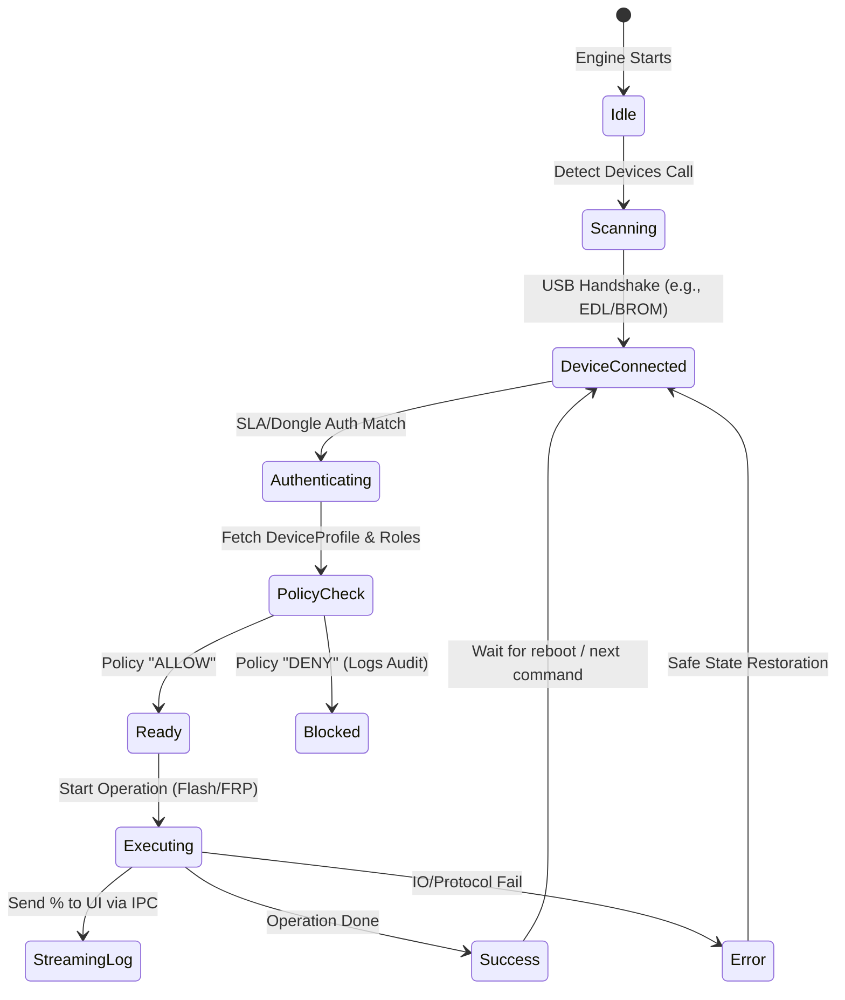

DEEPEYE UNIVERSAL – ORCHESTRATION & AGENT WIRING
(FLOW PHASE: **O – ORCHESTRATION**)

FLOW FRAMEWORK ACTIVATED:

- Current phase detected: **ORCHESTRATION (O)** – Core Logic, API Wiring, CI/CD
- Output: Rust Core execution flow, Frontend-Backend IPC, Policy Enforcement Logic, CI/CD Pipeline
- Next phase (WORLD) will focus on actual code implementation.

========================================

1. RUST CORE: THE EXECUTION ENGINE
========================================

The `DeepEyeCore` (Rust) is a singleton state machine.

**1.1 Core State Transitions:**



**1.2 Protocol Routing (The Dispatcher):**
When a UI calls `executeOperation(req)`, the Rust dispatcher checks `req.chipset`:

- If `MTK`: Loads the `mtk_da_engine` crate.
- If `QCOM`: Loads the `sahara_firehose_engine` crate.
- If `SPD`: Loads the `unisoc_fdl_engine` crate.

This modularity means updating Qualcomm support doesn't break MTK.

========================================
2. FRONTEND-BACKEND IPC (TAURI / JNI WIRING)
========================================

**2.1 Tauri Command Registration (Desktop):**

```rust
// In src-tauri/src/main.rs
#[tauri::command]
async fn execute_device_op(
    device_id: String, 
    op_type: String, 
    payload: Option<serde_json::Value>,
    state: tauri::State<'_, DeepEyeState>
) -> Result<OpResponse, String> {
    // 1. Validate payload against Policy Engine
    // 2. Dispatch to specific protocol engine (Qualcomm/MTK)
    // 3. Emit live events to JS side.
}
```

**2.2 Kotlin JNI Bridge (Android OTG):**

```kotlin
// Android JNI binding to the exact same Rust core compiled for ARM64
class DeepEyeCoreBridge {
    external fun detectDevice(usbFd: Int): String
    external fun executeOperation(targetId: Int, opCode: String, payloadJson: String): String
}
```

========================================
3. THE POLICY ENFORCEMENT ENGINE
========================================

Every single operation must pass through this gate before hardware interaction begins.

**3.1 Policy Evaluation Logic:**

```typescript
interface PolicyRequest {
    userId: string;
    role: "CONSUMER" | "TECHNICIAN" | "ENTERPRISE";
    operation: "FRP" | "READ_INFO" | "FLASH";
    deviceInfo: { brand: string, imei?: string };
}

function evaluatePolicy(req: PolicyRequest): "ALLOW" | "DENY" | "REQUIRE_KYC" {
    if (req.operation === "READ_INFO") return "ALLOW";
    
    if (req.operation === "FRP") {
        if (req.role === "CONSUMER") return "DENY"; // Redirects to Official
        if (req.role === "TECHNICIAN") return "REQUIRE_KYC";
    }
    
    return "ALLOW"; // Fallback with extreme audit logging
}
```

========================================
4. CONTINUOUS INTEGRATION / DEPLOYMENT (CI/CD)
========================================

**4.1 GitHub Actions Pipeline:**

- **Stage 1: Lints & Rust Tests.**
  - Runs `cargo test` on all protocol crates.
  - Mocks `libusb` so tests run headless without physical phones.
- **Stage 2: DeviceProfile Sync.**
  - Validates `Profiles.json` and updates the remote Postgres schema.
- **Stage 3: Multi-Target Build.**
  - `Windows-x64`: Compiles Tauri bundle (`.msi` + portable `.exe`).
  - `macOS-ARM64`: Compiles Tauri bundle (`.dmg`).
  - `Android-ARM64`: Compiles Kotlin App + Rust JNI `.so` libraries into an `.apk`.
- **Stage 4: Release & Over-The-Air (OTA).**
  - Publishes artifacts to GitHub Releases.
  - Updates the OTA endpoint (`updates.deepeye.io/latest.json`) so the client prompts the user.

========================================
5. ERROR HANDLING & TELEMETRY
========================================

**5.1 Graceful Failure Matrix:**

- **USB Disconnect Mid-Flash:** Engine immediately issues soft-reset to SoC (if supported) to prevent hard brick. UI logs: "CRITICAL: Connection Lost."
- **SLA Auth Rejected:** Engine gracefully closes BROM port. UI prompts: "SLA Tokens Expired/Invalid."
- **Storage Read Error:** Retry up to 3 times with exponential backoff.

**5.2 Anonymous Telemetry (Sentry/Custom):**

- Fails are hashed and aggregated:
  - `"Firehose Error 0x05 on SM8450 (Samsung S22)" -> Count: 142`
  - This informs the dev team which loaders or devices are failing globally in real-time.

========================================
6. NEXT PHASE READY?
========================================

**ORCHESTRATION phase (O) is now complete. You have:**
✅ State Machine Diagrams for Rust Core
✅ Tauri / Kotlin IPC bridging logic
✅ Policy Evaluator algorithms
✅ GitHub Actions CI/CD pipeline definition
✅ Error handling & Telemetry rules

**Please confirm:**
**"Next phase ready"** to move to the final **WORLD (W)** phase, where we initialize the exact project structure, deploy code components, and set up the active development environment for DeepEye Universal.
