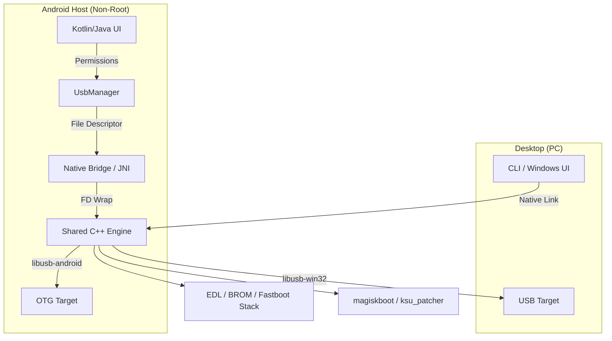

# DeepEye Portable (OTG-to-OTG) Architecture

### 🚀 Overview

DeepEye Portable is a high-performance system service designed for Android-to-Android device unlocking and recovery over OTG. It utilizes a shared C++ core engine to ensure identical protocol behavior between the desktop tool and the mobile APK.

---

### 🏗️ Architecture Diagram

---

### 🛡️ Host Safety & Isolation Strategy

1. **FD-Only access**: The native C++ engine *never* opens paths like `/dev/bus/usb`. It only operates on the `int fd` passed from the Android OS. This guarantees that the engine cannot scan or infect the host device's own internals.
2. **Private Storage Operations**: Binary tools like `magiskboot` are extracted to `context.filesDir`. Patching is performed in isolated cache directories, and temporary files are wiped using secure overwrites.
3. **VID/PID Filtering**: The `UsbHostManager` rejects connections if the Target VID/PID matches the Host SoC signature, preventing "self-flashing" loops.

---

### 📂 Directory Structure

- `/portable/core`: Shared C++ Engine (Protocols & Transport).
- `/portable/android`: Android Gradle project for the APK.
- `/portable/desktop`: CLI/GUI bridge for the PC version.
- `/portable/tools`: Prebuilt external binaries (`magiskboot`, `ksu_patcher`).

---

### 🛠️ Key Implementation Status

- [x] FD-based Libusb Transport (C++)
- [x] JNI Bridge for FD passing
- [x] Kotlin USB Permission Flow
- [x] Firehose XML Command Parser
- [x] BROM Handshake & Register primitives
- [x] MediaTek DA Injection & Execution
- [x] GPT Partition Table Discovery
- [x] Sparse Image Flashing (GSI)
- [x] Magisk/KernelSU Boot Patch Pipeline
- [x] Private Storage Binary Isolation
- [ ] Multi-LUN UFS Discovery (LUN 0-5)
- [ ] Automated CI Build Pipeline (GitHub Actions)
