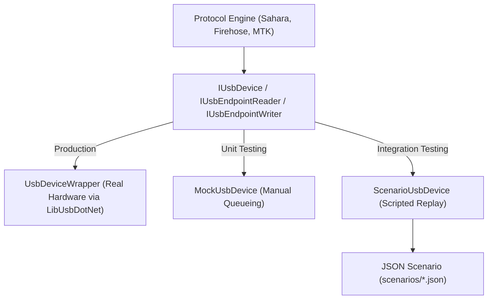

# Protocol Simulation Overview

DeepEyeUnlocker features a sophisticated **Protocol Simulation Engine** designed for hardware-independent verification of device communication protocols (Sahara, Firehose, MTK).

## Architecture

## Core Components

### 1. USB Abstraction (`IUsbDevice`)

The entire protocol stack depends on a clean USB interface rather than directly calling `LibUsbDotNet`. This allows the same protocol code to run against real physical devices or simulated mocks.

### 2. Scenario DSL

Protocol exchanges are defined in a declarative JSON format. This allows developers to describe the "back and forth" of a protocol (e.g., "Host sends A, Device responds with B") without writing C# code.

- **Schema**: [protocol_scenarios.schema.json](file:///Users/enayat/Documents/DeepEyeUnlocker/docs/protocol_scenarios.schema.json)
- **Location**: `scenarios/**/*.json`

### 3. Scenario Replayer

The `ScenarioUsbDevice` is a specialized implementation of `IUsbDevice` that:

- Loads a JSON scenario via `ScenarioLoader`.
- Validates that every byte written by the host matches the expected value in the script.
- Returns the exact byte sequences described in the script when the host performs a read.
- Enforces timing (delays) and tracks full consumption of the scripted exchange.

### 4. CI Integration

Protocol verification tests run on every Pull Request across a cross-platform matrix (**Windows, Ubuntu, macOS**). This ensures that protocol logic remains portable and free of regressions even when physical hardware is unavailable for testing.

---

## Capabilities

- **Success Paths**: Verify full handshakes (e.g., Sahara Hello, MTK BROM Sync).
- **Timeouts**: Simulate device silence to test host-side error handling.
- **Data Mismatches**: Ensure the host engine correctly rejects malformed device data.
- **Cross-Platform**: Run protocol logic on non-Windows systems without native drivers.
