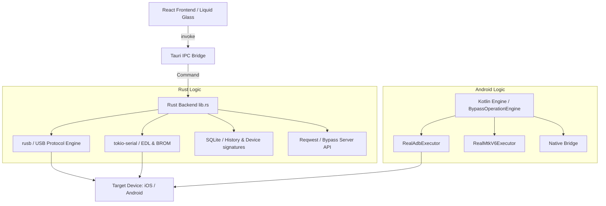

# DeepEye Unlocker - Architecture Map

## 🌌 Hybrid Orchestration Flow
DeepEye Unlocker operates as a bridge between high-level user intent and low-level hardware protocols.

---

## 🏗️ Core Logic Hubs

### 1. The Bridge (`src-tauri/src/lib.rs`)
The central dispatch for the desktop application. It defines the interface between the web UI and native system capabilities.
-   **Responsibility**: Command validation, async task spawning, and result serialization.
-   **Security**: Enforces strict type checking via `serde`.

### 2. The Engine (`BypassOperationEngine.kt`)
The heart of the Android implementation.
-   **Responsibility**: Routing features (FRP, iCloud, MDM) to specific executors.
-   **Key Mechanism**: `routeToRealProtocol` maps `BypassMechanism` enums to `RealExecutor` implementations.
-   **Reliability**: Implements exponential backoff and retry logic for volatile USB transport layers.

### 3. The Orchestrator (`src/modules/ExploitOrchestrator`)
A high-level state machine in the frontend.
-   **Responsibility**: Guiding the user through multi-stage processes (e.g., Signal Bypass Stages 1-10).
-   **UI Integration**: Live progress updates, warning issuance, and user action prompts (e.g., "Enter DFU Mode").

---

## 📡 Data Flow & State
1.  **Request**: User triggers an action in a React Module.
2.  **Dispatch**: Tauri `invoke` calls the corresponding Rust command.
3.  **Execution**: Rust backend communicates with the device via USB/Serial or registers intent with the Bypass Server.
4.  **Feedback**: Progress events are streamed back to the frontend (via `tauri::Window::emit` or return values).
5.  **Persistence**: Final results are recorded in the local SQLite history and optionally synced to the cloud vault.

---

## 🛡️ Critical Boundaries
-   **USB Transport**: Handled exclusively in native code (Rust/Kotlin) to avoid latency overhead.
-   **Cryptographic Layer**: AES-256 implementation is centralized to ensure consistency across platforms.
-   **Device Signatures**: Cached locally in `DeepEyeDeviceDB` but verified against the cloud for every exploit attempt.

---
**Last Updated**: April 24, 2026
